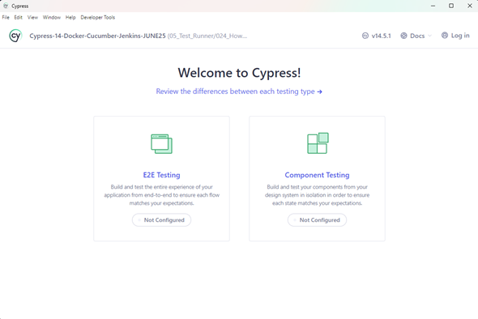

# Cypress V14.4.0 -Docker + Cucumber + Jenkins -JUNE'25 Course

## Cypress-14-Docker-Cucumber-Jenkins-JUNE25

[](https://www.udemy.com/course/cypress-ultimate-course/)

>[!IMPORTANT]
>
>* What you'll learn
>   * By end of this course, you will be a master in 2024 Cypress with latest version.
>   * You will be able to build robust framework using Cypress >+ Docker + Cucumber + Jenkins.
>   * Complete knowledge on how to write test in Cucumber BDD style.
>   * Complete knowledge on Docker and how to run tests inside docker.
>   * Complete understanding of Cypress Components such as fixtures, plugins, screenshots and videos.
>   * Usage of Cypress in real world automation end to end testing.
>   * Gain complete knowledge on Web Automation techniques and tricks.
>   * Practical knowledge in designing framework from scratch.
>   * Learn API testing using Cypress.
>   * Learn how to use Mocks for seamless web automation.

## Section 1: Introduction to Cypress

### 5. What is Cypress ?

>[!NOTE]
>
>`Cypress` is a next generation front end automation testing tool built for the modern web applications. Using `Cypress`. We can do fast, easy and reliable testing for anything that runs in a browser.
>
>To understand more about the `Cypress`, let's go to their official website. `Cypress`.Dot io is their official website.The slogan they have written is test, automate, accelerate.
>
>With `Cypress`, you can easily create tests for your modern web applications, debug them visually and automatically run them in your continuous integration bill. As you all are aware that the website is, keep on evolving like from Angular to React and many other assets.
>
>**What is asynchronous issue?**
>
>Let's say when we click on a button in a web page and it navigates to the other page, and it takes
>nearly five to 10s to navigate.
>
>If we use other automation tools, then we have to deliberately ad wait until the next page loads.But with `Cypress` we do not need to handle any wait. `Cypress` engine handles that for us.
>
>This is one of the major features which is `Cypress` offers when compared to other tools. As often the test script may fail because of this synchronization bonding. By default `Cypress` will wait for four seconds, but we can configure that globally and can increase the wait based upon the website we work on.
>
>We will cover this in detail in the upcoming session.`Cypress` scripts are written in JavaScript. This is because `Cypress` is built on NodeJS.
>
>**`Cypress` uses mocha and chai.**
>
>Mocha is a feature rich JavaScript test framework running on the NodeJS and in the browser, makingasynchronous testing simple and fun.
>
>Mocha tests run serially, allowing for flexible and accurate reporting while mapping uncaught exceptions to the correct test cases.
>
>Chai is a BDD or TDD assertion library for node and the browser that can be delightfully paired with any JavaScript testing framework.

### 6. Cypress Architecture

>[!NOTE]
>
>Antes de empezar con la arquitectura de `Cypress`, echemos un vistazo a la arquitectura de `Selenium`.
>Para las personas que no tienen ni idea sobre el `Selenium`.
>
>`Selenium` es la herramienta dominantemente utilizada para pruebas de automatización web en todo el mundo. Esta es la arquitectura del `Selenium`. Una vez que escribimos nuestro código en `Selenium`, compila y envía. Tiene una petición Http a un medio llamado como controlador del navegador.
>
>Si las personas que ya tienen una idea con `Selenium`, cada prueba tiene que mencionar lo que el controlador del navegador se ejecuta esta prueba.
>
>Veamos ahora la arquitectura de `Cypress`.
>
>Como puede ver en el diagrama, nuestra prueba de `Cypress` ejecuta comandos directamente en el navegador. En comparación con el selenio, `Cypress` no tiene ninguna sección de conductor intermedio.
>
>Gracias a ello, las pruebas de `Cypress` son superrápidas y mucho más fiables en comparación con otras herramientas de automatización. En resumen, `Cypress` es mucho más diferente y eficaz que las herramientas de automatización existentes.

### 7. Amazing Cypress Features

>[!NOTE]
>`Cypress` ofrece algunas características sorprendentes en comparación con otras herramientas de automatización como `Selenium`, `PlayWright`, WebDriver, IO, etc. Veámoslos uno por uno.
>
>**La primera característica es el viaje en el tiempo.**
>
>`Cypress` toma instantáneas mientras se ejecuta la prueba, lo que permite al usuario volver atrás y verificar una vez finalizada la ejecución para ver exactamente lo que ocurrió en cada paso.
>
>Esta característica es la más sorprendente característica que no está presente en cualquier otra herramienta de automatización. Lo veremos en detalle en nuestro próximo vídeo.
>
>**La siguiente característica es la recarga en tiempo real.**
>
>`Cypress` se recarga automáticamente cada vez que realizamos cambios en la prueba. Ya no es necesario ejecutar una prueba cada vez después de guardar un archivo. `Cypress` lo hace automáticamente.
>
>**La siguiente característica es spice stubs y relojes erificar y controlar el comportamiento de las funciones, las respuestas del servidor, o temporizadores.**
>
>Por ejemplo, digamos que estás probando una aplicación que lanza un error. Si abrimos con las fechas pasadas, a continuación, utilizando `Cypress`, podemos burlarse de los temporizadores como el punto fechas pasadas y comprobar las respuestas web.
>
>**La siguiente característica es la coherencia de los resultados.**
>
>Las pruebas de `Cypress` no tienen escamas.En todo momento, el resultado de la prueba será preciso gracias a su potente arquitectura, que consiste en que la prueba se ejecuta directamente en el navegador.
>
>**La siguiente característica es la capacidad de depuración de errores legibles y rastros de pila hace que la depuración sea tan fácil en `Cypress`.**
>
>Si la prueba falla con los errores mostrados en Test Runner y la función de viaje en el tiempo, podemos agarrar fácilmente los errores.
>
>Se acabaron las conjeturas para identificar los errores cuando trabajamos en `Cypress`.
>
>**La siguiente función es la ponderación automática.**
>
>Como se ha comentado anteriormente, `Cypress` ofrece por defecto la ponderación automática en los comandos y asercionesantes de seguir adelante, de modo que no es necesario poner peso o dormir deliberadamente en la prueba.
>
>**La siguiente función es el control del tráfico de red.**
>
>EC controla los y casos de prueba sin involucrar al servidor. Podemos simular fácilmente las respuestas del servidor para probar los casos extremos utilizando `Cypress`.
>
>**La siguiente función son las capturas de pantalla y los vídeos.**
>
>Esta es otra de las grandes características que ofrece `Cypress`. Las capturas de pantalla se toman automáticamente en caso de fallo y el vídeo de toda la prueba se graba y almacena automáticamente. Si desea obtener capturas de pantalla de vídeos utilizando selenio, tenemos que escribir código independiente e invocarlo en la prueba. Pero con las ofertas de `Cypress` como función incorporada.
>
>Así que hemos entendido claramente cuáles son las grandes características que ofrece el `Cypress` en comparación con las otras herramientas.

## Section 2: JavaScript Basics

### 8. Introduction to JavaScript

>[!NOTE]
>
>Entenderemos un poco de historia sobre el JavaScript.
>
>JavaScript fue creado por Brendan en 1995 mientras trabajaba en Netscape Communications Corporation.
>El JavaScript se denominaba originalmente Livescript.
>Más tarde se renombró como JavaScript para alinearse con la popularidad de otro lenguaje llamado Java.
>Aunque Java y JavaScript son muy diferentes entre sí.
>JavaScript se ganó rápidamente la atracción, ya que se proporciona una forma de añadir interactividad a las páginas web
>estáticas.
>
>**La primera característica es dinámica e interpretada.**
>
>JavaScript es un lenguaje de tipado dinámico, lo que significa que las variables pueden cambiar de tipo durante el tiempo de ejecución.
>También es un lenguaje interpretado, lo que significa que el código JavaScript es ejecutado directamente por un navegador
>web sin necesidad de compilación.
>
>Así que debido a que esto hace que el altamente accesible para los desarrolladores web, ya que pueden escribir y probar el código
>en tiempo real.
>
>**La segunda característica es el scripting del lado del cliente.**
>
>Uno de los principales usos de JavaScript es la creación de scripts en el lado del cliente.
>Se ejecuta en el navegador web del usuario, lo que permite a los desarrolladores crear aplicaciones web interactivas.
>Con JavaScript, puede manipular el Dom, que es el modelo de objetos del documento.
>Responder a los eventos del usuario, validar a partir de la entrada y realizar diversas acciones sin requerir un viaje de ida y vuelta del servidor.
>
>La principal ventaja de utilizar JavaScript para el desarrollo web es que podemos modificar la Dom como queramos y los
>desarrolladores pueden crearla tan rápido como en comparación con otros lenguajes de programación.
>
>**La siguiente característica es la sintaxis y la estructura.**
>
>JavaScript tiene una sintaxis de tipo C similar a la de lenguajes como Java y C plus.
>Utiliza punto y coma para terminar las sentencias y llaves para definir los bloques.
>Las variables se declaran utilizando palabras clave como var, let o constant.
>Las funciones son una característica esencial y los objetos y las matrices son estructuras de datos fundamentales.
>Así que la sintaxis y la estructura del JavaScript es muy similar a Java y C plus plus, pero la funcionalidad
>sabia todo está en un nivel muy diferente.
>La siguiente característica de JavaScript es la compatibilidad entre navegadores, que es una de las principales ventajas
>de JavaScript.
>
>**La siguiente función es Ecmascript.**
>
>JavaScript estándar se adhiere a la ECMA, que es European Computer Manufacturers Association script estándar, que
>define las especificaciones y características del lenguaje.
>Existen diferentes versiones de script que introducen nuevas características y mejoras en el lenguaje.
>
>Por ejemplo, Ecmascript seis, que es el ES6, que es la última versión de JavaScript, trajo una mejora significativa,
>incluyendo la plantilla de función de flecha, tripletas y sintaxis de clase, etcétera.
>
>**La siguiente característica de JavaScript es la versatilidad.**
>
>JavaScript no se limita al desarrollo web.
>Con la llegada de NodeJS, los desarrolladores pueden utilizar JavaScript para crear scripts del lado del servidor, crear servidores
>web y crear aplicaciones backend escalables.
>
>**En resumen, JavaScript es un lenguaje de programación versátil que desempeña un papel fundamental en el desarrollo web al permitir la creación de aplicaciones web dinámicas, interactivas y con capacidad de respuesta.**
>
>Su evolución constante.
>La compatibilidad entre navegadores y la diversidad del ecosistema lo convierten en una habilidad valiosa tanto para los desarrolladores
>front-end como back-end.
>Como ingeniero de automatización de pruebas, aprender JavaScript puede ayudarnos de muchas, muchas maneras al adherirnos a aprender muchas herramientas
>nuevas como `Cypress`, `PlayWright` y etcétera, las cuales todas han sido escritas por JavaScript.

### 9. Prerequisite Needed

>[!IMPORTANT]
>
>* [Visual Studio Code](https://code.visualstudio.com/download), editor liviano y muy acorde con `JavaScript`, pero ya existen otros que le compiten y con `I.A.` integrado ejemplos:
>   * [Las 10 mejores alternativas a Cursor AI (mejores que Github Copilot, código abierto)](https://apidog-com.translate.goog/blog/top-10-cursor-ai-alternatives/?_x_tr_sl=en&_x_tr_tl=es&_x_tr_hl=es&_x_tr_pto=tc&_x_tr_hist=true)
>   * [Cursor vs Windsurf vs GitHub Copilot](https://www-builder-io.translate.goog/blog/cursor-vs-windsurf-vs-github-copilot?_x_tr_sl=en&_x_tr_tl=es&_x_tr_hl=es&_x_tr_pto=tc&_x_tr_hist=true).
>

1. Creamos la csarpeta **"02-JavaScriptBasics"**.
2. Allí creamos el archivo **`HelloWorld.js`**,y le ponemos este código: </br>`console.log("HELLO WORLD!!");`
3. Abrimos una `TERMINAL` dentro de `Visual Studio Code` y ejecutamos este comando, para cambiar de carpeta:
```dos
cd ./02-JavaScriptBasics/
```
4. En la misma `TERMINAL` este otro comando:
```dos
node HelloWorld.js
```
5. El Instructor sugiere instalar en `Visual Studio Code`, la extensión [](https://marketplace.visualstudio.com/items?itemName=formulahendry.code-runner) de [Jun Han](https://marketplace.visualstudio.com/publishers/formulahendry)
6. En la parte izquierda donde sale los archivos y carpetas, se da clic derecho sobre el archivo, y se puede seleccionar `Run Code`.

### 10. Variables

>[!NOTE]
>
>Variable es un contenedor para un valor. Las variables pueden contener diversos tipos de datos, como números, cadenas u objetos. Proporcionan una forma de manipular y almacenar los datos durante el programa.

1. Creamos el archivo **`02-JavaScriptBasics/variable.js`**.
2. Ponemos este código:
```js
var myName = "John Doe";
let myAge = 30;
const myCountry = "USA";
console.log("Name:", myName);
console.log("Age:", myAge);
console.log("Country:", myCountry);
```
3. Damos clic derecho sobre **`variable.js`**, y seleccionamos `Code Run`.
>[!NOTE]
>
>**¿Cuáles son las principales diferencias entre var, let y const?**
>
>Las variables que se declaran con var son de ámbito de función, lo que significa que son accesibles
>en toda la función en la que se definen.
>Si la declaramos fuera de una función, esta variable declarada var estará disponible globalmente.
>
>Las variables let y const tienen ámbito de bloque, lo que significa que están limitadas a un ámbito en un bloque, lo
>que significa que se crea un bloque utilizando llaves.
>
>Aprenderemos más sobre esto en detalle en nuestros próximos vídeos en los que hablaremos de los temas de alcance.
>La única diferencia importante entre var let y const es.
>Var y let pueden modificarse.
>Mientras que si asignamos un valor a la constante que no se puede modificar.
4. Ejemplo puedeo ñadir este código y es permitido:
```js
// Changing the value of myName
myName = "Jane Doe"; // This is allowed because myName is declared with var
myAge = 31; // This is allowed because myAge is declared with let
// myCountry = "Canada"; // This would cause an error because myCountry is declared with const
console.log("Updated Name:", myName);
console.log("Updated Age:", myAge);
// console.log("Updated Country:", myCountry); // Uncommenting this line would cause an error
```

### 11. Datatypes

1. Creamos el archivo **`02-JavaScriptBasics/dataTypes.js`**.
>[!NOTE]
>**Primitive Data Types:**
>1. String: Represents text, enclosed in single or double quotes.
>2. Number: Represents numeric values, both integers and floating-point numbers.
>3. Boolean: Represents a logical entity and can have two values: true or false.
>4. Undefined: A variable that has been declared but not assigned a value.
>5. Null: Represents the intentional absence of any object value.
>6. Symbol: A unique and immutable primitive value, often used as object property keys.
>7. BigInt: Represents integers with arbitrary precision, useful for very large numbers.
>
>**Complex Data Types:**
>1. Object: A collection of key-value pairs, where keys are strings (or Symbols) and values can be of any type.
>2. Array: A special type of object that holds an ordered collection of values, which can be of any type.
>3. Function: A callable object that can be invoked to perform a specific task or computation.
>4. Date: Represents a specific point in time, allowing for date and time manipulation.
>5. RegExp: Represents a regular expression, used for pattern matching in strings.
>6. Map: A collection of keyed data items, similar to an object, but with keys of any type and maintaining the order of insertion.
>7. Set: A collection of unique values, where each value can only occur once, regardless of type.
>8. WeakMap: Similar to Map, but allows for garbage collection of keys that are not referenced elsewhere.
>9. WeakSet: Similar to Set, but allows for garbage collection of values that are not referenced elsewhere.
>
2. Creamos y mostramos los tipos primitivos:
```js
let num1 = 42; // Number
let str1 = "Hello, World!"; // String
let bool1 = true; // Boolean
let undef1; // Undefined (declared but not assigned)
let null1 = null; // Null (intentional absence of value)
let sym1 = Symbol("unique"); // Symbol (unique identifier)
let bigInt1 = BigInt(123456789012345678901234567890);
// Displaying the values
console.log("Primitive Data Types:");
console.log("Number:", num1);
console.log("String:", str1);
console.log("Boolean:", bool1);
console.log("Undefined:", undef1);
console.log("Null:", null1);
console.log("Symbol:", sym1);
console.log("BigInt:", bigInt1);
```
3. Resultado inicial:
```json
Primitive Data Types:
Number: 42
String: Hello, World!
Boolean: true
Undefined: undefined
Null: null
Symbol: Symbol(unique)
BigInt: 123456789012345677877719597056n
```
4. Hacemos lo mismo con los valores Tipos Complejos:
```js
let obj1 = { name: "Alice", age: 30 }; // Object
let arr1 = [1, 2, 3, "four", true]; // Array
let func1 = function () {
  return "Hello from a function!";
}; // Function
let date1 = new Date(); // Date
let regExp1 = /abc/; // RegExp
let map1 = new Map(); // Map
map1.set("key1", "value1");
let set1 = new Set(); // Set
set1.add(1);
set1.add(2);
let weakMap1 = new WeakMap(); // WeakMap
let obj2 = {};
weakMap1.set(obj2, "WeakMap value");
let weakSet1 = new WeakSet(); // WeakSet
let obj3 = {};
weakSet1.add(obj3); // Adding an object to WeakSet
// Displaying the values

console.log("\nComplex Data Types:");
console.log("Object:", obj1);
console.log("Array:", arr1);
console.log("Function:", func1());
console.log("Date:", date1);
console.log("RegExp:", regExp1);
console.log("Map:", map1);
console.log("Set:", set1);
console.log("WeakMap:", weakMap1.get(obj2)); // Accessing value from WeakMap
console.log("WeakSet contains obj3:", weakSet1.has(obj3)); // Checking if WeakSet contains obj3
```
5. Esto es lo que sería la otra parte:
```json
Complex Data Types:
Object: { name: 'Alice', age: 30 }
Array: [ 1, 2, 3, 'four', true ]
Function: Hello from a function!
Date: 2025-07-05T15:58:55.443Z
RegExp: /abc/
Map: Map(1) { 'key1' => 'value1' }
Set: Set(2) { 1, 2 }
WeakMap: WeakMap value
WeakSet contains obj3: true
```

### 12. Operators

1. Creamos el archivo **`02-JavaScriptBasics/operators.js`**.
>[!NOTE]
>**Operators in JavaScript:**
>1. Arithmetic Operators: Used for mathematical operations.
> * Addition (+)
> * Subtraction (-)
> * Multiplication (*)
> * Division (/)
> * Modulus (%)
> * Exponentiation (**)
>2. Assignment Operators: Used to assign values to variables.
> * Assignment (=)
> * Addition assignment (+=)
> * Subtraction assignment (-=)
> * Multiplication assignment (*=)
> * Division assignment (/=)
> * Modulus assignment (%=)
> * Exponentiation assignment (**=)
>3. Comparison Operators: Used to compare values.
> * Equal to (==)
> * Not equal to (!=)
> * Strict equal to (===)
> * Strict not equal to (!==)
> * Greater than (>)
> * Less than (<)
> * Greater than or equal to (>=)
> * Less than or equal to (<=)
>4. Logical Operators: Used to perform logical operations.
> * Logical AND (&&)
> * Logical OR (||)
> * Logical NOT (!)
>5. Bitwise Operators: Used to perform bit-level operations.
> * Bitwise AND (&)
> * Bitwise OR (|)
> * Bitwise XOR (^)
> * Bitwise NOT (~)
> * Left shift (<<)
> * Right shift (>>)
> * Unsigned right shift (>>>)
>6. Ternary Operator: A shorthand for if-else statements.
> * Conditional (condition ? expr1 : expr2)
>7. Typeof Operator: Used to determine the type of a variable.
> * typeof variable
>8. Instanceof Operator: Used to check if an object is an instance of a specific class.
> * object instanceof Class
>9. Comma Operator: Used to evaluate multiple expressions and return the last one.
> * (expr1, expr2, ..., exprN)
>10. Spread Operator: Used to expand an iterable (like an array) into its elements.
> * [...iterable]
>11. Rest Operator: Used to collect multiple elements into an array.
> * function(...args) { ... }
>12. Nullish Coalescing Operator: Returns the right-hand operand when the left-hand operand is null or undefined.
> * left ?? right
>13. Optional Chaining Operator: Allows reading the value of a property located deep within a chain of connected objects without having to check if each reference in the chain is nullish.
> * object?.property

2. Primera tanda de operadores:
```js
let a = 10;
let b = 5;

// Arithmetic Operators
let sum = a + b; // Addition
let difference = a - b; // Subtraction
let product = a * b; // Multiplication
let quotient = a / b; // Division
let remainder = a % b; // Modulus
let exponentiation = a ** b; // Exponentiation
console.log(`Sum: ${sum}`);
console.log(`Difference: ${difference}`);
console.log(`Product: ${product}`);
console.log(`Quotient: ${quotient}`);
console.log(`Remainder: ${remainder}`);
console.log(`Exponentiation: ${exponentiation}`);
```
3. Y este sería el resultado:
```json
Sum: 15
Difference: 5
Product: 50
Quotient: 2
Remainder: 0
Exponentiation: 100000
```
4. Otros Operadores de asignación:
```js
// Assignment Operators
let x = 10;
x += 5; // Addition assignment
console.log(`x after addition assignment: ${x}`);
x -= 3; // Subtraction assignment
console.log(`x after subtraction assignment: ${x}`);
x *= 2; // Multiplication assignment
console.log(`x after multiplication assignment: ${x}`);
x /= 3; // Division assignment
console.log(`x after division assignment: ${x}`);
x %= 5; // Modulus assignment
console.log(`x after modulus assignment: ${x}`);
x **= 2; // Exponentiation assignment
console.log(`x after exponentiation assignment: ${x}`);
```
6. Y este sería el resultado:
```json
x after addition assignment: 15
x after subtraction assignment: 12
x after multiplication assignment: 24
x after division assignment: 8
x after modulus assignment: 3
x after exponentiation assignment: 9
```
7. Esta otra tanda para comparar:
```js
// Comparison Operators
let c = 10;
let d = '10';
console.log(`c: ${c}, d: '${d}'`);
let isEqual = (c == d); // Equal to
let isNotEqual = (c != d); // Not equal to
let isStrictEqual = (c === d); // Strict equal to 
let isStrictNotEqual = (c !== d); // Strict not equal to
let isGreaterThan = (c > d); // Greater than
let isLessThan = (c < d); // Less than
let isGreaterThanOrEqual = (c >= d); // Greater than or equal to
let isLessThanOrEqual = (c <= d); // Less than or equal to
console.log(`Is Equal: ${isEqual}`);
console.log(`Is Not Equal: ${isNotEqual}`);
console.log(`Is Strict Equal: ${isStrictEqual}`);
console.log(`Is Strict Not Equal: ${isStrictNotEqual}`);
console.log(`Is Greater Than: ${isGreaterThan}`);
console.log(`Is Less Than: ${isLessThan}`); 
```
8. Y este resultado entre un número y una cadena:
```json
c: 10, d: '10'
Is Equal: true
Is Not Equal: false
Is Strict Equal: false
Is Strict Not Equal: true
Is Greater Than: false
Is Less Than: false
```
9. Operadores lógicos:
```js
// Logical Operators
let e = true;
let f = false;
let andOperation = e && f; // Logical AND
let orOperation = e || f; // Logical OR
let notOperation = !e; // Logical NOT
console.log(`AND Operation: ${andOperation}`);
console.log(`OR Operation: ${orOperation}`);
console.log(`NOT Operation: ${notOperation}`);
```
10. Con este resultado:
```json
AND Operation: false
OR Operation: true
NOT Operation: false
```
11. Operadores unitarios y ternarios:
```js
// Unary Operators
let g = 5;
let increment = ++g; // Increment
let decrement = --g; // Decrement
console.log(`Increment: ${increment}`);
console.log(`Decrement: ${decrement}`);

//Ternary Operator
let age = 18;
let canVote = age >= 18 ? "Yes" : "No"; // Ternary operator
console.log(`Can vote: ${canVote}`);
```
12. Esta es la respuesta:
```json
Increment: 6
Decrement: 5
Can vote: Yes
```
13. Tipo de datos:
```js
// Typeof Operator
let variable = "Hello";
let typeOfVariable = typeof variable; // Typeof operator
console.log(`Type of variable: ${typeOfVariable}`);
```
14. Y la respuesta es :`Type of variable: string`.
15. Los Binarios o _bitwise_ operadores con estos:
```js
// Binary or Bitwise Operators
let h = 5;
let i = 3;
let bitwiseAnd = h & i; // Bitwise AND
let bitwiseOr = h | i; // Bitwise OR
let bitwiseXor = h ^ i; // Bitwise XOR
let bitwiseNot = ~h; // Bitwise NOT
let leftShift = h << 1; // Left shift
let rightShift = h >> 1; // Right shift
let unsignedRightShift = h >>> 1; // Unsigned right shift
console.log(`Bitwise AND: ${bitwiseAnd}`);
console.log(`Bitwise OR: ${bitwiseOr}`);
console.log(`Bitwise XOR: ${bitwiseXor}`);
console.log(`Bitwise NOT: ${bitwiseNot}`);
console.log(`Left Shift: ${leftShift}`);
console.log(`Right Shift: ${rightShift}`);
console.log(`Unsigned Right Shift: ${unsignedRightShift}`);
```
16. Y esto es después de ejecutar:
```json
Bitwise AND: 1
Bitwise OR: 7
Bitwise XOR: 6
Bitwise NOT: -6
Left Shift: 10
Right Shift: 2
Unsigned Right Shift: 2
```

### 13. Conditional statement

1. Empezamos creando el archivo **`02-JavaScriptBasics/operators.jsconditionStatement.js`**.
2. Agrego este código, con un condicional básico:
```js
let age = 20;
if (age < 18) {
  console.log("You are a minor.");
} else if (age >= 18 && age < 65) {
  console.log("You are an adult.");
} else {
  console.log("You are a senior citizen.");
}
```
3. Esta sería la respuesta:</br>`You are an adult.`

### 14. Switch Statement

1. Creamos el archivo **`02-JavaScriptBasics/switchStatement.js`**.
2. Pongo este código:
```js
// Switch Statement Example
function getDayName(dayNumber) {
    let dayName;

    switch (dayNumber) {
        case 0:
            dayName = "Sunday";
            break;
        case 1:
            dayName = "Monday";
            break;
        case 2:
            dayName = "Tuesday";
            break;
        case 3:
            dayName = "Wednesday";
            break;
        case 4:
            dayName = "Thursday";
            break;
        case 5:
            dayName = "Friday";
            break;
        case 6:
            dayName = "Saturday";
            break;
        default:
            dayName = "Invalid day number";
    }

    return dayName;
}
// Example usage
console.log(getDayName(0)); // Output: Sunday
console.log(getDayName(3)); // Output: Wednesday
console.log(getDayName(6)); // Output: Saturday
console.log(getDayName(7)); // Output: Invalid day number
```
3. Al ejecutar obtengo esto:
```dos
Sunday
Wednesday
Saturday
Invalid day number
```


## Section 3: Javascript Advanced Level

### 15. Loops

1. Empezamos creando la carpeta **"03_JavascriptAdvancedLevel"**.
2. Dentro de la nueva carpeta creamos el archivo **`loops.js`**.
>[!NOTE]
>
>Los bucles en JavaScript son estructuras de control que permiten ejecutar un bloque de código repetidamente, siempre que se cumpla
>una determinada condición, o hasta que se alcance un número especificado de iteraciones.
>
>JavaScript ofrece tres tipos principales de bucles.
>Bucle `for`, bucle `while` y bucle `do while`, veremos uno por uno.
3. Empezamos con el bucle `for`:
```js
/* for loop
for (initialization; condition; increment/decrement) {
     // code to be executed
 }
*/
for (let i = 0; i < 5; i++) {
  console.log(i); // Output: 0 1 2 3 4
}
```
4. El siguiente es el bucle `while`:
```js
/* while loop
while (condition) {
     // code to be executed
 }
*/
let j = 0;
while (j < 5) {
  console.log(j); // Output: 0 1 2 3 4
  j++;
}
```
5. Por último el bucle `do while`:
```js
/* do while loop
do {
     // code to be executed
} while (condition);
*/
let k = 0;
do {
  console.log(k); // Output: 0 1 2 3 4
  k++;
}while (k < 5);
```
6. Las declaraciones `Break` y `Continue`:
```js
// Break and Continue
for (let l = 0; l < 5; l++) {
  if (l === 2) {
    continue; // Skip the iteration when l is 2
  }
  console.log(l); // Output: 0 1 3 4
} 
for (let m = 0; m < 5; m++) {
  if (m === 3) {
    break; // Exit the loop when m is 3
  }
  console.log(m); // Output: 0 1 2
}
```

### 16. Dynamic-Typing

1. Creamos el archivo **`03_JavascriptAdvancedLevel/dynamicTyping.js`**.
>[!NOTE]  
>
>La tipificación dinámica, también conocida como tipificación duck, es un concepto fundamental en JavaScript y en muchos otros lenguajes de programación
>de tipificación dinámica.
>
>Se refiere a la capacidad de las variables para cambiar sus tipos de datos durante el tiempo de ejecución, lo que permite un comportamiento
>flexible y dinámico en su código.
2. Este sería el código y su respuesta esperada:}
```js
// Type inference in JavaScript is a feature that allows the JavaScript engine to automatically determine the type of a variable at runtime.
//  This means that you do not need to explicitly declare the type of a variable when you create it. Instead, the engine infers the type based on the value assigned to the variable.

let dynamicVariable = 42; // Initially a number
console.log(typeof dynamicVariable); // Output: "number"
dynamicVariable = "Hello, World!"; // Now a string
console.log(typeof dynamicVariable); // Output: "string"
dynamicVariable = true; // Now a boolean
console.log(typeof dynamicVariable); // Output: "boolean"
dynamicVariable = { key: "value" }; // Now an object
console.log(typeof dynamicVariable); // Output: "object"
dynamicVariable = [1, 2, 3]; // Now an array (which is also an object)
console.log(typeof dynamicVariable); // Output: "object"
dynamicVariable = null; // Now null
console.log(typeof dynamicVariable); // Output: "object" (this is a known quirk in JavaScript)
dynamicVariable = undefined; // Now undefined
console.log(typeof dynamicVariable); // Output: "undefined"
dynamicVariable = Symbol("unique"); // Uncommenting this line would make it a Symbol
console.log(typeof dynamicVariable); // Output: "symbol"
dynamicVariable = function () {}; // Uncommenting this line would make it a function
console.log(typeof dynamicVariable);
```
3. Otro ejemplo sería validanto el tipo:
```js
// Type checking
dynamicVariable = [1, 2, 3];
console.log('is number?', typeof dynamicVariable === "number"); // Output: false
console.log('is string?', typeof dynamicVariable === "string"); // Output: false
console.log('is boolean?', typeof dynamicVariable === "boolean"); // Output: false
console.log('is object?', typeof dynamicVariable === "object"); // Output: true
console.log('is array?', Array.isArray(dynamicVariable)); // Output: false (since it's not an array)
console.log('is null?', dynamicVariable === null); // Output: false (since it's not null)
console.log('is undefinied?', dynamicVariable === undefined); // Output: false (since it's not undefined)
console.log('is symbol?', typeof dynamicVariable === "symbol"); // Output: false (since it's not a symbol)
console.log('is function?', typeof dynamicVariable === "function"); // Output: false (since it's not a function)
```


### 17. Arrays

1. Creamos el archivo **`03_JavascriptAdvancedLevel/arrays.js`**.
2. Empezamos con esta tanda:
```js
// Arrays

// Array literal
const fruits = ['apple', 'banana', 'orange']; 

// Array constructor
const vegetables = new Array('carrot', 'broccoli', 'spinach');  

console.log(fruits); // ['apple', 'banana', 'orange']
console.log(vegetables[1]); // 'broccoli'
```
3. Luego probamos esta:
```js
// Length of an array
console.log(fruits.length); // 3
```
4. Agregamos un elemento al final del arreglo:
```js
// Add elemento to the end of an array
fruits.push('grape');
console.log(fruits); // ['apple', 'banana', 'orange', 'grape']
```
5. Borramosel último elemento del arreglo:
```js
// Delete the last element of an array
fruits.pop();
console.log(fruits); // ['apple', 'banana', 'orange']
```
6. Recorrerlo a través de un ciclo:
```js
// Iterate using loop
for (let i = 0; i < fruits.length; i++) {
    console.log(fruits[i]); // 'apple', 'banana', 'orange'
} 
```
7. Recorrelo con `forEach`:
```js
// Iterate using forEach
fruits.forEach((fruit) => {
    console.log(fruit); // 'apple', 'banana', 'orange'
});

```
8. Recorrer usando `for..of`:
```js
// Iterate using for...of
for (const fruit of fruits) {
    console.log(fruit); // 'apple', 'banana', 'orange'
}
```


### 18. Objects

1. Creamos el archivo **`03_JavascriptAdvancedLevel/objects.js`**.
2. Ponemos este código inicial con un `Object Literal`:
```js
// Object Literal
const person = {
  name: "John",
  age: 30,
  greet: function () {
    console.log(`Hello, my name is ${this.name}`);
  },
};

console.log(person.name); // 'John'
console.log(person["age"]); // 30
person.greet(); // 'Hello, my name is John'
```
3. Ahora probamos el `Object Constructor`:
```js
// Object Constructor
function Car(make, model, year) {
  this.make = make;
  this.model = model;
  this.year = year;
}
Car.prototype.getDetails = function () {
  return `${this.year} ${this.make} ${this.model}`;
};
const myCar = new Car("Toyota", "Corolla", 2020);
console.log(myCar.getDetails()); // '2020 Toyota Corolla'
```
4. Puedo adiciona métodos y propiedades:
```js
// Adding properties and methods
myCar.color = "red";
myCar.start = function () {
  console.log(`Starting the ${this.color} ${this.make} ${this.model}`);
}
console.log(myCar.color); // 'red'
myCar.start(); // 'Starting the red Toyota Corolla'
```
5. Puedo adicionar y desesctructurar:
```js
// Object Property Access
person.job = "Developer";
console.log(person.job); // 'Developer'
person.greet = function () {
  console.log(`Hello, my name is ${this.name} and I am a ${this.job}`);
}
person.greet(); // 'Hello, my name is John and I am a Developer'  

// Object Destructuring
const { name, age } = person;
console.log(name); // 'John'
console.log(age); // 30
```

### 19. Function

1. Empezamos creando el archivo **`03_JavascriptAdvancedLevel/function.js`**.
2. Tengo tres funciones iniciales:
```js
// Function declaration
function greet(name) {
  return `Hello, ${name}!`;
}
// Function expression
const farewell = function (name) {
  return `Goodbye, ${name}!`;
};
// Arrow function
const welcome = (name) => `Welcome, ${name}!`;
// Higher-order function
```
3. Ahora invoco las tres funciones que se crearon:
```js
// Using the basic functions
console.log(greet("Alice")); // 'Hello, Alice!'
console.log(farewell("Bob")); // 'Goodbye, Bob!'
console.log(welcome("Charlie")); // 'Welcome, Charlie!'
```
4. Creo una función de alto nivel que usa las funciones básicas, y devuelve una función:
```js
// Higher-order function that takes a function as an argument
// and returns a new function
function processUser(name, callback) {
  return callback(name);
}
// Using the functions with the higher-order function
console.log(processUser("Dave", greet)); // 'Hello, Dave!'
console.log(processUser("Eve", farewell)); // 'Goodbye, Eve!'
console.log(processUser("Frank", welcome)); // 'Welcome, Frank!'
```
5. Funciones con parámetros por defecto:
```js
// Function with default parameters
function multiply(a, b = 1) {
  return a * b;
}
console.log(multiply(5)); // 5 (5 * 1)
console.log(multiply(5, 2)); // 10 (5 * 2)
```
6. Funciones que pueden representar varios parámetros:
```js
// Function with rest parameters
function sum(...numbers) {
  return numbers.reduce((acc, num) => acc + num, 0);
}
console.log(sum(1, 2, 3)); // 6 (1 + 2 + 3)
console.log(sum(4, 5, 6, 7)); // 22 (4 + 5 + 6 + 7)
```
7. Función que separe los valores por dentro:
```js
// Function with spread operator
function logNumbers(...numbers) {
  console.log(...numbers);
}
logNumbers(1, 2, 3); // 1 2 3
logNumbers(4, 5, 6, 7); // 4 5 6 7
```
8. Función destructurando los parámetros:
```js
// Function with destructuring parameters
function displayUser({ name, age }) {
  console.log(`Name: ${name}, Age: ${age}`);
}
const user = { name: "Alice", age: 30 };
displayUser(user); // 'Name: Alice, Age: 30'
// Function with object destructuring and default values
function createUser({ name = "Guest", age = 18 } = {}) {
  return { name, age };
}
console.log(createUser()); // { name: 'Guest', age: 18 }
console.log(createUser({ name: "Bob" })); // { name: 'Bob', age: 18 }
console.log(createUser({ name: "Charlie", age: 25 })); // { name: 'Charlie', age: 25 }
```
9. Función con encadenamiento opcional:
```js
// Function with optional chaining
function getUserName(user) {
  return user?.name ?? "Anonymous"; // Returns 'Anonymous' if user is undefined or null
}
const user1 = { name: "Dave" };
const user2 = null;
console.log(getUserName(user1)); // 'Dave'
console.log(getUserName(user2)); // 'Anonymous'
```
10. Función con coalisión opcional:
```js
// Function with nullish coalescing
function getUserAge(user) {
  return user?.age ?? 18; // Returns 18 if user is undefined or null
}
const user3 = { age: 25 };
const user4 = null;
console.log(getUserAge(user3)); // 25
console.log(getUserAge(user4)); // 18
```
11. Función asincrónica, para esperar ejemplo un _API_:
```js
// Function with async/await
async function fetchData(url) {
  try {
    const response = await fetch(url);
    if (!response.ok) {
      throw new Error("Network response was not ok");
    }
    const data = await response.json();
    return data;
  } catch (error) {
    console.error("Fetch error:", error);
  }
}
// Example usage of fetchData (uncomment to run in an environment that supports fetch)
fetchData("https://jsonplaceholder.typicode.com/posts")
  .then(data => console.log(data))
  .catch(error => console.error("Error fetching data:", error));
```
12. Función con promesas:
```js
// Function with promises
function getData(url) {
  return new Promise((resolve, reject) => {
    setTimeout(() => {
      if (url) {
        resolve(`Data from ${url}`);
      } else {
        reject("No URL provided");
      }
    }, 1000);
  });
}
// Example usage of getData
getData("https://api.example.com/data")
  .then(data => console.log(data)) // 'Data from https://api.example.com/data'
  .catch(error => console.error("Error:", error));
```
13. Función con manejo de errores:
```js
// Function with error handling
function safeDivide(a, b) {
  try {
    if (b === 0) {
      throw new Error("Division by zero is not allowed");
    }
    return a / b;
  } catch (error) {
    console.error("Error:", error.message);
    return null; // Return null in case of an error
  }
}
console.log(safeDivide(10, 2)); // 5
console.log(safeDivide(10, 0)); // Error: Division by zero is not
```

### 20. Scope

1. Creamos el archivo **`03_JavascriptAdvancedLevel/scope.js`**.
>[!NOTE]
>
>Scope es un concepto fundamental en JavaScript que determina la visibilidad y accesibilidad de variables
>y funciones en tu código.
>
>Define dónde se declaran las variables y las funciones y dónde se puede acceder a ellas.
>
>Comprender el ámbito de JavaScript es crucial para escribir un código bien estructurado y libre de errores.
>En primer lugar, comprenderemos cuáles son los distintos tipos de visores disponibles.
2. Un ejemplo de _alcance_ o _scope_ global y local, sería:
```js
// Global Scope
let globalVar = "I am a global variable";
function globalFunction() {
    console.log(globalVar); // Accessible here
}

// Local Scope
function localScopeExample() {
    let localVar = "I am a local variable";
    console.log(localVar); // Accessible here
    globalFunction(); // Can access global function
}
// console.log(localVar); // Uncaught ReferenceError: localVar is not defined
localScopeExample(); // Call the function to see local variable in action
```
3. Esto sería un alcance bloqueado, como sería dentro de un condicional:
```js
// Block Scope
if (true) {
    let blockVar = "I am a block-scoped variable";
    console.log(blockVar); // Accessible here
}
// console.log(blockVar); // Uncaught ReferenceError: blockVar is not defined 
```
4. Alcande en una función anidada o interna:
```js
// Function Scope
function functionScopeExample() {
    var functionVar = "I am a function-scoped variable";
    console.log(functionVar); // Accessible here
}
functionScopeExample(); // Call the function to see function-scoped variable in action
// console.log(functionVar); // Uncaught ReferenceError: functionVar is not defined 
```
5. Elevación en una función sería:
```js
// Hoisting
console.log(hoistedVar); // undefined (due to hoisting)
var hoistedVar = "I am a hoisted variable";
function hoistingExample() {
    console.log(hoistedFunction()); // Works due to hoisting
    function hoistedFunction() {
        return "I am a hoisted function";
    }
}
hoistingExample(); // Call the function to see hoisting in action
```


## Section 4: Cypress Installation & Setup

### 21. Prerequisites needed for Cypress installation

1. Instalar `NODEJS` y `npm` en su sistema, usando el `nvm`:
  [Instalar múltiples versiones de Node.js en Windows](https://rafaelneto.dev/blog/instalar-multiples-versiones-nodejs-windows/).
```bash
nvm install [version]
nvm use [version]
```
2. Verificar las versiones de `NODEJS` instaladas en una `TERMINAL`:
```bash
nvm list
```
3. Instalar también el `pnpm` [pnpm installation](https://pnpm.io/installation), es mas rápido que el  `npm`.
4. Instalar [Visual Studio Code](https://code.visualstudio.com/insiders/).
5. Dentro de `Visual Studio Code`, se recomiendan estas extensiones:
* `ES7+ React/Redux/React-Native snippets` de `dsznajder` 4.4.x.
* `Better Comments` de `Aaron Bond` 3.0.x.
* `ESLint` de `Microsoft` 3.0.x.
* `Paste JSON as Code` de `quicktype` 23.0.x.
* `Prettier - Code formatter` de `Prettier` 11.0.x.
* `React Create Component` de `Javier Gutierrez` 1.5.x.
* `Simple React Snippets` de `Burke Holland` 1.2.x
* `TSLint` de `Microsoft` 1.3.x.
* `vscode-styled-components` de `Styled Components` 1.7.x.

### 22. Important Note: Cypress Version Update

>[!NOTE]
>
>**Nota importante: Actualización de la versión de Cypress**
>
>En el próximo video, instalaremos la versión 12.12 de Cypress.
>
>Pero la última versión de Cypress del mes es la 14.5.1.
>
>No se preocupen. Todos los videos del curso funcionan con la última versión de Cypress, la 14.5.1.
>
>")
>¡Feliz aprendizaje!


### 23. Installation of Cypress

1. La carpeta es la misma que tenemos de raíz en el repositorio, en nuestro caso se llama [`Cypress-14-Docker-Cucumber-Jenkins-JUNE25`](https://github.com/JDGonzal/Cypress-14-Docker-Cucumber-Jenkins-JUNE25)
2. Aquí ya tenemos corriendo el `Visual Studio Code`.
3. Abrimos una `TERMINAL` y escribimos este comando:
```bash
npm init -y
```
4. Al ejecutar este comando se crea el archivo **`package.json`**:</br>
```json
{
  "name": "cypress-14-docker-cucumber-jenkins-june25",
  "version": "1.0.0",
  "description": "[](https://www.udemy.com/course/cypress-ultimate-course/)",
  "main": "index.js",
  "scripts": {
    "test": "echo \"Error: no test specified\" && exit 1"
  },
  "repository": {
    "type": "git",
    "url": "git+https://github.com/JDGonzal/Cypress-14-Docker-Cucumber-Jenkins-JUNE25.git"
  },
  "keywords": [],
  "author": "",
  "license": "ISC",
  "bugs": {
    "url": "https://github.com/JDGonzal/Cypress-14-Docker-Cucumber-Jenkins-JUNE25/issues"
  },
  "homepage": "https://github.com/JDGonzal/Cypress-14-Docker-Cucumber-Jenkins-JUNE25#readme"
}
```
5. El instructor sugiere el uso de `npm` para el resto de procesos, pero yo voy a seguir utilizando el `pnpm` ([Paso 3 del #21](#21-prerequisites-needed-for-cypress-installation)).</br> En una `TERMINAL` ejecutamos:
```bash
pnpm i
```
6. El comando creó la carpeta **"node_modules"** y el archivo **`pnpm-lock.yaml`**:</br>
7. Instalamos ahora si [`Cypress`](https://www.npmjs.com/package/cypress), en una `TERMINAL`, ejecutamos esto:
```bash
pnpm add cypress -E
```
>[!WARNING]
>
>Aparece este mensaje:</br>`Ignored build scripts: cypress.`      </br>`Run "pnpm approve-builds" to pick which dependencies should be allowed to run scripts.`
>1. En una `TERMINAL` ejecuté el comando sugerido:</br>`pnpm approve-builds`
>2. El paquete a seleccionar con la `[SPACE-BAR]` es `cypress`.
>3. Me dice los próximos paquetes van a ser construídos en `cypress`, le doy la tecla `[y]`.
>4. Y sale este mensaje:</br>`node_modules/.pnpm/cypress@14.5.1/node_modules/cypress: Running postinstall script`

8. Ejecuto este comando en la `TERMINAL`:
```bash
npx cypress version
```
9. La respuesta es lenta pero se obtiene lo siguiente:
```dos
Cypress package version: 14.5.1
Cypress binary version: 14.5.1
Electron version: 33.2.1
Bundled Node version: 
20.18.1
```
* **Significa que la Instalación fue exitosa.**


## Section 5: Test Runner

### 24. How to use Test Runner to execute cypress tests

1. Abrimos una `TERMINAL` en `Visual Studio Code` y escribimos este comando:
```dos
npx cypress open
```
2. Despues de un rato (demora un buen tiempo), primero sale una pantalla de advertencia relacionada con `Windows Security`:</br>
3. En la `TERMINAL` nos sale un texto como este:
```bash
It looks like this is your first time using Cypress: 14.5.1

✔  Verified Cypress! C:\...\AppData\Local\Cypress\Cache\14.5.1\Cypress

Opening Cypress...
}

DevTools listening on ws://127.0.0.1:63246/devtools/browser/d2543309-...-f3e04a263e36
```
5. Luego nos sale una ventana de `Cypress` con las noticias de los cambios mas reciente y doy clic en el botón `[Continue]`:</br>
6. Ya nos sale el mensaje de bienvenido:</br> 
7. El instructor nos sugiere `E2E Testing`, y debemos esperar un tiempo largo, porque estos están en estado:</br> `No Configured`
8. Luego nos sale cuatro archivos, los mismos que se reflejan en nuevos archivos y carpetas, dentro del proyecto:</br>
9. Damos clic en el botón `[Continue]` y esperamos otro rato largo.
10. Nos pregunta en que browser queremos hacer las pruebas:</br>
11. Damos clic en el botón verde de la sugerencia principal:</br> `[Start E2E Testing in Chrome]`.
12. En la `TERMINAL`, aparecen ejecuciones hasta que abre la ventana de `Create your first spec`:</br>
13. Damos clic en `Scaffold example specs`, nos aparece esto:</br> </br> y damos clic en `[Okay, I got it!]`
14. Revisamos en el proyecto y ya tenemos todos estos nuevos archivos: </br>
15. Le doy clic al archivo **`cypress/e2e/1-getting-started/todo.cy.js`**:</br>
16. Empieza la ejecución:</br>
17. Al rato aparecen las ejecuciones: </br> 
18. Damos clic en el menú de la izquierda a <svg width="24" height="24" viewBox="0 0 24 24" fill="none" class="shrink-0 h-[24px] m-[12px] w-[24px] children:transition children:duration-300 icon-dark-gray-500 icon-light-gray-900 group-hover:icon-dark-gray-300 group-hover:icon-light-gray-800 group-focus:icon-dark-gray-300 group-focus:icon-light-gray-800"><path d="M3 15h4v4H3v-4Z" fill="currentColor" class="icon-light"></path><path d="M21 8a1 1 0 1 0 0-2v2ZM11 6a1 1 0 1 0 0 2V6Zm10 12a1 1 0 1 0 0-2v2Zm-10-2a1 1 0 1 0 0 2v-2ZM2.293 8.293a1 1 0 0 0 1.414 1.414L2.293 8.293Zm5.414-2.586a1 1 0 0 0-1.414-1.414l1.414 1.414Zm-4-1.414a1 1 0 0 0-1.414 1.414l1.414-1.414Zm2.586 5.414a1 1 0 0 0 1.414-1.414L6.293 9.707ZM3 15v-1a1 1 0 0 0-1 1h1Zm4 0h1a1 1 0 0 0-1-1v1Zm0 4v1a1 1 0 0 0 1-1H7Zm-4 0H2a1 1 0 0 0 1 1v-1ZM21 6H11v2h10V6Zm0 10H11v2h10v-2ZM3.707 9.707l2-2-1.414-1.414-2 2 1.414 1.414Zm2-2 2-2-1.414-1.414-2 2 1.414 1.414Zm-3.414-2 2 2 1.414-1.414-2-2-1.414 1.414Zm2 2 2 2 1.414-1.414-2-2-1.414 1.414ZM3 16h4v-2H3v2Zm3-1v4h2v-4H6Zm1 3H3v2h4v-2Zm-3 1v-4H2v4h2Z" fill="currentColor" class="icon-dark"></path></svg>`Runs`:</br>
19. Damos clic en el que sigue <svg width="24" height="24" viewBox="0 0 24 24" fill="none" class="shrink-0 h-[24px] m-[12px] w-[24px] children:transition children:duration-300 icon-dark-gray-500 icon-light-gray-900 group-hover:icon-dark-gray-300 group-hover:icon-light-gray-800 group-focus:icon-dark-gray-300 group-focus:icon-light-gray-800"><path d="M15 10V7a3 3 0 1 0-6 0v3h6ZM15 10H9a3.162 3.162 0 0 0-2 2v4a4.564 4.564 0 0 0 4.014 3.89l.685.076c.2.023.402.023.602 0l.685-.076A4.564 4.564 0 0 0 17 16v-4a3.162 3.162 0 0 0-2-2Z" class="icon-light" fill="#D0D2E0"></path><path d="M17 12v2m0-2 .265-.088A4 4 0 0 0 20 8.117V7m-3 5v0a3.162 3.162 0 0 0-2-2v0m0 0V7a3 3 0 0 0-3-3v0a3 3 0 0 0-3 3v3m6 0H9m0 0v0a3.162 3.162 0 0 0-2 2v0m0 0v2m0-2-.265-.088A4 4 0 0 1 4 8.117V7m13 7h3m-3 0v2M7 14H4m3 0v2m10 0v0a4.564 4.564 0 0 1-4.014 3.89l-.685.076c-.2.023-.402.023-.602 0l-.685-.076A4.564 4.564 0 0 1 7 16v0m10 0 .265.088A4 4 0 0 1 20 19.883V21M7 16l-.265.088A4 4 0 0 0 4 19.883V21" class="icon-dark" stroke="currentColor" stroke-width="2" stroke-linecap="round"></path></svg>`Debug`: </br> 
20. La última es <svg width="24" height="24" viewBox="0 0 24 24" fill="none" class="shrink-0 h-[24px] m-[12px] w-[24px] children:transition children:duration-300 icon-dark-gray-500 icon-light-gray-900 group-hover:icon-dark-gray-300 group-hover:icon-light-gray-800 group-focus:icon-dark-gray-300 group-focus:icon-light-gray-800"><path fill-rule="evenodd" clip-rule="evenodd" d="M9.794 3.5a.5.5 0 0 1 .5-.5h3a.5.5 0 0 1 .5.5v1.417c0 .221.146.414.355.489.804.287 1.54.717 2.177 1.259a.524.524 0 0 0 .6.062l1.23-.71a.5.5 0 0 1 .683.184l1.5 2.598a.5.5 0 0 1-.184.683l-1.227.709a.524.524 0 0 0-.247.55 7.043 7.043 0 0 1 0 2.518c-.04.217.055.44.247.55l1.227.709a.5.5 0 0 1 .183.683l-1.5 2.598a.5.5 0 0 1-.683.183l-1.229-.71a.524.524 0 0 0-.6.063 6.993 6.993 0 0 1-2.177 1.26.525.525 0 0 0-.355.488V20.5a.5.5 0 0 1-.5.5h-3a.5.5 0 0 1-.5-.5v-1.417a.525.525 0 0 0-.354-.489 6.993 6.993 0 0 1-2.178-1.259.524.524 0 0 0-.6-.063l-1.229.71a.5.5 0 0 1-.683-.183l-1.5-2.598a.5.5 0 0 1 .183-.683l1.228-.709a.524.524 0 0 0 .246-.55 7.042 7.042 0 0 1 0-2.518.524.524 0 0 0-.246-.55l-1.228-.709a.5.5 0 0 1-.183-.683l1.5-2.598a.5.5 0 0 1 .683-.183l1.229.71c.191.11.432.08.6-.063a6.992 6.992 0 0 1 2.178-1.26.525.525 0 0 0 .354-.488V3.5Zm2 11.5a3 3 0 1 0 0-6 3 3 0 0 0 0 6Z" fill="#D0D2E0" class="icon-dark-stroke icon-light-fill" stroke="currentColor" stroke-width="2"></path></svg>`Settings`: </br> 
21. Cerramos la ventana de `Chrome` gobernada por `Cypress`.
22. Y cerramos la ventana de `Cypress`, abajo la `TERMINAL` muestra que ya se detuvo la ejecución  de [`npx cypress open`](#24-how-to-use-test-runner-to-execute-cypress-tests).


### 25. Cross browser testing

1. En primer lugar, vamos a abrir el ejecutor de pruebas, en una `TERMINAL` de `Visual Studio Code` con el comando:</br>`npx cypress open`
2. Esperamos un rato largo , hasta que aparece la ventana de: </br> 
3. Luego de un rato, aparece la ventana para seleccionar los diferentes browsers. El instructor nos sugiere utilizar `Edge`, en mi caso voy a utilizar `Firefox`.
4. Y luego clic en el botón verde de .
5. Esperamos otra vez un rato largo y nos aparece la ventana de `Firefox` bajo el control de `Cypress`, con la siguiente _URL_:</br> <http://localhost:57747/__/#/specs>
6. Vamos a darle clic al archivo **`cypress/e2e/2-advanced-examples/aliasing.cy.js`**
7. Empieza y termina el proceso:</br> </br> .
8. Repetimos buscando en <svg width="24" height="24" viewBox="0 0 24 24" fill="none" class="shrink-0 h-[24px] m-[12px] w-[24px] children:transition children:duration-300 icon-dark-indigo-300 icon-light-indigo-700"><path d="M21 6a2 2 0 0 0-2-2H5a2 2 0 0 0-2 2v2h18V6Z" fill="#D0D2E0" class="icon-light"></path><path fill-rule="evenodd" clip-rule="evenodd" d="M21 6a2 2 0 0 0-2-2H5a2 2 0 0 0-2 2v2h18V6Z" fill="#D0D2E0" class="icon-light"></path><path d="M3 8v10a2 2 0 0 0 2 2h14a2 2 0 0 0 2-2V8M3 8V6a2 2 0 0 1 2-2h14a2 2 0 0 1 2 2v2M3 8h18m-7 4 2 2-2 2m-4-4-2 1.929 2 1.928" stroke="currentColor" class="icon-dark" stroke-width="2" stroke-linecap="round" stroke-linejoin="round"></path></svg>`Specs`, el archivo **`cypress/e2e/2-advanced-examples/assertions.cy.js`**: </br> 
9. Me regreso a la página anterior y allí obtengo un selector en la parte superior derecha, para cambiar de browser y voy a seleccionar `Electron`:</br> 
10. Y allí seleccionamos el archivo **`cypress/e2e/2-advanced-examples/aliasing.cy.js`**:</br> 
11. Cerramos la ventana de `Electron` gobernada por `Cypress`.
12. Y cerramos la ventana de `Cypress`, abajo la `TERMINAL` muestra que ya se detuvo la ejecución  de [`npx cypress open`](#24-how-to-use-test-runner-to-execute-cypress-tests).


## Section 6: Folder Structure

### 26. Folder Structure in Cypress

>[!NOTE]
>
>**La primera carpeta bajo el `cypress` es de `e2e`.**
>
>Todos los archivos de prueba se encuentran en esta carpeta sólo a lo largo de nuestro curso.
>También voy a escribir todas nuestras pruebas en esta carpeta solamente.
>Todos los archivos de esta carpeta tienen una extensión punto js, lo que significa que son archivos JavaScript.
>Incluso los archivos de prueba de ejemplo creados por Cypress se encuentran en esta carpeta `e2e`.
>
>**Sólo la siguiente carpeta es `fixtures`.**
>
>Esta carpeta se utiliza para guardar los datos estáticos.
>Puede contener los datos de prueba o los archivos a cargar por los scripts de prueba, o los archivos a
>la derecha por el ejemplo de prueba.
>Supongamos que queremos probar una página de inicio de sesión con varios ID de correo electrónico y contraseñas.
>
>A continuación, todos los datos de prueba de varios ID de correo electrónico deben almacenarse sólo en esta carpeta `fixtures`.
>Estos son los mismos archivos de fijación añadir por el `Cypress`.
>Algunos de ellos son ejemplo de perfil `Json`.
>
>Todos estos son los archivos de `fixtures` añadidos automáticamente por el `Cypress` durante la instalación.
>
>**La siguiente carpeta es la carpeta de `support`.**
>
>Dentro de la carpeta de `support` tiene dos archivos comandos punto js.
> * El primer archivo es **`Command.js`** se utiliza para crear el comando personalizado y también para sobrescribir los comandos existentes en el `Cypress`.
> * El segundo archivo es **`e2e.js`**.
>Este archivo se utiliza para almacenar la configuración global y los comportamientos que modifican el Chipre en el momento de la ejecución
>de la prueba.
>Este archivo se carga automáticamente antes de que comience la prueba.
>
>**El siguiente archivo es **`cypress.config.js`**.**
>
>Se encuentra en la carpeta raíz.
>Este archivo se utiliza para almacenar la configuración básica necesaria para `Cypress`, como la base, la URL, el
>entorno de puertos, etc.
>
>**El siguiente archivo es **`package.json`**.**
>
>El archivo **`package.json`** se utiliza para gestionar las dependencias del proyecto.
>Incluso durante nuestra instalación de `Cypress` hemos añadido las dependencias de `Cypress` dev bajo este paquete dot Json
>solamente.

>[!TIP]
>
>El instructor habla del archivo **`package-lock.json`**, porque está usando el nativo `npm`, que viene con la instalación del `nodejs`, yo en cambio uso el [`pnpm`](#21-prerequisites-needed-for-cypress-installation), y en mi caso el archivo sería **`pnpm-lock.yaml`**.
>
>Este archivo es un archivo de registro que contiene la información sobre las dependencias o paquetes instalados para un proyecto de
>proceso de `node`, incluyendo su número exacto de versión.


## Section 7: Locator strategy & Write First test in Cypress

### 27. Locator Strategies

1. Para iniciar el ejercicio ingresamos al sitio [Swag Labs](https://www.saucedemo.com/).
2. Damos clic derecho al cuadro de `Username` y seleccionamos el último que es `Inspect`:</br>
3. Se puede cambiar la posición de este muelle (`Dock side`):</br>
4. La segunda manera es con la tecla [`F12`].
5. Dando clic en el lado del _Dock_, presione las teclas [`Ctrl`]+[`F`], y aparece un rectángulo para búsquedas.

>[!TIP]
>
>#### **DOM**: Modelo de Objetos del Documento (_Document Object Model_)
>
>Es una interfaz de programación que representa una página web como un árbol de nodos, permitiendo a JavaScript acceder y manipular dinámicamente el contenido, la estructura y el estilo del documento HTML.
>

6. Empiezo por escribir `id="password"`, pero no obtenermos ningún elemento en el _DOM_ señalado.
7. Si escribo solo `password`, me mostrará varios elementos en el _DOM_.
8. Pero si escribo `#password`, obtengo un único elemento en el _DOM_:</br>
9. Mientras que el _ID_ da el 100% de seguridad de seleccionar un elemento del _DOM_, que que sigue en prioridad es `name` y la forma de utilizarlo es nombrando el elemento que lo contiene, y entre corchetes el _name_:</br> `input[name="password"]` </br> ![`input[name="password"]`](images/2025-07-14_104001.png 'input[name="password"]')
10. Otro modo de búsqueda puede ser la clase o _class_, este es antecediendo un punto en la búsqueda, ejemplo:</br>`.input_error.form_input` y tiene dos selecciones:</br> ![.input_error.form_input [1 of 2]](images/2025-07-14_112024.png ".input_error.form_input [1 of 2]")
11. Puedo indicar para el nombre o _name_, solo con los corchetes:</br>`[name="password"]` y te selecciona el que tiene ese _name_.


### 28. Using Test Runner to Locate elements

1. Copiamos el archivo **`cypress\e2e\2-advanced-examples\actions.cy.js`** en el mismo sitio y lo renombramos a **`facebook.cy.js`**, y dejamos solo este código:
```js
/// <reference types="cypress" />

context("Actions", () => {
  // beforeEach(() => {
  //   cy.visit('https://example.cypress.io/commands/actions')
  // })

  // https://on.cypress.io/interacting-with-elements

  it(".type() - type into a DOM element", () => {
    cy.visit("https://facebook.com");
  });
});
```
2. Ejecutamos en nuestra `TERMINAL` de `Visual Studio Code` el comando:</br>`npx cypress open`</br> y esperamos un buen rato.
3. Damos clic al cuadro de `E2E Testing` (que ya debe aparecer abajo con el botón verde de `🟢 Configured`).</br> Esperamos otro rato, hasta que nos sale la ventana `Choose a browser`.
4. Seleccionamos `Chrome` y clic en el botón verde de:</br>`Start E2E Testing in Chrome`
5. Cierro el mensaje de arriba y allí tengo el nuevo archivo **`cypress/e2e/2-advanced-examples/facebook.cy.js`**:</br> 
6. Después de un rato de espera, el debe abrir en este browser la página de `facebook.com`: </br> 
7. Doy clic derecho sobre el cuadro de `Correo electrónico` o `email` (depende del idioma en que salga) y selecciono `Inspect`, uy me salgo algo así:</br> 
8. Doy clic varias veces al botón de ir atras o la flecha para retroceder en el browser, hasta regresar a la página de `Specs`.
9. En el archivo **`facebook.cy.js`**, agrego esto al código:
```js
    cy.get("#email");
```
10. Al regresar a <svg width="24" height="24" viewBox="0 0 24 24" fill="none" class="shrink-0 h-[24px] m-[12px] w-[24px] children:transition children:duration-300 icon-dark-gray-500 icon-light-gray-900 group-hover:icon-dark-gray-300 group-hover:icon-light-gray-800 group-focus:icon-dark-gray-300 group-focus:icon-light-gray-800"><path d="M21 6a2 2 0 0 0-2-2H5a2 2 0 0 0-2 2v2h18V6Z" fill="#D0D2E0" class="icon-light"></path><path fill-rule="evenodd" clip-rule="evenodd" d="M21 6a2 2 0 0 0-2-2H5a2 2 0 0 0-2 2v2h18V6Z" fill="#D0D2E0" class="icon-light"></path><path d="M3 8v10a2 2 0 0 0 2 2h14a2 2 0 0 0 2-2V8M3 8V6a2 2 0 0 1 2-2h14a2 2 0 0 1 2 2v2M3 8h18m-7 4 2 2-2 2m-4-4-2 1.929 2 1.928" stroke="currentColor" class="icon-dark" stroke-width="2" stroke-linecap="round" stroke-linejoin="round"></path></svg>`Specs`, volvemos a ejecutar **`facebook.cy.js`**, y ejecuta sin errores.
11. Cierro el _browser_ controlado por `Cypress` y el aplicativo de `Cypress`.


### 29. Plugin to ease locator finding process

1. En `Chrome`, buscar `conduit react-redux.realworld.io`, y de la lista el primero [`conduit`](https://react-redux.realworld.io/#).
2. Damos clic al botón de arriba de `[Sign in]`.
3. Damos clic derecho al cuadro de `Email` y seleccionamos `Inspect`, y veremos este contenido `HTML` de este elemento:
```html
<input type="email" class="form-control form-control-lg" placeholder="Email">
```
4. Sugiere instalar en `Chrome` el _plugin_ o extensión de nombre `SelectorHub`:</br> 
5. Regresando a la página de `conduit`, que nos pide el `Email` y el `Password`, en el _Dock_ de `Chrome`, buscamos el `SelectorsHub`: </br> 
6. Nos trae todas las opciones con las que podemos acceder a dicho elemento y podemos copiar la primera que es:</br> **1** _Rel cssSelector_ `input[placeholder='Email']`
7. En el _Dock_, en la zona de los elementos, damos las teclas [`Ctrl`]+[`F`] y pegamos el valor que conseguimos, y nos señala el elemento que requerimos:</br> ![`input[placeholder='Email']`](images/2025-07-14_181204.png "`input[placeholder='Email']`")
8. Repetimos la prueba por el elemento con el texto `Password` y el primer elemento que nos ofrece es: </br> `input[placeholder='Password']`

### 30. Important Note on Cypress Intellisense

>[!NOTE]
>
>**Important Note on Cypress Intellisense**
>
>In the next video we will be writing our First cypress test.
>
>Where I be showing a step to add below code as part of config.json in order to avoid writing cypress intellisense
>
>**`config.json`**
>```json
>{
>    "include":[
>        "./node_modules/cypress",
>        "cypress/**/*.js"
>    ]
>}
>```
>Currently it does not work for javascript. So I request to skip that step and continue to add `/// <reference types="cypress" />` in all the test spec files.

### 31. Write First test using Cypress

1. Las pruebas las vamos a enfocar en este sitio [`conduit`](https://react-redux.realworld.io/).
2. Nos sugiere probar con hacer esto:
   * Clic en el botón `Sign in`.
   * Poner en `Email`, el valor de `cypressdemo@gmail.com`.
   * En `Password`, este valor `cypressdemo`.
   * Dar clic en el botón verde de `[Sign in]`.
   * Pero obtenemos un error.

>[!WARNING]
>
>Sale el error:
>```diff
>-https://api.realworld.io/api/users/login net::ERR_FAILED
>```
>Pero parece que el error es mucho mas complejo, es un error de `CORS`:
>```diff
>-Access to XMLHttpRequest at 'https://api.realworld.io/api/users/login' (redirected from 'https://conduit.productionready.io/api/users/login') from origin 'https://react-redux.realworld.io' has been blocked by CORS policy: Response to preflight request doesn't pass access control check: No 'Access-Control-Allow-Origin' header is present on the requested resource.
>```

3. Haremos la prueba, hasta donde sea posible ,para obtener la respuesta exitosa.
4. Creamos el archivo **`cypress/e2e/Tc01_FirstScript.spec.cy.js`**.
5. La primera línea será:</br>`/// <reference types="cypress" />`
6. Creamos este archivo **`config.json`** y copiamos esto dentro:
```json
{
  "include": ["./node_modules/cypress", "cypress/**/*.js"]
}
```
7. Regresamos al archivo **`Tc01_FirstScript.spec.cy.js`** e importamos `{ describe, it }` de `"mocha"`, a modo de ejemplo, para luego comentarlo.
8. Empezamos con un `describe` y un `it`:
```js
describe("Login functionality", () => {
  it("Login Test using Conduit site", () => {});
});
```
9. Dentro de la función del `it`, hacemos un `visit` al sitio, requerido:
```js
  it("Login Test using Conduit site", () => {
    cy.visit("https://react-redux.realworld.io/");
  });
```
10. Veamos en un `inspect`, como conseguir el botón de arriba de `[Sign in]`, el valor sugerido por `SelectorHub` es: </br>`body > div:nth-child(1) > div:nth-child(1) > nav:nth-child(1) > div:nth-child(1) > ul:nth-child(2) > li:nth-child(2) > a:nth-child(1)`,</br> pero el mejor es por el atributo `href="#login"` de la etiqueta o elemento `a`:</br>`a[href='#login']`, y le aplicamos un `click()`:
```js
    cy.get("a[href='#login']").click();
```
>[!WARNING]
>El error detectado es por el tiempo o demora en escribir los textos, para eso se agrega el `{ delay: 0 }`

11. Hacemos `cy.get` para `email` y para `password` y les cargamos los valores respectivos:
```js
    // Fill in the login form
    cy.get("input[placeholder='Email']")
      .type("cypressdemo@gmail.com", 
      { delay: 0 });
    cy.get("input[placeholder='Password']")
      .type("cypressdemo", { delay: 0 });
```
12. Capturamos el botón tipo `submit` y le hacemos clic:
```js
    cy.get("button[type='submit']").click();
```
13. Verificamos que el botón queda en estado _disabled_:
```js
    cy.get("button[type='submit']").should("be.disabled");
```
14. Ejecutamos en nuestra `TERMINAL` de `Visual Studio Code` el comando:</br>`npx cypress open`</br> y esperamos un buen rato.
15. Damos clic al cuadro de `E2E Testing` (que ya debe aparecer abajo con el botón verde de `🟢 Configured`).</br> Esperamos otro rato, hasta que nos sale la ventana `Choose a browser`.
16. Seleccionamos `Chrome` y clic en el botón verde de:</br>`Start E2E Testing in Chrome`.
17. Buscamos en la lista (al final), el archivo **`Tc01_FirstScript.spec.cy.js`** y le damos clic para que se ejecute:</br>

>[!WARNING]
>Los errores que salen al final:
>```diff
>-(uncaught exception)TypeError: Cannot read properties of undefined (reading 'body')
>-(uncaught exception)TypeError: Cannot read properties of undefined (reading 'body')
>```
> Es porque los `GET` y `POST` a las _API_ no funcionan.
> * `POST https://conduit.productionready.io/api/users/login`
> * `GET https://api.realworld.io/api/articles?limit=10&offset=0`
> * `GET https://api.realworld.io/api/tags`
>

18. Cierro el _browser_ controlado por `Cypress` y el aplicativo de `Cypress`.


### 32. Code - First Script

>[!NOTE]
>
>Este es el código sugerido por el instructor:
>```js
>/// <reference types="Cypress" />
> 
>describe('Login Functionality',function(){
> 
>    it('Login Test using Conduit',function(){
>        cy.visit('https://react-redux.realworld.io/')
>        cy.get('a[href="#login"]').click()
>        cy.get('input[placeholder="Email"]').type('cypressdemo@gmail.com')
>        cy.get('input[placeholder="Password"]').type('cypressdemo')
>        cy.get('button[type="submit"]').click()
>        cy.get('a[href="#settings"]').click()
>        cy.get('.btn.btn-outline-danger').click()
>    })
>})
>```


## Section 8: Command Line Interface to run Cypress Tests

### 33. Understanding Importance of Command Line

>[!NOTE]
>
>* Una interfaz de línea de comandos, o podemos llamarla como CLI procesa comandos a un programa informático en
>forma de líneas de texto.
>* El programa que maneja esta interfaz se denomina intérprete de línea de comandos o procesador de línea de comandos.
>* En términos simples, el símbolo del sistema es una interfaz que permite al usuario dar comandos a su sistema operativo
>para hacer un determinado trabajo.
>
>
>
>Así que si Jenkins necesita ejecutar un script, no puede abrir ese proyecto y no puede ejecutarlo.
>En su lugar, necesita ejecutar unos comandos determinados.
>
>Ahí es donde entra en escena la línea de comandos.
>
>Utilizando la línea de comandos, podemos ejecutar la prueba sin necesidad de abrir un IDE.
>Es sólo un conjunto de comandos que deben ejecutarse en el símbolo del sistema para Windows o terminal en Mac.
>Así que ese es el uso de la línea de comandos.
>Y es muy potente.


### 34. Executing test from Command Line

1. El primer comando para ejecutar en la `TERMINAL` de `Visual Studio Code` es: </br> `npx cypress run`
2. El va a ejecutar todas las pruebas que tenga en la carpeta **"cypress/e2e"**, en modo _headless_.
3. Movamos las dos carpetas **"cypress/e2e/1-getting-started"** y **"cypress/e2e/2-advanced-examples"**, a una en la raíz de nombre **"08-temp"**, y repitamos el comando: </br> `npx cypress run`
4. Este es el resultado arrojado:
```diff
====================================================================================================

  (Run Starting)

  ┌────────────────────────────────────────────────────────────────────────────────────────────────┐
  │ Cypress:        14.5.1                                                                         │
  │ Browser:        Electron 130 (headless)                                                        │
  │ Node Version:   v22.16.0 (C:\Program Files\nodejs\node.exe)                                    │
  │ Specs:          1 found (Tc01_FirstScript.spec.cy.js)                                          │
  │ Searched:       cypress/e2e/**/*.cy.{js,jsx,ts,tsx}                                            │
  └────────────────────────────────────────────────────────────────────────────────────────────────┘


────────────────────────────────────────────────────────────────────────────────────────────────────

  Running:  Tc01_FirstScript.spec.cy.js                                                     (1 of 1)


  Login functionality
>     √ Login Test using Conduit site (1964ms)


+  1 passing (4s)


+  (Results)

  ┌────────────────────────────────────────────────────────────────────────────────────────────────┐
  │ Tests:        1                                                                                │
  │ Passing:      1                                                                                │
  │ Failing:      0                                                                                │
  │ Pending:      0                                                                                │
  │ Skipped:      0                                                                                │
  │ Screenshots:  0                                                                                │
  │ Video:        false                                                                            │
  │ Duration:     4 seconds                                                                        │
  │ Spec Ran:     Tc01_FirstScript.spec.cy.js                                                      │
  └────────────────────────────────────────────────────────────────────────────────────────────────┘


====================================================================================================

  (Run Finished)


       Spec                                              Tests  Passing  Failing  Pending  Skipped
  ┌────────────────────────────────────────────────────────────────────────────────────────────────┐
  │ √  Tc01_FirstScript.spec.cy.js              00:04        1        1        -        -        - │
  └────────────────────────────────────────────────────────────────────────────────────────────────┘
+    √  All specs passed!                        00:04        1        1        -        -        -
```
5. Al Instructor le aparece una nueva carpeta llamada **"videos"**, pero no aparece en mi caso.
6. El cambio debe hacerse en el archivo **`cypress.config.js`**:
```json
const { defineConfig } = require("cypress");

module.exports = defineConfig({
  e2e: {
    setupNodeEvents(on, config) {
      // implement node event listeners here
    },
    video:true, // Enable video recording
    videosFolder: "cypress/e2e/videos", // Specify the folder for videos
  },
});
```
* Si no especifico el `videosFolder`, por defecto los videos los graba en: `cypress/videos`.
7. Ahora bien, cuando se tiene dicho archivo tambien se debe excluir de lo que se sube al repositorio agregando estas líneas en el archivo **`.gitignore`**:
```ini
# Cypress Videos
cypress/e2e/videos
cypress/videos
# Cypress screenshots
cypress/e2e/screenshots
cypress/screenshots
# Cypress cache
cypress/cache
```
8. Agregamos unos _script_ en el archivo **`package.json`**:
```json
{
  ...
  "scripts": {
    "test": "echo \"Error: no test specified\" && exit 1",
    "open": "cypress open",
    "run-electron": "cypress run"
  },
  ...
}
```
9. Ahora ejecuto en la `TERMINAL`, en vez de usar `npx`, usaremos el sustituto de `npm`, que es `pnpm`: </br> `pnpm open`:</br> 
10. Cierro la ventana de `Cypress`, par poder continuar.
11. El otro comando en la `TERMINAL` sería: </br> `pnpm run-electron`
12. Creamos la carpetas:
* **"cypress/e2e/smokeTests"**
* **"cypress/e2e/regressionTests"**
13. Copiamos el arcchivo **`cypress/e2e/Tc01_FirstScript.spec.cy.js`**, en las dos nuevas carpetas y lo renombramos así:
* **`cypress/e2e/smokeTests/smokeScript.spec.cy.js`**
* **`cypress/e2e/regressionTests/regressionScript.spec.cy.js`**
14. Creamos otros _Script_ en el archivo **`package.json`**:
```json
  "scripts": {
    ...
    "smoke-test": "cypress run --spec 'cypress/e2e/smokeTests/*.cy.js'",
    "regression-test": "cypress run --spec 'cypress/e2e/regressionTests/*.cy.js'",
  },
```
15. Probemos el primero en la `TERMINAL`: </br> `pnpm smoke-test`
16. Probemos el segundo en la `TERMINAL`: </br> `pnpm regression-test`
17. Creamos y corregimos _Script_ en **`package.json`**, para una ejecución que se puede visualizar es decir _headed_:
```json
  "scripts": {
    ...
    "run-electron": "cypress run --spec 'cypress/e2e/*.cy.js'",
    "run-electron-headed": "cypress run --headed --browser electron --spec 'cypress/e2e/*.cy.js'",
    "run-chrome-headed": "cypress run --headed --browser chrome --spec 'cypress/e2e/*.cy.js'",
    ...
  },
```
18. Ejecutamos en la `TERMINAL`: </br> `pnpm run-electron-headed`
19. Ejecutamos en la `TERMINAL`: </br> `pnpm run-chrome-headed`
20. Podemos regresar las carpeta que tiene **"08-temp"**, a sus sitios originales, borrar la carpeta **"08-temp"** y ejecutar en la `TERMINAL`: </br> `pnpm run-electron` </br> Y solo ejecuta un caso de prueba.


## Section 9: Handling Basic UI Elements

### 35. Radio Button

1. Empezamos ingresando a este sitio [jQuery->Radio buttons](https://demos.jquerymobile.com/1.4.5/checkboxradio-radio/).
2. Creamos el archivo **`cypress/e2e/tc09035_RadioButton.spec.cy.js`**
3. Empezamos con el `/// <reference`, luego el `describe`, con una función anónima tipo flecha y dentro el `it`, también con una función anónima:
```js
/// <reference types="cypress" />

describe("Radio Button functionality", () => {
  it("Handling different radio buttons", () => {});
});
```
4. Agregamos el `cy.visit`, dentro del `it`, apuntando al sitio que vamos a probar de [jQuery->Radio buttons](https://demos.jquerymobile.com/1.4.5/checkboxradio-radio/):
```js
    // Visit the page with radio buttons
    cy.visit("https://demos.jquerymobile.com/1.4.5/checkboxradio-radio/");
```
5. Entramos a la página, le damos clic derecho e `Inspect`, apuntando al primer _Radio Button_ debajo de `Basic markup`: </br> `<input type="radio" name="radio-choice-0" id="radio-choice-0a" xpath="1">`
6. Agregamos un `cy.get`, sabiendo que estos elementos tiene sus correctos `id`. </br> El instructor sugiere el uso del `.clic()` al momento de hacer el `cy.get`:
```js
    /* Basic Radio Button */
    // Verify the first button is not checked initially
    cy.get("#radio-choice-0a").should("not.be.checked").click();
    // Verify the second button is not checked
    cy.get("#radio-choice-0b").should("not.be.checked").click();
```
7. » En una `TERMINAL`, ejecuto el comando: </br> `pnpm open` </br> » Este abre el `Cypress`. </br>» Entro al `E2E`. </br>» Selecciono `Chrome` y ejecuto `Start E2E Testing in Chrome`. </br>» Busco y ejecuto el archivo que estamos trabajando `tc09035_RadioButton.spec.cy.js`.

>[!WARNING]  
>Obtengo errores por que me dice:
>```diff
>-Timed out retrying after 4050ms: cy.check() failed because this element:
>!<input type="radio" name="radio-choice-0" id="radio-choice-0a">
>-is being covered by another element:
>!<label class="ui-btn ui-corner-all ui-btn-inherit ui-btn-icon-left ui-radio-off">One</label>
>```
>La solución es usar [`{force: true}`](https://docs.cypress.io/app/references/error-messages#cy-failed-because-the-element-cannot-be-interacted-with)

8. En vez de hacer el `.click()`, hago el `.check()` y le agrego el `{force: true}`:
```js
    /* Basic Radio Button */
    // Verify the first button is not checked, to check
    cy.get("#radio-choice-0a").should("not.be.checked").check({force: true});
    // Verify the second button is not checked, to check
    cy.get("#radio-choice-0b").should("not.be.checked").check({force: true});
    // Verify the second button is checked
    cy.get("#radio-choice-0b").should("be.checked");
    // Verify the first button is not checked
    cy.get("#radio-choice-0a").should("not.be.checked");
```
* Este sería el resultado esperado: </br> 
9. Vamos a la parte de `Horizontal group` e inspeccionamos el elemento de nombre `Two`: </br> `<input type="radio" name="radio-choice-h-2" id="radio-choice-h-2b" value="off" xpath="1">`
10. También tiene in `id`, hacemos el ejercicio:
```js
    /*Horizontal group */
    // Verify the second button is not checked, to check
    cy.get("#radio-choice-h-2b").should("not.be.checked").check({force: true});
    // Verify the third button is not checked, to check
    cy.get("#radio-choice-h-2c").should("not.be.checked").check({force: true});
    // Verify the third button is checked
    cy.get("#radio-choice-h-2c").should("be.checked");
    // Verify the first button is not checked
    cy.get("#radio-choice-h-2a").should("not.be.checked");
```
* Ocultamos o comentamos el ejercicio de `/* Basic Radio Button */` y este sería el resultado esperado: </br> 
11. Cierro el _browser_ controlado por `Cypress` y el aplicativo de `Cypress`.


### 36. Code - RadioButton

>[!NOTE]
>
>**Code - RadioButton**
>```js
>/// <reference types="Cypress" />
> 
>describe('Radio Button Functionality',function(){ 
>    it('Handling different radio button',function(){
>
>        //Basic Radio Button>
>        cy.visit('https://demos.jquerymobile.com/1.4.5/checkboxradio-radio/')
>        cy.get('#radio-choice-0a').should('not.be.checked').click({force: true})
>        cy.get('#radio-choice-0b').should('not.be.checked').click({force: true})
> 
>        //Modern Radio button
>        cy.get('#radio-choice-h-2b').should('not.be.checked').click({force: true})
>        cy.get('#radio-choice-h-2c').should('not.be.checked').click({force: true})
>    })
>})
>```

### 37. Check boxes

1. Empezamos ingresando a este sitio [jQuery->Checkbox](https://demos.jquerymobile.com/1.4.5/checkboxradio-checkbox/).
2. Creamos el archivo **`cypress/e2e/tc09037_Checkbox.spec.cy.js`**
3. Empezamos con el `/// <reference`, luego el `describe`, con una función anónima tipo flecha y dentro el `it`, también con una función anónima:
```js
/// <reference types="cypress" />

describe("Checkbox functionality", () => {
  it("Handling different check boxes", () => {});
});
```
4. Agregamos el `cy.visit`, dentro del `it`, apuntando al sitio que vamos a probar de [jQuery->Checkbox](https://demos.jquerymobile.com/1.4.5/checkboxradio-checkbox/):
```js
    // Visit the page with checkbox
    cy.visit("https://demos.jquerymobile.com/1.4.5/checkboxradio-checkbox/");
```
5. Entramos a la página, le damos clic derecho e `Inspect`, apuntando al primer _Checkbox_ debajo de `Vertical group`: </br> `<input type="checkbox" name="checkbox-v-2a" id="checkbox-v-2a">`
6. Agregamos un `cy.get`, sabiendo que estos elementos tiene sus correctos `id`. </br> El instructor sugiere el uso del `.check()` al momento de hacer el `cy.get`:
```js
    // Basic Checkbox
    cy.get("#checkbox-v-2a").should("not.be.checked").check({force: true}).should("be.checked");
    cy.get("#checkbox-v-2c").should("not.be.checked").check({force: true}).should("be.checked");
```
7. » En una `TERMINAL`, ejecuto el comando: </br> `pnpm open` </br> » Este abre el `Cypress`. </br>» Entro al `E2E`. </br>» Selecciono `Chrome` y ejecuto `Start E2E Testing in Chrome`. </br>» Busco y ejecuto el archivo que estamos trabajando `tc09037_Checkbox.spec.cy.js`.
8. Este sería el resultado esperado: </br> 
9. Cierro el _browser_ controlado por `Cypress` y el aplicativo de `Cypress`.

### 38. Code - CheckBoxes

>[!NOTE]
>
>**Code - CheckBoxes**
>```js
>/// <reference types="Cypress" />
 >
>describe('Checkbox Functionality',function(){
>    it('Handling different Check boxes',function(){
>     cy.visit('https://demos.jquerymobile.com/1.4.5/checkboxradio-checkbox/')
>        cy.get('#checkbox-v-2a').should('not.be.checked').check({force: true}).should('be.checked')
>        cy.get('#checkbox-v-2c').should('not.be.checked').check({force: true}).should('be.checked')
>    })
>})
>```

### 39. Dropdowns

1. Empezamos ingresando a este sitio [Selenium->Demo Page](https://seleniumbase.io/demo_page).
2. Creamos el archivo **`cypress/e2e/tc09039_Dropdowns.spec.cy.js`**
3. Empezamos con el `/// <reference`, luego el `describe`, con una función anónima tipo flecha y dentro el `it`, también con una función anónima:
```js
/// <reference types="cypress" />

describe("Dropdown functionality", () => {
  it("Handling Static Dropdown", () => {});
});
```
4. Agregamos el `cy.visit`, dentro del `it`, apuntando al sitio que vamos a probar de [Selenium->Demo Page](https://seleniumbase.io/demo_page):
```js
    // Visit the page with dropdown
    cy.visit("https://seleniumbase.io/demo_page");
```
5. Entramos a la página, le damos click derecho e `Inspect`, apuntando al primer _DropDown_ debajo de `Vertical group`: </br> `<input mbsc-input="" id="multiple-select-input" placeholder="Please select..." data-dropdown="true" data-input-style="outline" data-label-style="stacked" data-tags="true" autocomplete="off" class=" mbsc-ios mbsc-ltr  mbsc-textfield mbsc-textfield-outline mbsc-select mbsc-textfield-stacked mbsc-textfield-outline-stacked mbsc-textarea mbsc-textfield-hidden" value="" type="text">`
6. Agregamos un `cy.get`, sabiendo que estos elementos tiene sus correctos `id`. </br> El instructor sugiere el uso del `.clic()` al momento de hacer el `cy.get`:
```js
    // Select the dropdown
    cy.get("#mySelect").should("be.visible");
    // Select an option from the dropdown
    cy.get("#mySelect").select("25%");
    // Verify the selected option
    cy.get("#mySelect").should("have.value", "25%");
    // Select another option from the dropdown
    cy.get("#mySelect").select("50%");
    // Verify the selected option again
    cy.get("#mySelect").should("have.value", "50%");
    // Select the first option from the dropdown
    cy.get("#mySelect").select("75%");
    // Verify the selected option again
    cy.get("#mySelect").should("have.value", "75%");
    // Select the last option from the dropdown
    cy.get("#mySelect").select("100%");
    // Verify the selected option again
    cy.get("#mySelect").should("have.value", "100%"); 
```
7. » En una `TERMINAL`, ejecuto el comando: </br> `pnpm open` </br> » Este abre el `Cypress`. </br>» Entro al `E2E`. </br>» Selecciono `Chrome` y ejecuto `Start E2E Testing in Chrome`. </br>» Busco y ejecuto el archivo que estamos trabajando `tc09037_Checkbox.spec.cy.js`.
8. Este sería el resultado esperado: </br> 
9. Creo otro `it`, apuntando la visita a esta página [Telerik->DropDownlList](https://demos.telerik.com/aspnet-ajax/dropdownlist/examples/overview/defaultcs.aspx)
```js
it("Handling Dynamic Dropdown", () => {
    // Visit the page with dynamic dropdown
    cy.visit("https://demos.telerik.com/aspnet-ajax/dropdownlist/examples/overview/defaultcs.aspx");
  });
```
10. Entramos a la página, le damos clic derecho e `Inspect`, apuntando al primer _DropDownList_ debajo de `Select a product`: </br> `<div id="ctl00_ContentPlaceholder1_RadDropDownProducts" class="RadDropDownList RadDropDownList_Sunset" style="width:200px;" tabindex="0">    <span class="rddlInner rddlFocused"><span class="rddlFakeInput rddlDefaultMessage">Select a product</span><span class="rddlSelect"><span class="p-icon p-i-arrow-60-down"></span></span></span><div class="rddlSlide" id="ctl00_ContentPlaceholder1_RadDropDownProducts_DropDown" style="display: none; height: 200px;">    <div class="rddlPopup rddlPopup_Sunset" style="height: 198px;">   <ul class="rddlList">...</ul>   </div>    </div><input id="ctl00_ContentPlaceholder1_RadDropDownProducts_ClientState" name="ctl00_ContentPlaceholder1_RadDropDownProducts_ClientState" type="hidden" autocomplete="off">    </div>`
11. Agregamos un `cy.get`, sabiendo que estos elementos tiene sus correctos `id`. </br> El instructor sugiere el uso del `.click()` al momento de hacer el `cy.get`:
```js
    // Click on the dropdown to open it or expand it
    cy.get("#ctl00_ContentPlaceholder1_RadDropDownProducts")
      .should("be.visible").click()
    // Select an option from the dropdown
    cy.get(".rddlItem").contains("Gustaf's Knäckebröd").click();
```
12. Quiero darle clic al botón de `[Get Details]`, para ver abajo el resultado en `PRODUCT DETAILS`:
```js
    // Click on `Get Details` button
    cy.get("#ctl00_ContentPlaceholder1_GetDetails").click();
    // Verify the selected option
    cy.get(".order-summary").should("contain.text", "Gustaf's Knäckebröd");
```
13. Este sería el resultado esperado: </br> 
14. Creamos otro `it` para visitar esta página [jQuery Select->Multiple select](https://demo.mobiscroll.com/jquery/select/multiple-select#):
```js
    it("Handling Multiple Dropdowns", () => {
      // Visit the page with multiple dropdowns
      cy.visit("https://demo.mobiscroll.com/jquery/select/multiple-select#");
    });
```
15. Entramos a la página, le damos click derecho e `Inspect`, apuntando al primer _DropDown_ debajo de `Multi-select`: </br> `<input mbsc-input="" id="multiple-select-input" placeholder="Please select..." data-dropdown="true" data-input-style="outline" data-label-style="stacked" data-tags="true" autocomplete="off" class=" mbsc-ios mbsc-ltr  mbsc-textfield mbsc-textfield-outline mbsc-select mbsc-textfield-stacked mbsc-textfield-outline-stacked mbsc-textarea mbsc-textfield-hidden" value="" type="text" xpath="1" readonly="">`
16. Agregamos un `cy.get`, sabiendo que estos elementos tiene sus correctos `id`. </br> El instructor sugiere el uso del `.click()` al momento de hacer el `cy.get`:
```js
    // Click on the dropdown to open it or expand it
    cy.get("#multiple-select-input").click({ force: true });
```
17. Marcamos dos elementos de la lista y validamos que fueran los escogidos:
```js
    // Select an option from the dropdown
    cy.get(
      "div[class='mbsc-scroller-wheel-item mbsc-ios mbsc-ltr mbsc-wheel-item-checkmark mbsc-wheel-item-multi']"
    )
      .contains("Books")
      .click();
    // Select another option from the dropdown
    cy.get(
      "div[class='mbsc-scroller-wheel-item mbsc-ios mbsc-ltr mbsc-wheel-item-checkmark mbsc-wheel-item-multi']"
    )
      .contains("Health & Beauty")
      .click();
    // Verify the selected options
    cy.get("#multiple-select-input").should(
      "have.value",
      "Books, Health & Beauty"
    );
```
18. Cierro la lista del _DropDown_:
```js
    // Click on the popup-overlay to close it 
    cy.get(
      "div[class='mbsc-popup-overlay mbsc-popup-overlay-anchored mbsc-ios']"
    ).click({ force: true });
```
19. Este es el resultado esperado ocultando o comenytando los otros `it` y dejando el del Múltiple: </br> 
20. Cierro el _browser_ controlado por `Cypress` y el aplicativo de `Cypress`.


### 40. Code - DropDowns

>[!NOTE]
>
>**Code - DropDowns**
>```js
>/// <reference types="Cypress" />
> 
>describe('Dropdown Functionality',function(){
>     it('Handling Static DropDown',function(){
>        cy.visit('https://seleniumbase.io/demo_page')
>        cy.get('#mySelect').select('Set to 100%').should('have.value','100%')
>    })
> 
>    it('Handling Dynamic DropDown',function(){
>        cy.visit('https://demos.telerik.com/aspnet-ajax/dropdownlist/examples/overview/defaultcs.aspx')
>        >cy.get('#ctl00_ContentPlaceholder1_RadDropDownProducts').click()
>        cy.get('.rddlItem').contains('Aniseed Syrup').click()
>    })
> 
>    it('Handling Multiple DropDown',function(){
>        cy.visit('https://demo.mobiscroll.com/select/multiple-select')
>        cy.get('#multiple-select-input').click({force: true})
>        cy.get('div[class="mbsc-scroller-wheel-item mbsc-ios mbsc-ltr mbsc-wheel-item-checkmark mbsc-wheel-item-multi"]').contains('Electronics & Computers').click()
>        cy.get('div[class="mbsc-scroller-wheel-item mbsc-ios mbsc-ltr mbsc-wheel-item-checkmark mbsc-wheel-item-multi"]').contains('Health & Beauty').click()
>    })
>})
>```js


## Section 10: Handling Advanced UI Elements


### 41. Handling all types of Alerts

1. Empezamos buscando este sitio [JavaScript Alerts](https://the-internet.herokuapp.com/javascript_alerts).
2. Doy clic al primer botón `[Click for JS Alert]` y nos aparece en pantall: </br> `I am a JS Alert`
3. Cuando cierro el mensaje aparece un mensaje abajo de: </br> `You successfully clicked an alert`
4. Presiono el segundo botón `[Click for JS Confirm]` y sale el mensaje de: </br> `I am a JS Confirm` </br>Puedo presionar uno de dos botones `[OK]` o `[Cancel]`.
5. Dependiendo del botón presionado obtengo uno de dos mensajes: </br> `You clicked: Ok` </br> `You clicked: Cancel`
6. Presiono el tercer botón `[Click for JS Prompt]`, y sale este mensaje: </br> `I am a JS prompt`, y un _input_ para agregar cualquier texto, luego dos botones.
7. Dependiendo del botón presionado, sale: </br> `[OK]` -> `You entered:` y el texto digitado. </br> `[Cancel]` -> `You entered: null`
8. Creamos el archivo **`cypress/e2e/tc10041_Alert.spec.cy.js`**.
9. Empezamos digitando este código:
```js
/// <reference types="cypress" />

describe("Handling Different Alerts", () => {
  beforeEach(() => {
    // Visit the page with alerts
    cy.visit("https://the-internet.herokuapp.com/javascript_alerts");
  });
  it("Simple Alert", () => {});
});
```
10. En el primer `it`, añadimos este código:
```js
    // Click on the button to trigger the simple alert
    cy.get("button[onclick='jsAlert()']").click();
    // Verify the alert text
    cy.on("window:alert", (text) => {
      expect(text).to.equal("I am a JS Alert");
    });
    // Accept the alert
    cy.on("window:confirm", () => true);
    // Verify the result text after accepting the alert
    cy.get("#result").should("contain.text", "You successfully clicked an alert");
```
11. Vamos a probar: </br> » En una `TERMINAL`, ejecuto el comando: </br> `pnpm open` </br> » Este abre el `Cypress`. </br>» Entro al `E2E`. </br>» Selecciono `Chrome` y ejecuto `Start E2E Testing in Chrome`. </br>» Busco y ejecuto el archivo que estamos trabajando `tc10041_Alert.spec.cy.js`.
12. Este es el resultado esperado: </br> 
13. Creamos el segundo `it`, para el segundo botón:
```js
  it("Confirm Alert - OK Button", () => {
    // Click on the button to trigger the confirm alert
    cy.get("button[onclick='jsConfirm()']").click();
    // Verify the alert text
    cy.on("window:alert", (text) => {
      expect(text).to.equal("I am a JS Confirm");
    });
    // Accept the confirm alert
    cy.on("window:confirm", () => true);
    // Verify the result text after accepting the confirm alert
    cy.get("#result").should(
      "contain.text",
      "You clicked: Ok"
    );
  });
```
14. La prueba resulta satisfactoria.
15. Creamos el tercer `it`, para el mismo segundo botón:
```js
  it("Confirm Alert - Cancel Button", () => {
    // Click on the button to trigger the confirm alert
    cy.get("button[onclick='jsConfirm()']").click();
    // cy.contains("Click for JS Confirm").click(); // Instructor
    // Verify the alert text
    cy.on("window:alert", (text) => {
      expect(text).to.equal("I am a JS Confirm");
    });
    // Cancel the confirm alert
    cy.on("window:confirm", () => false);
    // Verify the result text after canceling the confirm alert
    cy.get("#result").should("contain.text", "You clicked: Cancel");
  });
```
16. Cuarto y último `it`, para el tercer botón:
```js
  it("Prompt Alert", () => {
    // Type a message in the prompt and accept it
    cy.window().then((win) => {
      // ! Este se debe poner antes de hacer click
      cy.stub(win, "prompt").returns("Hello, Cypress!");
      // Click on the button to trigger the prompt alert
      cy.get("button[onclick='jsPrompt()']").click();
      
    });
    // Verify the result text after accepting the prompt alert
    cy.get("#result").should("contain.text", "You entered: Hello, Cypress!");
  });
```
17. Y este es el resultado esperado: </br> 


>[!TIP]
>
>Hay una sugerencia de ejecutar en una `TERMINAL`, la actualización de `Cypress` a la última versión.
>1. Cerrar el _browse_ administrado por `Cypress` y el `Cypress`.
>2. Ejecutar en una `TERMINAL` este comando: </br> `pnpm add cypress@14.5.2` </br> Este Proceso demora un buen rato.
>3. Revise el archivo **`package.json`**, que aparezca la última versión.
>4. De vez en cuando actualizar la `pnpm` con el comando: </br> `Invoke-WebRequest https://get.pnpm.io/install.ps1 -UseBasicParsing | Invoke-Expression`
>5. Ejecutar de nuevo en la `TERMINAL` el comando: </br> `pnpm open` </br> Y nos advierte: </br>`It looks like this is your first time using Cypress: 14.5.2`
>6. En la ventana De `Windows Security`, darle `[Allow]` </br> 

18. Cierro el _browser_ controlado por `Cypress` y el aplicativo de `Cypress`.

### 42. Code - Alerts

>[!NOTE]
>
>**Code - Alerts**
>```js
>describe('Advanced UI Elements',function(){ 
>    it('Simple alert',function(){
>        cy.visit('https://the-internet.herokuapp.com/javascript_alerts')
>        cy.contains('Click for JS Alert').click()
>        cy.on('window:alert',(str)=>{
>            expect(str).to.equal('I am a JS Alert')
>        })
>        cy.get('#result').should('contain','You successfully clicked an alert')
>    })
> 
>    it('Confirmation alert - Ok button',function(){
>        cy.visit('https://the-internet.herokuapp.com/javascript_alerts')
>        cy.contains('Click for JS Confirm').click()
>        cy.on('window:confirm',(str)=>{
>            expect(str).to.equal('I am a JS Confirm')
>        })
>        cy.get('#result').should('contain','You clicked: Ok')
>    })
> 
>    it('Confirmation alert - Cancel button',function(){
>        cy.visit('https://the-internet.herokuapp.com/javascript_alerts')
>        cy.contains('Click for JS Confirm').click()
>        cy.on('window:confirm',(str)=>{
>            expect(str).to.equal('I am a JS Confirm')
>            return false
>        })
>        cy.get('#result').should('contain','You clicked: Cancel')
>    })
> 
>    it('Prompt Alert',function(){
>        cy.visit('https://the-internet.herokuapp.com/javascript_alerts')
>        cy.window().then(function($win){
>            cy.stub($win,'prompt').returns('Hello Alert')
>            cy.contains('Click for JS Prompt').click()        
>        })
>        cy.get('#result').should('contain','You entered: Hello >Alert')
>    })
>})
>```


### 43. Handling Web Tables

1. Empezamos ingresando al sitio [Data Tables](https://the-internet.herokuapp.com/tables)
2. Vamos a inspeccionar la tabla del `Example 1`: </br>
  <table id="table1" class="tablesorter">
    <thead>
      <tr>
        <th class="header"><span>Last Name</span></th>
        <th class="header"><span>First Name</span></th>
        <th class="header"><span>Email</span></th>
        <th class="header"><span>Due</span></th>
        <th class="header"><span>Web Site</span></th>
        <th class="header"><span>Action</span></th>
      </tr>
    </thead>
    <tbody>
      <tr>
        <td>Smith</td>
        <td>John</td>
        <td>jsmith@gmail.com</td>
        <td>$50.00</td>
        <td>http://www.jsmith.com</td>
        <td>
          <a href="#edit">edit</a>
          <a href="#delete">delete</a>
        </td>
      </tr>
      <tr>
        <td>Bach</td>
        <td>Frank</td>
        <td>fbach@yahoo.com</td>
        <td>$51.00</td>
        <td>http://www.frank.com</td>
        <td>
          <a href="#edit">edit</a>
          <a href="#delete">delete</a>
        </td>
      </tr>
      <tr>
        <td>Doe</td>
        <td>Jason</td>
        <td>jdoe@hotmail.com</td>
        <td>$100.00</td>
        <td>http://www.jdoe.com</td>
        <td>
          <a href="#edit">edit</a>
          <a href="#delete">delete</a>
        </td>
      </tr>
      <tr>
        <td>Conway</td>
        <td>Tim</td>
        <td>tconway@earthlink.net</td>
        <td>$50.00</td>
        <td>http://www.timconway.com</td>
        <td>
          <a href="#edit">edit</a>
          <a href="#delete">delete</a>
        </td>
      </tr>
    </tbody>
  </table>

3. Tenemos el `id="table1"`.
4. Creamos el archivo **`cypress/e2e/tc10043_WebTable.spec.cy.js`**, con al menos este código:
```js
/// <reference types="cypress" />

describe("Handling Web Tables", () => {
  beforeEach(() => {
    // Visit the page with tables
    cy.visit("https://the-internet.herokuapp.com/tables");
  });

  it("Web Tables", () => {});
});
```
5. Seguimos con verificar un valor en cualquier parte de la tabla, dentro del `it`:
```js
    // 1. Check value present anywhere in the table
    cy.get("#table1").contains("td", "jdoe@hotmail.com").should("exist");
    cy.get("#table1")
      .contains("td", "http://www.jdoe.com")
      .should("be.visible");
```
6. Luego verificar un valor en una celda específica:
```js
    // 2. Check value in a specific cell
    cy.get("#table1>tbody:nth-child(2)>tr:nth-child(1)>td:nth-child(3)")
      .contains("td", "jsmith@gmail.com")
      .should("exist"); // .should("be.visible");
```
7. Por último un dato basado en la condición:
```js
    // 3. Check value based on the condition
    cy.get("#table1>tbody>tr>td:nth-child(2)").each(($e, index, $list) => {
      const text = $e.text();
      if (text.includes("Jason")) {
        cy.get("#table1>tbody>tr>td:nth-child(4)")
        .eq(index)
        .then((due) => {
          const dueAmmount = due.text();
          expect(dueAmmount).to.equal("$100.00");
        });
      }
    });
```
8. Vamos a probar: </br> » En una `TERMINAL`, ejecuto el comando: </br> `pnpm open` </br> » Este abre el `Cypress`. </br>» Entro al `E2E`. </br>» Selecciono `Chrome` y ejecuto `Start E2E Testing in Chrome`. </br>» Busco y ejecuto el archivo que estamos trabajando `tc10043_WebTable.spec.cy.js`.
9. Este es el resultado esperado: </br> 
10. Cierro el _browser_ controlado por `Cypress` y el aplicativo de `Cypress`.


### 44. Code - WebTables

>[!NOTE]
>
>**Code - WebTables**
>```js
>/// <reference types="Cypress" />
> 
>describe('Advanced UI Elements',function(){
> 
>    const row = 1
>    const col = 3
> 
>    it('Web Tables',function(){
>        cy.visit('https://the-internet.herokuapp.com/tables')
> 
>        // 1 - Check value present anywhere in the table
>       cy.get('#table1').contains('td','http://www.jdoe.com').should('be.>visible')
> 
>        // 2 - Check value based on specific row and column
>        cy.get(`#table1>tbody>tr:nth-child(${row})>td:nth-child(${col})`).contains('td','jsmith@gmail.com').should('be.visible')
> 
>        // 3 - Check value based on a condition
>         cy.get('#table1>tbody>tr>td:nth-child(2)').each(($ele, index, $list)=> {
>            const fname = $ele.text()
>            if(fname.includes('Frank')){
>                cy.get('#table1>tbody>tr>td:nth-child(4)').eq(index).then(function($due){
>                    const dueAmount = $due.text()
>                    expect(dueAmount).to.equal('$51.00')
>                })
>            }
>        })
>    })
>})
>```


### 45. Handling Iframes

1. Empezamos ingresando a este sitio [the-internet -> iframe](https://the-internet.herokuapp.com/iframe).
2. Creamos el archivo **`cypress/e2e/tc10045_Iframes.spec.cy.js`** y ponemos un código básico:
```js
/// <reference types="cypress" />

describe("Handling Iframes", () => {
  beforeEach(() => {
    // Visit the page with tables
    cy.visit("https://the-internet.herokuapp.com/iframe");
  });

  it("Iframes", () => {});
});
```
3. Tengo inicialmente un mensaje al frente, que debo cerrar para proceder: </br> 
4. Inspecciono el el botón de la `X`, para poderlo cerrar: </br> `<button type="button" tabindex="-1" class="tox-notification__dismiss tox-button tox-button--naked tox-button--icon"><div aria-label="Close" class="tox-icon"><svg width="24" height="24" focusable="false"><path d="M17.3 8.2L13.4 12l3.9 3.8a1 1 0 01-1.5 1.5L12 13.4l-3.8 3.9a1 1 0 01-1.5-1.5l3.9-3.8-3.9-3.8a1 1 0 011.5-1.5l3.8 3.9 3.8-3.9a1 1 0 011.5 1.5z" fill-rule="evenodd"></path></svg></div></button>` </br>Esta es la instrucción para cerrar dicho botón, dentro del `it`:
```js
    // Close the tox-notification, using button with class 'tox-notification__dismiss'
    cy.get(".tox-notification__dismiss").click();
```
5. Luego inspecciono el espacio donde se podría editar, que tiene el texto `Your content goes here`: </br> `<iframe id="mce_0_ifr" frameborder="0" allowtransparency="true" title="Rich Text Area" class="tox-edit-area__iframe"></iframe>` </br> Y resulta que es un `iframe`.
6. Parece que el sitio ya se encuetra restringido, y está de solo lectura para que solo verifiquemos la existencia del elemento:
```js
    // Verify the element exists in the iframe
    cy.get("#mce_0_ifr").then(($iframe) => {
      const $body = $iframe.contents().find("body");
      console.log("element: ", $body);
      // Verify it is empty
      cy.wrap($body).should("be.exist");
    });
```
7. » En una `TERMINAL`, ejecuto el comando: </br> `pnpm open` </br> » Este abre el `Cypress`. </br>» Entro al `E2E`. </br>» Selecciono `Chrome` y ejecuto `Start E2E Testing in Chrome`. </br>» Busco y ejecuto el archivo que estamos trabajando `tc10045_Iframes.spec.cy.js`.
8. Cierro el _browser_ controlado por `Cypress` y el aplicativo de `Cypress`.


### 46. Code - iFrames

>[!NOTE]
>
>**Code - iFrames
>```js
>/// <reference types="Cypress" />
> 
>describe('Advanced UI Elements',function(){
> 
>    it('Iframes',function(){
>        cy.visit('https://the-internet.herokuapp.com/iframe')
>        cy.get('#mce_0_ifr').within(function($iframe){
>            const frame = $iframe.contents().find('#tinymce')
>            cy.wrap(frame).clear().type('hello')
>        })
>    })
>})
>```


### 47. Work around to use Xpath in Cypress

1. Empezamos instalando una nueva dependencia a modo de _developer_, de este sitio [cypress-xpath](https://www.npmjs.com/package/cypress-xpath), con este comando en una `TERMINAL`: </br> `pnpm add -D -E cypress-xpath` </br> Aunque nos sale la advertencia: </br> `devDependencies:` </br>`+ cypress-xpath 2.0.1 deprecated`
2. Abrimos el archivo **`cypress/support/e2e.js`**y agrego al final esta importación:
```js
// Importing cypress-xpath for XPath support
import "cypress-xpath";
```
3. Creamos el archivo **`cypress/e2e/tc10047_Xpath.spec.cy.js`** le copiamos el contenido de este archivo **`cypress/e2e/Tc01_FirstScript.spec.cy.js`**, y le hacemos algunos ajustes:
```js
/// <reference types="cypress" />

// import { describe, it } from "mocha";

describe("xPath functionality", () => {
  it("Login Test using Conduit site by Xpath locators", () => {
    cy.visit("https://react-redux.realworld.io/");
    // cy.get("#email").should("be.visible");
    cy.get("a[href='#login']").click();
    // Next page should have the login form
    cy.url().should("include", "/login");

    // Fill in the login form
    cy.get("input[placeholder='Email']").type("cypressdemo@gmail.com", {
      delay: 0,
    });
    cy.get("input[placeholder='Password']").type("cypressdemo", {
      delay: 0,
    });
    // Submit the form
    cy.get("button[type='submit']").click();
    // Check for error message
    cy.get("button[type='submit']").should("be.disabled");
  });
});
```
4. Entro al sitio [conduit](https://react-redux.realworld.io/), e inspecciono el botón de `Sign in`, para luego copiar de `SelectorsHub` el `Rel Xpath`: </br> , cambio los `get` por `xpath`.
5. Repetimos el mismo proceso para `Email` y para `Password`, y este es el resultado:
```js
/// <reference types="cypress" />

describe("xPath functionality", () => {
  it("Login Test using Conduit site by Xpath locators", async() => {
    await cy.visit("https://react-redux.realworld.io/");

    await cy.xpath("//a[normalize-space()='Sign in']").click(); 
    // Next page should have the login form
    await cy.url().should("include", "/login");

    // Fill in the email
    await cy.xpath("//input[@placeholder='Email']").type("cypressdemo@gmail.com", {
      delay: 0,
    });
    // Fill in the password
    await cy.xpath("//input[@placeholder='Password']").type("cypressdemo", {
      delay: 0,
    });
    // Submit the form
    await cy.xpath("//button[normalize-space()='Sign in']").click();
    // Check for error message
    await cy.xpath("//button[normalize-space()='Sign in']").should("be.disabled");
  });
});
```
6. » En una `TERMINAL`, ejecuto el comando: </br> `pnpm open` </br> » Este abre el `Cypress`. </br>» Entro al `E2E`. </br>» Selecciono `Chrome` y ejecuto `Start E2E Testing in Chrome`. </br>» Busco y ejecuto el archivo que estamos trabajando `tc10047_Xpath.spec.cy.js`.
7. Este es el resultado esperado: </br> 
8. Cierro el _browser_ controlado por `Cypress` y el aplicativo de `Cypress`.


### 48. Code - Xpath

>[!NOTE]
>
>**Code - Xpath**
>```js
>/// <reference types="Cypress" />
> 
>describe('Xpath Functionality',function(){
> 
>    it('Login Test using Conduit by Xpath locators',function(){
>        cy.visit('https://react-redux.realworld.io/')
>        cy.xpath('//a[normalize-space()="Sign in"]').click()
>        >cy.xpath('//input[@placeholder="Email"]').type('cypressdemo@gmail.com')
>        >cy.xpath('//input[@placeholder="Password"]').type('cypressdemo')
>        cy.xpath('//button[normalize-space()="Sign in"]').click()
>    })
>})
>```


### 49. Handling Browser controls

1. Regresamos a la página [conduit](https://react-redux.realworld.io/)
2. Creamos el archivo **`cypress\e2e\tc10049_BrowserControl.spec.cy.js`** y copiamos el código básico:
```js
/// <reference types="cypress" />

describe("Handling Browser Controls", () => {
  it("Handling Browser Controls", async () => {
    await cy.visit("https://react-redux.realworld.io/");
  });
});
```
3. Consigo el botón de `Sign In` y le doy click:
```js
    // Verify it contains `Sign in`
    cy.contains("Sign in").should("be.visible").click();
```
4. Y empiezo a ir hacia delante y hacia atrás:
```js
    // Back to previous page
    cy.go("back");
    // Go forward to the next page
    cy.go("forward");
    // Go back with numbers
    cy.go(-1);
    // Go forward with numbers
    cy.go(1);
```
5. Verifico que si esté en el sitio de `login` y el título:
```js
    // Verify the URL
    cy.url().should("include", "login");
    // Verify the title
    cy.title().should("include", "Conduit");
    // Reload the page
    cy.reload();
```
6. » En una `TERMINAL`, ejecuto el comando: </br> `pnpm open` </br> » Este abre el `Cypress`. </br>» Entro al `E2E`. </br>» Selecciono `Chrome` y ejecuto `Start E2E Testing in Chrome`. </br>» Busco y ejecuto el archivo que estamos trabajando `tc10049_BrowserControl.spec.cy.js`.
7. Este es e1 resultado esperado: </br> 
8. Cierro el _browser_ controlado por `Cypress` y el aplicativo de `Cypress`.


### 50. Code - BrowserControls

>[!NOTE]
>
>**Code - BrowserControls**
>```js
>/// <reference types="Cypress" />
> 
>describe('Advanced UI Elements',function(){
> 
>    it('Browser Controls',function(){
>        cy.visit('https://react-redux.realworld.io/')
>        cy.contains('Sign in').click()
>        cy.go('back')
>        cy.go('forward')
>        cy.go(-1)
>        cy.go(1)
>        cy.get('input[type="email"]').type('cypress')
>        cy.reload()
>    })
>})
>```


## Section 11: Framework Designing - Part 1

### 51. Hooks - Part 1

1. Empezamos creando el archivo **`cypress/e2e/tc11051_HooksBasic.scpec.cy.js`** y poniendo estos comentarios y lo básico de `Cypress`:
```js
/// <reference types="cypress" />

/*
? Basic Hooks Test
  * Before
  * After
  * BeforeEach
  * AfterEach
*/

describe("Hooks Basics", () => {

});
```
2. Vamos a colocar logs por cada uno de estos, y el `it`, también generando un log:
```js
  before(() => {
    // This will run once before all tests
    cy.log("Running before all tests");
  });

  after(() => {
    // This will run once after all tests
    cy.log("Running after all tests");
  });

  beforeEach(() => {
    // This will run before each test
    cy.log("Running before each test");
  });

  afterEach(() => {
    // This will run after each test
    cy.log("Running after each test");
  });

  it("Test Case 1", () => {
    cy.log("Executing Test Case 1");
    expect(true).to.be.true;
  });

  it("Test Case 2", () => {
    cy.log("Executing Test Case 2");
    expect(true).to.be.true;
  });
```
3. » En una `TERMINAL`, ejecuto el comando: </br> `pnpm open` </br> » Este abre el `Cypress`. </br>» Entro al `E2E`. </br>» Selecciono `Chrome` y ejecuto `Start E2E Testing in Chrome`. </br>» Busco y ejecuto el archivo que estamos trabajando `tc11051_HooksBasic.spec.cy.js`.
4. Este sería el resultado esperado: </br> 
5. Cierro el _browser_ controlado por `Cypress` y el aplicativo de `Cypress`.


### 25. Code - Hooks - Part 1

>[!NOTE]
>
>**Code - Hooks - Part 1**
>```js
>/// <reference types="Cypress" />
> 
>describe('Hooks Basics',function(){
> 
>    before(function(){
>        cy.log('Before block')
>    })
> 
>    beforeEach(function(){
>        cy.log('Before Each block')
>    })
> 
>    it('Search item',function(){
>        cy.log('This is Search item block')
>    })
> 
>    it('Order item',function(){
>        cy.log('This is Order item block')
>    })
> 
>    it('Check out item',function(){
>        cy.log('This is Check out item block')
>    })
> 
>    afterEach(function(){
>        cy.log('After Each block')
>    })
> 
>    after(function(){
>        cy.log('After block')
>    })
> 
>})
>```


### 53. Hooks - Part 2

1. Empezamos creando el archivo **`cypress/e2e/tc11053_HooksImplementation.spec.cy.js`** y poniendo algo básico:
```js
/// <reference types="cypress" />

describe("Hooks Implementation", () => {
  
});
```
2. Vamos al sitio donde vamos a hacer las pruebas [OrangeHRM](https://opensource-demo.orangehrmlive.com/web/index.php/auth/login).
3. Agrego un `cy.beforeEach` y un `cy.before`:
```js
  before(() => {
    // This will run once before all tests
    cy.log("Running before all tests");
  });

  beforeEach(() => {
    // Visit the OrangeHRM login page before each test
    cy.visit(
      "https://opensource-demo.orangehrmlive.com/web/index.php/auth/login"
    );
    // Login again before the next test
    cy.get("input[placeholder='Username']").type("Admin", { delay: 0 });
    cy.get("input[placeholder='Password']").type("admin123", { delay: 0 });
    cy.get("button[type='submit']").click();
  });
```
4. Hacemos las pruebas respectivas dentro de los `it`:
```js
  it("Search in Admin Tab with Username", () => {
    // Navigate to Admin tab and search for a user
    cy.get(".oxd-sidepanel-body").contains("Admin").click();
    // cy.contains("Admin").click();
    // Search for a user
    cy.xpath(
      "//div[@class='oxd-input-group oxd-input-field-bottom-space']" +
        "//div//input[@class='oxd-input oxd-input--active']"
    ).type("Admin", { delay: 0 });
    // Click the search button
    cy.get("button[type='submit']").click();
  });

  it("Search in Admin Tab with Emplyee Name", () => {
    // Navigate to Admin tab and search for a user
    cy.get(".oxd-sidepanel-body").contains("Admin").click();
    // Search for an employee name
    cy.xpath("//input[@placeholder='Type for hints...']").type("Joy Smith", {
      delay: 0,
    });
    // Click the search button
    cy.get("button[type='submit']").click();
  });
```
5. Y hacemos el respectivo cierre con `afterEach` y `after`:
```js
  afterEach(() => {
    // Log out after each test
    cy.get(".oxd-userdropdown-name").click();
    cy.xpath("//a[normalize-space()='Logout']").click();
  });

  after(() => {
    cy.clearCookies();
  });
```
6. » En una `TERMINAL`, ejecuto el comando: </br> `pnpm open` </br> » Este abre el `Cypress`. </br>» Entro al `E2E`. </br>» Selecciono `Chrome` y ejecuto `Start E2E Testing in Chrome`. </br>» Busco y ejecuto el archivo que estamos trabajando `tc11053_HooksImplementation.spec.cy.js`.
7. Algo así sería el resultado esperado: </br> 
8. Cierro el _browser_ controlado por `Cypress` y el aplicativo de `Cypress`.


### 54. Code - Hooks - Part 2


>[!NOTE]
>
>**Code - Hooks - Part 2**
>```js
>/// <reference types="Cypress" />
> 
>describe('Hooks Conduit', function () {
> 
>    beforeEach(function () {
>        cy.visit('https://opensource-demo.orangehrmlive.com/')
>        cy.get('input[name="username"]').type('Admin')
>        cy.get('input[name="password"]').type('admin123')
>        cy.get('button[type="submit"]').click()
>    })
> 
>    it('Search in Admin Tab with Username',function(){
>        cy.contains('Admin').click()
>        cy.xpath('(//input[@class="oxd-input oxd-input--active"])[2]').type('Admin')
>        cy.get('button[type="submit"]').click()
>    })
> 
>    it('Search in Admin Tab with User Role',function(){
>        cy.contains('Admin').click()
>        cy.xpath('(//i[contains(@class,"oxd-select-text--arrow")])[1]').click()
>        cy.get('div[role="listbox"]').contains('Admin').click()
>        cy.get('button[type="submit"]').click()
>    })
> 
>    afterEach(function () {
>        cy.get('.oxd-userdropdown-tab').click()
>        cy.contains('Logout').click()
>    })
>})
>```


### 55. How to use test data with Fixtures

1. El instructor nos sugiere volver al sitio [conduit](https://react-redux.realworld.io/), pero sabemos que tiene muchos eerores, entonces vamos a probar en el [OrangeHRM](https://opensource-demo.orangehrmlive.com/web/index.php/auth/login).
2. Empezamos por copiar el archivo **`cypress/e2e/tc11053_HooksImplementation.spec.cy.js`** en el archivo **`cypress/e2e/tc11055_FixturesTest.spec.cy.js`**, hago cambios para solo probar un _Login_ correcto y otro errado:
```js
/// <reference types="cypress" />

let isGood = true;

describe("Hooks Implementation", () => {
  before(() => {
    // This will run once before all tests
    cy.log("Running before all tests");
  });
  beforeEach(() => {
    // Visit the OrangeHRM login page before each test
    cy.visit(
      "https://opensource-demo.orangehrmlive.com/web/index.php/auth/login"
    );
  });
  const login = (isGood) => {
    // Login again before the next test
    cy.get("input[placeholder='Username']").type("Admin", { delay: 0 });
    if (isGood) {
      cy.get("input[placeholder='Password']").type("admin123", { delay: 0 });
    } else {
      cy.get("input[placeholder='Password']").type("bad123", { delay: 0 });
    }
    cy.get("button[type='submit']").click();
  };

  it("Just Login correctly", () => {
    isGood = true;
    // Login before the test
    login(isGood);
    // Navigate to Admin tab and search for a user
    cy.get(".oxd-sidepanel-body").contains("Admin").click();
  });

  it("Just Login wrong", () => {
    isGood = false;
    // Login with wrong credentials
    login(isGood);
    // Get the error message
    cy.get(".oxd-text.oxd-text--p.oxd-alert-content-text")
      .should("be.visible")
      .and("contain.text", "Invalid credentials");
  });

  afterEach(() => {
    if (isGood) {
      // Log out after each test if isGood is true
      cy.get(".oxd-userdropdown-name").click();
      cy.xpath("//a[normalize-space()='Logout']").click();
    }
  });

  after(() => {
    cy.clearCookies();
  });
});
```
3. Creamos el siguiente archivo **`cypress/fixtures/OrangeRHM.json`**, con esta información:
```json
{
  "userName":"Admin",
  "password":"admin123",
  "wrongPassword":"wrong123"
}
```
4. Vamos a utilizarlo en el archivo **`tc11055_FixturesTest.spec.cy.js`**, en el `cy.bforeEach`:
```js
  beforeEach(() => {
    // Fixture: Load the fixture before each test
    // cy.fixture("orange-rhm").as("data"); // Not work
    cy.fixture("orange-rhm").then((orange) => {
      data = orange;
    });
    
    // Visit the OrangeHRM login page before each test
    cy.visit(
      "https://opensource-demo.orangehrmlive.com/web/index.php/auth/login"
    );
  });
```
5. Corrijo los valores en el login usando la variable `data`:
```js
  const login = (isGood) => {
    // Login again before the next test
    cy.get("input[placeholder='Username']").type(data?.userName, {
      delay: 0,
    });
    if (isGood) {
      cy.get("input[placeholder='Password']").type(data?.password, { delay: 0 });
    } else {
      cy.get("input[placeholder='Password']").type(data?.wrongPassword, { delay: 0 });
    }
    cy.get("button[type='submit']").click();
  };
```
6. » En una `TERMINAL`, ejecuto el comando: </br> `pnpm open` </br> » Este abre el `Cypress`. </br>» Entro al `E2E`. </br>» Selecciono `Chrome` y ejecuto `Start E2E Testing in Chrome`. </br>» Busco y ejecuto el archivo que estamos trabajando `tc11055_FixturesTest.spec.cy.js`.
7. Algo así sería el resultado esperado: </br> 
8. Cierro el _browser_ controlado por `Cypress` y el aplicativo de `Cypress`.


### 56. Code - Fixtures

>[!NOTE]
>
>**Code - Fixtures**
>```js
>/// <reference types="Cypress" />
> 
>describe('Fixtures test',function(){
> 
>    beforeEach(function(){
>        cy.fixture('ConduitData').as('data')
>    })
> 
>    it('Conduit - Valid Credentials',function(){
>        cy.visit('https://react-redux.realworld.io/')
>        cy.contains('Sign in').click()
>        cy.get('input[type="email"]').type(this.data.email)
>        cy.get('input[type="password"]').type(this.data.password)
>        cy.get('button[type="submit"]').click()
>        cy.contains('Settings').click()
>        cy.contains('Or click here to logout.').click()
>    })
> 
>    it('Conduit - Invalid Credentials',function(){
>        cy.visit('https://react-redux.realworld.io/')
>        cy.contains('Sign in').click()
>        cy.get('input[type="email"]').type(this.data.email)
>        >cy.get('input[type="password"]').type(this.data.passwordWrong)
>        cy.get('button[type="submit"]').click()
>        cy.get('.error-messages').should('contain','email or >password is invalid')
>    })
>})
>```


### 57. Excel - Reading Data

1. Debemos revisar esta biblioteca [npm -> xlsx](https://www.npmjs.com/package/xlsx), e instalar en una `TERMINAL` con este comando: </br> `pnpm add xlsx -D -E` </br> El instructor sugiere utilizar el parámetro `-D`, para que solo sea una `devDependencies`.
2. Creamos dentro de la carpeta **"cypress"**, la carpeta **"plugins"**.
3. Creamos el archivo **`cypress/plugins/index.js`**.
4. Creamos el archivo **`cypress/plugins/read-xlsx.js`**.
5. En el archivo **`read-xlsx.js`**, importamos lo siguiente:
```js
// import fs from "fs"; // It not work
// import xlsx from "xlsx"; // It not work
const fs = require("fs"); // It has to be 'require' not 'import'
const XLSX = require("xlsx"); // It has to be 'require' not 'import'
```
6. Dentro de **`read-xlsx.js`**, ponemos dos funciones, la primera es la propuesta por el instructor:
```js
/* Suggested by Instructor */
const read = ({ file, sheet = "Sheet1" }) => {
  const buf = fs.readFileSync(file);
  const workbook = XLSX.read(buf, { type: "buffer" });
  const rows = XLSX.utils.sheet_to_json(workbook.Sheets[sheet]);
  console.log("Rows:", rows);
  return rows;
};
```
7. Y la otra función es la propuesta por `Copilot` con algunas correcciones:
```js
/* Suggested by Copilot  with some corrections*/
const readXlsxFile = ({file}) => {
  // Check if the file exists
  if (!fs.existsSync(file)) {
    console.error(`File not found: ${file}`);
    throw new Error(`File not found: ${file}`, file);
  }
  // Read the file
  const workbook = XLSX.readFile(file);
  // Get the first sheet name
  const sheetName = workbook.SheetNames[0];
  // Get the first sheet
  const worksheet = workbook.Sheets[sheetName];
  // Convert the sheet to JSON format
  const data = XLSX.utils.sheet_to_json(worksheet/*, { header: 1 }*/);
  console.log("Data from Excel:", data);
  // Return the data
  return data;
};
```
>[!IMPORTANT]
>
>#### El modelo que utiliza el Instructor con `module` es muy arcaico, actualmente se utiliza el de `import`, pero infortunadamente es el único que funciona en este ejercicio.

8. Creamos un archivo de nombre **`cypress\fixtures\orange-rhm.xlsx`** y lo abrimos con `Excel` o `LibreOffice`: </br> 
9. El archivo **`cypress\plugins\index.js`** empezamos importando el `cypress` y el archivo que recién construimos:
```js
/// <reference types="cypress" />

const readXlsx = require("./read-xlsx"); // It has to be 'require' not 'import'
// import  readXlsx from './read-xlsx'; // It not work
```
10. En el mismo **`index.js`**, exportamos como la `"task"`:
```js
// It has to be 'module.exports' not 'export default'
// export default (on, config) => {
//   on("task", {
//     'readXlsx': readXlsx.readXlsxFile, // .read
//   });
// };
module.exports = (on, config) => {
  on("task", {
    'readXlsx': readXlsx.readXlsxFile, // .read
  });
};
```
11. Abrimos el archivo **`cypress.config.js`** añadimos en `setupNodeEvents(on, config)`, lo siguiente:
```js
const { defineConfig } = require("cypress");
// import { defineConfig } from "cypress"; // It not work

module.exports = defineConfig({
  e2e: {
    setupNodeEvents(on, config) {
      // implement node event listeners here
      return require('./cypress/plugins/index.js')(on,config)
    },
    video:true, // Enable video recording
    videosFolder: "cypress/e2e/videos", // Specify the folder for videos
  },
});
```
12. Creamos el archivo **`cypress/e2e/tc11057_ReadExcel.spec.cy.js`** y copiamos denro el contenido de **`cypress/e2e/tc11055_FixturesTest.spec.cy.js`**.
13. Hamos algunos cambios en el archivo **`tc11057_ReadExcel.espec.cy.js`**:
```js
/// <reference types="cypress" />

let isGood = true;
let data = {};

describe("Excel Implementation", () => {
  before(() => {
    // This will run once before all tests
    cy.log("Running before all tests");
  });

  beforeEach(() => {
    // If you want to refer to Sheet1 then you dont need to pass it deliberately
    // If you want to pass other sheet names then use it like below
    // data = cy.task('readXlsx',{file:'cypress/fixtures/ConduitExcelData.xlsx',sheet:'Sheet2'})
    data = cy
      .task("readXlsx", { file: "cypress/fixtures/orange-rhm.xlsx" })
      .then((rows) => {
        data = rows;
      });
    // Visit the OrangeHRM login page before each test
    cy.visit(
      "https://opensource-demo.orangehrmlive.com/web/index.php/auth/login"
    );
  });

  const login = (isGood) => {
    // Login again before the next test
    cy.get("input[placeholder='Username']").type(data[0]?.username, {
      delay: 0,
    });
    if (isGood) {
      cy.get("input[placeholder='Password']").type(data[0]?.password, {
        delay: 0,
      });
    } else {
      cy.get("input[placeholder='Password']").type(data[1]?.password, {
        delay: 0,
      });
    }
    cy.get("button[type='submit']").click();
  };

  it("Just Login correctly", () => {
    isGood = true;
    // Login before the test
    login(isGood);
    // Navigate to Admin tab and search for a user
    cy.get(".oxd-sidepanel-body").contains("Admin").click();
  });

  it("Just Login wrong", () => {
    isGood = false;
    // Login with wrong credentials
    login(isGood);
    // Get the error message
    cy.get(".oxd-text.oxd-text--p.oxd-alert-content-text")
      .should("be.visible")
      .and("contain.text", "Invalid credentials");
  });

  afterEach(() => {
    if (isGood) {
      // Log out after each test if isGood is true
      cy.get(".oxd-userdropdown-name").click();
      cy.xpath("//a[normalize-space()='Logout']").click();
    }
  });

  after(() => {
    cy.clearCookies();
  });
});
```

>[!WARNING]
>
> Si utilizo el `{ header : 1 }` en el archivo **`read-xlsx.js`**, al momento de la función `sheet_to_json`, me arroja este resultado:
>```json
>Data from Excel: [
>  [ 'username', 'password' ],
>  [ 'Admin', 'admin123' ],
>  [ 'Admin', 'wrong123' ]
>]
>```
> Pero si no lo pongo genera un mejor resultado :
> ```json
>Data from Excel: [
>  { username: 'Admin', password: 'admin123' },
>  { username: 'Admin', password: 'wrong123' }
> ```
14. » En una `TERMINAL`, ejecuto el comando: </br> `pnpm open` </br> » Este abre el `Cypress`. </br>» Entro al `E2E`. </br>» Selecciono `Chrome` y ejecuto `Start E2E Testing in Chrome`. </br>» Busco y ejecuto el archivo que estamos trabajando `tc11057_ReadExcel.spec.cy.js`.
15. Algo así sería el resultado esperado: </br> 
16. Cierro el _browser_ controlado por `Cypress` y el aplicativo de `Cypress`.

>[!TIP]
>
>De nuevo hay solicitud de actualización de `Cypress`, con este comando en una `TERMINAL`: </br> `pnpm add cypress@14.5.3`


### 58. Code - Excel reading data

>[!NOTE]
>
>**Code - Excel reading data**
>
>**`cypress.config.js`**
>```js
>module.exports = defineConfig({
>  e2e: {
>    setupNodeEvents(on, config) {
>      // implement node event listeners here
>      return require('./cypress/plugins/index.js')(on,config)
>    },
>  },
>});
>```
>
>**`cypress/plugins/index.js`**
>```js
>/// <reference types="cypress" />
> 
>const readXlsx = require('./read-xlsx')
> 
>module.exports = (on, config) => {
>on('task', {
>    'readXlsx': readXlsx.read
>  }) 
>}
>```
>
>**`cypress/plugins/read-xlsx.js`**
>```js
>const fs = require('fs');
>const XLSX = require('xlsx');
>const read = ({file, sheet='Sheet1'}) => {
>const buf = fs.readFileSync(file);
>const workbook = XLSX.read(buf, { type: 'buffer' });
>const rows = XLSX.utils.sheet_to_json(workbook.Sheets[sheet]);
>return rows
>}
> 
>module.exports = {
>read,
>}
>```
>
>**`ExcelTest.spec.js`**
>```js
>/// <reference types="Cypress" />
> 
>describe('Excel test',function(){
> 
>    var data;
> 
>    beforeEach(function(){
>        // If you want to refer to Sheet1 then you dont need to pass it deliberately
>        // If you want to pass other sheet names then use it like below
>        // data = cy.task('readXlsx',{file:'cypress/fixtures/ConduitExcelData.xlsx',sheet:'Sheet2'})
>        data = cy.task('readXlsx',{file:'cypress/fixtures/ConduitExcelData.xlsx'})
>        .then((rows)=>{
>            data = rows
>        })
>    })
> 
>    it('Conduit - Valid Credentials',function(){
>        cy.visit('https://react-redux.realworld.io/')
>        cy.contains('Sign in').click()
>        cy.get('input[type="email"]').type(data[0].username)
>        cy.get('input[type="password"]').type(data[0].password)
>        cy.get('button[type="submit"]').click()
>        cy.contains('Settings').click()
>        cy.contains('Or click here to logout.').click()
>    })
> 
>    it('Conduit - Invalid Credentials',function(){
>        cy.visit('https://react-redux.realworld.io/')
>        cy.contains('Sign in').click()
>        cy.get('input[type="email"]').type(data[1].username)
>        cy.get('input[type="password"]').type(data[1].password)
>        cy.get('button[type="submit"]').click()
>        cy.get('.error-messages').should('contain','email or password is invalid')
>    })
>})
>```


### 59. Csv - Reading Data

1. Debemos revisar esta biblioteca [npm -> neat-csv](https://www.npmjs.com/package/neat-csv), e instalar en una `TERMINAL` con este comando: </br> `pnpm add neat-csv -D -E` </br> El instructor sugiere utilizar el parámetro `-D`, para que solo sea una `devDependencies`.
>[!WARNING]
>
>### Error de la versión 7.0.0 de `neat-csv`
>
>Actualmente el descarga la versión `7.0.0`, pero esta genera un error: [Error: Can't resolve 'node:buffer'  #744](https://github.com/cypress-io/cypress-example-recipes/issues/744), justo al momento de ser `importada`, se sugiere ejecutar este comando para obtener una versión que le funciona al Instructor: </br> `pnpm add neat-csv@5.2.0 -D -E` </br>

2. Creamos el archivo **`cypress/fixtures/orange-rhm.csv`**, simplemente con este texto:
```csv
username,	password
Admin,	admin123
Admin,	wrong123
```
3. Creamos el archivo **`cypress/e2e/tc11059_ReadCsv.spec.cy.js`** y copiamos el contenido del archivo **`cypress/e2e/tc11057_ReadExcel.spec.cy.js`**.
4. Directamente en el archivo **`tc11059_ReadCsv.spec.cy.js`**, empezamos la importación de la biblioteca `neat-csv`: </br> `import neatCSV from 'neat-csv';`
5. Luego el `beforeEach`, le hacemos los cambios para manejar esta biblioteca en un `cy.fixture()`:
```js
  beforeEach(() => {
    // Read the CSV file using neatCsv using a fixture
    cy.fixture("orange-rhm.csv")
      .then(neatCSV)
      .then((data) => {
        table = data;
        console.log("CSV Data:", table);
      });
    ...
    );
  });
```
6. Cambiamos el el nombre en la función `login()`, en vez de `data` por `table`:
```js
  const login = (isGood) => {
    // Login again before the next test
    cy.get("input[placeholder='Username']").type(table[0]?.username, {
      delay: 0,
    });
    if (isGood) {
      cy.get("input[placeholder='Password']").type(table[0]?.password, {
        delay: 0,
      });
    } else {
      cy.get("input[placeholder='Password']").type(table[1]?.password, {
        delay: 0,
      });
    }
    cy.get("button[type='submit']").click();
  };
```
7. » En una `TERMINAL`, ejecuto el comando: </br> `pnpm open` </br> » Este abre el `Cypress`. </br>» Entro al `E2E`. </br>» Selecciono `Chrome` y ejecuto `Start E2E Testing in Chrome`. </br>» Busco y ejecuto el archivo que estamos trabajando `tc11059_ReadCsv.spec.cy.js`.
8. Algo así sería el resultado esperado: </br> 
9. Cierro el _browser_ controlado por `Cypress` y el aplicativo de `Cypress`.


### 60. Code - CSV reading data

>[!NOTE]
>
>**Code - CSV reading data**
>
>**`CsvTest.spec.js`**
>```js
>/// <reference types="Cypress" />
> 
>const neatCsv = require('neat-csv')
> 
>describe('Csv test',function(){
> 
>    var table;
> 
>    beforeEach(function(){
>        cy.fixture('ConduitCsv.csv')
>        .then(neatCsv)
>        .then(data=>{
>            table = data
>        })
>    })
> 
>    it('Conduit - Valid Credentials',function(){
>        cy.visit('https://react-redux.realworld.io/')
>        cy.contains('Sign in').click()
>        cy.get('input[type="email"]').type(table[0].username)
>        cy.get('input[type="password"]').type(table[0].password)
>        cy.get('button[type="submit"]').click()
>        cy.contains('Settings').click()
>        cy.contains('Or click here to logout.').click()
>    })
> 
>    it('Conduit - Invalid Credentials',function(){
>        cy.visit('https://react-redux.realworld.io/')
>        cy.contains('Sign in').click()
>        cy.get('input[type="email"]').type(table[1].username)
>        cy.get('input[type="password"]').type(table[1].password)
>        cy.get('button[type="submit"]').click()
>        cy.get('.error-messages').should('contain','email or password is invalid')
>    })
>})
>```


## Section 12: Framework Designing - Part 2

### 61. How to create Custom commands

1. Creamos el archivo **`cypress/e2e/tc12061_CustomCommand.spec.cy.js`**.
2. Copiamos el contenido del archivo **`cypress/e2e/tc11055_FixturesTest.spec.cy.js`**.
3. Por ahora el único cambio es el `describe`:
```js
describe("Custom Command Implementation", () => {
  ...
});
```
4. Abrimos el archivo **`cypress/support/commands.js`**.
5. Quitamos los comentarios a esta línea: </br> `Cypress.Commands.add('login', (email, password) => { ... })`
6. Cambiamos el texto de soolo `login` a `orangehrmlogin` y en el código entre llaves agregamos esto:
```js
Cypress.Commands.add("orangehrmlogin", (userName, password) => {
  // Visit the OrangeHRM login page before each test
  cy.visit(
    "https://opensource-demo.orangehrmlive.com/web/index.php/auth/login"
  );
  
  cy.get("input[placeholder='Username']").type(userName, {
    delay: 0,
  });
  cy.get("input[placeholder='Password']").type(password, {
    delay: 0,
  });

  cy.get("button[type='submit']").click();
});
```
7. Así quedaría el archivo **`tc12061_CustomCommand.spec.cy.js`**:
```js
/// <reference types="cypress" />

describe("Custom Command Implementation", () => {
  let data = {};
  let itCanLogout = true;

  before(() => {
    // This will run once before all tests
    cy.log("Running before all tests");
  });

  beforeEach(() => {
    // Fixture: Load the fixture before each test
    // cy.fixture("orange-rhm").as("data"); // Not work
    cy.fixture("orange-rhm").then((orange) => {
      data = orange;
    });

    // It does't work with the command
    // cy.visit(
    //   "https://opensource-demo.orangehrmlive.com/web/index.php/auth/login"
    // );
  });

  it("Just Login correctly", () => {
    itCanLogout = true;
    // Login before the test
    cy.orangehrmlogin(data?.userName, data?.password);
    // Navigate to Admin tab and search for a user
    cy.get(".oxd-sidepanel-body").contains("Admin").click();
  });

  it("Just Login wrong", () => {
    itCanLogout = false;
    // Login with wrong credentials
    cy.orangehrmlogin(data?.userName, data?.wrongPassword);
    // Get the error message
    cy.get(".oxd-text.oxd-text--p.oxd-alert-content-text")
      .should("be.visible")
      .and("contain.text", "Invalid credentials");
  });

  afterEach(async () => {
    if (!itCanLogout) {
      cy.log("Skipping logout due to failed login");
      return; // Skip logout if login was unsuccessful
    } else {
      // Log out after each test if isGood is true
      cy.get(".oxd-userdropdown-name").should("be.visible").click();
      cy.xpath("//a[normalize-space()='Logout']").should("be.visible").click();
    }
  });

  after(() => {
    cy.clearCookies();
  });
});
```
8. » En una `TERMINAL`, ejecuto el comando: </br> `pnpm open` </br> » Este abre el `Cypress`. </br>» Entro al `E2E`. </br>» Selecciono `Chrome` y ejecuto `Start E2E Testing in Chrome`. </br>» Busco y ejecuto el archivo que estamos trabajando `tc12061_CustomCommand.spec.cy.js`.
9. Algo así sería el resultado esperado: </br> 
10. Cierro el _browser_ controlado por `Cypress` y el aplicativo de `Cypress`.


### 62. Code - CustomCommands

>[!NOTE]
>
>**Code - CustomCommands**
>```js
>/// <reference types="Cypress" />
> 
>describe('Fixtures test',function(){
> 
>    beforeEach(function(){
>        cy.fixture('ConduitData').as('data')
>    })
> 
>    it('Conduit - Valid Credentials',function(){
>        cy.conduitLogin(this.data.email,this.data.password)
>        cy.contains('Settings').click()
>        cy.contains('Or click here to logout.').click()
>    })
> 
>    it('Conduit - Invalid Credentials',function(){
>        cy.conduitLogin(this.data.email,this.data.passwordWrong)
>        cy.get('.error-messages').should('contain','email or password is invalid')
>    })
>})
>```


### 63. Global Configurations setup

1. » En una `TERMINAL`, ejecuto el comando: </br> `pnpm open` </br> » Este abre el `Cypress`. </br>» Entro al `E2E`. </br>» Selecciono `Chrome` y ejecuto `Start E2E Testing in Chrome`.
2. Busco la parte inferior a <svg width="24" height="24" viewBox="0 0 24 24" fill="none" class="shrink-0 h-[24px] m-[12px] w-[24px] children:transition children:duration-300 icon-dark-gray-500 icon-light-gray-900 group-hover:icon-dark-gray-300 group-hover:icon-light-gray-800 group-focus:icon-dark-gray-300 group-focus:icon-light-gray-800"><path fill-rule="evenodd" clip-rule="evenodd" d="M9.794 3.5a.5.5 0 0 1 .5-.5h3a.5.5 0 0 1 .5.5v1.417c0 .221.146.414.355.489.804.287 1.54.717 2.177 1.259a.524.524 0 0 0 .6.062l1.23-.71a.5.5 0 0 1 .683.184l1.5 2.598a.5.5 0 0 1-.184.683l-1.227.709a.524.524 0 0 0-.247.55 7.043 7.043 0 0 1 0 2.518c-.04.217.055.44.247.55l1.227.709a.5.5 0 0 1 .183.683l-1.5 2.598a.5.5 0 0 1-.683.183l-1.229-.71a.524.524 0 0 0-.6.063 6.993 6.993 0 0 1-2.177 1.26.525.525 0 0 0-.355.488V20.5a.5.5 0 0 1-.5.5h-3a.5.5 0 0 1-.5-.5v-1.417a.525.525 0 0 0-.354-.489 6.993 6.993 0 0 1-2.178-1.259.524.524 0 0 0-.6-.063l-1.229.71a.5.5 0 0 1-.683-.183l-1.5-2.598a.5.5 0 0 1 .183-.683l1.228-.709a.524.524 0 0 0 .246-.55 7.042 7.042 0 0 1 0-2.518.524.524 0 0 0-.246-.55l-1.228-.709a.5.5 0 0 1-.183-.683l1.5-2.598a.5.5 0 0 1 .683-.183l1.229.71c.191.11.432.08.6-.063a6.992 6.992 0 0 1 2.178-1.26.525.525 0 0 0 .354-.488V3.5Zm2 11.5a3 3 0 1 0 0-6 3 3 0 0 0 0 6Z" fill="#D0D2E0" class="icon-dark-stroke icon-light-fill" stroke="currentColor" stroke-width="2"></path></svg> `Settings`.
3. Abro el primero <svg width="24" height="24" viewBox="0 0 24 24" fill="none" xmlns="http://www.w3.org/2000/svg" class="h-[24px] w-[24px] icon-dark-indigo-500 icon-light-indigo-200" style="min-width: 24px; min-height: 24px;"><path fill-rule="evenodd" clip-rule="evenodd" d="M10.2929 4.29289C10.1054 4.10536 9.851 4 9.58579 4H4C3.44772 4 3 4.44772 3 5V8H9.58579C9.851 8 10.1054 7.89464 10.2929 7.70711L12 6L10.2929 4.29289Z" fill="#D0D2E0" class="icon-light"></path><path d="M12 6L10.2929 4.29289C10.1054 4.10536 9.851 4 9.58579 4H4C3.44772 4 3 4.44772 3 5V8M12 6H20C20.5523 6 21 6.44772 21 7V19C21 19.5523 20.5523 20 20 20H4C3.44772 20 3 19.5523 3 19V8M12 6L10.2929 7.70711C10.1054 7.89464 9.851 8 9.58579 8H3" stroke="#2945e0ff" stroke-width="2" stroke-linejoin="round" class="icon-dark"></path></svg>`Project Settings`.
4. Buscamos mas a menos en la mitad a `Resolved configuration`.
5. `baseUrl: null`: Entonces, lo que significa "mejor _URL_" es que, supongamos que vamos a ejecutar la prueba en un sitio web común. </br> En ese caso, es mejor cargar la _URL_ del sitio web como _URL_ base. De esta manera, cuando necesitemos usarla llamando a "c punto visita", en lugar de llamar a la _URL_ completa, podemos simplemente pasar la barra diagonal y el segundo valor.
6. `screenshotOnRunFailure: true`: Lo que vamos a cambiar es la etiqueta de capturas de pantalla en caso de fallo. Lo que significa que la captura de pantalla en caso de fallo se produce cuando la prueba se ejecuta y, cuando ocurre, se produce un fallo. </br> Por defecto, `Cypress` tomará una captura de pantalla. Está marcado como verdadero. </br> Si lo cambiamos a falso, `Cypress` no tomará una captura de pantalla ni siquiera cuando se produzca el fallo.
7. `video: true`: Y el último que verán es el video, y es cierto. </br> Esto significa que, siempre que la prueba se ejecute localmente mediante la línea de comandos, `Cypress` grabará un video de toda la sesión. </br> Lo que haremos es cambiarlo a `false` para asegurarnos de que no grabe ningún video.
8. Abramos el archivo **`cypress.config.js`** y así quedará con los cambios:
```js
const { defineConfig } = require("cypress");
// import { defineConfig } from "cypress"; // It not work

module.exports = defineConfig({
  e2e: {
    screenshotOnRunFailure: true,
    setupNodeEvents(on, config) {
      // implement node event listeners here
      return require('./cypress/plugins/index.js')(on,config)
    },
    video:true, // Enable video recording
    videosFolder: "cypress/e2e/videos", // Specify the folder for videos
    baseUrl: "https://opensource-demo.orangehrmlive.com/web/index.php/auth/login", // Set base URL to null
  },
});
```
9. Abrimos el archivo **`cypress/support/commands.js`** y cambiamos la linea de `cy.visit` a solo una con el datos de `baseUrl`: </br> `cy.visit(Cypress.config("baseUrl"));`
10. Creamos en **`package.json`** para el `"script"` uno nuevo: </br> `"run-electron63": "cypress run --spec 'cypress/e2e/tc12063_CustomCommand.spec.cy.js'",`
11. Copiamos el archivo **`tc12061_CustomCommand.spec.cy.js`** en **`tc12063_CustomCommand.spec.cy.js`**.
12. Borro las carpetas: **"/screenshoot"** y **"cypress/e2e/videos"**
13. Corremos en la `TERMINAL` este comando: </br> `pnpm run-electron63`
14. Este es el resultadi esperado:
```diff
       Spec                                              Tests  Passing  Failing  Pending  Skipped
  ┌────────────────────────────────────────────────────────────────────────────────────────────────┐
  │ √  tc12063_CustomCommand.spec.cy.js         00:07        2        2        -        -        - │
  └────────────────────────────────────────────────────────────────────────────────────────────────┘
+    √  All specs passed!                        00:07        2        2        -        -        -
```
15. Revisamos los carpetas y aparecen los video e imágenes.
16. En el archivo **`cypress.config.js`**, dejamos el `baseUrl:` en `null`.
17. En el archivo **`cypress/support/commands.js`**, dekamos el `cy.visit` anterior.
18. Cierro el _browser_ controlado por `Cypress` y el aplicativo de `Cypress`.


