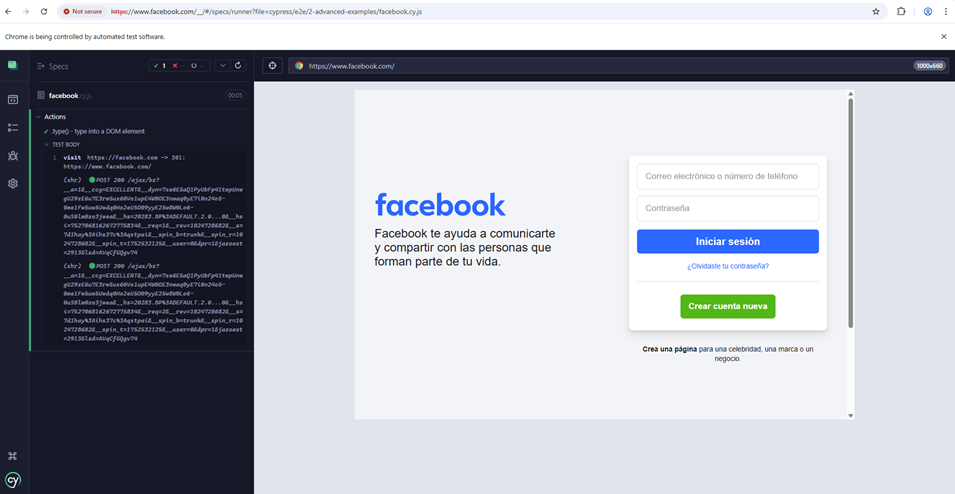
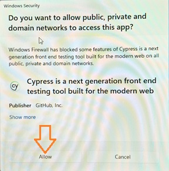
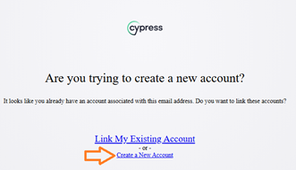
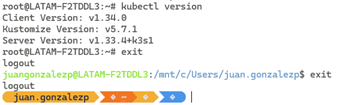
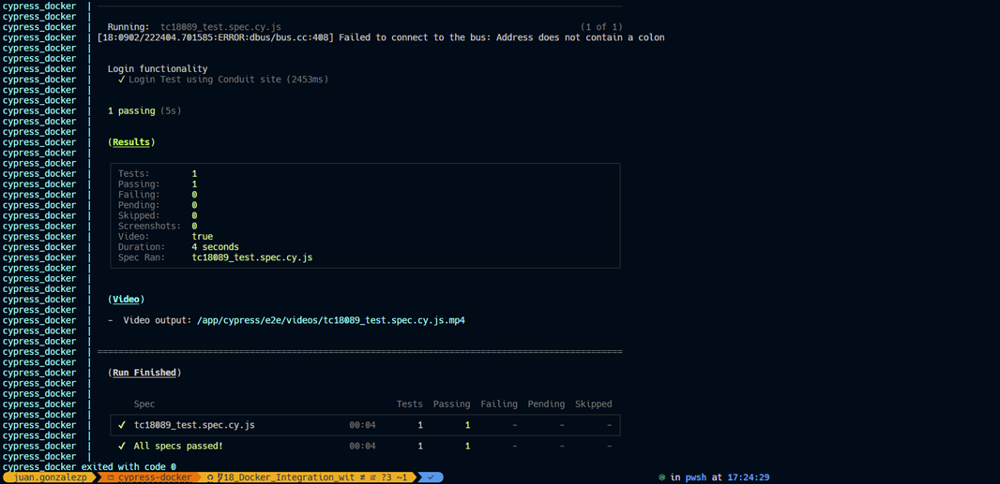
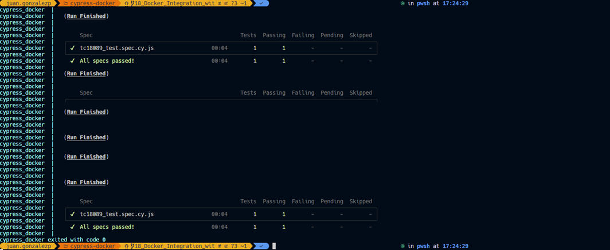

# Cypress V14.4.0 -Docker + Cucumber + Jenkins -JUNE'25 Course

## Cypress-14-Docker-Cucumber-Jenkins-JUNE25

[](https://www.udemy.com/course/cypress-ultimate-course/)

>[!IMPORTANT]
>
>* What you'll learn
>   * By end of this course, you will be a master in 2024 Cypress with latest version.
>   * You will be able to build robust framework using Cypress >+ Docker + Cucumber + Jenkins.
>   * Complete knowledge on how to write test in Cucumber BDD style.
>   * Complete knowledge on Docker and how to run tests inside docker.
>   * Complete understanding of Cypress Components such as fixtures, plugins, screenshots and videos.
>   * Usage of Cypress in real world automation end to end testing.
>   * Gain complete knowledge on Web Automation techniques and tricks.
>   * Practical knowledge in designing framework from scratch.
>   * Learn API testing using Cypress.
>   * Learn how to use Mocks for seamless web automation.

## Section 1: Introduction to Cypress

### 5. What is Cypress ?

>[!NOTE]
>
>`Cypress` is a next generation front end automation testing tool built for the modern web applications. Using `Cypress`. We can do fast, easy and reliable testing for anything that runs in a browser.
>
>To understand more about the `Cypress`, let's go to their official website. `Cypress`.Dot io is their official website.The slogan they have written is test, automate, accelerate.
>
>With `Cypress`, you can easily create tests for your modern web applications, debug them visually and automatically run them in your continuous integration bill. As you all are aware that the website is, keep on evolving like from Angular to React and many other assets.
>
>**What is asynchronous issue?**
>
>Let's say when we click on a button in a web page and it navigates to the other page, and it takes
>nearly five to 10s to navigate.
>
>If we use other automation tools, then we have to deliberately ad wait until the next page loads.But with `Cypress` we do not need to handle any wait. `Cypress` engine handles that for us.
>
>This is one of the major features which is `Cypress` offers when compared to other tools. As often the test script may fail because of this synchronization bonding. By default `Cypress` will wait for four seconds, but we can configure that globally and can increase the wait based upon the website we work on.
>
>We will cover this in detail in the upcoming session.`Cypress` scripts are written in JavaScript. This is because `Cypress` is built on NodeJS.
>
>**`Cypress` uses mocha and chai.**
>
>Mocha is a feature rich JavaScript test framework running on the NodeJS and in the browser, makingasynchronous testing simple and fun.
>
>Mocha tests run serially, allowing for flexible and accurate reporting while mapping uncaught exceptions to the correct test cases.
>
>Chai is a BDD or TDD assertion library for node and the browser that can be delightfully paired with any JavaScript testing framework.

### 6. Cypress Architecture

>[!NOTE]
>
>Antes de empezar con la arquitectura de `Cypress`, echemos un vistazo a la arquitectura de `Selenium`.
>Para las personas que no tienen ni idea sobre el `Selenium`.
>
>`Selenium` es la herramienta dominantemente utilizada para pruebas de automatización web en todo el mundo. Esta es la arquitectura del `Selenium`. Una vez que escribimos nuestro código en `Selenium`, compila y envía. Tiene una petición Http a un medio llamado como controlador del navegador.
>
>Si las personas que ya tienen una idea con `Selenium`, cada prueba tiene que mencionar lo que el controlador del navegador se ejecuta esta prueba.
>
>Veamos ahora la arquitectura de `Cypress`.
>
>Como puede ver en el diagrama, nuestra prueba de `Cypress` ejecuta comandos directamente en el navegador. En comparación con el selenio, `Cypress` no tiene ninguna sección de conductor intermedio.
>
>Gracias a ello, las pruebas de `Cypress` son superrápidas y mucho más fiables en comparación con otras herramientas de automatización. En resumen, `Cypress` es mucho más diferente y eficaz que las herramientas de automatización existentes.

### 7. Amazing Cypress Features

>[!NOTE]
>`Cypress` ofrece algunas características sorprendentes en comparación con otras herramientas de automatización como `Selenium`, `PlayWright`, WebDriver, IO, etc. Veámoslos uno por uno.
>
>**La primera característica es el viaje en el tiempo.**
>
>`Cypress` toma instantáneas mientras se ejecuta la prueba, lo que permite al usuario volver atrás y verificar una vez finalizada la ejecución para ver exactamente lo que ocurrió en cada paso.
>
>Esta característica es la más sorprendente característica que no está presente en cualquier otra herramienta de automatización. Lo veremos en detalle en nuestro próximo vídeo.
>
>**La siguiente característica es la recarga en tiempo real.**
>
>`Cypress` se recarga automáticamente cada vez que realizamos cambios en la prueba. Ya no es necesario ejecutar una prueba cada vez después de guardar un archivo. `Cypress` lo hace automáticamente.
>
>**La siguiente característica es spice stubs y relojes erificar y controlar el comportamiento de las funciones, las respuestas del servidor, o temporizadores.**
>
>Por ejemplo, digamos que estás probando una aplicación que lanza un error. Si abrimos con las fechas pasadas, a continuación, utilizando `Cypress`, podemos Simular de los temporizadores como el punto fechas pasadas y comprobar las respuestas web.
>
>**La siguiente característica es la coherencia de los resultados.**
>
>Las pruebas de `Cypress` no tienen escamas.En todo momento, el resultado de la prueba será preciso gracias a su potente arquitectura, que consiste en que la prueba se ejecuta directamente en el navegador.
>
>**La siguiente característica es la capacidad de depuración de errores legibles y rastros de pila hace que la depuración sea tan fácil en `Cypress`.**
>
>Si la prueba falla con los errores mostrados en Test Runner y la función de viaje en el tiempo, podemos agarrar fácilmente los errores.
>
>Se acabaron las conjeturas para identificar los errores cuando trabajamos en `Cypress`.
>
>**La siguiente función es la ponderación automática.**
>
>Como se ha comentado anteriormente, `Cypress` ofrece por defecto la ponderación automática en los comandos y asercionesantes de seguir adelante, de modo que no es necesario poner peso o dormir deliberadamente en la prueba.
>
>**La siguiente función es el control del tráfico de red.**
>
>EC controla los y casos de prueba sin involucrar al servidor. Podemos simular fácilmente las respuestas del servidor para probar los casos extremos utilizando `Cypress`.
>
>**La siguiente función son las capturas de pantalla y los vídeos.**
>
>Esta es otra de las grandes características que ofrece `Cypress`. Las capturas de pantalla se toman automáticamente en caso de fallo y el vídeo de toda la prueba se graba y almacena automáticamente. Si desea obtener capturas de pantalla de vídeos utilizando selenio, tenemos que escribir código independiente e invocarlo en la prueba. Pero con las ofertas de `Cypress` como función incorporada.
>
>Así que hemos entendido claramente cuáles son las grandes características que ofrece el `Cypress` en comparación con las otras herramientas.

## Section 2: JavaScript Basics

### 8. Introduction to JavaScript

>[!NOTE]
>
>Entenderemos un poco de historia sobre el JavaScript.
>
>JavaScript fue creado por Brendan en 1995 mientras trabajaba en Netscape Communications Corporation.
>El JavaScript se denominaba originalmente Livescript.
>Más tarde se renombró como JavaScript para alinearse con la popularidad de otro lenguaje llamado Java.
>Aunque Java y JavaScript son muy diferentes entre sí.
>JavaScript se ganó rápidamente la atracción, ya que se proporciona una forma de añadir interactividad a las páginas web
>estáticas.
>
>**La primera característica es dinámica e interpretada.**
>
>JavaScript es un lenguaje de tipado dinámico, lo que significa que las variables pueden cambiar de tipo durante el tiempo de ejecución.
>También es un lenguaje interpretado, lo que significa que el código JavaScript es ejecutado directamente por un navegador
>web sin necesidad de compilación.
>
>Así que debido a que esto hace que el altamente accesible para los desarrolladores web, ya que pueden escribir y probar el código
>en tiempo real.
>
>**La segunda característica es el scripting del lado del cliente.**
>
>Uno de los principales usos de JavaScript es la creación de scripts en el lado del cliente.
>Se ejecuta en el navegador web del usuario, lo que permite a los desarrolladores crear aplicaciones web interactivas.
>Con JavaScript, puede manipular el Dom, que es el modelo de objetos del documento.
>Responder a los eventos del usuario, validar a partir de la entrada y realizar diversas acciones sin requerir un viaje de ida y vuelta del servidor.
>
>La principal ventaja de utilizar JavaScript para el desarrollo web es que podemos modificar la Dom como queramos y los
>desarrolladores pueden crearla tan rápido como en comparación con otros lenguajes de programación.
>
>**La siguiente característica es la sintaxis y la estructura.**
>
>JavaScript tiene una sintaxis de tipo C similar a la de lenguajes como Java y C plus.
>Utiliza punto y coma para terminar las sentencias y llaves para definir los bloques.
>Las variables se declaran utilizando palabras clave como var, let o constant.
>Las funciones son una característica esencial y los objetos y las matrices son estructuras de datos fundamentales.
>Así que la sintaxis y la estructura del JavaScript es muy similar a Java y C plus plus, pero la funcionalidad
>sabia todo está en un nivel muy diferente.
>La siguiente característica de JavaScript es la compatibilidad entre navegadores, que es una de las principales ventajas
>de JavaScript.
>
>**La siguiente función es Ecmascript.**
>
>JavaScript estándar se adhiere a la ECMA, que es European Computer Manufacturers Association script estándar, que
>define las especificaciones y características del lenguaje.
>Existen diferentes versiones de script que introducen nuevas características y mejoras en el lenguaje.
>
>Por ejemplo, Ecmascript seis, que es el ES6, que es la última versión de JavaScript, trajo una mejora significativa,
>incluyendo la plantilla de función de flecha, tripletas y sintaxis de clase, etcétera.
>
>**La siguiente característica de JavaScript es la versatilidad.**
>
>JavaScript no se limita al desarrollo web.
>Con la llegada de NodeJS, los desarrolladores pueden utilizar JavaScript para crear scripts del lado del servidor, crear servidores
>web y crear aplicaciones backend escalables.
>
>**En resumen, JavaScript es un lenguaje de programación versátil que desempeña un papel fundamental en el desarrollo web al permitir la creación de aplicaciones web dinámicas, interactivas y con capacidad de respuesta.**
>
>Su evolución constante.
>La compatibilidad entre navegadores y la diversidad del ecosistema lo convierten en una habilidad valiosa tanto para los desarrolladores
>front-end como back-end.
>Como ingeniero de automatización de pruebas, aprender JavaScript puede ayudarnos de muchas, muchas maneras al adherirnos a aprender muchas herramientas
>nuevas como `Cypress`, `PlayWright` y etcétera, las cuales todas han sido escritas por JavaScript.

### 9. Prerequisite Needed

>[!IMPORTANT]
>
>* [Visual Studio Code](https://code.visualstudio.com/download), editor liviano y muy acorde con `JavaScript`, pero ya existen otros que le compiten y con `I.A.` integrado ejemplos:
>   * [Las 10 mejores alternativas a Cursor AI (mejores que Github Copilot, código abierto)](https://apidog-com.translate.goog/blog/top-10-cursor-ai-alternatives/?_x_tr_sl=en&_x_tr_tl=es&_x_tr_hl=es&_x_tr_pto=tc&_x_tr_hist=true)
>   * [Cursor vs Windsurf vs GitHub Copilot](https://www-builder-io.translate.goog/blog/cursor-vs-windsurf-vs-github-copilot?_x_tr_sl=en&_x_tr_tl=es&_x_tr_hl=es&_x_tr_pto=tc&_x_tr_hist=true).
>

1. Creamos la carpeta **"02-JavaScriptBasics"**.
2. Allí creamos el archivo **`HelloWorld.js`**,y le ponemos este código: </br>`console.log("HELLO WORLD!!");`
3. Abrimos una `TERMINAL` dentro de `Visual Studio Code` y ejecutamos este comando, para cambiar de carpeta:
```dos
cd ./02-JavaScriptBasics/
```
4. En la misma `TERMINAL` este otro comando:
```dos
node HelloWorld.js
```
5. El Instructor sugiere instalar en `Visual Studio Code`, la extensión [](https://marketplace.visualstudio.com/items?itemName=formulahendry.code-runner) de [Jun Han](https://marketplace.visualstudio.com/publishers/formulahendry)
6. En la parte izquierda donde sale los archivos y carpetas, se da clic derecho sobre el archivo, y se puede seleccionar `Run Code`.

### 10. Variables

>[!NOTE]
>
>Variable es un contenedor para un valor. Las variables pueden contener diversos tipos de datos, como números, cadenas u objetos. Proporcionan una forma de manipular y almacenar los datos durante el programa.

1. Creamos el archivo **`02-JavaScriptBasics/variable.js`**.
2. Ponemos este código:
```js
var myName = "John Doe";
let myAge = 30;
const myCountry = "USA";
console.log("Name:", myName);
console.log("Age:", myAge);
console.log("Country:", myCountry);
```
3. Damos clic derecho sobre **`variable.js`**, y seleccionamos `Code Run`.
>[!NOTE]
>
>**¿Cuáles son las principales diferencias entre var, let y const?**
>
>Las variables que se declaran con var son de ámbito de función, lo que significa que son accesibles
>en toda la función en la que se definen.
>Si la declaramos fuera de una función, esta variable declarada var estará disponible globalmente.
>
>Las variables let y const tienen ámbito de bloque, lo que significa que están limitadas a un ámbito en un bloque, lo
>que significa que se crea un bloque utilizando llaves.
>
>Aprenderemos más sobre esto en detalle en nuestros próximos vídeos en los que hablaremos de los temas de alcance.
>La única diferencia importante entre var let y const es.
>Var y let pueden modificarse.
>Mientras que si asignamos un valor a la constante que no se puede modificar.
4. Ejemplo puedeo ñadir este código y es permitido:
```js
// Changing the value of myName
myName = "Jane Doe"; // This is allowed because myName is declared with var
myAge = 31; // This is allowed because myAge is declared with let
// myCountry = "Canada"; // This would cause an error because myCountry is declared with const
console.log("Updated Name:", myName);
console.log("Updated Age:", myAge);
// console.log("Updated Country:", myCountry); // Uncommenting this line would cause an error
```

### 11. Datatypes

1. Creamos el archivo **`02-JavaScriptBasics/dataTypes.js`**.
>[!NOTE]
>**Primitive Data Types:**
>1. String: Represents text, enclosed in single or double quotes.
>2. Number: Represents numeric values, both integers and floating-point numbers.
>3. Boolean: Represents a logical entity and can have two values: true or false.
>4. Undefined: A variable that has been declared but not assigned a value.
>5. Null: Represents the intentional absence of any object value.
>6. Symbol: A unique and immutable primitive value, often used as object property keys.
>7. BigInt: Represents integers with arbitrary precision, useful for very large numbers.
>
>**Complex Data Types:**
>1. Object: A collection of key-value pairs, where keys are strings (or Symbols) and values can be of any type.
>2. Array: A special type of object that holds an ordered collection of values, which can be of any type.
>3. Function: A callable object that can be invoked to perform a specific task or computation.
>4. Date: Represents a specific point in time, allowing for date and time manipulation.
>5. RegExp: Represents a regular expression, used for pattern matching in strings.
>6. Map: A collection of keyed data items, similar to an object, but with keys of any type and maintaining the order of insertion.
>7. Set: A collection of unique values, where each value can only occur once, regardless of type.
>8. WeakMap: Similar to Map, but allows for garbage collection of keys that are not referenced elsewhere.
>9. WeakSet: Similar to Set, but allows for garbage collection of values that are not referenced elsewhere.
>
2. Creamos y mostramos los tipos primitivos:
```js
let num1 = 42; // Number
let str1 = "Hello, World!"; // String
let bool1 = true; // Boolean
let undef1; // Undefined (declared but not assigned)
let null1 = null; // Null (intentional absence of value)
let sym1 = Symbol("unique"); // Symbol (unique identifier)
let bigInt1 = BigInt(123456789012345678901234567890);
// Displaying the values
console.log("Primitive Data Types:");
console.log("Number:", num1);
console.log("String:", str1);
console.log("Boolean:", bool1);
console.log("Undefined:", undef1);
console.log("Null:", null1);
console.log("Symbol:", sym1);
console.log("BigInt:", bigInt1);
```
3. Resultado inicial:
```json
Primitive Data Types:
Number: 42
String: Hello, World!
Boolean: true
Undefined: undefined
Null: null
Symbol: Symbol(unique)
BigInt: 123456789012345677877719597056n
```
4. Hacemos lo mismo con los valores Tipos Complejos:
```js
let obj1 = { name: "Alice", age: 30 }; // Object
let arr1 = [1, 2, 3, "four", true]; // Array
let func1 = function () {
  return "Hello from a function!";
}; // Function
let date1 = new Date(); // Date
let regExp1 = /abc/; // RegExp
let map1 = new Map(); // Map
map1.set("key1", "value1");
let set1 = new Set(); // Set
set1.add(1);
set1.add(2);
let weakMap1 = new WeakMap(); // WeakMap
let obj2 = {};
weakMap1.set(obj2, "WeakMap value");
let weakSet1 = new WeakSet(); // WeakSet
let obj3 = {};
weakSet1.add(obj3); // Adding an object to WeakSet
// Displaying the values

console.log("\nComplex Data Types:");
console.log("Object:", obj1);
console.log("Array:", arr1);
console.log("Function:", func1());
console.log("Date:", date1);
console.log("RegExp:", regExp1);
console.log("Map:", map1);
console.log("Set:", set1);
console.log("WeakMap:", weakMap1.get(obj2)); // Accessing value from WeakMap
console.log("WeakSet contains obj3:", weakSet1.has(obj3)); // Checking if WeakSet contains obj3
```
5. Esto es lo que sería la otra parte:
```json
Complex Data Types:
Object: { name: 'Alice', age: 30 }
Array: [ 1, 2, 3, 'four', true ]
Function: Hello from a function!
Date: 2025-07-05T15:58:55.443Z
RegExp: /abc/
Map: Map(1) { 'key1' => 'value1' }
Set: Set(2) { 1, 2 }
WeakMap: WeakMap value
WeakSet contains obj3: true
```

### 12. Operators

1. Creamos el archivo **`02-JavaScriptBasics/operators.js`**.
>[!NOTE]
>**Operators in JavaScript:**
>1. Arithmetic Operators: Used for mathematical operations.
> * Addition (+)
> * Subtraction (-)
> * Multiplication (*)
> * Division (/)
> * Modulus (%)
> * Exponentiation (**)
>2. Assignment Operators: Used to assign values to variables.
> * Assignment (=)
> * Addition assignment (+=)
> * Subtraction assignment (-=)
> * Multiplication assignment (*=)
> * Division assignment (/=)
> * Modulus assignment (%=)
> * Exponentiation assignment (**=)
>3. Comparison Operators: Used to compare values.
> * Equal to (==)
> * Not equal to (!=)
> * Strict equal to (===)
> * Strict not equal to (!==)
> * Greater than (>)
> * Less than (<)
> * Greater than or equal to (>=)
> * Less than or equal to (<=)
>4. Logical Operators: Used to perform logical operations.
> * Logical AND (&&)
> * Logical OR (||)
> * Logical NOT (!)
>5. Bitwise Operators: Used to perform bit-level operations.
> * Bitwise AND (&)
> * Bitwise OR (|)
> * Bitwise XOR (^)
> * Bitwise NOT (~)
> * Left shift (<<)
> * Right shift (>>)
> * Unsigned right shift (>>>)
>6. Ternary Operator: A shorthand for if-else statements.
> * Conditional (condition ? expr1 : expr2)
>7. Typeof Operator: Used to determine the type of a variable.
> * typeof variable
>8. Instanceof Operator: Used to check if an object is an instance of a specific class.
> * object instanceof Class
>9. Comma Operator: Used to evaluate multiple expressions and return the last one.
> * (expr1, expr2, ..., exprN)
>10. Spread Operator: Used to expand an iterable (like an array) into its elements.
> * [...iterable]
>11. Rest Operator: Used to collect multiple elements into an array.
> * function(...args) { ... }
>12. Nullish Coalescing Operator: Returns the right-hand operand when the left-hand operand is null or undefined.
> * left ?? right
>13. Optional Chaining Operator: Allows reading the value of a property located deep within a chain of connected objects without having to check if each reference in the chain is nullish.
> * object?.property

2. Primera tanda de operadores:
```js
let a = 10;
let b = 5;

// Arithmetic Operators
let sum = a + b; // Addition
let difference = a - b; // Subtraction
let product = a * b; // Multiplication
let quotient = a / b; // Division
let remainder = a % b; // Modulus
let exponentiation = a ** b; // Exponentiation
console.log(`Sum: ${sum}`);
console.log(`Difference: ${difference}`);
console.log(`Product: ${product}`);
console.log(`Quotient: ${quotient}`);
console.log(`Remainder: ${remainder}`);
console.log(`Exponentiation: ${exponentiation}`);
```
3. Y este sería el resultado:
```json
Sum: 15
Difference: 5
Product: 50
Quotient: 2
Remainder: 0
Exponentiation: 100000
```
4. Otros Operadores de asignación:
```js
// Assignment Operators
let x = 10;
x += 5; // Addition assignment
console.log(`x after addition assignment: ${x}`);
x -= 3; // Subtraction assignment
console.log(`x after subtraction assignment: ${x}`);
x *= 2; // Multiplication assignment
console.log(`x after multiplication assignment: ${x}`);
x /= 3; // Division assignment
console.log(`x after division assignment: ${x}`);
x %= 5; // Modulus assignment
console.log(`x after modulus assignment: ${x}`);
x **= 2; // Exponentiation assignment
console.log(`x after exponentiation assignment: ${x}`);
```
6. Y este sería el resultado:
```json
x after addition assignment: 15
x after subtraction assignment: 12
x after multiplication assignment: 24
x after division assignment: 8
x after modulus assignment: 3
x after exponentiation assignment: 9
```
7. Esta otra tanda para comparar:
```js
// Comparison Operators
let c = 10;
let d = '10';
console.log(`c: ${c}, d: '${d}'`);
let isEqual = (c == d); // Equal to
let isNotEqual = (c != d); // Not equal to
let isStrictEqual = (c === d); // Strict equal to 
let isStrictNotEqual = (c !== d); // Strict not equal to
let isGreaterThan = (c > d); // Greater than
let isLessThan = (c < d); // Less than
let isGreaterThanOrEqual = (c >= d); // Greater than or equal to
let isLessThanOrEqual = (c <= d); // Less than or equal to
console.log(`Is Equal: ${isEqual}`);
console.log(`Is Not Equal: ${isNotEqual}`);
console.log(`Is Strict Equal: ${isStrictEqual}`);
console.log(`Is Strict Not Equal: ${isStrictNotEqual}`);
console.log(`Is Greater Than: ${isGreaterThan}`);
console.log(`Is Less Than: ${isLessThan}`); 
```
8. Y este resultado entre un número y una cadena:
```json
c: 10, d: '10'
Is Equal: true
Is Not Equal: false
Is Strict Equal: false
Is Strict Not Equal: true
Is Greater Than: false
Is Less Than: false
```
9. Operadores lógicos:
```js
// Logical Operators
let e = true;
let f = false;
let andOperation = e && f; // Logical AND
let orOperation = e || f; // Logical OR
let notOperation = !e; // Logical NOT
console.log(`AND Operation: ${andOperation}`);
console.log(`OR Operation: ${orOperation}`);
console.log(`NOT Operation: ${notOperation}`);
```
10. Con este resultado:
```json
AND Operation: false
OR Operation: true
NOT Operation: false
```
11. Operadores unitarios y ternarios:
```js
// Unary Operators
let g = 5;
let increment = ++g; // Increment
let decrement = --g; // Decrement
console.log(`Increment: ${increment}`);
console.log(`Decrement: ${decrement}`);

//Ternary Operator
let age = 18;
let canVote = age >= 18 ? "Yes" : "No"; // Ternary operator
console.log(`Can vote: ${canVote}`);
```
12. Esta es la respuesta:
```json
Increment: 6
Decrement: 5
Can vote: Yes
```
13. Tipo de datos:
```js
// Typeof Operator
let variable = "Hello";
let typeOfVariable = typeof variable; // Typeof operator
console.log(`Type of variable: ${typeOfVariable}`);
```
14. Y la respuesta es :`Type of variable: string`.
15. Los Binarios o _bitwise_ operadores con estos:
```js
// Binary or Bitwise Operators
let h = 5;
let i = 3;
let bitwiseAnd = h & i; // Bitwise AND
let bitwiseOr = h | i; // Bitwise OR
let bitwiseXor = h ^ i; // Bitwise XOR
let bitwiseNot = ~h; // Bitwise NOT
let leftShift = h << 1; // Left shift
let rightShift = h >> 1; // Right shift
let unsignedRightShift = h >>> 1; // Unsigned right shift
console.log(`Bitwise AND: ${bitwiseAnd}`);
console.log(`Bitwise OR: ${bitwiseOr}`);
console.log(`Bitwise XOR: ${bitwiseXor}`);
console.log(`Bitwise NOT: ${bitwiseNot}`);
console.log(`Left Shift: ${leftShift}`);
console.log(`Right Shift: ${rightShift}`);
console.log(`Unsigned Right Shift: ${unsignedRightShift}`);
```
16. Y esto es después de ejecutar:
```json
Bitwise AND: 1
Bitwise OR: 7
Bitwise XOR: 6
Bitwise NOT: -6
Left Shift: 10
Right Shift: 2
Unsigned Right Shift: 2
```

### 13. Conditional statement

1. Empezamos creando el archivo **`02-JavaScriptBasics/operators.jsconditionStatement.js`**.
2. Agrego este código, con un condicional básico:
```js
let age = 20;
if (age < 18) {
  console.log("You are a minor.");
} else if (age >= 18 && age < 65) {
  console.log("You are an adult.");
} else {
  console.log("You are a senior citizen.");
}
```
3. Esta sería la respuesta:</br>`You are an adult.`

### 14. Switch Statement

1. Creamos el archivo **`02-JavaScriptBasics/switchStatement.js`**.
2. Pongo este código:
```js
// Switch Statement Example
function getDayName(dayNumber) {
    let dayName;

    switch (dayNumber) {
        case 0:
            dayName = "Sunday";
            break;
        case 1:
            dayName = "Monday";
            break;
        case 2:
            dayName = "Tuesday";
            break;
        case 3:
            dayName = "Wednesday";
            break;
        case 4:
            dayName = "Thursday";
            break;
        case 5:
            dayName = "Friday";
            break;
        case 6:
            dayName = "Saturday";
            break;
        default:
            dayName = "Invalid day number";
    }

    return dayName;
}
// Example usage
console.log(getDayName(0)); // Output: Sunday
console.log(getDayName(3)); // Output: Wednesday
console.log(getDayName(6)); // Output: Saturday
console.log(getDayName(7)); // Output: Invalid day number
```
3. Al ejecutar obtengo esto:
```dos
Sunday
Wednesday
Saturday
Invalid day number
```


## Section 3: Javascript Advanced Level

### 15. Loops

1. Empezamos creando la carpeta **"03_JavascriptAdvancedLevel"**.
2. Dentro de la nueva carpeta creamos el archivo **`loops.js`**.
>[!NOTE]
>
>Los bucles en JavaScript son estructuras de control que permiten ejecutar un bloque de código repetidamente, siempre que se cumpla
>una determinada condición, o hasta que se alcance un número especificado de iteraciones.
>
>JavaScript ofrece tres tipos principales de bucles.
>Bucle `for`, bucle `while` y bucle `do while`, veremos uno por uno.
3. Empezamos con el bucle `for`:
```js
/* for loop
for (initialization; condition; increment/decrement) {
     // code to be executed
 }
*/
for (let i = 0; i < 5; i++) {
  console.log(i); // Output: 0 1 2 3 4
}
```
4. El siguiente es el bucle `while`:
```js
/* while loop
while (condition) {
     // code to be executed
 }
*/
let j = 0;
while (j < 5) {
  console.log(j); // Output: 0 1 2 3 4
  j++;
}
```
5. Por último el bucle `do while`:
```js
/* do while loop
do {
     // code to be executed
} while (condition);
*/
let k = 0;
do {
  console.log(k); // Output: 0 1 2 3 4
  k++;
}while (k < 5);
```
6. Las declaraciones `Break` y `Continue`:
```js
// Break and Continue
for (let l = 0; l < 5; l++) {
  if (l === 2) {
    continue; // Skip the iteration when l is 2
  }
  console.log(l); // Output: 0 1 3 4
} 
for (let m = 0; m < 5; m++) {
  if (m === 3) {
    break; // Exit the loop when m is 3
  }
  console.log(m); // Output: 0 1 2
}
```

### 16. Dynamic-Typing

1. Creamos el archivo **`03_JavascriptAdvancedLevel/dynamicTyping.js`**.
>[!NOTE]  
>
>La tipificación dinámica, también conocida como tipificación duck, es un concepto fundamental en JavaScript y en muchos otros lenguajes de programación
>de tipificación dinámica.
>
>Se refiere a la capacidad de las variables para cambiar sus tipos de datos durante el tiempo de ejecución, lo que permite un comportamiento
>flexible y dinámico en su código.
2. Este sería el código y su respuesta esperada:}
```js
// Type inference in JavaScript is a feature that allows the JavaScript engine to automatically determine the type of a variable at runtime.
//  This means that you do not need to explicitly declare the type of a variable when you create it. Instead, the engine infers the type based on the value assigned to the variable.

let dynamicVariable = 42; // Initially a number
console.log(typeof dynamicVariable); // Output: "number"
dynamicVariable = "Hello, World!"; // Now a string
console.log(typeof dynamicVariable); // Output: "string"
dynamicVariable = true; // Now a boolean
console.log(typeof dynamicVariable); // Output: "boolean"
dynamicVariable = { key: "value" }; // Now an object
console.log(typeof dynamicVariable); // Output: "object"
dynamicVariable = [1, 2, 3]; // Now an array (which is also an object)
console.log(typeof dynamicVariable); // Output: "object"
dynamicVariable = null; // Now null
console.log(typeof dynamicVariable); // Output: "object" (this is a known quirk in JavaScript)
dynamicVariable = undefined; // Now undefined
console.log(typeof dynamicVariable); // Output: "undefined"
dynamicVariable = Symbol("unique"); // Uncommenting this line would make it a Symbol
console.log(typeof dynamicVariable); // Output: "symbol"
dynamicVariable = function () {}; // Uncommenting this line would make it a function
console.log(typeof dynamicVariable);
```
3. Otro ejemplo sería validanto el tipo:
```js
// Type checking
dynamicVariable = [1, 2, 3];
console.log('is number?', typeof dynamicVariable === "number"); // Output: false
console.log('is string?', typeof dynamicVariable === "string"); // Output: false
console.log('is boolean?', typeof dynamicVariable === "boolean"); // Output: false
console.log('is object?', typeof dynamicVariable === "object"); // Output: true
console.log('is array?', Array.isArray(dynamicVariable)); // Output: false (since it's not an array)
console.log('is null?', dynamicVariable === null); // Output: false (since it's not null)
console.log('is undefinied?', dynamicVariable === undefined); // Output: false (since it's not undefined)
console.log('is symbol?', typeof dynamicVariable === "symbol"); // Output: false (since it's not a symbol)
console.log('is function?', typeof dynamicVariable === "function"); // Output: false (since it's not a function)
```


### 17. Arrays

1. Creamos el archivo **`03_JavascriptAdvancedLevel/arrays.js`**.
2. Empezamos con esta tanda:
```js
// Arrays

// Array literal
const fruits = ['apple', 'banana', 'orange']; 

// Array constructor
const vegetables = new Array('carrot', 'broccoli', 'spinach');  

console.log(fruits); // ['apple', 'banana', 'orange']
console.log(vegetables[1]); // 'broccoli'
```
3. Luego probamos esta:
```js
// Length of an array
console.log(fruits.length); // 3
```
4. Agregamos un elemento al final del arreglo:
```js
// Add elemento to the end of an array
fruits.push('grape');
console.log(fruits); // ['apple', 'banana', 'orange', 'grape']
```
5. Borramosel último elemento del arreglo:
```js
// Delete the last element of an array
fruits.pop();
console.log(fruits); // ['apple', 'banana', 'orange']
```
6. Recorrerlo a través de un ciclo:
```js
// Iterate using loop
for (let i = 0; i < fruits.length; i++) {
    console.log(fruits[i]); // 'apple', 'banana', 'orange'
} 
```
7. Recorrelo con `forEach`:
```js
// Iterate using forEach
fruits.forEach((fruit) => {
    console.log(fruit); // 'apple', 'banana', 'orange'
});

```
8. Recorrer usando `for..of`:
```js
// Iterate using for...of
for (const fruit of fruits) {
    console.log(fruit); // 'apple', 'banana', 'orange'
}
```


### 18. Objects

1. Creamos el archivo **`03_JavascriptAdvancedLevel/objects.js`**.
2. Ponemos este código inicial con un `Object Literal`:
```js
// Object Literal
const person = {
  name: "John",
  age: 30,
  greet: function () {
    console.log(`Hello, my name is ${this.name}`);
  },
};

console.log(person.name); // 'John'
console.log(person["age"]); // 30
person.greet(); // 'Hello, my name is John'
```
3. Ahora probamos el `Object Constructor`:
```js
// Object Constructor
function Car(make, model, year) {
  this.make = make;
  this.model = model;
  this.year = year;
}
Car.prototype.getDetails = function () {
  return `${this.year} ${this.make} ${this.model}`;
};
const myCar = new Car("Toyota", "Corolla", 2020);
console.log(myCar.getDetails()); // '2020 Toyota Corolla'
```
4. Puedo adiciona métodos y propiedades:
```js
// Adding properties and methods
myCar.color = "red";
myCar.start = function () {
  console.log(`Starting the ${this.color} ${this.make} ${this.model}`);
}
console.log(myCar.color); // 'red'
myCar.start(); // 'Starting the red Toyota Corolla'
```
5. Puedo adicionar y desesctructurar:
```js
// Object Property Access
person.job = "Developer";
console.log(person.job); // 'Developer'
person.greet = function () {
  console.log(`Hello, my name is ${this.name} and I am a ${this.job}`);
}
person.greet(); // 'Hello, my name is John and I am a Developer'  

// Object Destructuring
const { name, age } = person;
console.log(name); // 'John'
console.log(age); // 30
```

### 19. Function

1. Empezamos creando el archivo **`03_JavascriptAdvancedLevel/function.js`**.
2. Tengo tres funciones iniciales:
```js
// Function declaration
function greet(name) {
  return `Hello, ${name}!`;
}
// Function expression
const farewell = function (name) {
  return `Goodbye, ${name}!`;
};
// Arrow function
const welcome = (name) => `Welcome, ${name}!`;
// Higher-order function
```
3. Ahora invoco las tres funciones que se crearon:
```js
// Using the basic functions
console.log(greet("Alice")); // 'Hello, Alice!'
console.log(farewell("Bob")); // 'Goodbye, Bob!'
console.log(welcome("Charlie")); // 'Welcome, Charlie!'
```
4. Creo una función de alto nivel que usa las funciones básicas, y devuelve una función:
```js
// Higher-order function that takes a function as an argument
// and returns a new function
function processUser(name, callback) {
  return callback(name);
}
// Using the functions with the higher-order function
console.log(processUser("Dave", greet)); // 'Hello, Dave!'
console.log(processUser("Eve", farewell)); // 'Goodbye, Eve!'
console.log(processUser("Frank", welcome)); // 'Welcome, Frank!'
```
5. Funciones con parámetros por defecto:
```js
// Function with default parameters
function multiply(a, b = 1) {
  return a * b;
}
console.log(multiply(5)); // 5 (5 * 1)
console.log(multiply(5, 2)); // 10 (5 * 2)
```
6. Funciones que pueden representar varios parámetros:
```js
// Function with rest parameters
function sum(...numbers) {
  return numbers.reduce((acc, num) => acc + num, 0);
}
console.log(sum(1, 2, 3)); // 6 (1 + 2 + 3)
console.log(sum(4, 5, 6, 7)); // 22 (4 + 5 + 6 + 7)
```
7. Función que separe los valores por dentro:
```js
// Function with spread operator
function logNumbers(...numbers) {
  console.log(...numbers);
}
logNumbers(1, 2, 3); // 1 2 3
logNumbers(4, 5, 6, 7); // 4 5 6 7
```
8. Función destructurando los parámetros:
```js
// Function with destructuring parameters
function displayUser({ name, age }) {
  console.log(`Name: ${name}, Age: ${age}`);
}
const user = { name: "Alice", age: 30 };
displayUser(user); // 'Name: Alice, Age: 30'
// Function with object destructuring and default values
function createUser({ name = "Guest", age = 18 } = {}) {
  return { name, age };
}
console.log(createUser()); // { name: 'Guest', age: 18 }
console.log(createUser({ name: "Bob" })); // { name: 'Bob', age: 18 }
console.log(createUser({ name: "Charlie", age: 25 })); // { name: 'Charlie', age: 25 }
```
9. Función con encadenamiento opcional:
```js
// Function with optional chaining
function getUserName(user) {
  return user?.name ?? "Anonymous"; // Returns 'Anonymous' if user is undefined or null
}
const user1 = { name: "Dave" };
const user2 = null;
console.log(getUserName(user1)); // 'Dave'
console.log(getUserName(user2)); // 'Anonymous'
```
10. Función con coalisión opcional:
```js
// Function with nullish coalescing
function getUserAge(user) {
  return user?.age ?? 18; // Returns 18 if user is undefined or null
}
const user3 = { age: 25 };
const user4 = null;
console.log(getUserAge(user3)); // 25
console.log(getUserAge(user4)); // 18
```
11. Función asincrónica, para esperar ejemplo un _API_:
```js
// Function with async/await
async function fetchData(url) {
  try {
    const response = await fetch(url);
    if (!response.ok) {
      throw new Error("Network response was not ok");
    }
    const data = await response.json();
    return data;
  } catch (error) {
    console.error("Fetch error:", error);
  }
}
// Example usage of fetchData (uncomment to run in an environment that supports fetch)
fetchData("https://jsonplaceholder.typicode.com/posts")
  .then(data => console.log(data))
  .catch(error => console.error("Error fetching data:", error));
```
12. Función con promesas:
```js
// Function with promises
function getData(url) {
  return new Promise((resolve, reject) => {
    setTimeout(() => {
      if (url) {
        resolve(`Data from ${url}`);
      } else {
        reject("No URL provided");
      }
    }, 1000);
  });
}
// Example usage of getData
getData("https://api.example.com/data")
  .then(data => console.log(data)) // 'Data from https://api.example.com/data'
  .catch(error => console.error("Error:", error));
```
13. Función con manejo de errores:
```js
// Function with error handling
function safeDivide(a, b) {
  try {
    if (b === 0) {
      throw new Error("Division by zero is not allowed");
    }
    return a / b;
  } catch (error) {
    console.error("Error:", error.message);
    return null; // Return null in case of an error
  }
}
console.log(safeDivide(10, 2)); // 5
console.log(safeDivide(10, 0)); // Error: Division by zero is not
```

### 20. Scope

1. Creamos el archivo **`03_JavascriptAdvancedLevel/scope.js`**.
>[!NOTE]
>
>Scope es un concepto fundamental en JavaScript que determina la visibilidad y accesibilidad de variables
>y funciones en tu código.
>
>Define dónde se declaran las variables y las funciones y dónde se puede acceder a ellas.
>
>Comprender el ámbito de JavaScript es crucial para escribir un código bien estructurado y libre de errores.
>En primer lugar, comprenderemos cuáles son los distintos tipos de visores disponibles.
2. Un ejemplo de _alcance_ o _scope_ global y local, sería:
```js
// Global Scope
let globalVar = "I am a global variable";
function globalFunction() {
    console.log(globalVar); // Accessible here
}

// Local Scope
function localScopeExample() {
    let localVar = "I am a local variable";
    console.log(localVar); // Accessible here
    globalFunction(); // Can access global function
}
// console.log(localVar); // Uncaught ReferenceError: localVar is not defined
localScopeExample(); // Call the function to see local variable in action
```
3. Esto sería un alcance bloqueado, como sería dentro de un condicional:
```js
// Block Scope
if (true) {
    let blockVar = "I am a block-scoped variable";
    console.log(blockVar); // Accessible here
}
// console.log(blockVar); // Uncaught ReferenceError: blockVar is not defined 
```
4. Alcande en una función anidada o interna:
```js
// Function Scope
function functionScopeExample() {
    var functionVar = "I am a function-scoped variable";
    console.log(functionVar); // Accessible here
}
functionScopeExample(); // Call the function to see function-scoped variable in action
// console.log(functionVar); // Uncaught ReferenceError: functionVar is not defined 
```
5. Elevación en una función sería:
```js
// Hoisting
console.log(hoistedVar); // undefined (due to hoisting)
var hoistedVar = "I am a hoisted variable";
function hoistingExample() {
    console.log(hoistedFunction()); // Works due to hoisting
    function hoistedFunction() {
        return "I am a hoisted function";
    }
}
hoistingExample(); // Call the function to see hoisting in action
```


## Section 4: Cypress Installation & Setup

### 21. Prerequisites needed for Cypress installation

1. Instalar `NODEJS` y `npm` en su sistema, usando el `nvm`:
  [Instalar múltiples versiones de Node.js en Windows](https://rafaelneto.dev/blog/instalar-multiples-versiones-nodejs-windows/).
```bash
nvm install [version]
nvm use [version]
```
2. Verificar las versiones de `NODEJS` instaladas en una `TERMINAL`:
```bash
nvm list
```
3. Instalar también el `pnpm` [pnpm installation](https://pnpm.io/installation), es mas rápido que el  `npm`.
4. Instalar [Visual Studio Code](https://code.visualstudio.com/insiders/).
5. Dentro de `Visual Studio Code`, se recomiendan estas extensiones:
* `ES7+ React/Redux/React-Native snippets` de `dsznajder` 4.4.x.
* `Better Comments` de `Aaron Bond` 3.0.x.
* `ESLint` de `Microsoft` 3.0.x.
* `Paste JSON as Code` de `quicktype` 23.0.x.
* `Prettier - Code formatter` de `Prettier` 11.0.x.
* `React Create Component` de `Javier Gutierrez` 1.5.x.
* `Simple React Snippets` de `Burke Holland` 1.2.x
* `TSLint` de `Microsoft` 1.3.x.
* `vscode-styled-components` de `Styled Components` 1.7.x.

### 22. Important Note: Cypress Version Update

>[!NOTE]
>
>**Nota importante: Actualización de la versión de Cypress**
>
>En el próximo video, instalaremos la versión 12.12 de Cypress.
>
>Pero la última versión de Cypress del mes es la 14.5.1.
>
>No se preocupen. Todos los videos del curso funcionan con la última versión de Cypress, la 14.5.1.
>
>")
>¡Feliz aprendizaje!


### 23. Installation of Cypress

1. La carpeta es la misma que tenemos de raíz en el repositorio, en nuestro caso se llama [`Cypress-14-Docker-Cucumber-Jenkins-JUNE25`](https://github.com/JDGonzal/Cypress-14-Docker-Cucumber-Jenkins-JUNE25)
2. Aquí ya tenemos corriendo el `Visual Studio Code`.
3. Abrimos una `TERMINAL` y escribimos este comando:
```bash
npm init -y
```
4. Al ejecutar este comando se crea el archivo **`package.json`**:</br>
```json
{
  "name": "cypress-14-docker-cucumber-jenkins-june25",
  "version": "1.0.0",
  "description": "[](https://www.udemy.com/course/cypress-ultimate-course/)",
  "main": "index.js",
  "scripts": {
    "test": "echo \"Error: no test specified\" && exit 1"
  },
  "repository": {
    "type": "git",
    "url": "git+https://github.com/JDGonzal/Cypress-14-Docker-Cucumber-Jenkins-JUNE25.git"
  },
  "keywords": [],
  "author": "",
  "license": "ISC",
  "bugs": {
    "url": "https://github.com/JDGonzal/Cypress-14-Docker-Cucumber-Jenkins-JUNE25/issues"
  },
  "homepage": "https://github.com/JDGonzal/Cypress-14-Docker-Cucumber-Jenkins-JUNE25#readme"
}
```
5. El instructor sugiere el uso de `npm` para el resto de procesos, pero yo voy a seguir utilizando el `pnpm` ([Paso 3 del #21](#21-prerequisites-needed-for-cypress-installation)).</br> En una `TERMINAL` ejecutamos:
```bash
pnpm i
```
6. El comando creó la carpeta **"node_modules"** y el archivo **`pnpm-lock.yaml`**:</br>
7. Instalamos ahora si [`Cypress`](https://www.npmjs.com/package/cypress), en una `TERMINAL`, ejecutamos esto:
```bash
pnpm add cypress -E
```
>[!WARNING]
>
>Aparece este mensaje:</br>`Ignored build scripts: cypress.`      </br>`Run "pnpm approve-builds" to pick which dependencies should be allowed to run scripts.`
>1. En una `TERMINAL` ejecuté el comando sugerido:</br>`pnpm approve-builds`
>2. El paquete a seleccionar con la `[SPACE-BAR]` es `cypress`.
>3. Me dice los próximos paquetes van a ser construídos en `cypress`, le doy la tecla `[y]`.
>4. Y sale este mensaje:</br>`node_modules/.pnpm/cypress@14.5.1/node_modules/cypress: Running postinstall script`

8. Ejecuto este comando en la `TERMINAL`:
```bash
npx cypress version
```
9. La respuesta es lenta pero se obtiene lo siguiente:
```dos
Cypress package version: 14.5.1
Cypress binary version: 14.5.1
Electron version: 33.2.1
Bundled Node version: 
20.18.1
```
* **Significa que la Instalación fue exitosa.**


## Section 5: Test Runner

### 24. How to use Test Runner to execute cypress tests

1. Abrimos una `TERMINAL` en `Visual Studio Code` y escribimos este comando:
```dos
npx cypress open
```
2. Despues de un rato (demora un buen tiempo), primero sale una pantalla de advertencia relacionada con `Windows Security`:</br>
3. En la `TERMINAL` nos sale un texto como este:
```bash
It looks like this is your first time using Cypress: 14.5.1

✔  Verified Cypress! C:\...\AppData\Local\Cypress\Cache\14.5.1\Cypress

Opening Cypress...
}

DevTools listening on ws://127.0.0.1:63246/devtools/browser/d2543309-...-f3e04a263e36
```
5. Luego nos sale una ventana de `Cypress` con las noticias de los cambios mas reciente y doy clic en el botón `[Continue]`:</br>
6. Ya nos sale el mensaje de bienvenido:</br> 
7. El instructor nos sugiere `E2E Testing`, y debemos esperar un tiempo largo, porque estos están en estado:</br> `No Configured`
8. Luego nos sale cuatro archivos, los mismos que se reflejan en nuevos archivos y carpetas, dentro del proyecto:</br>
9. Damos clic en el botón `[Continue]` y esperamos otro rato largo.
10. Nos pregunta en que browser queremos hacer las pruebas:</br>
11. Damos clic en el botón verde de la sugerencia principal:</br> `[Start E2E Testing in Chrome]`.
12. En la `TERMINAL`, aparecen ejecuciones hasta que abre la ventana de `Create your first spec`:</br>
13. Damos clic en `Scaffold example specs`, nos aparece esto:</br> </br> y damos clic en `[Okay, I got it!]`
14. Revisamos en el proyecto y ya tenemos todos estos nuevos archivos: </br>
15. Le doy clic al archivo **`cypress/e2e/1-getting-started/todo.cy.js`**:</br>
16. Empieza la ejecución:</br>
17. Al rato aparecen las ejecuciones: </br> 
18. Damos clic en el menú de la izquierda a <svg width="24" height="24" viewBox="0 0 24 24" fill="none" class="shrink-0 h-[24px] m-[12px] w-[24px] children:transition children:duration-300 icon-dark-gray-500 icon-light-gray-900 group-hover:icon-dark-gray-300 group-hover:icon-light-gray-800 group-focus:icon-dark-gray-300 group-focus:icon-light-gray-800"><path d="M3 15h4v4H3v-4Z" fill="currentColor" class="icon-light"></path><path d="M21 8a1 1 0 1 0 0-2v2ZM11 6a1 1 0 1 0 0 2V6Zm10 12a1 1 0 1 0 0-2v2Zm-10-2a1 1 0 1 0 0 2v-2ZM2.293 8.293a1 1 0 0 0 1.414 1.414L2.293 8.293Zm5.414-2.586a1 1 0 0 0-1.414-1.414l1.414 1.414Zm-4-1.414a1 1 0 0 0-1.414 1.414l1.414-1.414Zm2.586 5.414a1 1 0 0 0 1.414-1.414L6.293 9.707ZM3 15v-1a1 1 0 0 0-1 1h1Zm4 0h1a1 1 0 0 0-1-1v1Zm0 4v1a1 1 0 0 0 1-1H7Zm-4 0H2a1 1 0 0 0 1 1v-1ZM21 6H11v2h10V6Zm0 10H11v2h10v-2ZM3.707 9.707l2-2-1.414-1.414-2 2 1.414 1.414Zm2-2 2-2-1.414-1.414-2 2 1.414 1.414Zm-3.414-2 2 2 1.414-1.414-2-2-1.414 1.414Zm2 2 2 2 1.414-1.414-2-2-1.414 1.414ZM3 16h4v-2H3v2Zm3-1v4h2v-4H6Zm1 3H3v2h4v-2Zm-3 1v-4H2v4h2Z" fill="currentColor" class="icon-dark"></path></svg>`Runs`:</br>
19. Damos clic en el que sigue <svg width="24" height="24" viewBox="0 0 24 24" fill="none" class="shrink-0 h-[24px] m-[12px] w-[24px] children:transition children:duration-300 icon-dark-gray-500 icon-light-gray-900 group-hover:icon-dark-gray-300 group-hover:icon-light-gray-800 group-focus:icon-dark-gray-300 group-focus:icon-light-gray-800"><path d="M15 10V7a3 3 0 1 0-6 0v3h6ZM15 10H9a3.162 3.162 0 0 0-2 2v4a4.564 4.564 0 0 0 4.014 3.89l.685.076c.2.023.402.023.602 0l.685-.076A4.564 4.564 0 0 0 17 16v-4a3.162 3.162 0 0 0-2-2Z" class="icon-light" fill="#D0D2E0"></path><path d="M17 12v2m0-2 .265-.088A4 4 0 0 0 20 8.117V7m-3 5v0a3.162 3.162 0 0 0-2-2v0m0 0V7a3 3 0 0 0-3-3v0a3 3 0 0 0-3 3v3m6 0H9m0 0v0a3.162 3.162 0 0 0-2 2v0m0 0v2m0-2-.265-.088A4 4 0 0 1 4 8.117V7m13 7h3m-3 0v2M7 14H4m3 0v2m10 0v0a4.564 4.564 0 0 1-4.014 3.89l-.685.076c-.2.023-.402.023-.602 0l-.685-.076A4.564 4.564 0 0 1 7 16v0m10 0 .265.088A4 4 0 0 1 20 19.883V21M7 16l-.265.088A4 4 0 0 0 4 19.883V21" class="icon-dark" stroke="currentColor" stroke-width="2" stroke-linecap="round"></path></svg>`Debug`: </br> 
20. La última es <svg width="24" height="24" viewBox="0 0 24 24" fill="none" class="shrink-0 h-[24px] m-[12px] w-[24px] children:transition children:duration-300 icon-dark-gray-500 icon-light-gray-900 group-hover:icon-dark-gray-300 group-hover:icon-light-gray-800 group-focus:icon-dark-gray-300 group-focus:icon-light-gray-800"><path fill-rule="evenodd" clip-rule="evenodd" d="M9.794 3.5a.5.5 0 0 1 .5-.5h3a.5.5 0 0 1 .5.5v1.417c0 .221.146.414.355.489.804.287 1.54.717 2.177 1.259a.524.524 0 0 0 .6.062l1.23-.71a.5.5 0 0 1 .683.184l1.5 2.598a.5.5 0 0 1-.184.683l-1.227.709a.524.524 0 0 0-.247.55 7.043 7.043 0 0 1 0 2.518c-.04.217.055.44.247.55l1.227.709a.5.5 0 0 1 .183.683l-1.5 2.598a.5.5 0 0 1-.683.183l-1.229-.71a.524.524 0 0 0-.6.063 6.993 6.993 0 0 1-2.177 1.26.525.525 0 0 0-.355.488V20.5a.5.5 0 0 1-.5.5h-3a.5.5 0 0 1-.5-.5v-1.417a.525.525 0 0 0-.354-.489 6.993 6.993 0 0 1-2.178-1.259.524.524 0 0 0-.6-.063l-1.229.71a.5.5 0 0 1-.683-.183l-1.5-2.598a.5.5 0 0 1 .183-.683l1.228-.709a.524.524 0 0 0 .246-.55 7.042 7.042 0 0 1 0-2.518.524.524 0 0 0-.246-.55l-1.228-.709a.5.5 0 0 1-.183-.683l1.5-2.598a.5.5 0 0 1 .683-.183l1.229.71c.191.11.432.08.6-.063a6.992 6.992 0 0 1 2.178-1.26.525.525 0 0 0 .354-.488V3.5Zm2 11.5a3 3 0 1 0 0-6 3 3 0 0 0 0 6Z" fill="#D0D2E0" class="icon-dark-stroke icon-light-fill" stroke="currentColor" stroke-width="2"></path></svg>`Settings`: </br> 
21. Cerramos la ventana de `Chrome` gobernada por `Cypress`.
22. Y cerramos la ventana de `Cypress`, abajo la `TERMINAL` muestra que ya se detuvo la ejecución  de [`npx cypress open`](#24-how-to-use-test-runner-to-execute-cypress-tests).


### 25. Cross browser testing

1. En primer lugar, vamos a abrir el ejecutor de pruebas, en una `TERMINAL` de `Visual Studio Code` con el comando:</br>`npx cypress open`
2. Esperamos un rato largo , hasta que aparece la ventana de: </br> 
3. Luego de un rato, aparece la ventana para seleccionar los diferentes browsers. El instructor nos sugiere utilizar `Edge`, en mi caso voy a utilizar `Firefox`.
4. Y luego clic en el botón verde de .
5. Esperamos otra vez un rato largo y nos aparece la ventana de `Firefox` bajo el control de `Cypress`, con la siguiente _URL_:</br> <http://localhost:57747/__/#/specs>
6. Vamos a darle clic al archivo **`cypress/e2e/2-advanced-examples/aliasing.cy.js`**
7. Empieza y termina el proceso:</br> </br> .
8. Repetimos buscando en <svg width="24" height="24" viewBox="0 0 24 24" fill="none" class="shrink-0 h-[24px] m-[12px] w-[24px] children:transition children:duration-300 icon-dark-indigo-300 icon-light-indigo-700"><path d="M21 6a2 2 0 0 0-2-2H5a2 2 0 0 0-2 2v2h18V6Z" fill="#D0D2E0" class="icon-light"></path><path fill-rule="evenodd" clip-rule="evenodd" d="M21 6a2 2 0 0 0-2-2H5a2 2 0 0 0-2 2v2h18V6Z" fill="#D0D2E0" class="icon-light"></path><path d="M3 8v10a2 2 0 0 0 2 2h14a2 2 0 0 0 2-2V8M3 8V6a2 2 0 0 1 2-2h14a2 2 0 0 1 2 2v2M3 8h18m-7 4 2 2-2 2m-4-4-2 1.929 2 1.928" stroke="currentColor" class="icon-dark" stroke-width="2" stroke-linecap="round" stroke-linejoin="round"></path></svg>`Specs`, el archivo **`cypress/e2e/2-advanced-examples/assertions.cy.js`**: </br> 
9. Me regreso a la página anterior y allí obtengo un selector en la parte superior derecha, para cambiar de browser y voy a seleccionar `Electron`:</br> 
10. Y allí seleccionamos el archivo **`cypress/e2e/2-advanced-examples/aliasing.cy.js`**:</br> 
11. Cerramos la ventana de `Electron` gobernada por `Cypress`.
12. Y cerramos la ventana de `Cypress`, abajo la `TERMINAL` muestra que ya se detuvo la ejecución  de [`npx cypress open`](#24-how-to-use-test-runner-to-execute-cypress-tests).


## Section 6: Folder Structure

### 26. Folder Structure in Cypress

>[!NOTE]
>
>**La primera carpeta bajo el `cypress` es de `e2e`.**
>
>Todos los archivos de prueba se encuentran en esta carpeta sólo a lo largo de nuestro curso.
>También voy a escribir todas nuestras pruebas en esta carpeta solamente.
>Todos los archivos de esta carpeta tienen una extensión punto js, lo que significa que son archivos JavaScript.
>Incluso los archivos de prueba de ejemplo creados por Cypress se encuentran en esta carpeta `e2e`.
>
>**Sólo la siguiente carpeta es `fixtures`.**
>
>Esta carpeta se utiliza para guardar los datos estáticos.
>Puede contener los datos de prueba o los archivos a cargar por los scripts de prueba, o los archivos a
>la derecha por el ejemplo de prueba.
>Supongamos que queremos probar una página de inicio de sesión con varios ID de correo electrónico y contraseñas.
>
>A continuación, todos los datos de prueba de varios ID de correo electrónico deben almacenarse sólo en esta carpeta `fixtures`.
>Estos son los mismos archivos de fijación añadir por el `Cypress`.
>Algunos de ellos son ejemplo de perfil `Json`.
>
>Todos estos son los archivos de `fixtures` añadidos automáticamente por el `Cypress` durante la instalación.
>
>**La siguiente carpeta es la carpeta de `support`.**
>
>Dentro de la carpeta de `support` tiene dos archivos comandos punto js.
> * El primer archivo es **`Command.js`** se utiliza para crear el comando personalizado y también para sobrescribir los comandos existentes en el `Cypress`.
> * El segundo archivo es **`e2e.js`**.
>Este archivo se utiliza para almacenar la configuración global y los comportamientos que modifican el Chipre en el momento de la ejecución
>de la prueba.
>Este archivo se carga automáticamente antes de que comience la prueba.
>
>**El siguiente archivo es **`cypress.config.js`**.**
>
>Se encuentra en la carpeta raíz.
>Este archivo se utiliza para almacenar la configuración básica necesaria para `Cypress`, como la base, la URL, el
>entorno de puertos, etc.
>
>**El siguiente archivo es **`package.json`**.**
>
>El archivo **`package.json`** se utiliza para gestionar las dependencias del proyecto.
>Incluso durante nuestra instalación de `Cypress` hemos añadido las dependencias de `Cypress` dev bajo este paquete dot Json
>solamente.

>[!TIP]
>
>El instructor habla del archivo **`package-lock.json`**, porque está usando el nativo `npm`, que viene con la instalación del `nodejs`, yo en cambio uso el [`pnpm`](#21-prerequisites-needed-for-cypress-installation), y en mi caso el archivo sería **`pnpm-lock.yaml`**.
>
>Este archivo es un archivo de registro que contiene la información sobre las dependencias o paquetes instalados para un proyecto de
>proceso de `node`, incluyendo su número exacto de versión.


## Section 7: Locator strategy & Write First test in Cypress

### 27. Locator Strategies

1. Para iniciar el ejercicio ingresamos al sitio [Swag Labs](https://www.saucedemo.com/).
2. Damos clic derecho al cuadro de `Username` y seleccionamos el último que es `Inspect`:</br>
3. Se puede cambiar la posición de este muelle (`Dock side`):</br>
4. La segunda manera es con la tecla [`F12`].
5. Dando clic en el lado del _Dock_, presione las teclas [`Ctrl`]+[`F`], y aparece un rectángulo para búsquedas.

>[!TIP]
>
>#### **DOM**: Modelo de Objetos del Documento (_Document Object Model_)
>
>Es una interfaz de programación que representa una página web como un árbol de nodos, permitiendo a JavaScript acceder y manipular dinámicamente el contenido, la estructura y el estilo del documento HTML.
>

6. Empiezo por escribir `id="password"`, pero no obtenermos ningún elemento en el _DOM_ señalado.
7. Si escribo solo `password`, me mostrará varios elementos en el _DOM_.
8. Pero si escribo `#password`, obtengo un único elemento en el _DOM_:</br>
9. Mientras que el _ID_ da el 100% de seguridad de seleccionar un elemento del _DOM_, que que sigue en prioridad es `name` y la forma de utilizarlo es nombrando el elemento que lo contiene, y entre corchetes el _name_:</br> `input[name="password"]` </br> ![`input[name="password"]`](images/2025-07-14_104001.png 'input[name="password"]')
10. Otro modo de búsqueda puede ser la clase o _class_, este es antecediendo un punto en la búsqueda, ejemplo:</br>`.input_error.form_input` y tiene dos selecciones:</br> ![.input_error.form_input [1 of 2]](images/2025-07-14_112024.png ".input_error.form_input [1 of 2]")
11. Puedo indicar para el nombre o _name_, solo con los corchetes:</br>`[name="password"]` y te selecciona el que tiene ese _name_.


### 28. Using Test Runner to Locate elements

1. Copiamos el archivo **`cypress\e2e\2-advanced-examples\actions.cy.js`** en el mismo sitio y lo renombramos a **`facebook.cy.js`**, y dejamos solo este código:
```js
/// <reference types="cypress" />

context("Actions", () => {
  // beforeEach(() => {
  //   cy.visit('https://example.cypress.io/commands/actions')
  // })

  // https://on.cypress.io/interacting-with-elements

  it(".type() - type into a DOM element", () => {
    cy.visit("https://facebook.com");
  });
});
```
2. Ejecutamos en nuestra `TERMINAL` de `Visual Studio Code` el comando:</br>`npx cypress open`</br> y esperamos un buen rato.
3. Damos clic al cuadro de `E2E Testing` (que ya debe aparecer abajo con el botón verde de `🟢 Configured`).</br> Esperamos otro rato, hasta que nos sale la ventana `Choose a browser`.
4. Seleccionamos `Chrome` y clic en el botón verde de:</br>`Start E2E Testing in Chrome`
5. Cierro el mensaje de arriba y allí tengo el nuevo archivo **`cypress/e2e/2-advanced-examples/facebook.cy.js`**:</br> 
6. Después de un rato de espera, el debe abrir en este browser la página de `facebook.com`: </br> 
7. Doy clic derecho sobre el cuadro de `Correo electrónico` o `email` (depende del idioma en que salga) y selecciono `Inspect`, uy me salgo algo así:</br> 
8. Doy clic varias veces al botón de ir atras o la flecha para retroceder en el browser, hasta regresar a la página de `Specs`.
9. En el archivo **`facebook.cy.js`**, agrego esto al código:
```js
    cy.get("#email");
```
10. Al regresar a <svg width="24" height="24" viewBox="0 0 24 24" fill="none" class="shrink-0 h-[24px] m-[12px] w-[24px] children:transition children:duration-300 icon-dark-gray-500 icon-light-gray-900 group-hover:icon-dark-gray-300 group-hover:icon-light-gray-800 group-focus:icon-dark-gray-300 group-focus:icon-light-gray-800"><path d="M21 6a2 2 0 0 0-2-2H5a2 2 0 0 0-2 2v2h18V6Z" fill="#D0D2E0" class="icon-light"></path><path fill-rule="evenodd" clip-rule="evenodd" d="M21 6a2 2 0 0 0-2-2H5a2 2 0 0 0-2 2v2h18V6Z" fill="#D0D2E0" class="icon-light"></path><path d="M3 8v10a2 2 0 0 0 2 2h14a2 2 0 0 0 2-2V8M3 8V6a2 2 0 0 1 2-2h14a2 2 0 0 1 2 2v2M3 8h18m-7 4 2 2-2 2m-4-4-2 1.929 2 1.928" stroke="currentColor" class="icon-dark" stroke-width="2" stroke-linecap="round" stroke-linejoin="round"></path></svg>`Specs`, volvemos a ejecutar **`facebook.cy.js`**, y ejecuta sin errores.
11. Cierro el _browser_ controlado por `Cypress` y el aplicativo de `Cypress`.


### 29. Plugin to ease locator finding process

1. En `Chrome`, buscar `conduit react-redux.realworld.io`, y de la lista el primero [`conduit`](https://react-redux.realworld.io/#).
2. Damos clic al botón de arriba de `[Sign in]`.
3. Damos clic derecho al cuadro de `Email` y seleccionamos `Inspect`, y veremos este contenido `HTML` de este elemento:
```html
<input type="email" class="form-control form-control-lg" placeholder="Email">
```
4. Sugiere instalar en `Chrome` el _plugin_ o extensión de nombre `SelectorHub`:</br> 
5. Regresando a la página de `conduit`, que nos pide el `Email` y el `Password`, en el _Dock_ de `Chrome`, buscamos el `SelectorsHub`: </br> 
6. Nos trae todas las opciones con las que podemos acceder a dicho elemento y podemos copiar la primera que es:</br> **1** _Rel cssSelector_ `input[placeholder='Email']`
7. En el _Dock_, en la zona de los elementos, damos las teclas [`Ctrl`]+[`F`] y pegamos el valor que conseguimos, y nos señala el elemento que requerimos:</br> ![`input[placeholder='Email']`](images/2025-07-14_181204.png "`input[placeholder='Email']`")
8. Repetimos la prueba por el elemento con el texto `Password` y el primer elemento que nos ofrece es: </br> `input[placeholder='Password']`

### 30. Important Note on Cypress Intellisense

>[!NOTE]
>
>**Important Note on Cypress Intellisense**
>
>In the next video we will be writing our First cypress test.
>
>Where I be showing a step to add below code as part of config.json in order to avoid writing cypress intellisense
>
>**`config.json`**
>```json
>{
>    "include":[
>        "./node_modules/cypress",
>        "cypress/**/*.js"
>    ]
>}
>```
>Currently it does not work for javascript. So I request to skip that step and continue to add `/// <reference types="cypress" />` in all the test spec files.

### 31. Write First test using Cypress

1. Las pruebas las vamos a enfocar en este sitio [`conduit`](https://react-redux.realworld.io/).
2. Nos sugiere probar con hacer esto:
   * Clic en el botón `Sign in`.
   * Poner en `Email`, el valor de `cypressdemo@gmail.com`.
   * En `Password`, este valor `cypressdemo`.
   * Dar clic en el botón verde de `[Sign in]`.
   * Pero obtenemos un error.

>[!WARNING]
>
>Sale el error:
>```diff
>-https://api.realworld.io/api/users/login net::ERR_FAILED
>```
>Pero parece que el error es mucho mas complejo, es un error de `CORS`:
>```diff
>-Access to XMLHttpRequest at 'https://api.realworld.io/api/users/login' (redirected from 'https://conduit.productionready.io/api/users/login') from origin 'https://react-redux.realworld.io' has been blocked by CORS policy: Response to preflight request doesn't pass access control check: No 'Access-Control-Allow-Origin' header is present on the requested resource.
>```

3. Haremos la prueba, hasta donde sea posible ,para obtener la respuesta exitosa.
4. Creamos el archivo **`cypress/e2e/Tc01_FirstScript.spec.cy.js`**.
5. La primera línea será:</br>`/// <reference types="cypress" />`
6. Creamos este archivo **`config.json`** y copiamos esto dentro:
```json
{
  "include": ["./node_modules/cypress", "cypress/**/*.js"]
}
```
7. Regresamos al archivo **`Tc01_FirstScript.spec.cy.js`** e importamos `{ describe, it }` de `"mocha"`, a modo de ejemplo, para luego comentarlo.
8. Empezamos con un `describe` y un `it`:
```js
describe("Login functionality", () => {
  it("Login Test using Conduit site", () => {});
});
```
9. Dentro de la función del `it`, hacemos un `visit` al sitio, requerido:
```js
  it("Login Test using Conduit site", () => {
    cy.visit("https://react-redux.realworld.io/");
  });
```
10. Veamos en un `inspect`, como conseguir el botón de arriba de `[Sign in]`, el valor sugerido por `SelectorHub` es: </br>`body > div:nth-child(1) > div:nth-child(1) > nav:nth-child(1) > div:nth-child(1) > ul:nth-child(2) > li:nth-child(2) > a:nth-child(1)`,</br> pero el mejor es por el atributo `href="#login"` de la etiqueta o elemento `a`:</br>`a[href='#login']`, y le aplicamos un `click()`:
```js
    cy.get("a[href='#login']").click();
```
>[!WARNING]
>El error detectado es por el tiempo o demora en escribir los textos, para eso se agrega el `{ delay: 0 }`

11. Hacemos `cy.get` para `email` y para `password` y les cargamos los valores respectivos:
```js
    // Fill in the login form
    cy.get("input[placeholder='Email']")
      .type("cypressdemo@gmail.com", 
      { delay: 0 });
    cy.get("input[placeholder='Password']")
      .type("cypressdemo", { delay: 0 });
```
12. Capturamos el botón tipo `submit` y le hacemos clic:
```js
    cy.get("button[type='submit']").click();
```
13. Verificamos que el botón queda en estado _disabled_:
```js
    cy.get("button[type='submit']").should("be.disabled");
```
14. Ejecutamos en nuestra `TERMINAL` de `Visual Studio Code` el comando:</br>`npx cypress open`</br> y esperamos un buen rato.
15. Damos clic al cuadro de `E2E Testing` (que ya debe aparecer abajo con el botón verde de `🟢 Configured`).</br> Esperamos otro rato, hasta que nos sale la ventana `Choose a browser`.
16. Seleccionamos `Chrome` y clic en el botón verde de:</br>`Start E2E Testing in Chrome`.
17. Buscamos en la lista (al final), el archivo **`Tc01_FirstScript.spec.cy.js`** y le damos clic para que se ejecute:</br>

>[!WARNING]
>Los errores que salen al final:
>```diff
>-(uncaught exception)TypeError: Cannot read properties of undefined (reading 'body')
>-(uncaught exception)TypeError: Cannot read properties of undefined (reading 'body')
>```
> Es porque los `GET` y `POST` a las _API_ no funcionan.
> * `POST https://conduit.productionready.io/api/users/login`
> * `GET https://api.realworld.io/api/articles?limit=10&offset=0`
> * `GET https://api.realworld.io/api/tags`
>

18. Cierro el _browser_ controlado por `Cypress` y el aplicativo de `Cypress`.


### 32. Code - First Script

>[!NOTE]
>
>Este es el código sugerido por el instructor:
>```js
>/// <reference types="Cypress" />
> 
>describe('Login Functionality',function(){
> 
>    it('Login Test using Conduit',function(){
>        cy.visit('https://react-redux.realworld.io/')
>        cy.get('a[href="#login"]').click()
>        cy.get('input[placeholder="Email"]').type('cypressdemo@gmail.com')
>        cy.get('input[placeholder="Password"]').type('cypressdemo')
>        cy.get('button[type="submit"]').click()
>        cy.get('a[href="#settings"]').click()
>        cy.get('.btn.btn-outline-danger').click()
>    })
>})
>```


## Section 8: Command Line Interface to run Cypress Tests

### 33. Understanding Importance of Command Line

>[!NOTE]
>
>* Una interfaz de línea de comandos, o podemos llamarla como CLI procesa comandos a un programa informático en
>forma de líneas de texto.
>* El programa que maneja esta interfaz se denomina intérprete de línea de comandos o procesador de línea de comandos.
>* En términos simples, el símbolo del sistema es una interfaz que permite al usuario dar comandos a su sistema operativo
>para hacer un determinado trabajo.
>
>
>
>Así que si Jenkins necesita ejecutar un script, no puede abrir ese proyecto y no puede ejecutarlo.
>En su lugar, necesita ejecutar unos comandos determinados.
>
>Ahí es donde entra en escena la línea de comandos.
>
>Utilizando la línea de comandos, podemos ejecutar la prueba sin necesidad de abrir un IDE.
>Es sólo un conjunto de comandos que deben ejecutarse en el símbolo del sistema para Windows o terminal en Mac.
>Así que ese es el uso de la línea de comandos.
>Y es muy potente.


### 34. Executing test from Command Line

1. El primer comando para ejecutar en la `TERMINAL` de `Visual Studio Code` es: </br> `npx cypress run`
2. El va a ejecutar todas las pruebas que tenga en la carpeta **"cypress/e2e"**, en modo _headless_.
3. Movamos las dos carpetas **"cypress/e2e/1-getting-started"** y **"cypress/e2e/2-advanced-examples"**, a una en la raíz de nombre **"08-temp"**, y repitamos el comando: </br> `npx cypress run`
4. Este es el resultado arrojado:
```diff
====================================================================================================

  (Run Starting)

  ┌────────────────────────────────────────────────────────────────────────────────────────────────┐
  │ Cypress:        14.5.1                                                                         │
  │ Browser:        Electron 130 (headless)                                                        │
  │ Node Version:   v22.16.0 (C:\Program Files\nodejs\node.exe)                                    │
  │ Specs:          1 found (Tc01_FirstScript.spec.cy.js)                                          │
  │ Searched:       cypress/e2e/**/*.cy.{js,jsx,ts,tsx}                                            │
  └────────────────────────────────────────────────────────────────────────────────────────────────┘


────────────────────────────────────────────────────────────────────────────────────────────────────

  Running:  Tc01_FirstScript.spec.cy.js                                                     (1 of 1)


  Login functionality
>     √ Login Test using Conduit site (1964ms)


+  1 passing (4s)


+  (Results)

  ┌────────────────────────────────────────────────────────────────────────────────────────────────┐
  │ Tests:        1                                                                                │
  │ Passing:      1                                                                                │
  │ Failing:      0                                                                                │
  │ Pending:      0                                                                                │
  │ Skipped:      0                                                                                │
  │ Screenshots:  0                                                                                │
  │ Video:        false                                                                            │
  │ Duration:     4 seconds                                                                        │
  │ Spec Ran:     Tc01_FirstScript.spec.cy.js                                                      │
  └────────────────────────────────────────────────────────────────────────────────────────────────┘


====================================================================================================

  (Run Finished)


       Spec                                              Tests  Passing  Failing  Pending  Skipped
  ┌────────────────────────────────────────────────────────────────────────────────────────────────┐
  │ √  Tc01_FirstScript.spec.cy.js              00:04        1        1        -        -        - │
  └────────────────────────────────────────────────────────────────────────────────────────────────┘
+    √  All specs passed!                        00:04        1        1        -        -        -
```
5. Al Instructor le aparece una nueva carpeta llamada **"videos"**, pero no aparece en mi caso.
6. El cambio debe hacerse en el archivo **`cypress.config.js`**:
```json
const { defineConfig } = require("cypress");

module.exports = defineConfig({
  e2e: {
    setupNodeEvents(on, config) {
      // implement node event listeners here
    },
    video:true, // Enable video recording
    videosFolder: "cypress/e2e/videos", // Specify the folder for videos
  },
});
```
* Si no especifico el `videosFolder`, por defecto los videos los graba en: `cypress/videos`.
7. Ahora bien, cuando se tiene dicho archivo tambien se debe excluir de lo que se sube al repositorio agregando estas líneas en el archivo **`.gitignore`**:
```ini
# Cypress Videos
cypress/e2e/videos
cypress/videos
# Cypress screenshots
cypress/e2e/screenshots
cypress/screenshots
# Cypress cache
cypress/cache
```
8. Agregamos unos _script_ en el archivo **`package.json`**:
```json
{
  ...
  "scripts": {
    "test": "echo \"Error: no test specified\" && exit 1",
    "open": "cypress open",
    "run-electron": "cypress run"
  },
  ...
}
```
9. Ahora ejecuto en la `TERMINAL`, en vez de usar `npx`, usaremos el sustituto de `npm`, que es `pnpm`: </br> `pnpm open`:</br> 
10. Cierro la ventana de `Cypress`, par poder continuar.
11. El otro comando en la `TERMINAL` sería: </br> `pnpm run-electron`
12. Creamos la carpetas:
* **"cypress/e2e/smokeTests"**
* **"cypress/e2e/regressionTests"**
13. Copiamos el arcchivo **`cypress/e2e/Tc01_FirstScript.spec.cy.js`**, en las dos nuevas carpetas y lo renombramos así:
* **`cypress/e2e/smokeTests/smokeScript.spec.cy.js`**
* **`cypress/e2e/regressionTests/regressionScript.spec.cy.js`**
14. Creamos otros _Script_ en el archivo **`package.json`**:
```json
  "scripts": {
    ...
    "smoke-test": "cypress run --spec 'cypress/e2e/smokeTests/*.cy.js'",
    "regression-test": "cypress run --spec 'cypress/e2e/regressionTests/*.cy.js'",
  },
```
15. Probemos el primero en la `TERMINAL`: </br> `pnpm smoke-test`
16. Probemos el segundo en la `TERMINAL`: </br> `pnpm regression-test`
17. Creamos y corregimos _Script_ en **`package.json`**, para una ejecución que se puede visualizar es decir _headed_:
```json
  "scripts": {
    ...
    "run-electron": "cypress run --spec 'cypress/e2e/*.cy.js'",
    "run-electron-headed": "cypress run --headed --browser electron --spec 'cypress/e2e/*.cy.js'",
    "run-chrome-headed": "cypress run --headed --browser chrome --spec 'cypress/e2e/*.cy.js'",
    ...
  },
```
18. Ejecutamos en la `TERMINAL`: </br> `pnpm run-electron-headed`
19. Ejecutamos en la `TERMINAL`: </br> `pnpm run-chrome-headed`
20. Podemos regresar las carpeta que tiene **"08-temp"**, a sus sitios originales, borrar la carpeta **"08-temp"** y ejecutar en la `TERMINAL`: </br> `pnpm run-electron` </br> Y solo ejecuta un caso de prueba.


## Section 9: Handling Basic UI Elements

### 35. Radio Button

1. Empezamos ingresando a este sitio [jQuery->Radio buttons](https://demos.jquerymobile.com/1.4.5/checkboxradio-radio/).
2. Creamos el archivo **`cypress/e2e/tc09035_RadioButton.spec.cy.js`**
3. Empezamos con el `/// <reference`, luego el `describe`, con una función anónima tipo flecha y dentro el `it`, también con una función anónima:
```js
/// <reference types="cypress" />

describe("Radio Button functionality", () => {
  it("Handling different radio buttons", () => {});
});
```
4. Agregamos el `cy.visit`, dentro del `it`, apuntando al sitio que vamos a probar de [jQuery->Radio buttons](https://demos.jquerymobile.com/1.4.5/checkboxradio-radio/):
```js
    // Visit the page with radio buttons
    cy.visit("https://demos.jquerymobile.com/1.4.5/checkboxradio-radio/");
```
5. Entramos a la página, le damos clic derecho e `Inspect`, apuntando al primer _Radio Button_ debajo de `Basic markup`: </br> `<input type="radio" name="radio-choice-0" id="radio-choice-0a" xpath="1">`
6. Agregamos un `cy.get`, sabiendo que estos elementos tiene sus correctos `id`. </br> El instructor sugiere el uso del `.clic()` al momento de hacer el `cy.get`:
```js
    /* Basic Radio Button */
    // Verify the first button is not checked initially
    cy.get("#radio-choice-0a").should("not.be.checked").click();
    // Verify the second button is not checked
    cy.get("#radio-choice-0b").should("not.be.checked").click();
```
7. » En una `TERMINAL`, ejecuto el comando: </br> `pnpm open` </br> » Este abre el `Cypress`. </br>» Entro al `E2E`. </br>» Selecciono `Chrome` y ejecuto `Start E2E Testing in Chrome`. </br>» Busco y ejecuto el archivo que estamos trabajando `tc09035_RadioButton.spec.cy.js`.

>[!WARNING]  
>Obtengo errores por que me dice:
>```diff
>-Timed out retrying after 4050ms: cy.check() failed because this element:
>!<input type="radio" name="radio-choice-0" id="radio-choice-0a">
>-is being covered by another element:
>!<label class="ui-btn ui-corner-all ui-btn-inherit ui-btn-icon-left ui-radio-off">One</label>
>```
>La solución es usar [`{force: true}`](https://docs.cypress.io/app/references/error-messages#cy-failed-because-the-element-cannot-be-interacted-with)

8. En vez de hacer el `.click()`, hago el `.check()` y le agrego el `{force: true}`:
```js
    /* Basic Radio Button */
    // Verify the first button is not checked, to check
    cy.get("#radio-choice-0a").should("not.be.checked").check({force: true});
    // Verify the second button is not checked, to check
    cy.get("#radio-choice-0b").should("not.be.checked").check({force: true});
    // Verify the second button is checked
    cy.get("#radio-choice-0b").should("be.checked");
    // Verify the first button is not checked
    cy.get("#radio-choice-0a").should("not.be.checked");
```
* Este sería el resultado esperado: </br> 
9. Vamos a la parte de `Horizontal group` e inspeccionamos el elemento de nombre `Two`: </br> `<input type="radio" name="radio-choice-h-2" id="radio-choice-h-2b" value="off" xpath="1">`
10. También tiene in `id`, hacemos el ejercicio:
```js
    /*Horizontal group */
    // Verify the second button is not checked, to check
    cy.get("#radio-choice-h-2b").should("not.be.checked").check({force: true});
    // Verify the third button is not checked, to check
    cy.get("#radio-choice-h-2c").should("not.be.checked").check({force: true});
    // Verify the third button is checked
    cy.get("#radio-choice-h-2c").should("be.checked");
    // Verify the first button is not checked
    cy.get("#radio-choice-h-2a").should("not.be.checked");
```
* Ocultamos o comentamos el ejercicio de `/* Basic Radio Button */` y este sería el resultado esperado: </br> 
11. Cierro el _browser_ controlado por `Cypress` y el aplicativo de `Cypress`.


### 36. Code - RadioButton

>[!NOTE]
>
>**Code - RadioButton**
>```js
>/// <reference types="Cypress" />
> 
>describe('Radio Button Functionality',function(){ 
>    it('Handling different radio button',function(){
>
>        //Basic Radio Button>
>        cy.visit('https://demos.jquerymobile.com/1.4.5/checkboxradio-radio/')
>        cy.get('#radio-choice-0a').should('not.be.checked').click({force: true})
>        cy.get('#radio-choice-0b').should('not.be.checked').click({force: true})
> 
>        //Modern Radio button
>        cy.get('#radio-choice-h-2b').should('not.be.checked').click({force: true})
>        cy.get('#radio-choice-h-2c').should('not.be.checked').click({force: true})
>    })
>})
>```

### 37. Check boxes

1. Empezamos ingresando a este sitio [jQuery->Checkbox](https://demos.jquerymobile.com/1.4.5/checkboxradio-checkbox/).
2. Creamos el archivo **`cypress/e2e/tc09037_Checkbox.spec.cy.js`**
3. Empezamos con el `/// <reference`, luego el `describe`, con una función anónima tipo flecha y dentro el `it`, también con una función anónima:
```js
/// <reference types="cypress" />

describe("Checkbox functionality", () => {
  it("Handling different check boxes", () => {});
});
```
4. Agregamos el `cy.visit`, dentro del `it`, apuntando al sitio que vamos a probar de [jQuery->Checkbox](https://demos.jquerymobile.com/1.4.5/checkboxradio-checkbox/):
```js
    // Visit the page with checkbox
    cy.visit("https://demos.jquerymobile.com/1.4.5/checkboxradio-checkbox/");
```
5. Entramos a la página, le damos clic derecho e `Inspect`, apuntando al primer _Checkbox_ debajo de `Vertical group`: </br> `<input type="checkbox" name="checkbox-v-2a" id="checkbox-v-2a">`
6. Agregamos un `cy.get`, sabiendo que estos elementos tiene sus correctos `id`. </br> El instructor sugiere el uso del `.check()` al momento de hacer el `cy.get`:
```js
    // Basic Checkbox
    cy.get("#checkbox-v-2a").should("not.be.checked").check({force: true}).should("be.checked");
    cy.get("#checkbox-v-2c").should("not.be.checked").check({force: true}).should("be.checked");
```
7. » En una `TERMINAL`, ejecuto el comando: </br> `pnpm open` </br> » Este abre el `Cypress`. </br>» Entro al `E2E`. </br>» Selecciono `Chrome` y ejecuto `Start E2E Testing in Chrome`. </br>» Busco y ejecuto el archivo que estamos trabajando `tc09037_Checkbox.spec.cy.js`.
8. Este sería el resultado esperado: </br> 
9. Cierro el _browser_ controlado por `Cypress` y el aplicativo de `Cypress`.

### 38. Code - CheckBoxes

>[!NOTE]
>
>**Code - CheckBoxes**
>```js
>/// <reference types="Cypress" />
 >
>describe('Checkbox Functionality',function(){
>    it('Handling different Check boxes',function(){
>     cy.visit('https://demos.jquerymobile.com/1.4.5/checkboxradio-checkbox/')
>        cy.get('#checkbox-v-2a').should('not.be.checked').check({force: true}).should('be.checked')
>        cy.get('#checkbox-v-2c').should('not.be.checked').check({force: true}).should('be.checked')
>    })
>})
>```

### 39. Dropdowns

1. Empezamos ingresando a este sitio [Selenium->Demo Page](https://seleniumbase.io/demo_page).
2. Creamos el archivo **`cypress/e2e/tc09039_Dropdowns.spec.cy.js`**
3. Empezamos con el `/// <reference`, luego el `describe`, con una función anónima tipo flecha y dentro el `it`, también con una función anónima:
```js
/// <reference types="cypress" />

describe("Dropdown functionality", () => {
  it("Handling Static Dropdown", () => {});
});
```
4. Agregamos el `cy.visit`, dentro del `it`, apuntando al sitio que vamos a probar de [Selenium->Demo Page](https://seleniumbase.io/demo_page):
```js
    // Visit the page with dropdown
    cy.visit("https://seleniumbase.io/demo_page");
```
5. Entramos a la página, le damos click derecho e `Inspect`, apuntando al primer _DropDown_ debajo de `Vertical group`: </br> `<input mbsc-input="" id="multiple-select-input" placeholder="Please select..." data-dropdown="true" data-input-style="outline" data-label-style="stacked" data-tags="true" autocomplete="off" class=" mbsc-ios mbsc-ltr  mbsc-textfield mbsc-textfield-outline mbsc-select mbsc-textfield-stacked mbsc-textfield-outline-stacked mbsc-textarea mbsc-textfield-hidden" value="" type="text">`
6. Agregamos un `cy.get`, sabiendo que estos elementos tiene sus correctos `id`. </br> El instructor sugiere el uso del `.clic()` al momento de hacer el `cy.get`:
```js
    // Select the dropdown
    cy.get("#mySelect").should("be.visible");
    // Select an option from the dropdown
    cy.get("#mySelect").select("25%");
    // Verify the selected option
    cy.get("#mySelect").should("have.value", "25%");
    // Select another option from the dropdown
    cy.get("#mySelect").select("50%");
    // Verify the selected option again
    cy.get("#mySelect").should("have.value", "50%");
    // Select the first option from the dropdown
    cy.get("#mySelect").select("75%");
    // Verify the selected option again
    cy.get("#mySelect").should("have.value", "75%");
    // Select the last option from the dropdown
    cy.get("#mySelect").select("100%");
    // Verify the selected option again
    cy.get("#mySelect").should("have.value", "100%"); 
```
7. » En una `TERMINAL`, ejecuto el comando: </br> `pnpm open` </br> » Este abre el `Cypress`. </br>» Entro al `E2E`. </br>» Selecciono `Chrome` y ejecuto `Start E2E Testing in Chrome`. </br>» Busco y ejecuto el archivo que estamos trabajando `tc09037_Checkbox.spec.cy.js`.
8. Este sería el resultado esperado: </br> 
9. Creo otro `it`, apuntando la visita a esta página [Telerik->DropDownlList](https://demos.telerik.com/aspnet-ajax/dropdownlist/examples/overview/defaultcs.aspx)
```js
it("Handling Dynamic Dropdown", () => {
    // Visit the page with dynamic dropdown
    cy.visit("https://demos.telerik.com/aspnet-ajax/dropdownlist/examples/overview/defaultcs.aspx");
  });
```
10. Entramos a la página, le damos clic derecho e `Inspect`, apuntando al primer _DropDownList_ debajo de `Select a product`: </br> `<div id="ctl00_ContentPlaceholder1_RadDropDownProducts" class="RadDropDownList RadDropDownList_Sunset" style="width:200px;" tabindex="0">    <span class="rddlInner rddlFocused"><span class="rddlFakeInput rddlDefaultMessage">Select a product</span><span class="rddlSelect"><span class="p-icon p-i-arrow-60-down"></span></span></span><div class="rddlSlide" id="ctl00_ContentPlaceholder1_RadDropDownProducts_DropDown" style="display: none; height: 200px;">    <div class="rddlPopup rddlPopup_Sunset" style="height: 198px;">   <ul class="rddlList">...</ul>   </div>    </div><input id="ctl00_ContentPlaceholder1_RadDropDownProducts_ClientState" name="ctl00_ContentPlaceholder1_RadDropDownProducts_ClientState" type="hidden" autocomplete="off">    </div>`
11. Agregamos un `cy.get`, sabiendo que estos elementos tiene sus correctos `id`. </br> El instructor sugiere el uso del `.click()` al momento de hacer el `cy.get`:
```js
    // Click on the dropdown to open it or expand it
    cy.get("#ctl00_ContentPlaceholder1_RadDropDownProducts")
      .should("be.visible").click()
    // Select an option from the dropdown
    cy.get(".rddlItem").contains("Gustaf's Knäckebröd").click();
```
12. Quiero darle clic al botón de `[Get Details]`, para ver abajo el resultado en `PRODUCT DETAILS`:
```js
    // Click on `Get Details` button
    cy.get("#ctl00_ContentPlaceholder1_GetDetails").click();
    // Verify the selected option
    cy.get(".order-summary").should("contain.text", "Gustaf's Knäckebröd");
```
13. Este sería el resultado esperado: </br> 
14. Creamos otro `it` para visitar esta página [jQuery Select->Multiple select](https://demo.mobiscroll.com/jquery/select/multiple-select#):
```js
    it("Handling Multiple Dropdowns", () => {
      // Visit the page with multiple dropdowns
      cy.visit("https://demo.mobiscroll.com/jquery/select/multiple-select#");
    });
```
15. Entramos a la página, le damos click derecho e `Inspect`, apuntando al primer _DropDown_ debajo de `Multi-select`: </br> `<input mbsc-input="" id="multiple-select-input" placeholder="Please select..." data-dropdown="true" data-input-style="outline" data-label-style="stacked" data-tags="true" autocomplete="off" class=" mbsc-ios mbsc-ltr  mbsc-textfield mbsc-textfield-outline mbsc-select mbsc-textfield-stacked mbsc-textfield-outline-stacked mbsc-textarea mbsc-textfield-hidden" value="" type="text" xpath="1" readonly="">`
16. Agregamos un `cy.get`, sabiendo que estos elementos tiene sus correctos `id`. </br> El instructor sugiere el uso del `.click()` al momento de hacer el `cy.get`:
```js
    // Click on the dropdown to open it or expand it
    cy.get("#multiple-select-input").click({ force: true });
```
17. Marcamos dos elementos de la lista y validamos que fueran los escogidos:
```js
    // Select an option from the dropdown
    cy.get(
      "div[class='mbsc-scroller-wheel-item mbsc-ios mbsc-ltr mbsc-wheel-item-checkmark mbsc-wheel-item-multi']"
    )
      .contains("Books")
      .click();
    // Select another option from the dropdown
    cy.get(
      "div[class='mbsc-scroller-wheel-item mbsc-ios mbsc-ltr mbsc-wheel-item-checkmark mbsc-wheel-item-multi']"
    )
      .contains("Health & Beauty")
      .click();
    // Verify the selected options
    cy.get("#multiple-select-input").should(
      "have.value",
      "Books, Health & Beauty"
    );
```
18. Cierro la lista del _DropDown_:
```js
    // Click on the popup-overlay to close it 
    cy.get(
      "div[class='mbsc-popup-overlay mbsc-popup-overlay-anchored mbsc-ios']"
    ).click({ force: true });
```
19. Este es el resultado esperado ocultando o comenytando los otros `it` y dejando el del Múltiple: </br> 
20. Cierro el _browser_ controlado por `Cypress` y el aplicativo de `Cypress`.


### 40. Code - DropDowns

>[!NOTE]
>
>**Code - DropDowns**
>```js
>/// <reference types="Cypress" />
> 
>describe('Dropdown Functionality',function(){
>     it('Handling Static DropDown',function(){
>        cy.visit('https://seleniumbase.io/demo_page')
>        cy.get('#mySelect').select('Set to 100%').should('have.value','100%')
>    })
> 
>    it('Handling Dynamic DropDown',function(){
>        cy.visit('https://demos.telerik.com/aspnet-ajax/dropdownlist/examples/overview/defaultcs.aspx')
>        >cy.get('#ctl00_ContentPlaceholder1_RadDropDownProducts').click()
>        cy.get('.rddlItem').contains('Aniseed Syrup').click()
>    })
> 
>    it('Handling Multiple DropDown',function(){
>        cy.visit('https://demo.mobiscroll.com/select/multiple-select')
>        cy.get('#multiple-select-input').click({force: true})
>        cy.get('div[class="mbsc-scroller-wheel-item mbsc-ios mbsc-ltr mbsc-wheel-item-checkmark mbsc-wheel-item-multi"]').contains('Electronics & Computers').click()
>        cy.get('div[class="mbsc-scroller-wheel-item mbsc-ios mbsc-ltr mbsc-wheel-item-checkmark mbsc-wheel-item-multi"]').contains('Health & Beauty').click()
>    })
>})
>```js


## Section 10: Handling Advanced UI Elements


### 41. Handling all types of Alerts

1. Empezamos buscando este sitio [JavaScript Alerts](https://the-internet.herokuapp.com/javascript_alerts).
2. Doy clic al primer botón `[Click for JS Alert]` y nos aparece en pantall: </br> `I am a JS Alert`
3. Cuando cierro el mensaje aparece un mensaje abajo de: </br> `You successfully clicked an alert`
4. Presiono el segundo botón `[Click for JS Confirm]` y sale el mensaje de: </br> `I am a JS Confirm` </br>Puedo presionar uno de dos botones `[OK]` o `[Cancel]`.
5. Dependiendo del botón presionado obtengo uno de dos mensajes: </br> `You clicked: Ok` </br> `You clicked: Cancel`
6. Presiono el tercer botón `[Click for JS Prompt]`, y sale este mensaje: </br> `I am a JS prompt`, y un _input_ para agregar cualquier texto, luego dos botones.
7. Dependiendo del botón presionado, sale: </br> `[OK]` -> `You entered:` y el texto digitado. </br> `[Cancel]` -> `You entered: null`
8. Creamos el archivo **`cypress/e2e/tc10041_Alert.spec.cy.js`**.
9. Empezamos digitando este código:
```js
/// <reference types="cypress" />

describe("Handling Different Alerts", () => {
  beforeEach(() => {
    // Visit the page with alerts
    cy.visit("https://the-internet.herokuapp.com/javascript_alerts");
  });
  it("Simple Alert", () => {});
});
```
10. En el primer `it`, añadimos este código:
```js
    // Click on the button to trigger the simple alert
    cy.get("button[onclick='jsAlert()']").click();
    // Verify the alert text
    cy.on("window:alert", (text) => {
      expect(text).to.equal("I am a JS Alert");
    });
    // Accept the alert
    cy.on("window:confirm", () => true);
    // Verify the result text after accepting the alert
    cy.get("#result").should("contain.text", "You successfully clicked an alert");
```
11. Vamos a probar: </br> » En una `TERMINAL`, ejecuto el comando: </br> `pnpm open` </br> » Este abre el `Cypress`. </br>» Entro al `E2E`. </br>» Selecciono `Chrome` y ejecuto `Start E2E Testing in Chrome`. </br>» Busco y ejecuto el archivo que estamos trabajando `tc10041_Alert.spec.cy.js`.
12. Este es el resultado esperado: </br> 
13. Creamos el segundo `it`, para el segundo botón:
```js
  it("Confirm Alert - OK Button", () => {
    // Click on the button to trigger the confirm alert
    cy.get("button[onclick='jsConfirm()']").click();
    // Verify the alert text
    cy.on("window:alert", (text) => {
      expect(text).to.equal("I am a JS Confirm");
    });
    // Accept the confirm alert
    cy.on("window:confirm", () => true);
    // Verify the result text after accepting the confirm alert
    cy.get("#result").should(
      "contain.text",
      "You clicked: Ok"
    );
  });
```
14. La prueba resulta satisfactoria.
15. Creamos el tercer `it`, para el mismo segundo botón:
```js
  it("Confirm Alert - Cancel Button", () => {
    // Click on the button to trigger the confirm alert
    cy.get("button[onclick='jsConfirm()']").click();
    // cy.contains("Click for JS Confirm").click(); // Instructor
    // Verify the alert text
    cy.on("window:alert", (text) => {
      expect(text).to.equal("I am a JS Confirm");
    });
    // Cancel the confirm alert
    cy.on("window:confirm", () => false);
    // Verify the result text after canceling the confirm alert
    cy.get("#result").should("contain.text", "You clicked: Cancel");
  });
```
16. Cuarto y último `it`, para el tercer botón:
```js
  it("Prompt Alert", () => {
    // Type a message in the prompt and accept it
    cy.window().then((win) => {
      // ! Este se debe poner antes de hacer click
      cy.stub(win, "prompt").returns("Hello, Cypress!");
      // Click on the button to trigger the prompt alert
      cy.get("button[onclick='jsPrompt()']").click();
      
    });
    // Verify the result text after accepting the prompt alert
    cy.get("#result").should("contain.text", "You entered: Hello, Cypress!");
  });
```
17. Y este es el resultado esperado: </br> 


>[!TIP]
>
>Hay una sugerencia de ejecutar en una `TERMINAL`, la actualización de `Cypress` a la última versión.
>1. Cerrar el _browse_ administrado por `Cypress` y el `Cypress`.
>2. Ejecutar en una `TERMINAL` este comando: </br> `pnpm add cypress@14.5.2` </br> Este Proceso demora un buen rato.
>3. Revise el archivo **`package.json`**, que aparezca la última versión.
>4. De vez en cuando actualizar la `pnpm` con el comando: </br> `Invoke-WebRequest https://get.pnpm.io/install.ps1 -UseBasicParsing | Invoke-Expression`
>5. Ejecutar de nuevo en la `TERMINAL` el comando: </br> `pnpm open` </br> Y nos advierte: </br>`It looks like this is your first time using Cypress: 14.5.2`
>6. En la ventana De `Windows Security`, darle `[Allow]` </br> 

18. Cierro el _browser_ controlado por `Cypress` y el aplicativo de `Cypress`.

### 42. Code - Alerts

>[!NOTE]
>
>**Code - Alerts**
>```js
>describe('Advanced UI Elements',function(){ 
>    it('Simple alert',function(){
>        cy.visit('https://the-internet.herokuapp.com/javascript_alerts')
>        cy.contains('Click for JS Alert').click()
>        cy.on('window:alert',(str)=>{
>            expect(str).to.equal('I am a JS Alert')
>        })
>        cy.get('#result').should('contain','You successfully clicked an alert')
>    })
> 
>    it('Confirmation alert - Ok button',function(){
>        cy.visit('https://the-internet.herokuapp.com/javascript_alerts')
>        cy.contains('Click for JS Confirm').click()
>        cy.on('window:confirm',(str)=>{
>            expect(str).to.equal('I am a JS Confirm')
>        })
>        cy.get('#result').should('contain','You clicked: Ok')
>    })
> 
>    it('Confirmation alert - Cancel button',function(){
>        cy.visit('https://the-internet.herokuapp.com/javascript_alerts')
>        cy.contains('Click for JS Confirm').click()
>        cy.on('window:confirm',(str)=>{
>            expect(str).to.equal('I am a JS Confirm')
>            return false
>        })
>        cy.get('#result').should('contain','You clicked: Cancel')
>    })
> 
>    it('Prompt Alert',function(){
>        cy.visit('https://the-internet.herokuapp.com/javascript_alerts')
>        cy.window().then(function($win){
>            cy.stub($win,'prompt').returns('Hello Alert')
>            cy.contains('Click for JS Prompt').click()        
>        })
>        cy.get('#result').should('contain','You entered: Hello >Alert')
>    })
>})
>```


### 43. Handling Web Tables

1. Empezamos ingresando al sitio [Data Tables](https://the-internet.herokuapp.com/tables)
2. Vamos a inspeccionar la tabla del `Example 1`: </br>
  <table id="table1" class="tablesorter">
    <thead>
      <tr>
        <th class="header"><span>Last Name</span></th>
        <th class="header"><span>First Name</span></th>
        <th class="header"><span>Email</span></th>
        <th class="header"><span>Due</span></th>
        <th class="header"><span>Web Site</span></th>
        <th class="header"><span>Action</span></th>
      </tr>
    </thead>
    <tbody>
      <tr>
        <td>Smith</td>
        <td>John</td>
        <td>jsmith@gmail.com</td>
        <td>$50.00</td>
        <td>http://www.jsmith.com</td>
        <td>
          <a href="#edit">edit</a>
          <a href="#delete">delete</a>
        </td>
      </tr>
      <tr>
        <td>Bach</td>
        <td>Frank</td>
        <td>fbach@yahoo.com</td>
        <td>$51.00</td>
        <td>http://www.frank.com</td>
        <td>
          <a href="#edit">edit</a>
          <a href="#delete">delete</a>
        </td>
      </tr>
      <tr>
        <td>Doe</td>
        <td>Jason</td>
        <td>jdoe@hotmail.com</td>
        <td>$100.00</td>
        <td>http://www.jdoe.com</td>
        <td>
          <a href="#edit">edit</a>
          <a href="#delete">delete</a>
        </td>
      </tr>
      <tr>
        <td>Conway</td>
        <td>Tim</td>
        <td>tconway@earthlink.net</td>
        <td>$50.00</td>
        <td>http://www.timconway.com</td>
        <td>
          <a href="#edit">edit</a>
          <a href="#delete">delete</a>
        </td>
      </tr>
    </tbody>
  </table>

3. Tenemos el `id="table1"`.
4. Creamos el archivo **`cypress/e2e/tc10043_WebTable.spec.cy.js`**, con al menos este código:
```js
/// <reference types="cypress" />

describe("Handling Web Tables", () => {
  beforeEach(() => {
    // Visit the page with tables
    cy.visit("https://the-internet.herokuapp.com/tables");
  });

  it("Web Tables", () => {});
});
```
5. Seguimos con verificar un valor en cualquier parte de la tabla, dentro del `it`:
```js
    // 1. Check value present anywhere in the table
    cy.get("#table1").contains("td", "jdoe@hotmail.com").should("exist");
    cy.get("#table1")
      .contains("td", "http://www.jdoe.com")
      .should("be.visible");
```
6. Luego verificar un valor en una celda específica:
```js
    // 2. Check value in a specific cell
    cy.get("#table1>tbody:nth-child(2)>tr:nth-child(1)>td:nth-child(3)")
      .contains("td", "jsmith@gmail.com")
      .should("exist"); // .should("be.visible");
```
7. Por último un dato basado en la condición:
```js
    // 3. Check value based on the condition
    cy.get("#table1>tbody>tr>td:nth-child(2)").each(($e, index, $list) => {
      const text = $e.text();
      if (text.includes("Jason")) {
        cy.get("#table1>tbody>tr>td:nth-child(4)")
        .eq(index)
        .then((due) => {
          const dueAmmount = due.text();
          expect(dueAmmount).to.equal("$100.00");
        });
      }
    });
```
8. Vamos a probar: </br> » En una `TERMINAL`, ejecuto el comando: </br> `pnpm open` </br> » Este abre el `Cypress`. </br>» Entro al `E2E`. </br>» Selecciono `Chrome` y ejecuto `Start E2E Testing in Chrome`. </br>» Busco y ejecuto el archivo que estamos trabajando `tc10043_WebTable.spec.cy.js`.
9. Este es el resultado esperado: </br> 
10. Cierro el _browser_ controlado por `Cypress` y el aplicativo de `Cypress`.


### 44. Code - WebTables

>[!NOTE]
>
>**Code - WebTables**
>```js
>/// <reference types="Cypress" />
> 
>describe('Advanced UI Elements',function(){
> 
>    const row = 1
>    const col = 3
> 
>    it('Web Tables',function(){
>        cy.visit('https://the-internet.herokuapp.com/tables')
> 
>        // 1 - Check value present anywhere in the table
>       cy.get('#table1').contains('td','http://www.jdoe.com').should('be.>visible')
> 
>        // 2 - Check value based on specific row and column
>        cy.get(`#table1>tbody>tr:nth-child(${row})>td:nth-child(${col})`).contains('td','jsmith@gmail.com').should('be.visible')
> 
>        // 3 - Check value based on a condition
>         cy.get('#table1>tbody>tr>td:nth-child(2)').each(($ele, index, $list)=> {
>            const fname = $ele.text()
>            if(fname.includes('Frank')){
>                cy.get('#table1>tbody>tr>td:nth-child(4)').eq(index).then(function($due){
>                    const dueAmount = $due.text()
>                    expect(dueAmount).to.equal('$51.00')
>                })
>            }
>        })
>    })
>})
>```


### 45. Handling Iframes

1. Empezamos ingresando a este sitio [the-internet -> iframe](https://the-internet.herokuapp.com/iframe).
2. Creamos el archivo **`cypress/e2e/tc10045_Iframes.spec.cy.js`** y ponemos un código básico:
```js
/// <reference types="cypress" />

describe("Handling Iframes", () => {
  beforeEach(() => {
    // Visit the page with tables
    cy.visit("https://the-internet.herokuapp.com/iframe");
  });

  it("Iframes", () => {});
});
```
3. Tengo inicialmente un mensaje al frente, que debo cerrar para proceder: </br> 
4. Inspecciono el el botón de la `X`, para poderlo cerrar: </br> `<button type="button" tabindex="-1" class="tox-notification__dismiss tox-button tox-button--naked tox-button--icon"><div aria-label="Close" class="tox-icon"><svg width="24" height="24" focusable="false"><path d="M17.3 8.2L13.4 12l3.9 3.8a1 1 0 01-1.5 1.5L12 13.4l-3.8 3.9a1 1 0 01-1.5-1.5l3.9-3.8-3.9-3.8a1 1 0 011.5-1.5l3.8 3.9 3.8-3.9a1 1 0 011.5 1.5z" fill-rule="evenodd"></path></svg></div></button>` </br>Esta es la instrucción para cerrar dicho botón, dentro del `it`:
```js
    // Close the tox-notification, using button with class 'tox-notification__dismiss'
    cy.get(".tox-notification__dismiss").click();
```
5. Luego inspecciono el espacio donde se podría editar, que tiene el texto `Your content goes here`: </br> `<iframe id="mce_0_ifr" frameborder="0" allowtransparency="true" title="Rich Text Area" class="tox-edit-area__iframe"></iframe>` </br> Y resulta que es un `iframe`.
6. Parece que el sitio ya se encuetra restringido, y está de solo lectura para que solo verifiquemos la existencia del elemento:
```js
    // Verify the element exists in the iframe
    cy.get("#mce_0_ifr").then(($iframe) => {
      const $body = $iframe.contents().find("body");
      console.log("element: ", $body);
      // Verify it is empty
      cy.wrap($body).should("be.exist");
    });
```
7. » En una `TERMINAL`, ejecuto el comando: </br> `pnpm open` </br> » Este abre el `Cypress`. </br>» Entro al `E2E`. </br>» Selecciono `Chrome` y ejecuto `Start E2E Testing in Chrome`. </br>» Busco y ejecuto el archivo que estamos trabajando `tc10045_Iframes.spec.cy.js`.
8. Cierro el _browser_ controlado por `Cypress` y el aplicativo de `Cypress`.


### 46. Code - iFrames

>[!NOTE]
>
>**Code - iFrames
>```js
>/// <reference types="Cypress" />
> 
>describe('Advanced UI Elements',function(){
> 
>    it('Iframes',function(){
>        cy.visit('https://the-internet.herokuapp.com/iframe')
>        cy.get('#mce_0_ifr').within(function($iframe){
>            const frame = $iframe.contents().find('#tinymce')
>            cy.wrap(frame).clear().type('hello')
>        })
>    })
>})
>```


### 47. Work around to use Xpath in Cypress

1. Empezamos instalando una nueva dependencia a modo de _developer_, de este sitio [cypress-xpath](https://www.npmjs.com/package/cypress-xpath), con este comando en una `TERMINAL`: </br> `pnpm add -D -E cypress-xpath` </br> Aunque nos sale la advertencia: </br> `devDependencies:` </br>`+ cypress-xpath 2.0.1 deprecated`
2. Abrimos el archivo **`cypress/support/e2e.js`**y agrego al final esta importación:
```js
// Importing cypress-xpath for XPath support
import "cypress-xpath";
```
3. Creamos el archivo **`cypress/e2e/tc10047_Xpath.spec.cy.js`** le copiamos el contenido de este archivo **`cypress/e2e/Tc01_FirstScript.spec.cy.js`**, y le hacemos algunos ajustes:
```js
/// <reference types="cypress" />

// import { describe, it } from "mocha";

describe("xPath functionality", () => {
  it("Login Test using Conduit site by Xpath locators", () => {
    cy.visit("https://react-redux.realworld.io/");
    // cy.get("#email").should("be.visible");
    cy.get("a[href='#login']").click();
    // Next page should have the login form
    cy.url().should("include", "/login");

    // Fill in the login form
    cy.get("input[placeholder='Email']").type("cypressdemo@gmail.com", {
      delay: 0,
    });
    cy.get("input[placeholder='Password']").type("cypressdemo", {
      delay: 0,
    });
    // Submit the form
    cy.get("button[type='submit']").click();
    // Check for error message
    cy.get("button[type='submit']").should("be.disabled");
  });
});
```
4. Entro al sitio [conduit](https://react-redux.realworld.io/), e inspecciono el botón de `Sign in`, para luego copiar de `SelectorsHub` el `Rel Xpath`: </br> , cambio los `get` por `xpath`.
5. Repetimos el mismo proceso para `Email` y para `Password`, y este es el resultado:
```js
/// <reference types="cypress" />

describe("xPath functionality", () => {
  it("Login Test using Conduit site by Xpath locators", async() => {
    await cy.visit("https://react-redux.realworld.io/");

    await cy.xpath("//a[normalize-space()='Sign in']").click(); 
    // Next page should have the login form
    await cy.url().should("include", "/login");

    // Fill in the email
    await cy.xpath("//input[@placeholder='Email']").type("cypressdemo@gmail.com", {
      delay: 0,
    });
    // Fill in the password
    await cy.xpath("//input[@placeholder='Password']").type("cypressdemo", {
      delay: 0,
    });
    // Submit the form
    await cy.xpath("//button[normalize-space()='Sign in']").click();
    // Check for error message
    await cy.xpath("//button[normalize-space()='Sign in']").should("be.disabled");
  });
});
```
6. » En una `TERMINAL`, ejecuto el comando: </br> `pnpm open` </br> » Este abre el `Cypress`. </br>» Entro al `E2E`. </br>» Selecciono `Chrome` y ejecuto `Start E2E Testing in Chrome`. </br>» Busco y ejecuto el archivo que estamos trabajando `tc10047_Xpath.spec.cy.js`.
7. Este es el resultado esperado: </br> 
8. Cierro el _browser_ controlado por `Cypress` y el aplicativo de `Cypress`.


### 48. Code - Xpath

>[!NOTE]
>
>**Code - Xpath**
>```js
>/// <reference types="Cypress" />
> 
>describe('Xpath Functionality',function(){
> 
>    it('Login Test using Conduit by Xpath locators',function(){
>        cy.visit('https://react-redux.realworld.io/')
>        cy.xpath('//a[normalize-space()="Sign in"]').click()
>        >cy.xpath('//input[@placeholder="Email"]').type('cypressdemo@gmail.com')
>        >cy.xpath('//input[@placeholder="Password"]').type('cypressdemo')
>        cy.xpath('//button[normalize-space()="Sign in"]').click()
>    })
>})
>```


### 49. Handling Browser controls

1. Regresamos a la página [conduit](https://react-redux.realworld.io/)
2. Creamos el archivo **`cypress\e2e\tc10049_BrowserControl.spec.cy.js`** y copiamos el código básico:
```js
/// <reference types="cypress" />

describe("Handling Browser Controls", () => {
  it("Handling Browser Controls", async () => {
    await cy.visit("https://react-redux.realworld.io/");
  });
});
```
3. Consigo el botón de `Sign In` y le doy click:
```js
    // Verify it contains `Sign in`
    cy.contains("Sign in").should("be.visible").click();
```
4. Y empiezo a ir hacia delante y hacia atrás:
```js
    // Back to previous page
    cy.go("back");
    // Go forward to the next page
    cy.go("forward");
    // Go back with numbers
    cy.go(-1);
    // Go forward with numbers
    cy.go(1);
```
5. Verifico que si esté en el sitio de `login` y el título:
```js
    // Verify the URL
    cy.url().should("include", "login");
    // Verify the title
    cy.title().should("include", "Conduit");
    // Reload the page
    cy.reload();
```
6. » En una `TERMINAL`, ejecuto el comando: </br> `pnpm open` </br> » Este abre el `Cypress`. </br>» Entro al `E2E`. </br>» Selecciono `Chrome` y ejecuto `Start E2E Testing in Chrome`. </br>» Busco y ejecuto el archivo que estamos trabajando `tc10049_BrowserControl.spec.cy.js`.
7. Este es e1 resultado esperado: </br> 
8. Cierro el _browser_ controlado por `Cypress` y el aplicativo de `Cypress`.


### 50. Code - BrowserControls

>[!NOTE]
>
>**Code - BrowserControls**
>```js
>/// <reference types="Cypress" />
> 
>describe('Advanced UI Elements',function(){
> 
>    it('Browser Controls',function(){
>        cy.visit('https://react-redux.realworld.io/')
>        cy.contains('Sign in').click()
>        cy.go('back')
>        cy.go('forward')
>        cy.go(-1)
>        cy.go(1)
>        cy.get('input[type="email"]').type('cypress')
>        cy.reload()
>    })
>})
>```


## Section 11: Framework Designing - Part 1

### 51. Hooks - Part 1

1. Empezamos creando el archivo **`cypress/e2e/tc11051_HooksBasic.scpec.cy.js`** y poniendo estos comentarios y lo básico de `Cypress`:
```js
/// <reference types="cypress" />

/*
? Basic Hooks Test
  * Before
  * After
  * BeforeEach
  * AfterEach
*/

describe("Hooks Basics", () => {

});
```
2. Vamos a colocar logs por cada uno de estos, y el `it`, también generando un log:
```js
  before(() => {
    // This will run once before all tests
    cy.log("Running before all tests");
  });

  after(() => {
    // This will run once after all tests
    cy.log("Running after all tests");
  });

  beforeEach(() => {
    // This will run before each test
    cy.log("Running before each test");
  });

  afterEach(() => {
    // This will run after each test
    cy.log("Running after each test");
  });

  it("Test Case 1", () => {
    cy.log("Executing Test Case 1");
    expect(true).to.be.true;
  });

  it("Test Case 2", () => {
    cy.log("Executing Test Case 2");
    expect(true).to.be.true;
  });
```
3. » En una `TERMINAL`, ejecuto el comando: </br> `pnpm open` </br> » Este abre el `Cypress`. </br>» Entro al `E2E`. </br>» Selecciono `Chrome` y ejecuto `Start E2E Testing in Chrome`. </br>» Busco y ejecuto el archivo que estamos trabajando `tc11051_HooksBasic.spec.cy.js`.
4. Este sería el resultado esperado: </br> 
5. Cierro el _browser_ controlado por `Cypress` y el aplicativo de `Cypress`.


### 25. Code - Hooks - Part 1

>[!NOTE]
>
>**Code - Hooks - Part 1**
>```js
>/// <reference types="Cypress" />
> 
>describe('Hooks Basics',function(){
> 
>    before(function(){
>        cy.log('Before block')
>    })
> 
>    beforeEach(function(){
>        cy.log('Before Each block')
>    })
> 
>    it('Search item',function(){
>        cy.log('This is Search item block')
>    })
> 
>    it('Order item',function(){
>        cy.log('This is Order item block')
>    })
> 
>    it('Check out item',function(){
>        cy.log('This is Check out item block')
>    })
> 
>    afterEach(function(){
>        cy.log('After Each block')
>    })
> 
>    after(function(){
>        cy.log('After block')
>    })
> 
>})
>```


### 53. Hooks - Part 2

1. Empezamos creando el archivo **`cypress/e2e/tc11053_HooksImplementation.spec.cy.js`** y poniendo algo básico:
```js
/// <reference types="cypress" />

describe("Hooks Implementation", () => {
  
});
```
2. Vamos al sitio donde vamos a hacer las pruebas [OrangeHRM](https://opensource-demo.orangehrmlive.com/web/index.php/auth/login).
3. Agrego un `cy.beforeEach` y un `cy.before`:
```js
  before(() => {
    // This will run once before all tests
    cy.log("Running before all tests");
  });

  beforeEach(() => {
    // Visit the OrangeHRM login page before each test
    cy.visit(
      "https://opensource-demo.orangehrmlive.com/web/index.php/auth/login"
    );
    // Login again before the next test
    cy.get("input[placeholder='Username']").type("Admin", { delay: 0 });
    cy.get("input[placeholder='Password']").type("admin123", { delay: 0 });
    cy.get("button[type='submit']").click();
  });
```
4. Hacemos las pruebas respectivas dentro de los `it`:
```js
  it("Search in Admin Tab with Username", () => {
    // Navigate to Admin tab and search for a user
    cy.get(".oxd-sidepanel-body").contains("Admin").click();
    // cy.contains("Admin").click();
    // Search for a user
    cy.xpath(
      "//div[@class='oxd-input-group oxd-input-field-bottom-space']" +
        "//div//input[@class='oxd-input oxd-input--active']"
    ).type("Admin", { delay: 0 });
    // Click the search button
    cy.get("button[type='submit']").click();
  });

  it("Search in Admin Tab with Emplyee Name", () => {
    // Navigate to Admin tab and search for a user
    cy.get(".oxd-sidepanel-body").contains("Admin").click();
    // Search for an employee name
    cy.xpath("//input[@placeholder='Type for hints...']").type("Joy Smith", {
      delay: 0,
    });
    // Click the search button
    cy.get("button[type='submit']").click();
  });
```
5. Y hacemos el respectivo cierre con `afterEach` y `after`:
```js
  afterEach(() => {
    // Log out after each test
    cy.get(".oxd-userdropdown-name").click();
    cy.xpath("//a[normalize-space()='Logout']").click();
  });

  after(() => {
    cy.clearCookies();
  });
```
6. » En una `TERMINAL`, ejecuto el comando: </br> `pnpm open` </br> » Este abre el `Cypress`. </br>» Entro al `E2E`. </br>» Selecciono `Chrome` y ejecuto `Start E2E Testing in Chrome`. </br>» Busco y ejecuto el archivo que estamos trabajando `tc11053_HooksImplementation.spec.cy.js`.
7. Algo así sería el resultado esperado: </br> 
8. Cierro el _browser_ controlado por `Cypress` y el aplicativo de `Cypress`.


### 54. Code - Hooks - Part 2


>[!NOTE]
>
>**Code - Hooks - Part 2**
>```js
>/// <reference types="Cypress" />
> 
>describe('Hooks Conduit', function () {
> 
>    beforeEach(function () {
>        cy.visit('https://opensource-demo.orangehrmlive.com/')
>        cy.get('input[name="username"]').type('Admin')
>        cy.get('input[name="password"]').type('admin123')
>        cy.get('button[type="submit"]').click()
>    })
> 
>    it('Search in Admin Tab with Username',function(){
>        cy.contains('Admin').click()
>        cy.xpath('(//input[@class="oxd-input oxd-input--active"])[2]').type('Admin')
>        cy.get('button[type="submit"]').click()
>    })
> 
>    it('Search in Admin Tab with User Role',function(){
>        cy.contains('Admin').click()
>        cy.xpath('(//i[contains(@class,"oxd-select-text--arrow")])[1]').click()
>        cy.get('div[role="listbox"]').contains('Admin').click()
>        cy.get('button[type="submit"]').click()
>    })
> 
>    afterEach(function () {
>        cy.get('.oxd-userdropdown-tab').click()
>        cy.contains('Logout').click()
>    })
>})
>```


### 55. How to use test data with Fixtures

1. El instructor nos sugiere volver al sitio [conduit](https://react-redux.realworld.io/), pero sabemos que tiene muchos eerores, entonces vamos a probar en el [OrangeHRM](https://opensource-demo.orangehrmlive.com/web/index.php/auth/login).
2. Empezamos por copiar el archivo **`cypress/e2e/tc11053_HooksImplementation.spec.cy.js`** en el archivo **`cypress/e2e/tc11055_FixturesTest.spec.cy.js`**, hago cambios para solo probar un _Login_ correcto y otro errado:
```js
/// <reference types="cypress" />

let isGood = true;

describe("Hooks Implementation", () => {
  before(() => {
    // This will run once before all tests
    cy.log("Running before all tests");
  });
  beforeEach(() => {
    // Visit the OrangeHRM login page before each test
    cy.visit(
      "https://opensource-demo.orangehrmlive.com/web/index.php/auth/login"
    );
  });
  const login = (isGood) => {
    // Login again before the next test
    cy.get("input[placeholder='Username']").type("Admin", { delay: 0 });
    if (isGood) {
      cy.get("input[placeholder='Password']").type("admin123", { delay: 0 });
    } else {
      cy.get("input[placeholder='Password']").type("bad123", { delay: 0 });
    }
    cy.get("button[type='submit']").click();
  };

  it("Just Login correctly", () => {
    isGood = true;
    // Login before the test
    login(isGood);
    // Navigate to Admin tab and search for a user
    cy.get(".oxd-sidepanel-body").contains("Admin").click();
  });

  it("Just Login wrong", () => {
    isGood = false;
    // Login with wrong credentials
    login(isGood);
    // Get the error message
    cy.get(".oxd-text.oxd-text--p.oxd-alert-content-text")
      .should("be.visible")
      .and("contain.text", "Invalid credentials");
  });

  afterEach(() => {
    if (isGood) {
      // Log out after each test if isGood is true
      cy.get(".oxd-userdropdown-name").click();
      cy.xpath("//a[normalize-space()='Logout']").click();
    }
  });

  after(() => {
    cy.clearCookies();
  });
});
```
3. Creamos el siguiente archivo **`cypress/fixtures/OrangeRHM.json`**, con esta información:
```json
{
  "userName":"Admin",
  "password":"admin123",
  "wrongPassword":"wrong123"
}
```
4. Vamos a utilizarlo en el archivo **`tc11055_FixturesTest.spec.cy.js`**, en el `cy.bforeEach`:
```js
  beforeEach(() => {
    // Fixture: Load the fixture before each test
    // cy.fixture("orange-rhm").as("data"); // Not work
    cy.fixture("orange-rhm").then((orange) => {
      data = orange;
    });
    
    // Visit the OrangeHRM login page before each test
    cy.visit(
      "https://opensource-demo.orangehrmlive.com/web/index.php/auth/login"
    );
  });
```
5. Corrijo los valores en el login usando la variable `data`:
```js
  const login = (isGood) => {
    // Login again before the next test
    cy.get("input[placeholder='Username']").type(data?.userName, {
      delay: 0,
    });
    if (isGood) {
      cy.get("input[placeholder='Password']").type(data?.password, { delay: 0 });
    } else {
      cy.get("input[placeholder='Password']").type(data?.wrongPassword, { delay: 0 });
    }
    cy.get("button[type='submit']").click();
  };
```
6. » En una `TERMINAL`, ejecuto el comando: </br> `pnpm open` </br> » Este abre el `Cypress`. </br>» Entro al `E2E`. </br>» Selecciono `Chrome` y ejecuto `Start E2E Testing in Chrome`. </br>» Busco y ejecuto el archivo que estamos trabajando `tc11055_FixturesTest.spec.cy.js`.
7. Algo así sería el resultado esperado: </br> 
8. Cierro el _browser_ controlado por `Cypress` y el aplicativo de `Cypress`.


### 56. Code - Fixtures

>[!NOTE]
>
>**Code - Fixtures**
>```js
>/// <reference types="Cypress" />
> 
>describe('Fixtures test',function(){
> 
>    beforeEach(function(){
>        cy.fixture('ConduitData').as('data')
>    })
> 
>    it('Conduit - Valid Credentials',function(){
>        cy.visit('https://react-redux.realworld.io/')
>        cy.contains('Sign in').click()
>        cy.get('input[type="email"]').type(this.data.email)
>        cy.get('input[type="password"]').type(this.data.password)
>        cy.get('button[type="submit"]').click()
>        cy.contains('Settings').click()
>        cy.contains('Or click here to logout.').click()
>    })
> 
>    it('Conduit - Invalid Credentials',function(){
>        cy.visit('https://react-redux.realworld.io/')
>        cy.contains('Sign in').click()
>        cy.get('input[type="email"]').type(this.data.email)
>        >cy.get('input[type="password"]').type(this.data.passwordWrong)
>        cy.get('button[type="submit"]').click()
>        cy.get('.error-messages').should('contain','email or >password is invalid')
>    })
>})
>```


### 57. Excel - Reading Data

1. Debemos revisar esta biblioteca [npm -> xlsx](https://www.npmjs.com/package/xlsx), e instalar en una `TERMINAL` con este comando: </br> `pnpm add xlsx -D -E` </br> El instructor sugiere utilizar el parámetro `-D`, para que solo sea una `devDependencies`.
2. Creamos dentro de la carpeta **"cypress"**, la carpeta **"plugins"**.
3. Creamos el archivo **`cypress/plugins/index.js`**.
4. Creamos el archivo **`cypress/plugins/read-xlsx.js`**.
5. En el archivo **`read-xlsx.js`**, importamos lo siguiente:
```js
// import fs from "fs"; // It not work
// import xlsx from "xlsx"; // It not work
const fs = require("fs"); // It has to be 'require' not 'import'
const XLSX = require("xlsx"); // It has to be 'require' not 'import'
```
6. Dentro de **`read-xlsx.js`**, ponemos dos funciones, la primera es la propuesta por el instructor:
```js
/* Suggested by Instructor */
const read = ({ file, sheet = "Sheet1" }) => {
  const buf = fs.readFileSync(file);
  const workbook = XLSX.read(buf, { type: "buffer" });
  const rows = XLSX.utils.sheet_to_json(workbook.Sheets[sheet]);
  console.log("Rows:", rows);
  return rows;
};
```
7. Y la otra función es la propuesta por `Copilot` con algunas correcciones:
```js
/* Suggested by Copilot  with some corrections*/
const readXlsxFile = ({file}) => {
  // Check if the file exists
  if (!fs.existsSync(file)) {
    console.error(`File not found: ${file}`);
    throw new Error(`File not found: ${file}`, file);
  }
  // Read the file
  const workbook = XLSX.readFile(file);
  // Get the first sheet name
  const sheetName = workbook.SheetNames[0];
  // Get the first sheet
  const worksheet = workbook.Sheets[sheetName];
  // Convert the sheet to JSON format
  const data = XLSX.utils.sheet_to_json(worksheet/*, { header: 1 }*/);
  console.log("Data from Excel:", data);
  // Return the data
  return data;
};
```
>[!IMPORTANT]
>
>#### El modelo que utiliza el Instructor con `module` es muy arcaico, actualmente se utiliza el de `import`, pero infortunadamente es el único que funciona en este ejercicio.

8. Creamos un archivo de nombre **`cypress\fixtures\orange-rhm.xlsx`** y lo abrimos con `Excel` o `LibreOffice`: </br> 
9. El archivo **`cypress\plugins\index.js`** empezamos importando el `cypress` y el archivo que recién construimos:
```js
/// <reference types="cypress" />

const readXlsx = require("./read-xlsx"); // It has to be 'require' not 'import'
// import  readXlsx from './read-xlsx'; // It not work
```
10. En el mismo **`index.js`**, exportamos como la `"task"`:
```js
// It has to be 'module.exports' not 'export default'
// export default (on, config) => {
//   on("task", {
//     'readXlsx': readXlsx.readXlsxFile, // .read
//   });
// };
module.exports = (on, config) => {
  on("task", {
    'readXlsx': readXlsx.readXlsxFile, // .read
  });
};
```
11. Abrimos el archivo **`cypress.config.js`** añadimos en `setupNodeEvents(on, config)`, lo siguiente:
```js
const { defineConfig } = require("cypress");
// import { defineConfig } from "cypress"; // It not work

module.exports = defineConfig({
  e2e: {
    setupNodeEvents(on, config) {
      // implement node event listeners here
      return require('./cypress/plugins/index.js')(on,config)
    },
    video:true, // Enable video recording
    videosFolder: "cypress/e2e/videos", // Specify the folder for videos
  },
});
```
12. Creamos el archivo **`cypress/e2e/tc11057_ReadExcel.spec.cy.js`** y copiamos denro el contenido de **`cypress/e2e/tc11055_FixturesTest.spec.cy.js`**.
13. Hamos algunos cambios en el archivo **`tc11057_ReadExcel.espec.cy.js`**:
```js
/// <reference types="cypress" />

let isGood = true;
let data = {};

describe("Excel Implementation", () => {
  before(() => {
    // This will run once before all tests
    cy.log("Running before all tests");
  });

  beforeEach(() => {
    // If you want to refer to Sheet1 then you dont need to pass it deliberately
    // If you want to pass other sheet names then use it like below
    // data = cy.task('readXlsx',{file:'cypress/fixtures/ConduitExcelData.xlsx',sheet:'Sheet2'})
    data = cy
      .task("readXlsx", { file: "cypress/fixtures/orange-rhm.xlsx" })
      .then((rows) => {
        data = rows;
      });
    // Visit the OrangeHRM login page before each test
    cy.visit(
      "https://opensource-demo.orangehrmlive.com/web/index.php/auth/login"
    );
  });

  const login = (isGood) => {
    // Login again before the next test
    cy.get("input[placeholder='Username']").type(data[0]?.username, {
      delay: 0,
    });
    if (isGood) {
      cy.get("input[placeholder='Password']").type(data[0]?.password, {
        delay: 0,
      });
    } else {
      cy.get("input[placeholder='Password']").type(data[1]?.password, {
        delay: 0,
      });
    }
    cy.get("button[type='submit']").click();
  };

  it("Just Login correctly", () => {
    isGood = true;
    // Login before the test
    login(isGood);
    // Navigate to Admin tab and search for a user
    cy.get(".oxd-sidepanel-body").contains("Admin").click();
  });

  it("Just Login wrong", () => {
    isGood = false;
    // Login with wrong credentials
    login(isGood);
    // Get the error message
    cy.get(".oxd-text.oxd-text--p.oxd-alert-content-text")
      .should("be.visible")
      .and("contain.text", "Invalid credentials");
  });

  afterEach(() => {
    if (isGood) {
      // Log out after each test if isGood is true
      cy.get(".oxd-userdropdown-name").click();
      cy.xpath("//a[normalize-space()='Logout']").click();
    }
  });

  after(() => {
    cy.clearCookies();
  });
});
```

>[!WARNING]
>
> Si utilizo el `{ header : 1 }` en el archivo **`read-xlsx.js`**, al momento de la función `sheet_to_json`, me arroja este resultado:
>```json
>Data from Excel: [
>  [ 'username', 'password' ],
>  [ 'Admin', 'admin123' ],
>  [ 'Admin', 'wrong123' ]
>]
>```
> Pero si no lo pongo genera un mejor resultado :
> ```json
>Data from Excel: [
>  { username: 'Admin', password: 'admin123' },
>  { username: 'Admin', password: 'wrong123' }
> ```
14. » En una `TERMINAL`, ejecuto el comando: </br> `pnpm open` </br> » Este abre el `Cypress`. </br>» Entro al `E2E`. </br>» Selecciono `Chrome` y ejecuto `Start E2E Testing in Chrome`. </br>» Busco y ejecuto el archivo que estamos trabajando `tc11057_ReadExcel.spec.cy.js`.
15. Algo así sería el resultado esperado: </br> 
16. Cierro el _browser_ controlado por `Cypress` y el aplicativo de `Cypress`.

>[!TIP]
>
>De nuevo hay solicitud de actualización de `Cypress`, con este comando en una `TERMINAL`: </br> `pnpm add cypress@14.5.3`


### 58. Code - Excel reading data

>[!NOTE]
>
>**Code - Excel reading data**
>
>**`cypress.config.js`**
>```js
>module.exports = defineConfig({
>  e2e: {
>    setupNodeEvents(on, config) {
>      // implement node event listeners here
>      return require('./cypress/plugins/index.js')(on,config)
>    },
>  },
>});
>```
>
>**`cypress/plugins/index.js`**
>```js
>/// <reference types="cypress" />
> 
>const readXlsx = require('./read-xlsx')
> 
>module.exports = (on, config) => {
>on('task', {
>    'readXlsx': readXlsx.read
>  }) 
>}
>```
>
>**`cypress/plugins/read-xlsx.js`**
>```js
>const fs = require('fs');
>const XLSX = require('xlsx');
>const read = ({file, sheet='Sheet1'}) => {
>const buf = fs.readFileSync(file);
>const workbook = XLSX.read(buf, { type: 'buffer' });
>const rows = XLSX.utils.sheet_to_json(workbook.Sheets[sheet]);
>return rows
>}
> 
>module.exports = {
>read,
>}
>```
>
>**`ExcelTest.spec.js`**
>```js
>/// <reference types="Cypress" />
> 
>describe('Excel test',function(){
> 
>    var data;
> 
>    beforeEach(function(){
>        // If you want to refer to Sheet1 then you dont need to pass it deliberately
>        // If you want to pass other sheet names then use it like below
>        // data = cy.task('readXlsx',{file:'cypress/fixtures/ConduitExcelData.xlsx',sheet:'Sheet2'})
>        data = cy.task('readXlsx',{file:'cypress/fixtures/ConduitExcelData.xlsx'})
>        .then((rows)=>{
>            data = rows
>        })
>    })
> 
>    it('Conduit - Valid Credentials',function(){
>        cy.visit('https://react-redux.realworld.io/')
>        cy.contains('Sign in').click()
>        cy.get('input[type="email"]').type(data[0].username)
>        cy.get('input[type="password"]').type(data[0].password)
>        cy.get('button[type="submit"]').click()
>        cy.contains('Settings').click()
>        cy.contains('Or click here to logout.').click()
>    })
> 
>    it('Conduit - Invalid Credentials',function(){
>        cy.visit('https://react-redux.realworld.io/')
>        cy.contains('Sign in').click()
>        cy.get('input[type="email"]').type(data[1].username)
>        cy.get('input[type="password"]').type(data[1].password)
>        cy.get('button[type="submit"]').click()
>        cy.get('.error-messages').should('contain','email or password is invalid')
>    })
>})
>```


### 59. Csv - Reading Data

1. Debemos revisar esta biblioteca [npm -> neat-csv](https://www.npmjs.com/package/neat-csv), e instalar en una `TERMINAL` con este comando: </br> `pnpm add neat-csv -D -E` </br> El instructor sugiere utilizar el parámetro `-D`, para que solo sea una `devDependencies`.
>[!WARNING]
>
>### Error de la versión 7.0.0 de `neat-csv`
>
>Actualmente el descarga la versión `7.0.0`, pero esta genera un error: [Error: Can't resolve 'node:buffer'  #744](https://github.com/cypress-io/cypress-example-recipes/issues/744), justo al momento de ser `importada`, se sugiere ejecutar este comando para obtener una versión que le funciona al Instructor: </br> `pnpm add neat-csv@5.2.0 -D -E` </br>

2. Creamos el archivo **`cypress/fixtures/orange-rhm.csv`**, simplemente con este texto:
```csv
username,	password
Admin,	admin123
Admin,	wrong123
```
3. Creamos el archivo **`cypress/e2e/tc11059_ReadCsv.spec.cy.js`** y copiamos el contenido del archivo **`cypress/e2e/tc11057_ReadExcel.spec.cy.js`**.
4. Directamente en el archivo **`tc11059_ReadCsv.spec.cy.js`**, empezamos la importación de la biblioteca `neat-csv`: </br> `import neatCSV from 'neat-csv';`
5. Luego el `beforeEach`, le hacemos los cambios para manejar esta biblioteca en un `cy.fixture()`:
```js
  beforeEach(() => {
    // Read the CSV file using neatCsv using a fixture
    cy.fixture("orange-rhm.csv")
      .then(neatCSV)
      .then((data) => {
        table = data;
        console.log("CSV Data:", table);
      });
    ...
    );
  });
```
6. Cambiamos el el nombre en la función `login()`, en vez de `data` por `table`:
```js
  const login = (isGood) => {
    // Login again before the next test
    cy.get("input[placeholder='Username']").type(table[0]?.username, {
      delay: 0,
    });
    if (isGood) {
      cy.get("input[placeholder='Password']").type(table[0]?.password, {
        delay: 0,
      });
    } else {
      cy.get("input[placeholder='Password']").type(table[1]?.password, {
        delay: 0,
      });
    }
    cy.get("button[type='submit']").click();
  };
```
7. » En una `TERMINAL`, ejecuto el comando: </br> `pnpm open` </br> » Este abre el `Cypress`. </br>» Entro al `E2E`. </br>» Selecciono `Chrome` y ejecuto `Start E2E Testing in Chrome`. </br>» Busco y ejecuto el archivo que estamos trabajando `tc11059_ReadCsv.spec.cy.js`.
8. Algo así sería el resultado esperado: </br> 
9. Cierro el _browser_ controlado por `Cypress` y el aplicativo de `Cypress`.


### 60. Code - CSV reading data

>[!NOTE]
>
>**Code - CSV reading data**
>
>**`CsvTest.spec.js`**
>```js
>/// <reference types="Cypress" />
> 
>const neatCsv = require('neat-csv')
> 
>describe('Csv test',function(){
> 
>    var table;
> 
>    beforeEach(function(){
>        cy.fixture('ConduitCsv.csv')
>        .then(neatCsv)
>        .then(data=>{
>            table = data
>        })
>    })
> 
>    it('Conduit - Valid Credentials',function(){
>        cy.visit('https://react-redux.realworld.io/')
>        cy.contains('Sign in').click()
>        cy.get('input[type="email"]').type(table[0].username)
>        cy.get('input[type="password"]').type(table[0].password)
>        cy.get('button[type="submit"]').click()
>        cy.contains('Settings').click()
>        cy.contains('Or click here to logout.').click()
>    })
> 
>    it('Conduit - Invalid Credentials',function(){
>        cy.visit('https://react-redux.realworld.io/')
>        cy.contains('Sign in').click()
>        cy.get('input[type="email"]').type(table[1].username)
>        cy.get('input[type="password"]').type(table[1].password)
>        cy.get('button[type="submit"]').click()
>        cy.get('.error-messages').should('contain','email or password is invalid')
>    })
>})
>```


## Section 12: Framework Designing - Part 2

### 61. How to create Custom commands

1. Creamos el archivo **`cypress/e2e/tc12061_CustomCommand.spec.cy.js`**.
2. Copiamos el contenido del archivo **`cypress/e2e/tc11055_FixturesTest.spec.cy.js`**.
3. Por ahora el único cambio es el `describe`:
```js
describe("Custom Command Implementation", () => {
  ...
});
```
4. Abrimos el archivo **`cypress/support/commands.js`**.
5. Quitamos los comentarios a esta línea: </br> `Cypress.Commands.add('login', (email, password) => { ... })`
6. Cambiamos el texto de soolo `login` a `orangehrmlogin` y en el código entre llaves agregamos esto:
```js
Cypress.Commands.add("orangehrmlogin", (userName, password) => {
  // Visit the OrangeHRM login page before each test
  cy.visit(
    "https://opensource-demo.orangehrmlive.com/web/index.php/auth/login"
  );
  
  cy.get("input[placeholder='Username']").type(userName, {
    delay: 0,
  });
  cy.get("input[placeholder='Password']").type(password, {
    delay: 0,
  });

  cy.get("button[type='submit']").click();
});
```
7. Así quedaría el archivo **`tc12061_CustomCommand.spec.cy.js`**:
```js
/// <reference types="cypress" />

describe("Custom Command Implementation", () => {
  let data = {};
  let itCanLogout = true;

  before(() => {
    // This will run once before all tests
    cy.log("Running before all tests");
  });

  beforeEach(() => {
    // Fixture: Load the fixture before each test
    // cy.fixture("orange-rhm").as("data"); // Not work
    cy.fixture("orange-rhm").then((orange) => {
      data = orange;
    });

    // It does't work with the command
    // cy.visit(
    //   "https://opensource-demo.orangehrmlive.com/web/index.php/auth/login"
    // );
  });

  it("Just Login correctly", () => {
    itCanLogout = true;
    // Login before the test
    cy.orangehrmlogin(data?.userName, data?.password);
    // Navigate to Admin tab and search for a user
    cy.get(".oxd-sidepanel-body").contains("Admin").click();
  });

  it("Just Login wrong", () => {
    itCanLogout = false;
    // Login with wrong credentials
    cy.orangehrmlogin(data?.userName, data?.wrongPassword);
    // Get the error message
    cy.get(".oxd-text.oxd-text--p.oxd-alert-content-text")
      .should("be.visible")
      .and("contain.text", "Invalid credentials");
  });

  afterEach(async () => {
    if (!itCanLogout) {
      cy.log("Skipping logout due to failed login");
      return; // Skip logout if login was unsuccessful
    } else {
      // Log out after each test if isGood is true
      cy.get(".oxd-userdropdown-name").should("be.visible").click();
      cy.xpath("//a[normalize-space()='Logout']").should("be.visible").click();
    }
  });

  after(() => {
    cy.clearCookies();
  });
});
```
8. » En una `TERMINAL`, ejecuto el comando: </br> `pnpm open` </br> » Este abre el `Cypress`. </br>» Entro al `E2E`. </br>» Selecciono `Chrome` y ejecuto `Start E2E Testing in Chrome`. </br>» Busco y ejecuto el archivo que estamos trabajando `tc12061_CustomCommand.spec.cy.js`.
9. Algo así sería el resultado esperado: </br> 
10. Cierro el _browser_ controlado por `Cypress` y el aplicativo de `Cypress`.


### 62. Code - CustomCommands

>[!NOTE]
>
>**Code - CustomCommands**
>```js
>/// <reference types="Cypress" />
> 
>describe('Fixtures test',function(){
> 
>    beforeEach(function(){
>        cy.fixture('ConduitData').as('data')
>    })
> 
>    it('Conduit - Valid Credentials',function(){
>        cy.conduitLogin(this.data.email,this.data.password)
>        cy.contains('Settings').click()
>        cy.contains('Or click here to logout.').click()
>    })
> 
>    it('Conduit - Invalid Credentials',function(){
>        cy.conduitLogin(this.data.email,this.data.passwordWrong)
>        cy.get('.error-messages').should('contain','email or password is invalid')
>    })
>})
>```


### 63. Global Configurations setup

1. » En una `TERMINAL`, ejecuto el comando: </br> `pnpm open` </br> » Este abre el `Cypress`. </br>» Entro al `E2E`. </br>» Selecciono `Chrome` y ejecuto `Start E2E Testing in Chrome`.
2. Busco la parte inferior a <svg width="24" height="24" viewBox="0 0 24 24" fill="none" class="shrink-0 h-[24px] m-[12px] w-[24px] children:transition children:duration-300 icon-dark-gray-500 icon-light-gray-900 group-hover:icon-dark-gray-300 group-hover:icon-light-gray-800 group-focus:icon-dark-gray-300 group-focus:icon-light-gray-800"><path fill-rule="evenodd" clip-rule="evenodd" d="M9.794 3.5a.5.5 0 0 1 .5-.5h3a.5.5 0 0 1 .5.5v1.417c0 .221.146.414.355.489.804.287 1.54.717 2.177 1.259a.524.524 0 0 0 .6.062l1.23-.71a.5.5 0 0 1 .683.184l1.5 2.598a.5.5 0 0 1-.184.683l-1.227.709a.524.524 0 0 0-.247.55 7.043 7.043 0 0 1 0 2.518c-.04.217.055.44.247.55l1.227.709a.5.5 0 0 1 .183.683l-1.5 2.598a.5.5 0 0 1-.683.183l-1.229-.71a.524.524 0 0 0-.6.063 6.993 6.993 0 0 1-2.177 1.26.525.525 0 0 0-.355.488V20.5a.5.5 0 0 1-.5.5h-3a.5.5 0 0 1-.5-.5v-1.417a.525.525 0 0 0-.354-.489 6.993 6.993 0 0 1-2.178-1.259.524.524 0 0 0-.6-.063l-1.229.71a.5.5 0 0 1-.683-.183l-1.5-2.598a.5.5 0 0 1 .183-.683l1.228-.709a.524.524 0 0 0 .246-.55 7.042 7.042 0 0 1 0-2.518.524.524 0 0 0-.246-.55l-1.228-.709a.5.5 0 0 1-.183-.683l1.5-2.598a.5.5 0 0 1 .683-.183l1.229.71c.191.11.432.08.6-.063a6.992 6.992 0 0 1 2.178-1.26.525.525 0 0 0 .354-.488V3.5Zm2 11.5a3 3 0 1 0 0-6 3 3 0 0 0 0 6Z" fill="#D0D2E0" class="icon-dark-stroke icon-light-fill" stroke="currentColor" stroke-width="2"></path></svg> `Settings`.
3. Abro el primero <svg width="24" height="24" viewBox="0 0 24 24" fill="none" xmlns="http://www.w3.org/2000/svg" class="h-[24px] w-[24px] icon-dark-indigo-500 icon-light-indigo-200" style="min-width: 24px; min-height: 24px;"><path fill-rule="evenodd" clip-rule="evenodd" d="M10.2929 4.29289C10.1054 4.10536 9.851 4 9.58579 4H4C3.44772 4 3 4.44772 3 5V8H9.58579C9.851 8 10.1054 7.89464 10.2929 7.70711L12 6L10.2929 4.29289Z" fill="#D0D2E0" class="icon-light"></path><path d="M12 6L10.2929 4.29289C10.1054 4.10536 9.851 4 9.58579 4H4C3.44772 4 3 4.44772 3 5V8M12 6H20C20.5523 6 21 6.44772 21 7V19C21 19.5523 20.5523 20 20 20H4C3.44772 20 3 19.5523 3 19V8M12 6L10.2929 7.70711C10.1054 7.89464 9.851 8 9.58579 8H3" stroke="#2945e0ff" stroke-width="2" stroke-linejoin="round" class="icon-dark"></path></svg>`Project Settings`.
4. Buscamos mas a menos en la mitad a `Resolved configuration`.
5. `baseUrl: null`: Entonces, lo que significa "mejor _URL_" es que, supongamos que vamos a ejecutar la prueba en un sitio web común. </br> En ese caso, es mejor cargar la _URL_ del sitio web como _URL_ base. De esta manera, cuando necesitemos usarla llamando a "c punto visita", en lugar de llamar a la _URL_ completa, podemos simplemente pasar la barra diagonal y el segundo valor.
6. `screenshotOnRunFailure: true`: Lo que vamos a cambiar es la etiqueta de capturas de pantalla en caso de fallo. Lo que significa que la captura de pantalla en caso de fallo se produce cuando la prueba se ejecuta y, cuando ocurre, se produce un fallo. </br> Por defecto, `Cypress` tomará una captura de pantalla. Está marcado como verdadero. </br> Si lo cambiamos a falso, `Cypress` no tomará una captura de pantalla ni siquiera cuando se produzca el fallo.
7. `video: true`: Y el último que verán es el video, y es cierto. </br> Esto significa que, siempre que la prueba se ejecute localmente mediante la línea de comandos, `Cypress` grabará un video de toda la sesión. </br> Lo que haremos es cambiarlo a `false` para asegurarnos de que no grabe ningún video.
8. Abramos el archivo **`cypress.config.js`** y así quedará con los cambios:
```js
const { defineConfig } = require("cypress");
// import { defineConfig } from "cypress"; // It not work

module.exports = defineConfig({
  e2e: {
    screenshotOnRunFailure: true,
    setupNodeEvents(on, config) {
      // implement node event listeners here
      return require('./cypress/plugins/index.js')(on,config)
    },
    video:true, // Enable video recording
    videosFolder: "cypress/e2e/videos", // Specify the folder for videos
    baseUrl: "https://opensource-demo.orangehrmlive.com/web/index.php/auth/login", // Set base URL to null
  },
});
```
9. Abrimos el archivo **`cypress/support/commands.js`** y cambiamos la linea de `cy.visit` a solo una con el datos de `baseUrl`: </br> `cy.visit(Cypress.config("baseUrl"));`
10. Creamos en **`package.json`** para el `"script"` uno nuevo: </br> `"run-electron63": "cypress run --spec 'cypress/e2e/tc12063_CustomCommand.spec.cy.js'",`
11. Copiamos el archivo **`tc12061_CustomCommand.spec.cy.js`** en **`tc12063_CustomCommand.spec.cy.js`**.
12. Borro las carpetas: **"/screenshoot"** y **"cypress/e2e/videos"**
13. Corremos en la `TERMINAL` este comando: </br> `pnpm run-electron63`
14. Este es el resultadi esperado:
```diff
       Spec                                              Tests  Passing  Failing  Pending  Skipped
  ┌────────────────────────────────────────────────────────────────────────────────────────────────┐
  │ √  tc12063_CustomCommand.spec.cy.js         00:07        2        2        -        -        - │
  └────────────────────────────────────────────────────────────────────────────────────────────────┘
+    √  All specs passed!                        00:07        2        2        -        -        -
```
15. Revisamos los carpetas y aparecen los video e imágenes.
16. En el archivo **`cypress.config.js`**, dejamos el `baseUrl:` en `null`.
17. En el archivo **`cypress/support/commands.js`**, dekamos el `cy.visit` anterior.
18. Cierro el _browser_ controlado por `Cypress` y el aplicativo de `Cypress`.


## Section 13: Framework Designing - Part 3

### 64. Page Object Model Importance

>[!NOTE]
>
>En este vídeo veremos qué es el patrón de diseño de modelo de objetos de página.
>Antes de entender el patrón de diseño del modelo de objetos de página, vamos a entender el escenario de pruebas en
>tiempo real.
>
>Por ejemplo, digamos que hay un escenario de prueba uno donde tenemos que ir a la página de destino.
>Tenemos que hacer clic en el botón de inicio de sesión, introducir las credenciales y, a continuación, nos dirigirá a la página
>de inicio.
>Allí.
>Digamos que tenemos que crear un post, y tenemos que ver si el post ha sido creado con éxito.
>Este es el escenario uno.
>
>Y el escenario dos también sigue el mismo patrón.
>Tenemos que ir a la página de aterrizaje.
>Tenemos que hacer clic en el botón de inicio de sesión.
>Introduzca las credenciales.
>Desde ahí tenemos que ir a la página de inicio.
>Esta vez tenemos que hacer clic en el icono de alimentación global.
>A partir de ahí tenemos que cerrar la sesión así.
>
>Supongamos que tenemos varios escenarios en nuestro bloque de pruebas.
>Digamos que mañana el localizador del botón de registro ha sido cambiado por el desarrollador.
>Si es así, tendremos que actualizar todos los casos de prueba que utilicen este localizador de botones de inicio de sesión.
>
>
>
>Digamos que si hay 100 casos de prueba que utilizan este inicio de sesión, entonces todos esos 100 casos de prueba necesitan ser
>actualizados debido a un pequeño cambio de localizador hecho por el desarrollador.
>Para evitar estas confusiones, lo mejor es utilizar el modelo de objetos de página (_Page Object Model_ - `POM`).
>
>**Page Object Model** no es más que un patrón de diseño, donde podemos crear múltiples páginas para en la interfaz de usuario, y cotejar
>todos los localizadores en esa página web bajo un archivo de página.
>Digamos que si tenemos una página de aterrizaje en esa página de aterrizaje, tendremos el botón de registro y el botón de registro.
>Así que crearemos los localizadores del botón de registro y del botón de inscripción en la página de destino.
>
>Del mismo modo, podríamos tener una página de inicio de sesión donde tendremos los localizadores para introducir el cuadro de texto del correo electrónico, introducir
>el cuadro de texto de la contraseña y hacer clic en el botón Iniciar sesión.
>Del mismo modo, podemos tener múltiples clases de página como queramos.
>Junto con estos localizadores, también podemos escribir las funciones en esta clase de página para hacer ciertas acciones.
>Por ejemplo, en la página de inicio de sesión podemos escribir un localizador para el campo de correo electrónico.
>También una función para introducir la dirección de correo electrónico basada en el texto que enviamos.
>Esto se denomina patrón de diseño del modelo de objetos de página (_Page Object Model_ - `POM`).


### 65. Implementing Page Object Model with current framework

1. Empezamos creando este directorio: **"cypress/e2e/pages"**.
2. Creamos el archivo **`cypress/e2e/pages/landingPage.js`**.
3. Empezamos definiendo una `class` de nombre `LandingPage` (_Primera siempre en mayúscula_) y exportándola al final como `default`:
```js
class LandingPage {}

export default LandingPage;
```
4. Dentro de la `class`, ponemos la función `getSignin()` y la invoacamos en otra función de nombre `cliclSignButton()`:
```js
class LandingPage {
  getLoginText() {
    return "Login"; // locator for the Login text
  }

  shouldLoginText() {
    cy.contains(this.getLoginText()).should("be.visible")
  }
}
```
5. Creamos el archivo **`cypress/e2e/pages/loginPage.js`**.
6. También definimos una `class` de nombre `loginPage` (_Primera siempre en mayúscula_) y también la exportamos al final como `default`:
```js
class LoginPage {}

export default new LoginPage();
```
7. Dentro de la `class`, obtenemos los elementos o _locators_:
```js
class LoginPage {
  // Getters for locators
  getUsernameField() {
    return "input[placeholder='Username']"
  }
  getPasswordField() {
    return "input[placeholder='Password']"
  }
  getLoginButton() {
    return "button[type='submit']"
  }
  getErrorMessage() {
    return ".oxd-text.oxd-text--p.oxd-alert-content-text";
  }
}
```
8. Agregamos para estos tres primeros _locators_ al proceso para usarlos:
```js
  // Methods to use the locators
  enterUsername(userName) {
    cy.get(this.getUsernameField()).type(userName, {
      delay: 0,
    });
  }
  enterPassword(password) {
    cy.get(this.getPasswordField()).type(password, {
      delay: 0,
    });
  }
  clickLoginButton() {
    cy.get(this.getLoginButton()).click();
  }
```
9. Creamos una función que unifica los tres elementos y otro para verificar el mensaje de error:
```js
  // Method to perform login
  login(userName, password) {
    this.enterUsername(userName);
    this.enterPassword(password);
    this.clickLoginButton();
  }
  // Method to verify error message
  verifyErrorMessage(expectedMessage) {
    cy.get(this.getErrorMessage())
      .should("be.visible")
      .and("contain.text", expectedMessage);   
  }
```
10. Creamos el archivo **`cypress/e2e/pages/homePage.js`**, ponemos la `class`, exportamos por `default` y definimos estos elementos o _locators_ para buscar y validamos que al menos estén visibles:
```js
class HomePage {
  // Getters for locators
  getAdminTab() {
    return "Admin";
  }
  getPIMTab() {
    return "PIM";
  }
  getLeaveTab() {
    return "Leave";
  }
  getDashboardTab() {
    return "Dashboard";
  }

  // Methods to use the locators
  shouldSeeAdminTab() {
    cy.get.contains(this.getAdminTab()).should("be.visible");
  }
  shouldSeePIMTab() {
    cy.get.contains(this.getPIMTab()).should("be.visible");
  }
  shouldSeeLeaveTab() {
    cy.get.contains(this.getLeaveTab()).should("be.visible");
  }
  shouldSeeDashboardTab() {
    cy.get.contains(this.getDashboardTab()).should("be.visible");
  }
}

export default HomePage;
```
11. Creamos un método que inifica el proceso:
```js
  // Method to navigate to Admin tab
  navigateToAdmin() {
    this.shouldSeeAdminTab;
    this.shouldSeePIMTab();
    this.shouldSeeLeaveTab();
    this.shouldSeeDashboardTab();
  }
```
12. Creamos el archivo **`cypress/e2e/pages/settingsPage.js`**, ponemos la `class`, exportamos por `default` y definimos estos elementos o _locators_ para buscar y validamos que al menos estén visibles:
```js
class SettingsPage {
  // Getters for locators
  getLogoutSelector() {
    return ".oxd-userdropdown-name";
  }
  getLogoutLink() {
    return "//a[normalize-space()='Logout']";
  }

  // Methods to use the locators
  clickLogoutSelector() {
    cy.get(this.getLogoutSelector()).should("be.visible").click();
  }
  clickLogoutLink() {
    cy.xpath(this.getLogoutLink()).should("be.visible").click();
  }
}

export default new SettingsPage();
```
13. Creamos el archivo **`cypress/e2e/tc13065_POM_Implementation.spec.cy.js`**.
14. Empezamos con la referencia `/// <reference types="cypress"/>`.
15. Importamos las cuatro páginas inialmente definidas:
```js
import LandingPage from "./pages/landingPage";
import LoginPage from "./pages/loginPage";
import HomePage from "./pages/homePage";
import SettingsPage from "./pages/settingsPage";
```
16. Añado el `describe` y los elementos parecidos al del archivo **`tc12063_CustomCommand.spec.cy.js`**:
```js
/// <reference types="cypress" />

// import AdminPage from "../pageObjects/adminPage"; // Sugested import
import LandingPage from "./pages/landingPage";
import LoginPage from "./pages/loginPage";
import HomePage from "./pages/homePage";
import SettingsPage from "./pages/settingsPage";

describe("POM Implementation", () => {
  let data = {};
  let itCanLogout = true;

  const landingPage = new LandingPage();
  const homePage = new HomePage();
  const settingsPage = new SettingsPage();
  const loginPage = new LoginPage();

  before(() => {
    // This will run once before all tests
    cy.log("Running before all tests");
  
  });

  beforeEach(() => {
    cy.log("Running Before each test")
    // Load the fixture before all test
    cy.fixture("orange-rhm").then((orange) => {
      data = orange;
    });
    
  });

  it("Login and navigate to Admin tab", () => {
    itCanLogout = true;
    // Login using POM
    landingPage.visitLoginPage();
    loginPage.login(data?.userName, data?.password);
    // Navigate to Admin tab using POM
    homePage.navigateToAdmin();
  });

  it("Login with wrong credentials", () => {
    itCanLogout = false;
    // Login with wrong credentials using POM
    landingPage.visitLoginPage()
    loginPage.login(data?.userName, data?.wrongPassword);
    // Verify error message using POM
    loginPage.verifyErrorMessage("Invalid credentials");
  });

  afterEach(async () => {
    if (await !itCanLogout) {
      cy.log("Skipping logout due to failed login");
      return; // Skip logout if login was unsuccessful
    } else {
      // Log out using POM
      await settingsPage.clickLogoutSelector();
      await settingsPage.clickLogoutLink();
    }
  });

  after(() => {
    cy.clearCookies();
  });
});
```
17. » En una `TERMINAL`, ejecuto el comando: </br> `pnpm open` </br> » Este abre el `Cypress`. </br>» Entro al `E2E`. </br>» Selecciono `Chrome` y ejecuto `Start E2E Testing in Chrome`. </br>» Busco y ejecuto el archivo que estamos trabajando `tc13065_POM_Implementation.spec.cy.js`.
18. Algo así sería el resultado esperado: </br> 
19. Cierro el _browser_ controlado por `Cypress` y el aplicativo de `Cypress`.


### 66. Base Page Introduction

>[!NOTE]
>
>Tener una página base en el modelo de objetos de página es una práctica beneficiosa que ofrece varias ventajas a nuestro
>marco de automatización de pruebas.
>
>
>
>Estas son algunas de las razones clave de tener esta página base en nuestro modelo de objetos de página.
>
>* Así que la primera ventaja de tener la página base es la reutilización del código.
>Una página base permite definir e implementar métodos y comportamientos comunes compartidos por varios objetos de
>página.
>Esto favorece la reutilización del código, reduciendo la redundancia y haciendo más eficiente el mantenimiento.
>
>* La siguiente ventaja es el mantenimiento.
>Cuando su aplicación cambia o se actualiza, normalmente necesita actualizar su código de automatización de pruebas en consecuencia.
>Con una página base, puede realizar cambios en un solo lugar, que es en la página base en lugar de en varias clases de objetos de
>página, lo que simplifica el mantenimiento y reduce las posibilidades de que se pierdan actualizaciones.
>
>* La tercera ventaja es la coherencia.
>Una página base impone una estructura y un comportamiento coherentes para sus objetos de página.
>Garantiza que los métodos comunes tengan una convención de nomenclatura y una implementación coherentes, lo que facilita el trabajo
>conjunto del equipo de automatización y la comprensión de la base de código.
>
>* La cuarta es la encapsulación.
>El patrón Perm pretende encapsular la interacción con los elementos web y la acción asociada dentro de
>objetos de página.
>Una página base ayuda a encapsular acciones o interacciones comunes, como navegar a una URL, realizar operaciones de
>inicio y cierre de sesión de forma limpia y organizada.
>
>* La quinta es la claridad de los casos de prueba.
>Al utilizar una página base para los métodos comunes, su caso de prueba se centra más en la funcionalidad específica que se
>está probando, en lugar de estar abarrotado de código repetitivo para la interacción con elementos web.
>Esto mejora la claridad y legibilidad de sus casos de prueba.
>
>
>
>* Las siguientes ventajas son la escalabilidad.
>A medida que crece el conjunto de pruebas, se crean más objetos de página.
>Una página base simplifica el proceso de añadir nuevos objetos de página.
>Puede extender la página base para crear nuevos objetos de página, heredando rápidamente todos los métodos comunes
>y reduciendo el esfuerzo de desarrollo.
>
>* La siguiente es probar las mejores prácticas.
>La separación de las preocupaciones es un principio fundamental del desarrollo de software.
>Al centralizar los métodos comunes en una página base, se adhiere a este principio, haciendo que su código de automatización
>de pruebas sea más mantenible, legible y robusto.
>
>* El octavo es el diseño modular.
>Una página base promueve un diseño modular y organizado para su marco de automatización de pruebas.
>Separa las preocupaciones de la funcionalidad común de la funcionalidad específica de cada objeto de página,
>lo que facilita la gestión y ampliación de su base de código de automatización.
>
>* Y la última ventaja es la colaboración eficaz en un entorno de equipo.
>Varios ingenieros de automatización pueden trabajar en distintas partes de la aplicación.
>Una página base con métodos comunes proporciona una base compartida.
>Los miembros del equipo pueden colaborar y garantizar la coherencia y la eficacia en el desarrollo de la automatización de pruebas.
>
>En resumen, una página base en el modelo Page Object es esencial para promover la reutilización del código, simplificar
>el mantenimiento, garantizar la coherencia, etc. es un componente fundamental de un marco de automatización de pruebas
>bien organizado y eficaz.


### 67. Base Page Implementation

>[!TIP]
>
>En `Cypress`, los nombres de archivo para clases dentro de la carpeta **"pages"** (o cualquier carpeta que organice tus páginas de la interfaz de usuario) deben seguir una convención que facilite la identificación y el mantenimiento del código. Un ejemplo común es utilizar un nombre que refleje el propósito de la página seguido de la extensión **`.page.ts`** (si usas `TypeScript`) o **`.page.js`** (si usas `JavaScript`).
>
>Ejemplo:
>
>Si tienes una página de inicio de sesión, un nombre de archivo adecuado podría ser: **`login.page.ts`** (si usas `TypeScript`), **`login.page.js`** (si usas `JavaScript`).
>
>#### Recomendaciones:
>
>**Minúsculas y guiones:**
>Utiliza minúsculas para todas las letras y separa las palabras con guiones para una mejor legibilidad.</br>
>**`.page`**:</br>
>Incluye la extensión `.page` para indicar claramente que se trata de una clase que representa una página en tu aplicación.</br>
>**`.ts`** o **`.js`**:</br>
>Asegúrate de usar la extensión correcta según el lenguaje de programación que estés utilizando.
>
>**Organización:**
>Mantén una estructura de carpetas consistente para tus archivos de página, por ejemplo, dentro de una carpeta **"pages"** en tu directorio **"cypress/support"** o en mi caso **"cypress/e2e"**.
>
>Ejemplo completo:
>Si tienes una página de inicio de sesión y usas `JavaScript`, podrías tener la siguiente estructura:
>```bash
>cypress/
>└── e2e/
>    └── pages/
>        └── login.page.js
>```
>Y dentro de **`login.page.js`**, tendrías la clase `LoginPage` que modela la página de inicio de sesión:
>```js
>class LoginPage {
>  // ... métodos y propiedades de la página de inicio de sesión >...
>}
>
>export default LoginPage;
>```

1. Empezamos creando el archivo **`cypress/e2e/pages/base.page.js`** y similar que los otros en esta carpeta, epezamos creando la `class` (_mismo nombre del archivo, sin el punto, y la primera en mayúsculas_), seguido de la exportación por `default`:
```js
class BasePage {}

export default BasePage;
```
2. Agregamos al tope la _referencia_ a `Cypress`: </br> `/// <reference types="cypress" />`

>[!NOTE]
>
>**¿Qué es la página base?**
>
>Como hemos visto en el vídeo anterior, dentro de la página base, vamos a tener todos los métodos comunes que se
>utilizarán a través de múltiples páginas.
>
>Así, por ejemplo, algunos de los métodos comunes son digamos navegar a que, básicamente, navegar a cualquiera que sea
>la URL que estamos alimentando en hacer clic fuera de un elemento, llenar el cuadro de texto, obtener el texto
>del elemento, a la espera de que el elemento sea visible así.
>
>Podemos crear cualquier número de métodos comunes en función de nuestras necesidades.

3. Ponemos un método común como sería el ir a la _URL_ que se quiere navegar:
```js
  // Common method to navigate
  navigateTo(url) {
    cy.visit(url);
  }
```
4. Un método común para hacer clic en un elemento:
```js
  // Common method for element clicking
  clickElement(locator, getTheDOM = "g") {
    switch (getTheDOM) {
      case "c":
        cy.contains(locator).click();
        break;
      case "x":
        cy.xpath(locator).click();
        break;
      default:
        cy.get(locator).click();
        break;
    }
  }
```
5. Un método común para ingresar un texto:
```js
  // Common method for entering text
  fillText(locator, value = "", getTheDOM = "g") {
    switch (getTheDOM) {
      case "c":
        cy.contains(locator).type(value, { delay: 0 });
        break;
      case "x":
        cy.xpath(locator).type(value, { delay: 0 });
        break;
      default:
        cy.get(locator).type(value, { delay: 0 });
        break;
    }
  }
```
6. Un método común para obtener un texto de un elemento:
```js
  // Common method to retrieve text from an element
  getElementText(locator, getTheDOM = "g") {
    switch (getTheDOM) {
      case "c":
        return cy.contains(locator).getElementText("text");
        break;
      case "x":
        return cy.xpath(locator).getElementText("text");
        break;
      default:
        return cy.get(locator).getElementText("text");
        break;
    }
  }
```
7. Un método común para esperar la visibilidad de un elemento:
```js
  // Common method to wait for an element to be visible
  waitForElementVisible(locator, getTheDOM = "g") {
    switch (getTheDOM) {
      case "c":
        cy.contains(locator).should("be.visible");
        break;
      case "x":
        cy.xpath(locator).should("be.visible");
        break;
      default:
        cy.get(locator).should("be.visible");
        break;
    }
  }
```
8. Un método común para afirmar (_assert_) si un elemento es visible:
```js
  // Common method to assert if an element to be visible
  isElementVisible(locator, getTheDOM = "g") {
    switch (getTheDOM) {
      case "c":
        return cy.contains(locator).should("be.visible");
        break;
      case "x":
        return cy.xpath(locator).should("be.visible");
        break;
      default:
        return cy.get(locator).should("be.visible");
        break;
    }
  }
```
9. Un método común para afirmar (_assert_) si un elemento es visible y hay un texto esperado:
```js
  // Common method to assert if an element to be visible and expected text
  isElementVisibleAndExpected(locator, expectedText, getTheDOM = "g") {
    switch (getTheDOM) {
      case "c":
        return cy
          .contains(locator)
          .should("be.visible")
          .and("contain.text", expectedText);
        break;
      case "x":
        return cy
          .xpath(locator)
          .should("be.visible")
          .and("contain.text", expectedText);
        break;
      default:
        return cy
          .get(locator)
          .should("be.visible")
          .and("contain.text", expectedText);
        break;
    }
  }
```
10. Vamos a integrar este nuevo **`base.page.js`**, con el resto de archivos de la carpeta **"pages"**, empezando con el **`home.page.js`**, importando `./base.page` y en la `class` haciendo un `extend` de `BasePage`:
```js
import BasePage from "./base.page";

class HomePage extends BasePage {
  // Getters for locators
  getAdminTab() {
    return "Admin";
  }

  // Methods to use the locators
  shouldSeeAdminTab() {
    console.log("See ", this.getAdminTab());
    // cy.contains(this.getAdminTab).should("be.visible");
    this.isElementVisible(this.getAdminTab, "c");
  }

  // Method to navigate to Admin tab
  navigateToAdmin() {
    this.shouldSeeAdminTab;
  }
}

export default HomePage;
```
11. Seguimos con **`landing.page.js`**, importando `./base.page` y añadiendo el `extend` a `BasePage`:
```js
import BasePage from "./base.page";

class LandingPage extends BasePage {
  // Getters for locators
  getLoginText() {
    return ".oxd-text.oxd-text--h5.orangehrm-login-title"; // locator for the Login text
  }
  getURL() {
    return "https://opensource-demo.orangehrmlive.com/web/index.php/auth/login"; // URL for the login page
  }

  // Methods to use the locators
  shouldLoginText() {
    // cy.get(this.getLoginText()).should("be.visible");
    this.isElementVisible(this.getLoginText());
  }
  visitLoginPage() {
    // cy.visit(this.getURL());
    this.navigateTo(this.getURL());
    this.shouldLoginText();
  }
}

export default LandingPage;
```
12. Seguimos con **`login.page.js`**, importando `./base.page` y añadiendo el `extend` a `BasePage`:
```js
import BasePage from "./base.page";

class LoginPage extends BasePage {
  // Getters for locators
  getUsernameField() {
    return "input[placeholder='Username']";
  }
  getPasswordField() {
    return "input[placeholder='Password']";
  }
  getLoginButton() {
    return "button[type='submit']";
  }
  getErrorMessage() {
    return ".oxd-text.oxd-text--p.oxd-alert-content-text";
  }

  // Methods to use the locators
  enterUsername(userName) {
    // cy.get(this.getUsernameField()).type(userName, { delay: 0 });
    this.fillText(this.getUsernameField(), userName);
  }
  enterPassword(password) {
    // cy.get(this.getPasswordField()).type(password, { delay: 0 });
    this.fillText(this.getPasswordField(), password);
  }
  clickLoginButton() {
    // cy.get(this.getLoginButton()).click();
    this.clickElement(this.getLoginButton());
  }

  // Method to perform login
  login(userName, password) {
    console.log("Logging in with:", userName, password);
    this.enterUsername(userName);
    this.enterPassword(password);
    this.clickLoginButton();
  }
  // Method to verify error message
  verifyErrorMessage(expectedMessage) {
    // cy.get(this.getErrorMessage()).should("be.visible").and("contain.text", expectedMessage);
    this.isElementVisibleAndExpected(this.getErrorMessage(), expectedMessage);
  }
}

export default LoginPage;
```
13. Finalizamos con **`settings.page.js`**, importando `./base.page` y añadiendo el `extend` a `BasePage`:
```js
import BasePage from "./base.page";

class SettingsPage extends BasePage {
  // Getters for locators
  getLogoutSelector() {
    return ".oxd-userdropdown-name";
  }
  getLogoutLink() {
    return "//a[normalize-space()='Logout']";
  }

  // Methods to use the locators
  clickLogoutSelector() {
    // cy.get(this.getLogoutSelector()).click();
    this.clickElement(this.getLogoutSelector());
  }
  clickLogoutLink() {
    // cy.xpath(this.getLogoutLink()).click();
    this.clickElement(this.getLogoutLink(), "x");
  }
}

export default SettingsPage;
```
14. » En una `TERMINAL`, ejecuto el comando: </br> `pnpm open` </br> » Este abre el `Cypress`. </br>» Entro al `E2E`. </br>» Selecciono `Chrome` y ejecuto `Start E2E Testing in Chrome`. </br>» Busco y ejecuto el archivo que estamos trabajando `tc13065_POM_Implementation.spec.cy.js`.
15. Algo así sería el resultado esperado: </br> 
16. Cierro el _browser_ controlado por `Cypress` y el aplicativo de `Cypress`.


### 68. Object Creation in Page Class

>[!NOTE]
>
>En este vídeo, veremos cómo crear fácilmente los objetos de página para cada una de las clases de página que utilizamos en nuestra
>prueba.
>
>En nuestros vídeos anteriores, ya hemos visto cómo integrar la página Modelo de objetos.
>Si usted ve esta prueba, se puede ver.
>Primero importamos todas las clases de página que necesitamos y dentro del bloque describe creamos los
>objetos para esas clases.
>
>Así que si creamos sólo los objetos, entonces podemos obtener todos los métodos dentro de cada clase de página.
>Por ejemplo, aquí hemos creado un objeto llamado como página de aterrizaje.
>Así que en el momento en que introduzca landing page dot, mostrará todos los métodos y los localizadores que están disponibles como
>parte de esta landing page.
>
>Pero imagina en tu prueba, digamos si tienes que usar diez clases de páginas.
>Así que en ese caso, lo que tienes que hacer es añadir diez sentencias import para importar todas esas clases de
>página.
>Y luego tienes que escribir diez objetos donde tienes que crear objetos para cada clase.
>Es una gran molestia.
>
>Así que ahora vamos a ver cómo resolver fácilmente este problema con sólo importarlos y no creando ningún objeto para
>ello.
>Para ello, lo que tenemos que hacer es ir a las clases de cada página.
>Y aquí se puede ver que tenemos la declaración de clase aquí.

1. Empezando en el archivo **`home.page.js`**, antes del `export`, hacemos este cambio:
```js
const homePage = new HomePage();
export default homePage;
```
2. Y en el archivo **`tc13065_POM_Implementation.spec.cy.js`**, cambiamos el `import` y ya no requerimos esta línea: </br> ~~`const homePage = new HomePage();`~~:
```js
import homePage from "./pages/home.page";
```
3. Repetimos este proceso para:
    * **`landing.page.js`**
    * **`home.page.js`**
    * **`settings.page.js`**
4. » En una `TERMINAL`, ejecuto el comando: </br> `pnpm open` </br> » Este abre el `Cypress`. </br>» Entro al `E2E`. </br>» Selecciono `Chrome` y ejecuto `Start E2E Testing in Chrome`. </br>» Busco y ejecuto el archivo que estamos trabajando `tc13065_POM_Implementation.spec.cy.js`.
5. Algo así sería el resultado esperado: </br> 
6. Cierro el _browser_ controlado por `Cypress` y el aplicativo de `Cypress`.


### 69. Method Chaining

>[!NOTE]
>
>En este vídeo veremos cómo implementar el encadenamiento de métodos.
>Primero entenderemos qué es el encadenamiento de métodos.
>Como su nombre indica, es una técnica para cambiar los métodos presentes en los archivos de página.
>La ventaja de este encadenamiento de métodos es que no necesitamos importar manualmente todos los archivos de página que estamos incluyendo
>en nuestra prueba.
>
>En su lugar, podemos importar sólo una clase de página y la lista de todas las conexiones entre cada clase de página se llevará
>a cabo debido a este método.
>Encadenamiento.
>Otra ventaja de esto es que podemos probar intrínsecamente la navegación entre páginas.
>

1. Abrimos archivo **`landing.page.js`** y empezamos importando `"./login.page"` y en el método `visitLoginPage()`, hacemos un `return loginPage;`.
2. En el archivo **`login.page.js`** en el método `enterUsername()` hacemos un `return this;`.
3. Hacemos lo mismo para el método `enterPassword()`.
4. Agregamos la importación de `"./home.page"`.
5. En el método `clickLoginButton()`, agregamos un `return homePage;`.
6. En el archivo **`home.page.js`**, para el método `shouldSeeAdminTab()`, agregamos un `return this;`.
7. E importamos `"./settings.page"`.
8. Y en el método `navigateToAdmin()`, agregamos esto `return settingsPage;`.
9. En el archivo **`settings.page.js`**, agregamos un import a `"./landing.page"`.
10. En el método `clickLogoutLink()`, agregamos esto `return landingPage;`.
11. Movemos del archivo **`login.page.js`** a **`home.page.js`** los métodos: </br> `verifyErrorMessage()` </br> `getErrorMessage()`
12. Cambiamos el método `navigateToAdmin()` para hacer un condicional:
```js
  navigateToAdmin(expectedMessage) {
    if (expectedMessage) {
      this.verifyErrorMessage(expectedMessage);
    } else {
      this.shouldSeeAdminTab;
    }
    return settingsPage;
  }
```
13. Copiamos el archivo **`tc13065_POM_Implementation.spec.cy.js`** en **`tc13069_POM_withMethodChaining.spec.cy.js`**
14. Borramos todos los `import`, excepto el de `landingPage`, y todo se encadena a `landingPage`:
```js
/// <reference types="cypress" />

import landingPage from "./pages/landing.page";

describe("POM Implementation", () => {
  let data = {};
  let itCanLogout = true;

  before(() => {
    // This will run once before all tests
    cy.log("Running before all tests");
  });

  beforeEach(() => {
    cy.log("Running Before each test");
    // Load the fixture before all test
    cy.fixture("orange-rhm").then((orange) => {
      data = orange;
    });
  });

  it("Login and navigate to Admin tab", () => {
    itCanLogout = true;
    // Login using POM
    landingPage
      .visitLoginPage()
      .login(data?.userName, data?.password)
      // Navigate to Admin tab using POM
      .navigateToAdmin();
  });

  it("Login with wrong credentials", () => {
    itCanLogout = false;
    // Login with wrong credentials using POM
    landingPage
      .visitLoginPage()
      .login(data?.userName, data?.wrongPassword)
      // Verify error message using POM
      .navigateToAdmin("Invalid credentials");
  });

  afterEach(async () => {...});

  after(() => {...});
});
```
15. Esta es la ruta con la que quedó de encadenamiento entre las clases, desde **`landing.page.js`**:
>```bash
>landing.page.js
>└── login.page.js
>    └── home.page.js
>        └── settings.page.js
>```
16. Se crea el método `logout()` en el archivo **`settings.page.js`** para llamar los otros métodos en cadena y reotrne `landingPage` y los otros métodos se les pone un `return this`:
```js
class SettingsPage extends BasePage {
  // Getters for locators
  getLogoutSelector() {...}
  getLogoutLink() {...}

  // Methods to use the locators
  clickLogoutSelector() {
    this.clickElement(this.getLogoutSelector());
    return this;
  }
  clickLogoutLink() {
    this.clickElement(this.getLogoutLink(), "x");
    return this;
  }

  logout() {
    this.clickLogoutSelector().clickLogoutLink();
    return landingPage;
  }
}
```
17. Creo en **`home.page.js`** una función que retorne `settingsPage`:
```js
  _home(){
    return settingsPage;
  }
```
18. Creo en **`login.page.js`** una función que retorne `homePage`:
```js
  _login(){
    return homePage;
  }
```
19. Creo en **`landing.page.js`** una función que retorne `loginPage`:
```js
  _landing(){
    return loginPage;
  }
```
20. Anora en el `afterEach()` de **`tc13069_POM_withMethodChaining.spec.cy.js`**, llamo toda esta cadena, hasta llegar al `logout()`:
```js
  afterEach(async () => {
    if (await !itCanLogout) {
      cy.log("Skipping logout due to failed login");
      return; // Skip logout if login was unsuccessful
    } else {
      // Log out using POM
      await landingPage._landing()._login()._home().logout();
    }
  });
```
21. » En una `TERMINAL`, ejecuto el comando: </br> `pnpm open` </br> » Este abre el `Cypress`. </br>» Entro al `E2E`. </br>» Selecciono `Chrome` y ejecuto `Start E2E Testing in Chrome`. </br>» Busco y ejecuto el archivo que estamos trabajando `tc13069_POM_withMethodChaining.spec.cy.js`.
22. Algo así sería el resultado esperado: </br> 
23. Cierro el _browser_ controlado por `Cypress` y el aplicativo de `Cypress`.


### 70. Dashboard featured in Cypress and its Limitations

>[!NOTE]
>En este vídeo veremos la función del salpicadero en `Cypress`.
>
>* Dashboard es el servicio basado en la nube que ofrece `Cypress`.
>Gracias a este servicio, podemos ejecutar, mantener, registrar y corregir pruebas fallidas en CI con más facilidad que
>nunca.
>* El `Cypress Dashboard Service` es un complemento opcional basado en web para el ejecutor de pruebas local, que hemos
>visto hasta ahora.
>* Proporciona información puntual, sencilla y potente sobre todas las pruebas realizadas de un vistazo.
>* Con la paralelización y el equilibrio de carga automáticos, puede optimizar su CI y ejecutar las pruebas mucho
>más rápido.
>
>Veamos ahora las principales ventajas que ofrece este cuadro de mandos.
>Ventajas muy importantes.
>
> * **Paralelización:**
>Utiliza todas las máquinas disponibles para lograr un mejor rendimiento, lo que significa que el sistema de tablero automatizado
>entenderá cuántas pruebas hay y cuántos sistemas están disponibles en él, y dividirá todas las pruebas
>de forma paralela y ejecutará todo al mismo tiempo.
>Debido a que la ejecución de la prueba, que será diez veces más potente y rápido.
>
> * La siguiente ventaja es **La agrupación:**
>Cree grupos de especificaciones para realizar un seguimiento del entorno de pruebas o aplicaciones monorepo separadas.
>
> * La siguiente es la **perspicacia:**
>Esta es una de las principales ventajas de utilizar el cuadro de mandos, ya que ofrece una visión detallada del rendimiento
>de cada una de las pruebas y especificaciones, no de si se han superado o no.</br>
>Por ejemplo, cuando ejecutamos con un corredor de prueba, sólo nos mostrará si se pasa o falla.
>Pero cuando estamos ejecutando la prueba en el tablero de instrumentos, que le dará una visión detallada,
>como la cantidad de segundos que tomó para cada paso y en qué paso se ha retrasado de esa manera.
>La razón para agrupar es que ahorrará un tiempo más cuando se está ejecutando con la paralelización.
>
>
>
> * La siguiente ventaja es la configuración para **grabar la prueba:**
>Así que aquí podemos configurar un proyecto muy fácilmente.
>Si quieres trabajar con un cuadro de mando, sólo tienes que seguir un mínimo de dos o tres pasos para configurarlo.
>
> * Una vez que hayamos terminado, se sincronizará automáticamente con el CI que estamos solicitando.
>`Cypress` puede ejecutarse en cualquier CI famoso como Jenkins, Travis CI, Circle CI e incluso con un Docker.
>Una vez que hemos enganchado este tablero de instrumentos, entonces podemos ejecutar con cualquier CI como deseamos.</br> 
>
> * La siguiente es que podemos **optimizar fácilmente la prueba**, por ejemplo, en este.
>Imagen si ves que esta ejecutando todas las pruebas en varias misiones como la misión del 1 al 6.
>Y aquí se muestra cuántas pruebas se han realizado en cada misión.
>Viendo esto, podemos optimizar fácilmente la prueba basándonos en el equilibrio de carga que ofrece el `Cypress`. </br> 
>
> * La siguiente es maximizar la eficiencia con la **paralelización**.
>Igual que en la diapositiva anterior.
>Esta es una ilustración de cómo el ciprés decidirá cuántas pruebas hay basándose en ella.
>Asignará un número de máquinas para ejecutarlo en paralelo.
>Si ves en la imagen de abajo, dice que con la paralelización, toda la prueba se ha completado en cinco
>minutos.
>Si la paralelización no estaba, tardará 12. 5 minutos para correr.
>Así que está ahorrando casi la mitad del tiempo cuando funciona en paralelo. </br> 
>
> * La siguiente es el **equilibrio de carga automático**.
>Esta es una de las características clave que ofrece el tablero de Chipre, que es que automáticamente balanceará la carga basándose
>en el número de pruebas que tiene, junto con el número de misión que tiene.</br> 
>
> * El siguiente es que tiene un fácil acceso con una **integración de GitHub**.
>Por ejemplo, una vez que su proyecto está integrado con GitHub, cada vez que estamos creando cualquier PR
>automáticamente se activará una prueba a través de Jenkins o el CI que ha configurado, y el PR será aprobado
>o rechazado en función del resultado de la prueba de Jenkins.
> * Así que aquí se puede ver después de la PR, se puede ver la construcción ha fallado, y le dará la razón de por qué la construcción
>ha fallado.
>Si hace clic en los detalles, tener esto será de gran ayuda para las personas que están revisando nuestro
>código.</br> 
>
> * Y así será el resultado de la prueba.
> En caso de que se haya conectado con el flujo de trabajo de Jenkins, dirá claramente para qué commit se ejecutan
>las pruebas y cuánto tiempo tardan en ejecutarse, y con qué sistema operativo y qué navegador y todos esos detalles. </br> 
>
> * Pero teniendo todas estas características todavía, tenemos una limitación con este tablero de instrumentos, que
>no es un libre de costo de uso. </br>
>Si usted puede ver que a partir de la fecha actual, Chipre está ofreciendo la libre sólo para los 50 usuarios, donde podemos ejecutar
>sólo los resultados de las pruebas de 500 máximo por mes.</br>
>
>
> * Digamos que si usted es un equipo de cinco miembros, podemos utilizar esto, pero como máximo podemos correr con este tablero
>para 500 pruebas publicadas.
>La prueba no se ejecutará en caso de que quiera utilizarla para su organización o algo así.
>Hay múltiples paquetes más que tienen como la empresa de negocios de equipo como este.</br>
>Pero dado que ha sido un servicio de pago, pero el tablero de instrumentos tiene muy buenas características, lo que hemos
>discutido hasta ahora.
>Este es el panel de `Cypress` y las funciones que ofrece.


### 71. Dashboard setup

1. Tenemos tres archivos en la carpeta **"cypress/e2e/13071_Dashboard"**
2. El primero es **`tc13071a.spec.cy.js`**, una prueba normal de inicio de sesión, que funcionará sin problemas:
```js
/// <reference types="cypress" />

describe("Login Functionality", () => {
  it("Login Test using Conduit", () => {
    cy.visit("https://react-redux.realworld.io/");
    cy.get("a[href='#login']").click();
    cy.get("input[placeholder='Email']").type("cypressdemo@gmail.com", {
      delay: 0,
    });
    cy.get("input[placeholder='Password']").type("cypressdemo", { delay: 0 });
    cy.get("button[type='submit']").click();
    cy.get("button[type='submit']").should("be.disabled");
    cy.xpath("//a[normalize-space()='Home']").click();
  });
});
```
3. El segundo es **`tc13071b.spec.cy.js`**, con la misma prueba, pero cambiando el primer localizador en vez de:</br>`cy.get("a[href='#login']").click();`</bt>Cambia a ponerlo en plural: </br> `cy.get("a[href='#logins']").click();`
4. Y el tercero es **`tc13071c.spec.cy.js`**, similar al primero, pero agregando al `it` un `.skip`.
5. » En una `TERMINAL`, ejecuto el comando: </br> `pnpm open` </br> » Este abre el `Cypress`. </br>» Entro al `E2E`. </br>» Selecciono `Chrome` y ejecuto `Start E2E Testing in Chrome`. </br>
6. Vamos al botón de <svg width="24" height="24" viewBox="0 0 24 24" fill="none" class="shrink-0 h-[24px] m-[12px] w-[24px] children:transition children:duration-300 icon-dark-indigo-300 icon-light-indigo-700"><path d="M3 15h4v4H3v-4Z" fill="currentColor" class="icon-light"></path><path d="M21 8a1 1 0 1 0 0-2v2ZM11 6a1 1 0 1 0 0 2V6Zm10 12a1 1 0 1 0 0-2v2Zm-10-2a1 1 0 1 0 0 2v-2ZM2.293 8.293a1 1 0 0 0 1.414 1.414L2.293 8.293Zm5.414-2.586a1 1 0 0 0-1.414-1.414l1.414 1.414Zm-4-1.414a1 1 0 0 0-1.414 1.414l1.414-1.414Zm2.586 5.414a1 1 0 0 0 1.414-1.414L6.293 9.707ZM3 15v-1a1 1 0 0 0-1 1h1Zm4 0h1a1 1 0 0 0-1-1v1Zm0 4v1a1 1 0 0 0 1-1H7Zm-4 0H2a1 1 0 0 0 1 1v-1ZM21 6H11v2h10V6Zm0 10H11v2h10v-2ZM3.707 9.707l2-2-1.414-1.414-2 2 1.414 1.414Zm2-2 2-2-1.414-1.414-2 2 1.414 1.414Zm-3.414-2 2 2 1.414-1.414-2-2-1.414 1.414Zm2 2 2 2 1.414-1.414-2-2-1.414 1.414ZM3 16h4v-2H3v2Zm3-1v4h2v-4H6Zm1 3H3v2h4v-2Zm-3 1v-4H2v4h2Z" fill="currentColor" class="icon-dark"></path></svg>`Runs` </br>  </br> Y le damos clic al botón azul de `[Connect to Cypress Cloud]`.
7. Damos `[Log in]` a Cypress y le damos de preferencia al primer botón de: </br>  `[Log in with Github]` </br> 
8. Luego nos pide "`Are you trying to create a new account?`": </br>  </br> En mi caso lo doy a `Create a New Account`.
9. Completo los campos requeridos y doy clic en el botón azul de `[Continue]` </br>  </br> Se demora un rato.

>[!WARNING]
>Tengo un mensaje de error </br> `INTERNAL_SERVER_ERROR, Location: [{"line":12,"column":7}], Path: me,membershipInvitations,totalCount` </br> Toca intentar en otro momento.

10. Cierro el browser administrado por el `Cypress` y el `Cypress`, doy el comando: </br> `pnpm open` </br> Luego intento hacer _Log in_, e igual se queda con el mismo error: </br>  </br> Este es otro error: </br> `Refused to load the script 'https://www.google-analytics.com/analytics.js' because it violates the following Content Security Policy directive: "script-src-elem 'self' 'unsafe-inline'`


>[!IMPORTANT]
>
>#### Insistí con otra forma de hacer _Login_ y este si funcionó.
>
>Tengo un tiempo de prueba de 14 días.


11. Hice el cambio de hacer el login con otro: </br> `[Log in with Google]` y obtuve esta otra pantalla:<br> </br> LE deje el nombre `Default`.


12. Me sale otra pantalla con una consulta `Where are you in your Cypress journey?`: </br></br> Le respondo con la segunda:</br> `Writing my project's firts Cypress tests`.


13. Luego me pregunta para `Invite your team`:</br> </br>Solo le doy al de `Skip for now`.


14. Tengo una ventana de Bienvenida, y me doy cuenta que tengo 14 días de prueba: </br> 


15. Y obtengo la última pantalla de `Trial process`: </br> 


16. » En una `TERMINAL`, ejecuto el comando: </br> `pnpm open` </br> » Este abre el `Cypress`. </br>» Entro al `E2E`. </br>» Selecciono `Chrome` y ejecuto `Start E2E Testing in Chrome`. </br>
17. De nuevo voy a  <svg width="24" height="24" viewBox="0 0 24 24" fill="none" class="shrink-0 h-[24px] m-[12px] w-[24px] children:transition children:duration-300 icon-dark-indigo-300 icon-light-indigo-700"><path d="M3 15h4v4H3v-4Z" fill="currentColor" class="icon-light"></path><path d="M21 8a1 1 0 1 0 0-2v2ZM11 6a1 1 0 1 0 0 2V6Zm10 12a1 1 0 1 0 0-2v2Zm-10-2a1 1 0 1 0 0 2v-2ZM2.293 8.293a1 1 0 0 0 1.414 1.414L2.293 8.293Zm5.414-2.586a1 1 0 0 0-1.414-1.414l1.414 1.414Zm-4-1.414a1 1 0 0 0-1.414 1.414l1.414-1.414Zm2.586 5.414a1 1 0 0 0 1.414-1.414L6.293 9.707ZM3 15v-1a1 1 0 0 0-1 1h1Zm4 0h1a1 1 0 0 0-1-1v1Zm0 4v1a1 1 0 0 0 1-1H7Zm-4 0H2a1 1 0 0 0 1 1v-1ZM21 6H11v2h10V6Zm0 10H11v2h10v-2ZM3.707 9.707l2-2-1.414-1.414-2 2 1.414 1.414Zm2-2 2-2-1.414-1.414-2 2 1.414 1.414Zm-3.414-2 2 2 1.414-1.414-2-2-1.414 1.414Zm2 2 2 2 1.414-1.414-2-2-1.414 1.414ZM3 16h4v-2H3v2Zm3-1v4h2v-4H6Zm1 3H3v2h4v-2Zm-3 1v-4H2v4h2Z" fill="currentColor" class="icon-dark"></path></svg>`Runs`.
18. Le doy click al botón azúl de `[`<svg width="16" height="16" viewBox="0 0 16 16" fill="none" xmlns="http://www.w3.org/2000/svg" class="icon-dark-white icon-light-transparent" style="min-width: 16px; min-height: 16px;"><path d="M10 3C9.44771 3 9 3.44772 9 4C9 4.55228 9.44771 5 10 5V3ZM10 11C9.44771 11 9 11.4477 9 12C9 12.5523 9.44771 13 10 13V11ZM6 5C6.55228 5 7 4.55228 7 4C7 3.44772 6.55228 3 6 3V5ZM6 13C6.55228 13 7 12.5523 7 12C7 11.4477 6.55228 11 6 11V13ZM5 7C4.44772 7 4 7.44772 4 8C4 8.55228 4.44772 9 5 9V7ZM11 9C11.5523 9 12 8.55228 12 8C12 7.44772 11.5523 7 11 7V9ZM10 5H11V3H10V5ZM11 11H10V13H11V11ZM5 5H6V3H5V5ZM6 11H5V13H6V11ZM5 9H11V7H5V9ZM2 8C2 6.34315 3.34315 5 5 5V3C2.23858 3 0 5.23858 0 8H2ZM0 8C0 10.7614 2.23858 13 5 13V11C3.34315 11 2 9.65685 2 8H0ZM14 8C14 9.65685 12.6569 11 11 11V13C13.7614 13 16 10.7614 16 8H14ZM16 8C16 5.23858 13.7614 3 11 3V5C12.6569 5 14 6.34315 14 8H16Z" fill="currentColor" class="icon-dark"></path></svg> `Connect a Cypress Cloud project]`.
19. Ahora si tengo una ventana que me muestra `Organization` y `Project name`<sup>*️⃣</sup>: </br> </br>El Instructor sugiere dejaro el `Private`, pero yo prefiero hacerlo 👁️‍🗨️ `Public`.
20. Doy clic en el botón `➕ Create project` </br> Se demora mucho y me regresa a la pantalla anterior.

>[!WARNING]
>
> 1. Como no obtengo respuesta cierro el browser administrado por el `Cypress` y también el `Cypress`.
> 2. Ejecuto la actualización de `Cypress` con este comando: </br> `pnpm add -D cypress@14.5.4`
> 3. Regreso a la `TERMINAL`, ejecuto el comando: </br> `pnpm open` </br> » Este abre el `Cypress`. </br>» Entro al `E2E`. </br>» Selecciono `Chrome` y ejecuto `Start E2E Testing in Chrome`. </br>

21. Vuelvo al botón de <svg width="24" height="24" viewBox="0 0 24 24" fill="none" class="shrink-0 h-[24px] m-[12px] w-[24px] children:transition children:duration-300 icon-dark-indigo-300 icon-light-indigo-700"><path d="M3 15h4v4H3v-4Z" fill="currentColor" class="icon-light"></path><path d="M21 8a1 1 0 1 0 0-2v2ZM11 6a1 1 0 1 0 0 2V6Zm10 12a1 1 0 1 0 0-2v2Zm-10-2a1 1 0 1 0 0 2v-2ZM2.293 8.293a1 1 0 0 0 1.414 1.414L2.293 8.293Zm5.414-2.586a1 1 0 0 0-1.414-1.414l1.414 1.414Zm-4-1.414a1 1 0 0 0-1.414 1.414l1.414-1.414Zm2.586 5.414a1 1 0 0 0 1.414-1.414L6.293 9.707ZM3 15v-1a1 1 0 0 0-1 1h1Zm4 0h1a1 1 0 0 0-1-1v1Zm0 4v1a1 1 0 0 0 1-1H7Zm-4 0H2a1 1 0 0 0 1 1v-1ZM21 6H11v2h10V6Zm0 10H11v2h10v-2ZM3.707 9.707l2-2-1.414-1.414-2 2 1.414 1.414Zm2-2 2-2-1.414-1.414-2 2 1.414 1.414Zm-3.414-2 2 2 1.414-1.414-2-2-1.414 1.414Zm2 2 2 2 1.414-1.414-2-2-1.414 1.414ZM3 16h4v-2H3v2Zm3-1v4h2v-4H6Zm1 3H3v2h4v-2Zm-3 1v-4H2v4h2Z" fill="currentColor" class="icon-dark"></path></svg>`Runs`.
22. Me aparece una nueva ventana con un comando incluído: </br> 
23. Abrir el archivo **`cypress.config.js`** y revisar que al principio de la configuración `JSON`, aparece un nuevo campo de nombre `projectId`.
24. Abrimos el archivo **`package.json`** y creamos un nuevo `script` de nombre `"test-dashboard"` y le pegamos el dato del paso 22:
```json
  "scripts": {
    ...
    "test-dashboard":"npx cypress run --record --key 20579074-xoxoxoxoxoxod72c0fa"
  },
```
25. Si ejecuto el comando </br>`pnpm test-dashboard`</br> se ejecutará todo lo que hay en esta carpeta **"cypress\e2e"**, entonces voy a renombrar la carpeta **"e2e"** por **"13071-e2e"** y muevo la **"cypress\13071-e2e\13071_Dashboard"**, al nivel de **"13071-e2e"** y la renombro a **"e2e"**.
26. Ahora si ejecuto el comando:</br>`pnpm test-dashboard` </br> el se demora un rato en procesar y este es el resultado:
```bash
  ┌────────────────────────────────────────────────────────────────────────────────────────────────┐
  │ Cypress:        14.5.4                                                                         │
  │ Browser:        Electron 130 (headless)                                                        │
  │ Node Version:   v22.18.0 (C:\nvm4w\nodejs\node.exe)                                            │
  │ Specs:          3 found (tc13071a.spec.cy.js, tc13071b.spec.cy.js, tc13071c.spec.cy.js)        │
  │ Searched:       cypress/e2e/**/*.cy.{js,jsx,ts,tsx}                                            │
  │ Params:         Tag: false, Group: false, Parallel: false                                      │
  │ Run URL:        https://cloud.cypress.io/projects/ci89hj/runs/1                                │
  └────────────────────────────────────────────────────────────────────────────────────────────────┘
```
```diff
       Spec                                              Tests  Passing  Failing  Pending  Skipped
  ┌────────────────────────────────────────────────────────────────────────────────────────────────┐
  │ √  tc13071a.spec.cy.js                      00:04        1        1        -        -        - │
  ├────────────────────────────────────────────────────────────────────────────────────────────────┤
  │ ×  tc13071b.spec.cy.js                      00:03        1        -        1        -        - │
  ├────────────────────────────────────────────────────────────────────────────────────────────────┤
  │ √  tc13071c.spec.cy.js                       65ms        1        -        -        1        - │
  └────────────────────────────────────────────────────────────────────────────────────────────────┘
    ×  1 of 3 failed (33%)                      00:07        3        1        1        1        -
  Recorded Run: https://cloud.cypress.io/projects/ci89hj/runs/1
```
27. Este es el resultado de la página consultada: </br> 


## Section 15: Framework Designing - Part 5

### 72. Advantages of using Mochawesome Report

>[!NOTE]
>
>
>En este video entenderemos que es `Mocha Awesome Report Generator`.
>
> * `Mocha`, que es más generador de informes personalizados es la contraparte de Mock Awesome, que es un reportero personalizado
>para su uso con el marco de pruebas de JavaScript como `Mocha`.
>
> * `Mocha` toma la salida Json del ASM de `Mocha` y genera un informe CSS HTML completo que ayuda a visualizar sus
>suites de prueba.
>
> * `Mocha Awesome Reporter` proviene puramente de `Mocha`, que es un framework de `JavaScript` y no está relacionado con Cyprus.
>
> * La razón principal para cambiar a `Mocha` SIM report en lugar de la función de cuadro de mandos ofrecida por `Cypress` es que
>`Mocha` es totalmente gratuito, mientras que la función de cuadro de mandos ofrecida por `Cypress` es de pago.
>
>
>
>Ahora vamos a ver cuáles son las características que ofrece este generador de informes impresionante Simulación?
>
> * La primera, como he dicho antes, **es gratuita.**
>Es muy fácil conectar este informe con nuestro marco existente y obtener un informe impresionante similar
>al que ofrece el cuadro de mandos de `Cypress`.
>
> * El siguiente es **Tiene un diseño sencillo, limpio y moderno.**
>El informe tendrá un aspecto bastante sencillo, con un diseño limpio pero con todos los detalles relacionados con la ejecución
>de la prueba.
>
> * La siguiente es la **compatibilidad con el anidamiento de pruebas y conjuntos.**
>En el informe de Mock Awesome se detallan todas las pruebas ejecutadas, así como el nivel
>de la suite.
>
> * El siguiente es que también **muestra el antes y después de ganchos en nuestro informe general de la prueba**, que estamos recibiendo fuera
>de la prueba de corredor.
>No muestra los resultados de la prueba del gancho antes y después, mientras que el generador de informes Mocha Awesome
>también dará detalles sobre la ejecución de los ganchos antes y después.
>
> * El siguiente es **el seguimiento de las pruebas fallidas.**
>Así, cada vez que la prueba falle, el seguimiento de pila proporcionado por Cyprus se capturará automáticamente en mocha.
>Impresionante.
>
> * La siguiente es que tiene un **filtro EQ para mostrar sólo el texto que quieras.**
>Por ejemplo, supongamos que estamos ejecutando diez pruebas, de las cuales seis pasan y cuatro
>fallan.
>Supongamos que sólo quiero saber qué pruebas han fallado.
>Así que hay una opción en los filtros para elegir que tenemos que ver sólo la prueba fallida.
>Entonces el informe `Mocha` mostrará sólo la prueba fallida.
>
> * El siguiente es.
>**El informe es muy receptivo y apto para móviles**, por lo que puede visualizarse incluso en el navegador
>del móvil.
>
> * **Y por último, también es compatible con la visualización sin conexión.**
>Así que estas son las abundantes características que ofrece este generador de informes impresionante `Mocha`.
>
>
>


### 73. Setup Mochawesome Report

1. Empezamos con instalaciones para `"devDependencies"`:
```bash
pnpm add -D mocha -E
pnpm add -D cypress-multi-reporters -E
pnpm add -D mochawesome -E
pnpm add -D mochawesome-merge -E
pnpm add -D mochawesome-report-generator -E
```

>[!WARNING]
>
>Sale una mensaje de advertencia: </br> `deprecated cypress-xpath@2.0.1:` </br>Se sugiere ejecutar una desinstalación: </br> `pnpm uninstall cypress-xpath` </br> Pero no, lo dejamos tal cual. </br> Eso ya se había advertido en [47. Work around to use Xpath in Cypress](#47-work-around-to-use-xpath-in-cypress)

2. Abrimos el archivo **`cypress.config.js`**, y debajo de la _key_ de `pojectId`, agregamos a `reporter`:
```json
module.exports = defineConfig({
  ...
  reporter: 'cypress-multi-reporters',
  reporterOptions: {
    reporterEnabled: "mochawesome",
    mochawesomeReporterOptions: {
      reportDir: "cypress/reports/mocha",
      quiet: true,
      overwrite: false,
      html: false,
      json: true,
    },
  },
  ...
});
```
3. Abrimos el archivo **`package.json`**, para añadir un nuevo `"scripts"`:
```json
  "scripts": {
    "open": "cypress open",
    ...
    "scripts": "cypress run",
    "clean:reports" : "rm -R -f cypress/reports && mkdir -p cypress/reports && mkdir -p cypress/reports/mochareports",
    "pretest": "pnpm clean:reports",
    "report:merge": "mochawesome-merge cypress/reports/mocha/*.json > cypress/reports/mochareports/report.json",
    "report:generate": "marge cypress/reports/mochareports/report.json -f report -o cypress/reports/mochareports",
    "report:post": "pnpm report:merge && pnpm report:generate",
    "test": "pnpm scripts || pnpm report:post"
  },
```
5. Dado que el proceso de borrar y crear directorio no está funcionando (`"clean:reports"`), cree un archivo en la raíz de nombre **`create-dirs.js`**, con este código, para que valide los directorio o carpetas, si es necesario los borre y luego los vuelva a crear, no importa el sistema operativo que se ejecute:
```js
const fs = require("fs").promises;
const path = require("path");

async function checkDirectoryExistence(directoryPath) {
  try {
    await fs.access(directoryPath);
    console.log(`Directory '${directoryPath}' exists.`);
    return true;
  } catch (error) {
    if (error.code === "ENOENT") {
      console.log(`Directory '${directoryPath}' does not exist.`);
    } else {
      console.error(`Error checking directory '${directoryPath}':`, error);
    }
    return false;
  }
}

async function deleteDirectory(directoryPath) {
  try {
    await fs.rm(directoryPath, { recursive: true, force: true });
    console.log(
      `Directory '${directoryPath}' and its contents deleted successfully.`
    );
  } catch (error) {
    console.error(`Error deleting directory '${directoryPath}':`, error);
  }
}

async function createDirectory(directoryPath) {
  try {
    await fs.mkdir(directoryPath, { recursive: true }); // Create directory, recursive: true creates parent directories if they don't exist
    console.log(`Directory '${directoryPath}' created successfully.`);
  } catch (err) {
    if (err.code === "EEXIST") {
      // Handle case where directory already exists
      console.log(`Directory '${directoryPath}' already exists.`);
    } else {
      console.error(`Error creating directory '${directoryPath}':`, err);
    }
  }
}

let dirPath = path.join(__dirname, "cypress", "reports"); // Adjust path as needed

// Check if 'dirPath' exists
checkDirectoryExistence(dirPath).then((exists) => {
  if (exists) {
    deleteDirectory(dirPath)
      .then(() => createDirectory(dirPath))
      .then(() => createDirectory(dirPath+ "/mochareports")) // Create 'mochareports' subdirectory
      .catch((err) => console.error(`Error during directory operations:`, err));
  } else {
    // Create the directory if it doesn't exist
    createDirectory(dirPath)
    
      .catch((err) => console.error(`Error during directory creation:`, err));
  }
});
```
6. Ahora si cambio los `"scripts"` del archivo **`package.json`**:
```json
  "scripts": {
    ...
    "scripts": "cypress run",
    "pretest": "node create-dirs.js",
    "report:merge": "mochawesome-merge cypress/reports/mocha/*.json > cypress/reports/mochareports/report.json",
    "report:generate": "marge cypress/reports/mochareports/report.json -f report -o cypress/reports/mochareports",
    "report:post": "pnpm report:merge && pnpm report:generate",
    "test": "pnpm scripts || pnpm report:post"
  },
```
7. Para probar ejecutamos en una `TERMINAL` el comando: </br> `pnpm test` </br> Y el resultado obtenido es este archivo **`cypress/reports/mochareports/report.html`** </br> Cuando lo abro en un browser, se vería algo parecido a esto: </br> 


8. En el menú del extremo izquierdo, puedo activar filtros y otras funciones: </br> 


### 74. Add Failed test screenshot in Mochawesome report

1. Abrimos el archivo **`cypress.config.js`** y antes de `projectId:`, agregamos la _key_ `screenshotsFolder`:
```js
  screenshotsFolder: "cypress/reports/mochareports/assets",
```
2. Abrimos el archivo **`cypress/support/e2e.js`** y agregamos una importación: </br> `import addContext from "mochawesome/addContext";`
3. Abajo llamamos a `Cypress.on` con el parámetro `'test:after:run'` y una función:
```js
Cypress.on("test:after:run", (test, runnable) => {
});
```
4. Empezamos a llenar la función tipo flecha dentro de este:
```js
Cypress.on("test:after:run", (test, runnable) => {
  if (test.state === "failed") {
    const screenshotFileName = `${runnable.parent.title} -- ${test.title} (failed).png`;
    const screenshotFilePath = `assets/${Cypress.spec.name}/${screenshotFileName}`;
    addContext({ test }, screenshotFilePath);
  }
});
```
5. Para probar en una `TERMINAL` ejecutamos: </br> `pnpm test` </br> Obtenemos el achivo **`cypress/reports/mochareports/report.html`** </br> Lo abrimos en el browser, expandimos el que tiene error y allí aparece el _screenshot_ o pantallazo: </br> 


## Section 16: API Testing


### 75. What is API testing ?


>[!NOTE]
>
>En primer lugar, conozcamos qué es la API.
>
>**API.**
> * Es una forma completa de interfaz de programación de aplicaciones que permite la comunicación y el intercambio de datos entre
>dos sistemas de software distintos.
> * Un sistema informático.
>La implementación de una API contiene funciones o subrutinas que pueden ser ejecutadas por otro sistema de software.
> * En pocas palabras, la API es la columna vertebral de la interfaz de usuario web.
>Cada vez que realicemos cualquier acción en el sitio web, se enviará una llamada API al servidor.
> * Sin API, no podemos realizar ninguna acción en la interfaz de usuario.
>
>
>
>A continuación veremos qué es una prueba API.
>
>En cualquier interfaz de usuario habrá tres capas.
>
>
>
> 1. Una es la capa de presentación, la segunda es la capa de negocio y la última es la capa de base de datos.
>La capa de presentación es la interfaz de usuario web, que estamos viendo en nuestro monitor.
>
> 2. Y habrá una capa de negocio donde se realizará la interfaz de usuario de la aplicación, que es la prueba de
>la API.
>
> 3. Y la última es la capa de base de datos, que suele ser un servidor en el que se guardarán todos
>los valores que recuperarán las API.
>
> * Las pruebas de API son un tipo de prueba de software que valida la interfaz de programación de aplicaciones,
>es decir, las API.
>
> * El objetivo de las pruebas de API es comprobar la funcionalidad, fiabilidad, rendimiento y seguridad de las
>interfaces de programación.
>
>
>
> * En las pruebas de la API en lugar de utilizar la entrada de usuario estándar, que es clave.
>Puertos y salidas.
>Utiliza software para enviar llamadas a la API, obtener resultados y anotar la respuesta del sistema.
>
> * Las pruebas de API son muy diferentes de las pruebas de GUI y no se centran en el aspecto de una aplicación.
>Se centra principalmente en la capa de lógica empresarial de la arquitectura de software.
>
> * Para probar una API, necesitará dos cosas:
>Una es que necesitamos utilizar la herramienta de pruebas para manejar la API, y escribir tu propio código para probar la API.
>
>Existen varias herramientas realizadas en el mercado para realizar las pruebas de API, como
>
>
>
>postman Katalon, Rest Assured, Apache Jmeter, Karate y Soap UI.
>
>Pero con Cypress podemos hacer directamente las pruebas de la API sin involucrar a ninguna de estas herramientas de terceros.


### 76. Rest API Introduction

>[!NOTE]
>
>Tiene una API Rest es una API que se ajusta a los principios de diseño de la Rest, que también se llama como estilo arquitectónico
>de transferencia de estado representacional.
>
>Por este motivo, las API Rest se denominan a veces API RESTful.
>En términos sencillos, las API Rest no son más que la API implementada con el diseño Rest.
>Ahora vamos a entender lo que es métodos Http.
>
>Las APIs Rest permiten desarrollar todo tipo de aplicaciones web, disponiendo de todas las operaciones Crud posibles.
>Por operaciones Crud se entiende crear, recuperar, actualizar y eliminar.
>Las directrices Rest sugieren utilizar un método Http específico en un tipo concreto de llamada realizada al servidor a través
>de.
>Técnicamente, es posible incumplir esta directriz.
>


### 77. GET Method

1. Entramos a esta página [](https://reqres.in/)
2. Buscamos aproximadamente de la mitad hacia abajo una lista de `Request` y `Response`: </br> 


3. Creamos el archivo **`cypress/e2e/tc16077GETTesting.cy.js`** y empiezo con lo básico:
```js
/// <reference types="cypress" />

describe("API testing", () => {

});
```
4. Añadimos el primer `it`:
```js
  // With Copilot
  it("GET request", () => {
    cy.request("https://jsonplaceholder.typicode.com/posts/1").then(
      (response) => {
        expect(response.status).to.eq(200);
        expect(response.body).to.have.property("id", 1);
        expect(response.body).to.have.property("userId", 1);
        expect(response.body).to.have.property("title");
        expect(response.body).to.have.property("body");
      }
    );
  });
```
5. El segundo `it` es basado en la página [`ReqRes.in`](https://reqres.in/), buscando al clic derecho sobre el primer `Request`, con `Copy link adress`, y obtenemos este link <https://reqres.in/api/users?page=2>:
```js
  //With Instructor
  it("GET API Testing", () => {
    cy.request("GET", "https://reqres.in/api/users?page=2").then((response) => {
      expect(response.status).to.eq(200);
      expect(response.body.data[1]?.first_name).equal("Lindsay");
      expect(response.body.data?.support.text).contains("Tired of writing endless")
    });
  });
```
6. » En una `TERMINAL`, ejecuto el comando: </br> `pnpm open` </br> » Este abre el `Cypress`. </br>» Entro al `E2E`. </br>» Selecciono `Chrome` y ejecuto `Start E2E Testing in Chrome`. </br>» Busco y ejecuto el archivo que estamos trabajando `tc16077GETTesting.cy.js`.
7. Al ejecutarlo obtengo un error en el segundo `it`, el error `401` (_Unauthorized_).</br> Buscando encontré esta respuesta [Error 401: Clave API faltante no autorizada en las API de ReqRes](https://www.youtube.com/watch?v=iYL4MF7nHZ4), se corrige el segundo `it` de esta manera:
```js
  it("GET API Testing", () => {
    cy.request({
      method: "GET",
      url: "https://reqres.in/api/users?page=2",
      headers: { "x-api-key": "reqres-free-v1" },
    }).then((response) => {
      expect(response.status).equal(200);
      expect(response.body.data[1]?.first_name).equal("Lindsay");
      expect(response.body?.support.text).contains("Tired of writing endless");
    });
  });
```
8. Ahora si al ejecutarse ahora si obtengo la respuesta satisfatoria: </br> 
9. Cierro el browser administrado por el `Cypress` y también el `Cypress`.


### 78. POST Method

1. Vamos a usar de la página [`ReqRes.in`](https://reqres.in/), con método `POST` el que tiene `CREATE` y le copiamos el _Link Adress_ y esto es lo que obtenemos <https://reqres.in/api/users>.
2. Copiamos el archivo **`cypress/e2e/tc16077GETTesting.cy.js`** en **`tc16078POSTTesting.cy.js`**, y hacemos el cambio en el primer `it`:
```js
  // With Copilot
  it("POST request", () => {
    cy.request({
      method: "POST",
      url: "https://reqres.in/api/users",
      headers: { "x-api-key": "reqres-free-v1" },
      body: {
        name: "morpheus",
        job: "leader",
      },
    }).then((response) => {
      expect(response.status).equal(201);
      expect(response.body?.name).equal("morpheus");
      expect(response.body?.job).equal("leader");
      expect(response.body).to.have.property("id");
      expect(response.body).to.have.property("createdAt");
    });
  });
```
3. El segundo `it`, sería:
```js
  //With Instructor
  it("POST API in ReqRes Testing", () => {
    const user = {
      name: "JPiza",
      job: "Tester",
    };
    cy.request({
      method: "POST",
      url: "https://reqres.in/api/users",
      headers: { "x-api-key": "reqres-free-v1" },
      body: user,
    }).then((response) => {
      expect(response.status).equal(201);
      expect(response.body?.name).equal(user.name);
      expect(response.body?.job).equal(user.job);
    });
  });
```
4. » En una `TERMINAL`, ejecuto el comando: </br> `pnpm open` </br> » Este abre el `Cypress`. </br>» Entro al `E2E`. </br>» Selecciono `Chrome` y ejecuto `Start E2E Testing in Chrome`. </br>» Busco y ejecuto el archivo que estamos trabajando `tc16078POSTTesting.cy.js`.
5. Este sería el resultado satisfactorio: </br> 
6. Cierro el browser administrado por el `Cypress` y también el `Cypress`.


### 79. PUT Method

1. Vamos a usar de la página [`ReqRes.in`](https://reqres.in/), con método `PUT` el que tiene `UPDATE` y le copiamos el _Link Adress_ y esto es lo que obtenemos <https://reqres.in/api/users/2>.
2. Copiamos el archivo **`cypress/e2e/tc16077GETTesting.cy.js`** en **`tc16079PUTTesting.cy.js`**, y hacemos el cambio en el primer `it`:
```js
  it("PUT request", () => {
    cy.request({
      method: "PUT",
      url: "https://reqres.in/api/users/2",
      headers: { "x-api-key": "reqres-free-v1" },
      body: {
        name: "morpheus",
        job: "zion resident",
      },
    }).then((response) => {
      expect(response.status).equal(200);
      expect(response.body?.name).equal("morpheus");
      expect(response.body?.job).equal("zion resident");
      expect(response.body).to.have.property("updatedAt");
    });
  });
```
3. El segundo `it` sería:
```js
  //With Instructor
  it("POST PUT in ReqRes Testing", () => {
    const user = {
      name: "JPiza",
      job: "Developer",
    };
    cy.request({
      method: "PUT",
      url: "https://reqres.in/api/users/2",
      headers: { "x-api-key": "reqres-free-v1" },
      body: user,
    }).then((response) => {
      expect(response.status).equal(200);
      expect(response.body?.name).equal(user.name);
      expect(response.body?.job).equal(user.job);
    });
  });
```
4. » En una `TERMINAL`, ejecuto el comando: </br> `pnpm open` </br> » Este abre el `Cypress`. </br>» Entro al `E2E`. </br>» Selecciono `Chrome` y ejecuto `Start E2E Testing in Chrome`. </br>» Busco y ejecuto el archivo que estamos trabajando `tc16079PUTTesting.cy.js`.
5. Este sería el resultado satisfactorio: </br> 
6. Cierro el browser administrado por el `Cypress` y también el `Cypress`.


### 80. DELETE Method

1. Vamos a usar de la página [`ReqRes.in`](https://reqres.in/), con método `DELETE` el que tiene `DELETE` y le copiamos el _Link Adress_ y esto es lo que obtenemos <https://reqres.in/api/users/2>.
2. Copiamos el archivo **`cypress/e2e/tc16077GETTesting.cy.js`** en **`tc16080DELETETesting.cy.js`**, y hacemos el cambio en el primer `it`:
```js
  it("DELETE request", () => {
    cy.request({
      method: "DELETE",
      url: "https://reqres.in/api/users/2",
      headers: { "x-api-key": "reqres-free-v1" },
    }).then((response) => {
      expect(response.status).equal(204);
    });
  });
```
3. El segundo `it` sería:
```js
  it("DELETE API in ReqRes Testing", () => {
    cy.request({
      method: "DELETE",
      url: "https://reqres.in/api/users/2",
      headers: { "x-api-key": "reqres-free-v1" },
    }).then((response) => {
      expect(response.status).equal(204);
    });
  });
```
4. » En una `TERMINAL`, ejecuto el comando: </br> `pnpm open` </br> » Este abre el `Cypress`. </br>» Entro al `E2E`. </br>» Selecciono `Chrome` y ejecuto `Start E2E Testing in Chrome`. </br>» Busco y ejecuto el archivo que estamos trabajando `tc16080DELETETesting.cy.js`.
5. Este sería el resultado satisfactorio: </br> 
6. Cierro el browser administrado por el `Cypress` y también el `Cypress`.


### 81. Code - API Testing

```js
/// <reference types="Cypress" />
 
describe('API testing',function(){
 
    it('GET Method',function(){
        cy.request('GET','https://reqres.in/api/users?page=2').then((response)=>{
            expect(response.status).equal(200)
            expect(response.body.data[0].first_name).equal('Michael')
        })
    })
 
    it('POST Method',function(){
        var user={
            "name": "morpheus",
            "job": "leader"
        }
        cy.request('POST','https://reqres.in/api/users',user).then((response)=>{
            expect(response.status).equal(201)
            expect(response.body.name).equal(user.name)
            expect(response.body.job).equal(user.job)
        })
    })
 
    it('PUT Method',function(){
        var user={
            "name": "vignesh",
            "job": "tester"
        }
        cy.request('PUT','https://reqres.in/api/users/2',user).then((response)=>{
            expect(response.status).equal(200)
            expect(response.body.name).equal(user.name)
            expect(response.body.job).equal(user.job)
        })
    })
 
    it('DELETE Method',function(){
        cy.request('DELETE','https://reqres.in/api/users/2').then((response)=>{
            expect(response.status).equal(204)
        })
    })
 
 
})
```


## Section 17: Mocks and Stubs


### 82. Advantages of using Mocks

>[!NOTE]
>
>**¿Qué son Simulacros o _Mocks_?**
>
>
>
> * En primer lugar, entendamos qué son los simulacros.
>Las marcas son un tipo de nivel de prueba que permiten verificar que se ha realizado una llamada sin depender de la respuesta
>del servidor.
>
> * En inglés sencillo, Simular es hacer una réplica o imitación de algo.
>
> * Mocking se utiliza principalmente en las pruebas unitarias, pero también se puede utilizar en la herramienta de pruebas de extremo a extremo.
>En las pruebas de extremo a extremo.
> * La mayoría de los mocks se utilizarán para la respuesta de la API.
>Veamos ahora cuál es la importancia de utilizar mocks en testing.
>
> * Cuando utilizamos mocks, el resultado de la prueba será siempre preciso ya que no necesitamos depender de una API
>real.
>En lugar de Simular de la respuesta de la API como queremos.
>
>**Veamos un Ejemplo**.
>
>
>
> * Digamos que hay un front-end, que es una interfaz de usuario web, y hay un back-end que es el servidor.
>
> * Así que cada vez que hacemos cualquier acción en el front-end, la llamada a la API será golpeado al servidor back-end
>y nos dará una respuesta.
>
> * Digamos que hay algún problema con el servidor back-end y nos está dando un error de respuesta de la API.
>Ahora.
>
> * Debido a esto, la prueba en el front-end fallará porque estamos recibiendo una mala respuesta del servidor debido
>a lo cual no podemos realizar ninguna prueba de automatización del front-end.
>
> * Imagina un escenario de cómo los mocks manejarán esto.
>
> * Del mismo modo, estamos teniendo una interfaz de usuario web front-end y tenemos un servidor back-end.
>
> * En el medio tendremos algo llamado como mocks.
>Así que lo que este mocks va a hacer es esto nos dará una API mock.
>Exactamente lo mismo que dará el servidor final.
>
> * Así que básicamente vamos a crear y guardar estos mocks en un repositorio exactamente igual a cómo el servidor de back-end
>dará una respuesta basada en una situación.
>
>Así que la ventaja de utilizar los mocks por aquí es lo que sucede con el servidor back-end.
>Digamos que el servidor back-end tiene algunos problemas y está dando alguna mala respuesta pase lo que pase.
>
>Aún así, nuestra prueba de automatización del front end se ejecutará 100% segura porque estamos usando los mocks, lo que significa
>que siempre los mocks darán la misma respuesta que esperamos del servidor.
>
>**Uso del SIMULACRO o _MOCKING_**
>
>
>
> * El uso del simulacro  de su ejecución de la prueba será más rápido.
>Debido a que no estamos confiando en el servidor, estamos llamando directamente a los mocks y estamos alimentando los datos de
>prueba de los resultados de la prueba de la misma.
>
> * Y siempre es fiable porque no hay posibilidades de que los mocks se caigan, pero sí de que se
>caiga el servidor.
>Por lo tanto, si se utilizan simulacros, las pruebas serán siempre fiables.
>
> * Podemos probar incluso un escenario de caso de borde, por ejemplo, en ciertos casos, si queremos, la respuesta
>del servidor debe ser de cierta manera, podemos simularlo y podemos probar la prueba.
>
> * El siguiente es.
>No hay que preocuparse si el servidor backend no funciona.
>Como he dicho antes, aunque el servidor backend se caiga, no tenemos que preocuparnos porque Mark nunca
>se caerá.
>
>**Servidore de Simulacro o _Mock_ de Terceros**
>
>
>
>Hay muchos servidores MOC de terceros disponibles en el mercado, como mountebank, VIA MOC y MOC SERVER.
>
>Pero en nuestro próximo video, vamos a ver cómo utilizar la inversa Cypress mocking para Simular de nuestras pruebas y hacer que
>se ejecute correctamente.


### 83. Using mocks in real time example

>[!IMPORTANT]
>
>El instructor apunta a la página [`conduit`](https://react-redux.realworld.io/), pero como sabemos luego de dar el email = `cypressdemo@gmail.com` y la contraseña = `cypressdemo`, el sitio presenta un error y nada de lo que allí se sugiere, aparece.
>
>Entonces vamos a probar en este otro sitio [`OrangeHRM`](https://opensource-demo.orangehrmlive.com/web/index.php/auth/login), con los datos de _Username_ = "Admin"  y _Password_ = "admin123"

1. En el Sitio de [`OrangeHRM`](https://qbank.accelq.com/), luego de dar el _Username_ y el _Password_, dando la tecla [`F12`] o seleccionando `Inspect` en el browser, tenemos varias consultas en la opción `Network` </br> .

2. De `locations` con esta _URL_ <https://opensource-demo.orangehrmlive.com/web/index.php/api/v2/dashboard/employees/locations> </br> método `GET` </br> Guardamos la `Response` en el archivo **`cypress\fixtures\mock-locations.json`**</br> Teniendo en cuenta el `Status` = `200` </br> Agregamos un sitio mas y alteramos la cantidad, quedanso así:
```json
{
  "data": [
    {
      "location": {
        "id": 5,
        "name": "Texas R&D"
      },
      "count": 5
    },
    {
      "location": {
        "id": 2,
        "name": "New York Sales Office"
      },
      "count": 2
    },
    {
      "location": {
        "id": 3,
        "name": "Medellin"
      },
      "count": 3
    }
  ],
  "meta": {
    "otherEmployeeCount": 0,
    "unassignedEmployeeCount": 114,
    "totalLocationCount": 3
  },
  "rels": []
}
```
3. Creamos el archivo **`cypress\e2e\tc17083MockOrangeHRM.spec.cy.js`** y el pongo los datos básico iniciales:
```js
/// <reference types="cypress" />

describe("Mock OrangeHRM Testing", () => {
  beforeEach(async () => {
    // Visit the OrangeHRM login page before each test
    cy.visit(
      "https://opensource-demo.orangehrmlive.com/web/index.php/auth/login"
    );
    // Login again before the next test
    cy.get("input[placeholder='Username']").type("Admin", { delay: 0 });
    cy.get("input[placeholder='Password']").type("admin123", { delay: 0 });
    cy.get("button[type='submit']").click();
  });

  it("loaction Mock", () => {});

  afterEach(() => {
    // Log out after each test
    cy.get(".oxd-userdropdown-name").click();
    cy.xpath("//a[normalize-space()='Logout']").click();
  });
});
```
4. Modifico el `it` con este código:
```js
  it("locations Mock", () => {
    // const url = "api/v2/dashboard/employees/locations";
    const url =
      "https://opensource-demo.orangehrmlive.com/web/index.php/api/v2/dashboard/employees/locations";
    cy.log(url);
    // Intercept instead a request, for a _Mock_ values
    cy.intercept(
      {
        method: "GET",
        url: url,
      },
      { fixture: "mock-locations.json" }
    );
    cy.wait(2500);
    cy.contains("Employee Distribution by Location").should("be.visible");
    // El siguiente proceso lo debo hacer porque existen muchos elementos con la misma clase 
    cy.get(".orangehrm-dashboard-widget-body").then(($elements) => {
      // $elements is a jQuery object containing all elements with the class 'my-class'
      // You can treat it like an array and iterate over it or access elements by index.

      // Example: Log the text of each element
      $elements.each((index, element) => {
        cy.log(`Element ${index + 1}: ${Cypress.$(element).text()}`);
      });

      // Example: Assert the number of elements
      expect($elements).to.have.length(6);

      // Necesito el quinto elemento que es el de `locations`
      cy.wrap($elements.eq(5))
        .should("contain", "Texas R&D")
        .and("contain", "New York Sales Office")
        .and("contain", "Medellin");
    });
  });
```
7. Acabamos de alterar el dato leído del _API_, por otro Simulado desde un archivo `JSON`, dejando este resultado en el proceso: </br> 
8. Cierro el browser administrado por el `Cypress` y también el `Cypress`.
9. Ejecuto el reporte de nuevo con el comando: </br> `pnpm test` </br> Y obtengo este resultado en el archivo _HTML_: </br> 


>[!TIP]
>
>Actualizé el `Cypress`, usando este comando en una `TERMINAL`: </br> `pnpm add -D cypress@15.0.0`


### 84. Code: Mock Test

>[!NOTE]
>
>Código propuesto por el Instructor para la otra página:
>```js
>/// <reference types="Cypress" />
> 
>describe('Mock Testing',function(){
> 
>    beforeEach(function(){
>        cy.visit('https://react-redux.realworld.io/')
>        cy.contains('Sign in').click()
>        >cy.get('input[type="email"]').type('cypressdemo@gmail.com')
>        cy.get('input[type="password"]').type('cypressdemo')
>        cy.get('button[type="submit"]').click()
>    })
> 
>    it('Tag Mock',function(){
>        cy.intercept('GET','/api/tags',{fixture:'Tags.json'})
>        cy.contains('Your Feed').should('be.visible')
>        cy.get('.tag-list').should('contain','cypress').and('contain','udemy').and('contain','course')
>    })
> 
>    it('Article Mock',function(){
>        cy.intercept('GET','/api/articles/*',{fixture:'Article.json'})
>        cy.contains('Your Feed').should('be.visible')
>        cy.contains('Global Feed').click()
>        cy.get('.col-md-9').should('contain','Demo Mock Cypress')
>    })
> 
>    it('Login User Mock',function(){
>        cy.intercept('POST','/api/users/login',{fixture:'Login.json'})
>        cy.get('a[href^="#@"]').should('contain','Vignesh-Udemy-Instructor')
>    })
> 
>})
>```


## Section 18: Docker Integration with Cypress


### 85. What is Docker

>[!NOTE]
>
>#### En este vídeo aprenderemos qué es Docker y cuáles son las ventajas de utilizar Docker.
>
>
>
> * Docker es la plataforma de contenedores de software más importan hace que el proceso de despliegue de aplicaciones sea muy fácilte del mundo.
> * Docker y eficiente, y resuelve muchos problemas relacionados
>con el despliegue de aplicaciones antes de la invención de Docker.
>Desplegar el código en producción es un engorro muy grande, en el que intervienen múltiples procesos y en el que tenemos
>que gastar demasiados recursos.</br>
>Pero una vez inventado Docker, hace que el proceso de despliegue de aplicaciones sea muy, muy fácil
>y muy práctico.
> * Docker es una herramienta diseñada para facilitar el despliegue y la ejecución de aplicaciones mediante el uso de contenedores.
>Docker incorporado utiliza una tecnología llamada contenedor con él, lo que ayuda a desplegar con éxito en
>prod y de una manera muy fácil.
>
>#### Ahora entendemos lo que es Docker. Veamos ahora cuáles son las ventajas de utilizar Docker.
>
>
>
> * **La primera ventaja es crear la aplicación.**</br>
>SóloVentajas de usar Docker una vez una aplicación dentro de un contenedor puede ejecutarse en cualquier sistema que tenga Docker instalado, por lo que no hay necesidad
>de construir y configurar las aplicaciones varias veces en diferentes plataformas.</br></br>
>Por ejemplo, antes de que se inventara el doctor, digamos que si quería ejecutar el código en windows, tenía que desplegar
>el código en la máquina windows y luego tenía que compilarlo.
>Del mismo modo, si quisiera ejecutar el código en, por ejemplo, Mac, entonces tengo que desplegarlo en la
>máquina Mac y luego tengo que compilarlo.
></br></br>
>Pero después de la invención de Docker, no necesitamos construir varias veces.
>Sólo una vez.
></br></br>
>Construir es suficiente porque tanto Windows como Mac ejecutan el Docker en una misma plataforma llamada contenedor, por lo que
>construir una vez es suficiente.
>
> * **Lo siguiente es dormir más y preocuparse menos.**</br>
>Con Docker, puede probar su aplicación dentro de un contenedor y enviarla como tal.
>Esto significa que el entorno en el que se realizan las pruebas es idéntico al que utilizará la aplicación en producción.
></br></br>
>Así, por ejemplo, digamos que si tengo el docker en local y si lo configuro exactamente de la misma manera que el sistema de
>producción sería, entonces cada vez que despliego y pruebo en mi local, esa es la misma forma en que va a funcionar en la producción
>también, así que no tenemos que preocuparnos de cómo va a funcionar en la producción.
>
> * **La siguiente es la portabilidad.** </br>
>Esta es la principal.
>Beneficio de usar Docker, que es portable a cualquier plataforma, lo que significa que puede funcionar
>en windows, Mac, Linux y todo.
></br></br>
>Además, su funcionamiento será idéntico en todas las plataformas.
>
> * **Y el último es el control de versiones como git.**</br>
>Docker también tiene un sistema de control de versiones incorporado.
>Esto ayudará a los desarrolladores de aplicaciones incluso a volver a la versión anterior de la imagen de compilación de
></br></br>
>Docker, que crearon en caso de que la actual tenga algunos problemas o se haya dañado.
>Así que esto es lo que es Docker.
>Y estas son las ventajas de utilizar Docker.
>


### 86a. How to Install Docker

>[!WARNING]
>
> Antes de empezar véase esta otra advertencia de [Docker Desktop ⚠️](#docker-desktop-no-está-autorizado-en-la-compañía)


1. Vamos al sitio [`Docker Desktop release notes`](https://docs.docker.com/desktop/release-notes/), tomamos el mas reciente, que hoy es el `4.45.0` <sup>2025-08-28 </sup> y descargamos  el [`Windows`](https://desktop.docker.com/win/main/amd64/203075/Docker%20Desktop%20Installer.exe?utm_source=docker&utm_medium=webreferral&utm_campaign=docs-driven-download-windows) <sub>558 MB</sub>, se demora un buen rato la descarga.
2. Abrimos una `TERMINAL` de `PowerShell` en modo _Admin_ y buscamos la ruta donde descargamos el archivo `Docker Desktop Installer.exe` </br> `cd "$($env:HOMEPATH)\Downloads"`
3. En la misma `TERMINAL`, ejecutamos este comando </br> `Start-Process 'Docker Desktop Installer.exe' -Wait install`
4. En la primer pantalla de opciones, dejo marcados todos y le doy al botón `[OK]`: </br> 
5. El proceso se muestra en pantalla, hasta que al final aparece el botón de `[Close and restart]` </br> </br>Revisamos que tenga todos los archivos guardados para proceder con el `Cerrar y Reiniciar`.
6. Al regresar nos espera otra ventana de `Docker Subscription Service Agreement`: </br>  </br> Yo solo le di al botón de `[Close]`.
7. Abrimos el `Docker Desktop` y veo que toca si o si, darle al botón `[Accept]`.
8. Luego nos presenta las opciones para hacer `Sign in`: </br>  </br> Yo selecciono la de <svg xmlns="http://www.w3.org/2000/svg" x="0px" y="0px" width="20" height="20" viewBox="0 0 48 48"><path fill="#FFC107" d="M43.611,20.083H42V20H24v8h11.303c-1.649,4.657-6.08,8-11.303,8c-6.627,0-12-5.373-12-12c0-6.627,5.373-12,12-12c3.059,0,5.842,1.154,7.961,3.039l5.657-5.657C34.046,6.053,29.268,4,24,4C12.955,4,4,12.955,4,24c0,11.045,8.955,20,20,20c11.045,0,20-8.955,20-20C44,22.659,43.862,21.35,43.611,20.083z"></path><path fill="#FF3D00" d="M6.306,14.691l6.571,4.819C14.655,15.108,18.961,12,24,12c3.059,0,5.842,1.154,7.961,3.039l5.657-5.657C34.046,6.053,29.268,4,24,4C16.318,4,9.656,8.337,6.306,14.691z"></path><path fill="#4CAF50" d="M24,44c5.166,0,9.86-1.977,13.409-5.192l-6.19-5.238C29.211,35.091,26.715,36,24,36c-5.202,0-9.619-3.317-11.283-7.946l-6.522,5.025C9.505,39.556,16.227,44,24,44z"></path><path fill="#1976D2" d="M43.611,20.083H42V20H24v8h11.303c-0.792,2.237-2.231,4.166-4.087,5.571c0.001-0.001,0.002-0.001,0.003-0.002l6.19,5.238C36.971,39.205,44,34,44,24C44,22.659,43.862,21.35,43.611,20.083z"></path></svg>`Google`

>[!CAUTION]
>
>#### `Docker Desktop` no está autorizado en la Compañía.
>
>|`Docker Desktop` No|`Docker` Si|
>|-|-|
>|![Membership in the [perficientinc] organization is required. Sign in enforced by your administrators (via registry.json).](images/2025-09-01_112515.png "Membership in the [perficientinc] organization is required. Sign in enforced by your administrators (via registry.json).")|Después de varios intentos con ingresar,</br> ya sea con cuentas de `Google`, `GitHub`</br> o el simple correo, me sale esta pantalla.</br>  </br> En pocas palabras `Docker Desktop` no está autorizado.</br> Entonces, no se usa la plataforma de `Docker Desktop`, sino la de `Rancher Desktop`.|


1. La sugerencia es usar [`Rancher Desktop`](https://rancherdesktop.io/).


### 86b. How to Install Rancher Desktop

[")](https://www.youtube.com/watch?v=I9YtRhPRMqc)

1. Empezamos en este sitio [Rancher -> Windows -> Instalación](https://docs.rancherdesktop.io/getting-started/installation#windows)
2. En los requerimintos vemos con el comando `winver` y en mi caso me sale esta información: </br> 
3. Otro de los requerimientos es tener instalado un [Windows Subsystem for Linux](https://learn.microsoft.com/en-us/windows/wsl/install).</br> Ejecutar este comando en una `TERMINAL` de `PoweShell` con permisos de _Admin_: </br> `wsl --install` </br> » El sistema te instala un `Ubuntu` por defecto, pese a que hay mas opciones.</br> » Se deja el usuario existente de windows, el que te muestra por defecto. </br> » En la contraseña si le ponemos una muy simple `qwer1234` </br> » Nos sugiere este mensaje: </br> `To run a command as administrator (user "root"), use "sudo <command>".` </br> » Para salirnos de este ambiente escribir el comando `exit`. </br> » Para volver a ingresar con `wsl`.
4. Nos dice que debe ser el `WSL 2`, entonces en la `TERMINAL` de `PowerShell` con permisos de _Admin_ ponemos este comando: </br> `wsl.exe --set-default-version 2`
5. Debemos ir a esta página para descargar el instalador de cada sistema operativo [rancher-sandbox -> Rancher Desktop](https://github.com/rancher-sandbox/rancher-desktop/releases) En mi caso es este [Windows](https://github.com/rancher-sandbox/rancher-desktop/releases/download/v1.20.0/Rancher.Desktop.Setup.1.20.0.msi) <sub>657 MB</sub>, se demora un buen rato la descarga.
6. Ejecutamos el proceso de Instalación: </br>  </br> Tenemos en cuenta lo siguiente: </br> » Sin cambios en el proceso de instalación</br> » Por defecto la versión de `Kubernetes` que tenga última y `dockerd`. <br> » El Diagnóstico se corre y falla. </br> » En Preferencias definimos el `WSL`, que en este caso es `Ubuntu`. </br> » Volvemos a correr el diagnóstico y todo esta OK.
7. En la `TERMINAL` de `PowerShell` con permisos de _Admin_ ejecutamos el comando: </br> `wsl -l -v` </br> Y nos sale esto:
```bash
  NAME                    STATE           VERSION
* Ubuntu                  Running         2
  rancher-desktop-data    Stopped         2
  rancher-desktop         Running         2
```
8. Estando en el mismo `PowerShell`, damos el comando para ingresar al ambiente de `linux` o `Ubuntu`: </br> `wsl`
9. Escribimos el comando : </br> `docker` </br> Y nos parece un error: </br> `Command 'docker' not found, but can be installed with: sudo snap install docker`.
10. Escribimos ese comando: </br> `sudo snap install docker` </br> Nos pide la contraseña básica que le dimos: `qwer1234` </br> El proceso toma su tiempo y termina con: </br> `docker 28.1.1+1 from Canonical✓ installed`
11. Escribo este comando: </br> `docker version` </br> Y obtengo este error </br> `internal error, please report: running "docker" failed: cannot find installed snap "docker" at revision 3265: missing file /snap/docker/3265/meta/snap.yaml`
12. Procedo con lo que sugiere el Instructor, pero puede pasar  [`Docker Snap`](#error-cannot-find-installed-snap-docker-at-revision-3265): </br> `sudo apt-get update` </br> Misma contraseña.
13. Luego el comando: </br> `sudo apt install docker.io` </br> Me sale esta advertencia: `fter this operation, 304 MB of additional disk space will be used.` </br> y le doy `Y`
14. Repito el comando: </br> `docker version` </br> Y obtengo el mismo error </br> `internal error, please report: running "docker" failed: cannot find installed snap "docker" at revision 3265: missing file /snap/docker/3265/meta/snap.yaml`

>[!WARNING]
>
>#### Error "cannot find installed snap docker at revision 3265
>
>El error "No se puede encontrar el `Docker Snap` instalado en la revisión 3265: falta el archivo /snap/docker/3265/meta/snap.yaml" indica que el sistema `Snap` no puede localizar ni acceder a un archivo de metadatos crucial para el `Snap` de `Docker` en una revisión específica. Esto puede deberse a diversas razones, como corrupción del sistema de archivos, problemas con el servicio `SnapD` o problemas con la compatibilidad subyacente con _SquashFS_.
>
>Los `Snaps` dependen de _squashfs_ para su sistema de archivos. Asegúrate de que tu kernel sea compatible con _squashfs_. Si usas un kernel personalizado o una instalación de `Ubuntu` no estándar, es posible que debas verificar que los módulos del kernel necesarios estén cargados o que la compatibilidad con _squashfs_ esté habilitada. Reinstale o actualice el `Docker Snap`.

15. Escribo estos comandos: </br> `sudo systemctl restart snapd snapd.socket` </br> `sudo systemctl daemon-reload` </br> `sudo reboot`
16. Volvemos a ingresar al ambiente `Ubuntu`: </br> `wsl`
17. Doy un comando para refrescar el `Docker Snap`: </br> `sudo snap refresh docker` </br> La contraseña básica : `qwer1234`
18. Repito el comando: </br> `sudo docker version` </br> Y al fin obtengo una respuesta satisfactoria:
```bash
Client:
 Version:           27.5.1
 API version:       1.47
 Go version:        go1.22.2
 Git commit:        27.5.1-0ubuntu3~24.04.2
 Built:             Mon Jun  2 11:51:53 2025
 OS/Arch:           linux/amd64
 Context:           default

Server:
 Engine:
  Version:          28.1.1+1
  API version:      1.49 (minimum version 1.24)
  Go version:       go1.23.8
  Git commit:       01f442b
  Built:            Fri Jun 13 16:12:14 2025
  OS/Arch:          linux/amd64
  Experimental:     false
 containerd:
  Version:          v1.7.27
  GitCommit:        05044ec0a9a75232cad458027ca83437aae3f4da
 runc:
  Version:          1.2.6
  GitCommit:
 docker-init:
  Version:          0.19.0
  GitCommit:        de40ad0
```

19. Escribimos simplemente: </br> `sudo -i` </br> La básica: `qwer1234`
20. Y luego el comando: </br> `docker ps` </br> Y nos sale que no tengo nada: </br> `CONTAINER ID   IMAGE     COMMAND   CREATED   STATUS    PORTS     NAMES`
21. También debemos instalar `kubectl`, basado en este sitio [Install kubectl on Linux](https://kubernetes.io/docs/tasks/tools/install-kubectl-linux/), con este comando para descargar el instalador: </br> `curl -LO "https://dl.k8s.io/release/$(curl -L -s https://dl.k8s.io/release/stable.txt)/bin/linux/amd64/kubectl"` </br> Y luego se instala con este otro comando </br> `sudo install -o root -g root -m 0755 kubectl /usr/local/bin/kubectl` </br> El proceso es rápido, por si dudas ejecuta sin el `sudo`.
22. Escribo este comando: </br> `kubectl version` </br> Y esta es la respuesta:
```bash
Client Version: v1.34.0
Kustomize Version: v5.7.1
The connection to the server localhost:8080 was refused - did you specify the right host or port?
```
23. Seguimos con mas comandos: </br> `chmod +x kubectl` </br> `mkdir -p ~/.local/bin` </br> `mv ./kubectl ~/.local/bin/kubectl` </br> `kubectl version --client`
24. Abro el archivo en mi ambiente Windows con esta ruta **"C:/Users/`<username>`/.kube"** y allí abro el archivo **`config`**, similar a este: </br>  </br> Copio el contenido.
25. En el ambiente de `Ubuntu`, el comando </br> `sudo` </br> La contraseña básica y estamos con todos los permisos.
26. Damos el comando: </br> `vim $HOME/.kube/conf` </br> Y pego el contetenido del **`config`** de windows, queda algo así como: </br> ") </br> ")
27. Presionamos la tecla [`ESC`] y escribimos: </br> `:wq` </br> Y la tecla [`ENTER`].
28. Para verificar que quedó grabado este comando: </br> `cat $HOME/.kube/conf`.
29. Verificamos si `kubectl` tomó la configuración, con este comando: </br> `kubectl config view` </br> Y nos arroja este resultado:
```bash
apiVersion: v1
clusters: null
contexts: null
current-context: ""
kind: Config
users: null
```
30. Debemos configurar la variable de ambiente `$KUBECONFIG`, con este comando: </br> `export KUBECONFIG=$HOME/.kube/conf`.
31. Repetimos el comando: </br> `kubectl config view` </br> Y nos arroja este resultado:
```bash
apiVersion: v1
clusters:
- cluster:
    certificate-authority-data: DATA+OMITTED
    server: https://127.0.0.1:6443
  name: rancher-desktop
contexts:
- context:
    cluster: rancher-desktop
    user: rancher-desktop
  name: rancher-desktop
current-context: rancher-desktop
kind: Config
users:
- name: rancher-desktop
  user:
    client-certificate-data: DATA+OMITTED
    client-key-data: DATA+OMITTED
```
32. Ahora si damos el comando: </br> `kubectl version` </br> Y al fin Obtenemos una respuesta satisfactoria:
```bash
Client Version: v1.34.0
Kustomize Version: v5.7.1
Server Version: v1.33.4+k3s1
```
33. Salirse del `sudo` con el comando `exit`.
34. Salirse del `wsl` con el comando `exit`.
35. Ya está en `PowerShell`: </br> 


### 87. Additional Work after Docker/Rancher Installation on Windows

>[!NOTE]
>
>In Windows post installing the docker if you try to run it  --> It will throw error related to Kernel update
>
>To fix it please follow the steps mentioned in this link  - [Manual installation steps for older versions of WSL](https://learn.microsoft.com/en-us/windows/wsl/install-manual#step-4---download-the-linux-kernel-update-package)

### 88. Important Note: Cypress Version Update

>[!IMPORTANT]
>
>In the upcoming video, we will be installing Cypress Version **12.12**
>
>But the current month's latest Cypress version is **15.0.0**
>
>Do not worry. All the videos in the course work with the latest Cypress Version **15.0.0**
>
>HAPPY LEARNING !!!
>
> * `pnpm add -D cypress@15.0.0`</br>
> * `npx cypress version`
>```dos
>Cypress package version: 15.0.0
>Cypress binary version: 15.0.0
>Electron version: 36.4.0
>Bundled Node version: 
>22.15.1
>```


### 89a. Running Cypress Tests inside Docker/Rancher

1. Creo una carpeta de usando la `TERMINAL` de nombre **"cypress-docker"**: </br> `md cypress-docker`
2. Ingreso a esa carpeta usando la `TERMINAL`: </br> `cd cypress-docker`
3. E invoco una nueva ventana de `Visual Studio Code`: </br> `code .`


### 89b. All the following instructions will be executed in the new window of `Visual Studio Code`

1. Esta es la ventana inicial del nuevo `Visual Studio Code` para el proyecto `CYPRESS-DOCKER`: </br> 
2. Sigo las instrucciones de [**23. Installation of Cypress**](#23-installation-of-cypress)
3. Abrimos una `TERMINAL` y ponemos este comando: </br> `npm init -y` </br> con seo se crea el archivo **`package.json`**
4. Instalamos [`Cypress`](https://www.npmjs.com/package/cypress), en una `TERMINAL`, con este comando: </br> `pnpm add cypress -E`
5. Verifico la versión con este comando: </br> `npx cypress version`
6. Seguimos con las instrucciones de [**24. How to use Test Runner to execute cypress tests**](#24-how-to-use-test-runner-to-execute-cypress-tests).
7. En la `TERMINAL` el comando : </br> `npx cypress open`
8. Revisamos que `E2E Testing` está en estado `Not Configured`:</br> 
9. Damos clic en `E2E Testing`, nos sale esta ventana: </br>  </br> » **`cypress.config.js`** </br> » `cypress/support/e2e.js` </br> » **`cypress/support/commands.js`** </br> » **`cypress/fixtures/example.json`**
10. Doy clic en el botón azul de `[Continue]` y ya tengo los archivos en mi sistema y me muestra los diferentes `Browsers` que puedo uytilizar para las pruebas: </br> 
11. Cerramos la ventana de `Cypress`.
12. Creamos el archivo **`cypress/e2e/tc18089_test.spec.cy.js`**.
13. Copiamos el contenido del archivo **`Tc01_FirstScript.spec.cy.js`**, borro algunos comentarios
14. En una `TERMINAL` doy el comando:</br> `docker --version` </br> Para confirmar que `Docker` si esté funcionando.
15. En una `TERMINAL` con `DOS` voy a ejecutar este comando: 
```dos
docker run -it -v "%cd%":/e2e -w /e2e --entrypoint=cypress cypress/included:latest run
```
Pero antes una breve explicación de cada parte del comando:
* `docker`: Ejecuta el contenedor de `Docker`.
* `-it`: `i` mantiene la entrada abierta y `t` un pseudo _TTY_ o terminal como si usara un sistema operativo.
* `-v`: Para montar un volumen en un contenedor.
* `"%cd%":/e2e`: la ruta donde se va a montar ese contenedor, en la máquina _host_, usado para compartir los archivos de pruebas o las configuraciones.
* `-w /e2e`: Esto configura el directorio de trabajodentro del contenedor, es decir en la carpeta **"e2e"**, el resto de comandos se ejecutarán dentro de este directorio.
* `--entrypoint=cypress`: Permite interactar con el DLL de `Cypress`.
* `cypress/included:latest`: Se usa la mas reciente "imagen" de `Cypress`.
* `run`: Este ejecuta el `Cypress` dentro del contenedor. En este caso le dice a `Cypress` que ejecute la prueba.

16. En una `TERMINAL` para `MAC`, este sería el comando:
```bash
docker run -it -v $PWD:/e2e -w /e2e --entrypoint=cypress cypress/included:latest run
```
17. Abro una terminal de `cmd`, como sugiere el Instructor y ejecuto el comando del paso 15. Estos son los procesos que se ejecutan: </br>    
18. Debo hacer un cambio en el archivo **`cypress.config.js`**, para que se gener el video del proceso:
```js
const { defineConfig } = require("cypress");

module.exports = defineConfig({
  e2e: {
    setupNodeEvents(on, config) {
      // implement node event listeners here
    },
    video: true, // Enable video recording
    videosFolder: "cypress/e2e/videos", // Specify the folder for videos
  },
});
```
19. Volvemos a ejecutar en la `TERMINAL` de `DOS` el mismo comando, y ahí si obtenemos el vídeo [`tc18089_test.spec.cy.js.mp4`](./cypress-docker/cypress/e2e/videos/tc18089_test.spec.cy.js.mp4).
20. Otro comando para ver la ejecución en un _browser_ de `Chrome`:
```bash
docker run -it -v "%cd%":/e2e -w /e2e --entrypoint=cypress cypress/included:latest run --browser chrome
```

>[!WARNING]
>
>Tengo un error en pantalla: </br>
>`Failed to connect to the bus: Failed to connect to socket /run/dbus/system_bus_socket: No such file or directory`</br
>`Failed to connect to the bus: Address does not contain a colon`</br>
>Hallo esta información:
>
>The error "Failed to connect to the bus: Failed to connect to socket /run/dbus/system_bus_socket: No such file or directory" within a Docker container indicates that a process inside the container is attempting to communicate with the D-Bus system bus, but the necessary socket file for this communication is missing or inaccessible. This typically arises because Docker containers are designed to be isolated environments and do not, by default, include or expose the D-Bus system bus from the host system. 
>>
Pero no veo una solución a la mano.

### 90. Windows vs Mac code to execute Cypress test inside docker

>[!NOTE]
>
>**For WINDOWS** --> Execute all the commands mentioned below in the command prompt
>
>To check if Docker container is running use command: </br> >`docker ps -a`
>
>Command to execute test: </br> `docker run -it -v "%cd%":/e2e -w /e2e --entrypoint=cypress cypress/included:latest run`
>
>Instead of `cypress/included:latest` should use the cypress version installed in your machine. For example if the cypress version = 12.12.0 --> Then the command should contain </br>`cypress/included:12.12.0`
>
>**For MAC** --> Execute all the commands mentioned below in the terminal
>
>To check if Docker container is running use command: </br> `docker ps -a`
>
>Command to execute test: </br> `docker run -it -v $PWD:/e2e -w /e2e --entrypoint=cypress cypress/included:latest run`
>
>Instead of `cypress/included:latest` should use the cypress version installed in your machine. For example if the cypress version = 12.12.0 --> Then the command should contain </br>`cypress/included:12.12.0`
>


### 91. What is Docker File & Docker Compose

>[!NOTE]
>
>**Docker File**
>
>")
>
>* PrimeDocker File (Part 1)ro veremos qué es un archivo Docker.
>Un archivo Docker es un archivo de texto que contiene un conjunto de instrucciones para construir una imagen Docker.
>Estas instrucciones definen cómo se debe crear una imagen Docker, incluyendo qué imagen base utilizar,
>qué softwares instalar y cómo configurar el entorno.
>De ahí un desglose de los componentes y conceptos clave relacionados con los archivos Docker.
>
>* **La primera es la imagen base**.
>Toda imagen Docker parte de una imagen base.
>Es la base sobre la que se asentarán la aplicación, las dependencias y el código.
>Las imágenes de base comunes incluyen distribuciones Linux oficiales como Ubuntu, Alpine Linux o imágenes especializadas
>como Node. js, Python, etc..
>
>* Lo siguiente son **las instrucciones**.
>El archivo Docker consiste en una serie de instrucciones que se ejecutan secuencialmente durante la construcción de la imagen.
>Las instrucciones comunes incluían.
>   * La primera es de, por lo que especifica la imagen base que debe descargar.
>   * El segundo comando es ejecutar ejecuta comandos para instalar software, configurar el entorno y realizar otras tareas
>de configuración.
>   * La siguiente es copiar y añadir.
>Copia los archivos de la máquina anfitriona en la imagen.
>   * El siguiente es Workdir.
>Esto establece el directorio de trabajo dentro del contenedor.
>   * La siguiente es exponer.
>Esto especifica en qué puertos escuchará el contenedor.
>   * y el último es cmd o punto de entrada.
>Define el comando predeterminado que se ejecutará cuando se inicie el contenedor.
>
>")
>
>* La siguiente es la estratificación.
>Cada instrucción de un archivo Docker crea una nueva capa en la imagen Docker.
>Las capas se almacenan en caché, por lo que si realizas cambios en el archivo Docker y reconstruyes una imagen, sólo se reconstruyen
>las capas modificadas, lo que hace que la creación de imágenes sea muy eficiente y la última son las mejores prácticas.
>
>* Los archivos Docker deben seguir las mejores prácticas, como minimizar el número de capas utilizando un usuario no root, limpiar los archivos
>temporales y utilizar compilaciones multietapa para imágenes más pequeñas.
>Así que este es el archivo Docker.
>
>**Docker compose**
>
>
>
>* Docker compose es una herramienta.
>Para definir la ejecución de las aplicaciones Docker multicontenedor.
>Permite definir los servicios, redes y volúmenes necesarios para una aplicación en un único archivo de configuración
>de Yaml.</br>
>Así que normalmente el archivo docker compose tendrá una extensión llamada Docker hyphen compose dot yaml.
>Aquí está la explicación detallada del archivo docker compose.
>
>   * **Servicios.**
>En un archivo docker compose, se definen los servicios que componen la aplicación.</br>
>Cada servicio corresponde a un contenedor e incluye detalles como la imagen a utilizar, las variables de entorno,
>los puertos a exponer y los volúmenes a montar.
>   * **Las Redes.**
>Docker compose crea una red por defecto para tu aplicación y puedes definir redes personalizadas.
>Esto permite a los contenedores dentro de la misma aplicación comunicarse entre sí, utilizando los nombres de servicio
>como nombres de host.
>   * **Los volúmenes.**
>Los volúmenes se utilizan para persistir los datos entre ejecuciones de contenedores.</br>
>Puedes definir volúmenes con nombre o montajes bind para compartir los datos entre los contenedores y la máquina anfitriona.
>   * **Las variables de Ambiente.**
>Puede especificar variables de entorno en el archivo de composición, que luego estarán disponibles para los contenedores.</br>
>Esto facilita la configuración de su aplicación.
>   * **El Escalado.**
>Docker Compose permite escalar servicios, es decir, ejecutar varias instancias de un servicio.
>Esto es útil para equilibrar la carga y escalar su aplicación.
>   * **Las Dependencias.**
>Docker compose puede definir dependencias entre servicios.</br>
>Por ejemplo, un servicio web puede depender de un servicio de base de datos, lo que garantiza que la base de datos se inicie antes
>que el servicio web.
>   * **La Interfaz de línea de Comandos.**
>Docker compose proporciona una interfaz de línea de comandos para gestionar tus contenedores y servicios, incluyendo
>el arranque, parada, reconstrucción y escalado de la imagen.
>   * **La asignación de Puertos.**
>Puedes especificar la asignación de puertos entre los contenedores y la máquina anfitriona, haciéndola accesible desde
>tu red anfitriona.
>   * **Las anulaciones de configuración.**
>Puede utilizar varios archivos de composición o anular las configuraciones utilizando archivos de composición específicos
>del entorno o del despliegue.
>
>En resumen, los archivos Docker se utilizan para crear imágenes Docker individuales, mientras que el archivo Docker
>compose simplifica la gestión de aplicaciones multicontenedor definiendo los servicios, redes y volúmenes
>necesarios para ejecutarlas conjuntamente.
>
>Docker compose es especialmente útil para el desarrollo, las pruebas y las implantaciones locales, ya que permite definir
>las pilas de aplicaciones complejas en un único archivo de configuración.
>


### 92. Implementing Docker File & Docker Compose

1. Regresamos al `Visual Studio Code` con el proyecto `CYPRESS-DOCKER`, puede ejecutarse en una terminal estos comando para ir allá: </br> `cd cypress-docker` </br> `code .`
2. Creamos en la raíz de ese proyecto el archivo **`Dockerfile`**.
3. El `Visual Studio Code` me recomienda instalar la Extensión [`Container Tools`](https://marketplace.visualstudio.com/items?itemName=ms-azuretools.vscode-containers) de [Microsoft](https://marketplace.visualstudio.com/publishers/Microsoft), y procedo a instalarla.
4. Instalo también la extensión [`Doker`](https://marketplace.visualstudio.com/items?itemName=ms-azuretools.vscode-docker) también de [Microsoft](https://marketplace.visualstudio.com/publishers/Microsoft)
5. Coloco este código en el archivo **`Dockerfile`**:
```docker
FROM cypress/included:latest
WORKDIR /app
COPY . /app
RUN npm i
RUN npx cypress verify
CMD [ "npx", "cypress", "run" ]
```
6. Creamos otro archivo en la raíz **`.dockerignore`**, con esta sola línea:
```ini
node_modules
```
7. Creamos el achivo **`docker-compose.yml`**, con esta información:
```yml
version: '3'
services:
  e2e:
    image: cypress
    build: .
    container_name: cypress_docker
    command: npx cypress run
```
Super importante la _identación_ o los tabuladores en un archivo **`.yml`**

8. Ejecutamos este comando en una `TERMINAL`: </br> `docker-compose -f docker-compose.yml up` </br> Y obtenemos algo parecido a esto: </br>   


9. Revisamos el `Rancher Desktop`, en la opción de `Containers`, y nos parece esto: </br> 


### 93. Code - DockerFile & DockerCompose

>[!NOTE]
>
>#### For WINDOWS
>
>**Docker File :**
>```docker
>#Below in place of <Cypress Version> replace with cypress version installed in your system
>FROM cypress/included:<Cypress Version>
>WORKDIR /app
>COPY . /app
>RUN npm install
>```
>**Docker Compose :**
>```yml
>version: '3'
>services: 
>  e2e:
>    image: cypress
>    build: .
>    container_name: cypress
>    command: npx cypress run
>```
>
>#### For MAC
>
>**Docker File :**
>```docker
>#Below in place of <Cypress Version> replace with cypress version installed in your system
>FROM cypress/included:<Cypress Version>
>WORKDIR /app
>COPY . /app
>RUN npm install
>RUN npx cypress verify
>CMD [ "npx", "cypress", "run" ]
>```
>**Docker Compose :**
>```yml
>version: '3'
>services: 
>  e2e:
>    image: cypress
>    build: .
>    container_name: cypress
>    command: npx cypress run
>```


### 94. Volume Mapping in Docker

1. Regresamos al `Visual Studio Code` con el proyecto `CYPRESS-DOCKER`, puede ejecutarse en una terminal estos comando para ir allá: </br> `cd cypress-docker` </br> `code .`
2. Abrimos el archivo **`docker-compose.yml`**, añadimos la _key_ `volumnes`:
```yml
version: '3'
services:
  e2e:
    image: cypress
    build: .
    container_name: cypress_docker
    command: npx cypress run
    volumes:
      - ./:/app
```
3. Ejecutamos de nuevo el comando en una `TERMINAL`: </br> `docker-compose -f docker-compose.yml up`
4. Este es el resultado luego de ejecutar: </br>  


### 95. Code - Volume Mapping

>[!NOTE]
>
>#### FOR WINDOWS
>
>**Docker Compose :**
>```yml
>version: '3'
>services: 
>  e2e:
>    image: cypress
>    build: .
>    container_name: cypress
>    command: npx cypress run
>    volumes:
>      - ./:/app
>```
>
>#### FOR MAC
>
>**Docker Compose :**
>```yml
>version: '3'
>services: 
>  e2e:
>    image: cypress
>    build: .
>    container_name: cypress
>    command: npx cypress run
>    volumes: 
>      - $PWD:/app
>```


## Section 19: Cucumber - BDD Framework


### 96. Cucumber Introduction

>[!NOTE]
>
>Antes de entender lo que es `Cucumber`, primero vamos a entender algo llamado BDD.
>
>
>
> * BDD significa desarrollo guiado por el comportamiento.
>BDD es una forma de trabajar para los equipos de software que cierra la brecha entre la gente de negocios y la
>
> * Gente técnica mediante el fomento de la colaboración a través de roles para construir una comprensión compartida del problema a resolver.
> * Este BDD nos ayuda a trabajar en iteraciones rápidas y pequeñas para aumentar la retroalimentación y el flujo de valor produciendo documentación del sistema
> * que se comprueba automáticamente con el comportamiento del sistema.

>
>**¿Qué es el `Cucumber`?**
>
> ")
>
> * Cucumber es una herramienta que permitirá al usuario escribir la prueba de una manera orientada al negocio.
> * `Gherkin` es la sintaxis que debemos seguir para escribir la prueba en cucumber.
>
>**¿Cuáles son las ventajas de utilizar pepino sobre el enfoque más bien TDD, que hemos aprendido hasta ahora?**
>
>")
>
> * Incluso las partes interesadas de negocio pueden entender fácilmente la prueba de automatización con nuestra
> prueba escrita anterior de la manera TDD, no es muy fácil para las partes interesadas de negocio leer el código y entenderlo.</br>
> TDD es para la gente técnica, mientras que cuando escribimos la prueba en cucumber, incluso las partes interesadas del negocio pueden entender
> fácilmente lo que estamos probando como parte de eso.
> * Aumenta la legibilidad, por lo que fomenta el trabajo en equipo.
> Así que cuando escribimos la prueba en cucumber, como he mencionado antes, cualquier parte interesada puede leerlo, a pesar de que no saben
> ningún conocimiento técnico acerca de la herramienta de automatización, y aún así pueden compartir
> sus comentarios con el fin de mejorar su trabajo en equipo.
> Y el siguiente es `Gherkin` es un fácil de adoptar.
> * `Gherkin` es el lenguaje que utilizaremos para escribir la prueba del pepino.
> `Gherkin` no es más que un lenguaje sencillo y llano en el que escribiremos todos los escenarios
> que vamos a probar para que cualquier interesado pueda leerlo y entenderlo fácilmente.
> Ahora ya sabemos qué es el pepino y cuáles son sus ventajas.
>


### 97. Cucumber Installation

1. Creo la carpeta **"cypress-cucumber"** en raíz.
2. Desde una `TERMINAL` ejecutamos estos comandos:
```bash
cd ./cypress-cucumber
code .
```
3. Todo lo siguientes comandos lo jugamos desde la `TERMINAL` del nuevo `Visual Studio Code` y son similares a [23. Installation of Cypress](#23-installation-of-cypress) y [...in the new window of `Visual Studio Code`](#89b-all-the-following-instructions-will-be-executed-in-the-new-window-of-visual-studio-code).
4. En esa otra `TERMINAL`, ejecutamos estos comando en el proyecto `CYPRESS-CUCUMBER`:
```bash
npm init -y
pnpm add cypress -E
```
5. Hasta acá tenemos lo básico del proyecto, debemos poner el comando que activa la configuración de `Cypress`:
```bash
npx cypress open
```

6. Esto activa un proceso para completar los archivo faltantes de `Cypress`  </br> 


7. Ahora si empezamos a instalar `Cucumber` de esta página [cypress-cucumber-preprocessor](https://www.npmjs.com/package/cypress-cucumber-preprocessor), con este comando en esa nueva `TERMINAL` del proyecto `CYPRESS-CUCUMBER`:
```bash
pnpm add -D cypress-cucumber-preprocessor -E
```
Así va el **`package.json`** hasta el momento: </br> 


8. Abrimos el archivo **`cypress.config.js`** y agregamos lo relacionado con `Cucumber`:
```js
const { defineConfig } = require("cypress");
const cucumber = require("cypress-cucumber-preprocessor").default;

module.exports = defineConfig({
  e2e: {
    setupNodeEvents(on, config) {
      on('file:preprocessor', cucumber()); // Integrate Cucumber preprocessor
    },
    video: true, // Enable video recording
    videosFolder: "cypress/e2e/videos", // Specify the folder for videos
    specPattern: "cypress/e2e/**/*.feature", // Use .feature files for specs
    // specPattern: "cypress/e2e/cucumber/feature/*.feature", // Alternative pattern
  },
});
```
9. Abrimos el archivo **`package.json`**, para agregarle la configuración relacionada con `Cucucmber`, al final:
```json
  "cypress-cucumber-preprocessor": {
    "nonGlobalStepDefinitions": false,
    "stepDefinitions": "cypress/e2e/cucumber/step_definitions/*"
  }
```


### 98. Important Note: Cypress Version Update

>[!NOTE]
>
>In the upcoming video, we will be installing Cypress Version **12.12**
>
>But the current month's latest Cypress version is **15.0.0**
>
>Do not worry. All the videos in the course work with the latest Cypress Version **15.0.0**
>
>HAPPY LEARNING !!!
>
> * `pnpm add -D cypress@15.0.0`</br>
> * `npx cypress version`
>```dos
>Cypress package version: 15.0.0
>Cypress binary version: 15.0.0
>Electron version: 36.4.0
>Bundled Node version: 
>22.15.1
>```


### 99. Writing First Test in Cucumber

>[!TIP]
>
>El siguiente proceso se hace dentro de la nueva ventana de `Visual Studio Code` del nuevo proyecto `CYPRESS-CUCUMBER`.
>

1. Creamos la carpeta **"cypress/e2e/cucumber"**.
2. Creamos otras dos nuevas carpetas dentro de esta última nueva: </br> » **"feature"** </br> » **"step_definitions"**
3. Se requiere instalar dos _plugins_ en la zona de  `[Extensions]` de `Visual Studio Code`:
    * [Cucumber](https://marketplace.visualstudio.com/items?itemName=CucumberOpen.cucumber-official) de [Cucumber](https://marketplace.visualstudio.com/publishers/CucumberOpen).
    * [Cucumber (Gherkin) Full Support](https://marketplace.visualstudio.com/items?itemName=alexkrechik.cucumberautocomplete) de [Alexander Krechik](https://marketplace.visualstudio.com/publishers/alexkrechik).
  
4. Creamos el archivo **`cypress/e2e/cucumber/feature/orangeLogin.feature`** y le cargamos nuestra primera funcionalidad:
```feature
Feature: Orange-HRM Login Functionality

  Scenario: Login and Logout with Valid Credentials
    Given I open the OrangeHRM login page
    When User enters valid username and password
    And User clicks on the login button
    Then User should be logged in successfully
    When User clicks on the userdropdown-name link
    And User clicks on the logout link
    Then User should be logged out successfully
```
5. Creamos el archivo **`cypress/e2e/cucumber/step_definitions/orangeLogin/orangeLogin.step.js`**, empezamos con unos elementos importados de `'cypress-cucumber-preprocessor'`:
```js
import { Given, When, Then, And } from "cypress-cucumber-preprocessor/steps";
```
6. Siguiendo la lógica del archivo **`orangeLogin.feature`**, hacemos un `Given`, para apuntar a la página de trabajo:
```js
Given("User open the OrangeHRM login page", () => {
  cy.visit(
    "https://opensource-demo.orangehrmlive.com/web/index.php/auth/login"
  );
});
```
7. Hacemos los tres primeros pasos una vez hallada la página, los de `When`, `And` y `Then`:
```js
When("User enters valid username and password", () => {
  cy.get('input[name="username"]').type("Admin", { delay: 0 });
  cy.get('input[name="password"]').type("admin123", { delay: 0 });
});

And("User clicks on the login button", () => {
  cy.get('button[type="submit"]').click();
});

Then("User should be logged in successfully", () => {
  cy.url().should("include", "/dashboard");
  cy.contains("Dashboard").should("be.visible");
  cy.get(".oxd-sidepanel-body").contains("Admin").click();
});
```
8. Hacemos los últimos tres pasos paso que también tienen `When`, `And` y `Then`:
```js
When("User clicks on the userdropdown-name link", () => {
  cy.get(".oxd-userdropdown-name").click();
});

And("User clicks on the logout link", () => {
  // cy.xpath("//a[normalize-space()='Logout']").click(); Aquí no funciona el `xpath`
    cy.get('a[href="/web/index.php/auth/logout"]').click();
});

Then("User should be logged out successfully", () => {
  cy.url().should("include", "/auth/login");
  cy.contains("Login").should("be.visible");
});
```
9. » Ejecutamos el comando en la `TERMINAL` del proyecto `CYPRESS-CUCUMBER`: </br> `npx cypress open`</br> » Este abre el `Cypress`. </br>» Entro al `E2E`. </br>» Selecciono `Chrome` y ejecuto `Start E2E Testing in Chrome`. </br>» Busco y ejecuto el archivo que estamos trabajando `orangeLogin.feature`.
10. Así aparece el proceso de ejecución: </br> 


11. Aprovechamos para actualiza a la última versión de `Cypress`: </br> `npm install -D cypress@15.1.0`
12. Cerramos la ventana de `Chrome` gobernada por `Cypress`.
13. Y cerramos la ventana de `Cypress`, abajo la `TERMINAL` muestra que ya se detuvo la ejecución  de [`npx cypress open`]


### 100. Code - First Test in Cucumber

>[!NOTE]
>
>**Feature File**
>```feature
>Feature: Conduit Login Functionality
> 
>  Scenario: Login and Logout with Valid Credentials
>    Given User is on the login page
>    When User login with valid credentials
>    And User click on the settings button
>    And User click on the logout button
>    Then User should be routed back to login page
>```
>**Step Definition File**
>```js
>import { Given, When, Then } from 'cypress-cucumber-preprocessor/steps'
> 
>beforeEach(function(){
>    cy.fixture('conduitLoginData').as('data')
>})
> 
>Given('User is on the login page', function () {
>    cy.visit('https://react-redux.realworld.io/')
>    cy.get('a[href="#login"]').click()
>})
> 
>When('User login with valid credentials', function () {
>    >cy.get('input[placeholder="Email"]').type(this.data.validEmail)
>    >cy.get('input[placeholder="Password"]').type(this.data.validPassword)
>    cy.get('button[type="submit"]').click()
>})
> 
>When('User click on the settings button', function () {
>    cy.get('a[href="#settings"]').click()
>})
> 
>When('User click on the logout button', function () {
>    cy.get('.btn.btn-outline-danger').click()
>})
> 
>Then('User should be routed back to login page', function () {
>    cy.title().should('eq', 'Conduit')
>})
>```


### 101. How to Synchronize Feature File and Step Definition File

1. En Windows y dentro de `Visual Studio Code`, presiono las teclas [`Ctrl`] + [`,`].
2. Sale la ventana de `Settings`, con las opciones de `Backup and Sync Settings`
3. Escribimos `cucumber` y seleccionamos el link [Edit in settings.json](Edit-in-settings.json) </br> 
4. Agrego datos para `"cucumber.features"`, `"cucumber.glue"` y `"cucumberautocomplete.steps"`:
```json
  "cucumber.features": [
    "cypress/e2e/**/*.feature" // Adjust path based on your feature file location
  ],
  "cucumber.glue": [
    "cypress/e2e/**/*.js", // Adjust path based on your step definition file location
    "cypress/support/*.js" // Include support files if step definitions are there
  ],
  "cucumberautocomplete.steps": [
    "cypress/e2e/**/*.js", // Adjust path based on your step definition file location
    "cypress/support/*.js" // Include support files if step definitions are there
  ]
```
5. Le doy guardar y cierro esos tabuladores.
6. Cerramos ese `Visual Studio Code`, para que los cambios sean tomados.
7. Abrimos de nuevo el proyecto `CYPRESS-CUCUMBER`
8. Estando en el archivo **`orangeLogin.feature`**, doy las teclas [`Ctrl`]+`clic` y nos lleva al archivo **`orangeLogin.step.js`**, en la función donde están los pasos a procesar con `Cypress`.


### 102. Plugin to generate Step Definition file

1. Vamos a las  `[Extensions]` de `Visual Studio Code`, para instalalar un _plugin_:
    * [Cuke Step Definition Generator](https://marketplace.visualstudio.com/items?itemName=muralidharan92.cuke-step-definition-generator) de [Muralidharan Rajendran](https://marketplace.visualstudio.com/publishers/muralidharan92)
2. Desde el proyecto `CYPRESS-CUCUMBER` en el nuevo `Visual Studio Code` Vamos al archivo **`orangeLogin.feature`**, selecciono todo debajo de `Scenario` y vemos las opciones que nos aparecen: </br> 
3. Selecciono el primero `Generate Stop Definition: Copy to Clipboard` o las teclas [`Ctrl`]+[`Alt`]+[`C`].
4. Luego abro el otro archivo **`orangeLogin.step.js`** y le doy en la parte inferior clic derecho y pegar o las teclas [`Ctrl`]+[`V`] y esto es el valor que aparece:
```js
Given(/^User open the OrangeHRM login page$/, () => {
	return true;
});

When(/^User enters valid username and password$/, () => {
	return true;
});

When(/^User clicks on the login button$/, () => {
	return true;
});

Then(/^User should be logged in successfully$/, () => {
	return true;
});

When(/^User clicks on the userdropdown-name link$/, () => {
	return true;
});

When(/^User clicks on the logout link$/, () => {
	return true;
});

Then(/^User should be logged out successfully$/, () => {
	return true;
});
```
5. Utiliza la barra obliqua o _slash_ `/` y el caret `^`, y termina con el síbolo de dólar `$` y barra oblicua o _slash_, que es un _regex_, no es obligatorio que pero es bueno tenerlo, cambiamos por nuestra propia lógica, es decir pasamos lo de arriba para estas nuevas funciones:
```js
Given(/^User open the OrangeHRM login page$/, () => {
  cy.visit(
    "https://opensource-demo.orangehrmlive.com/web/index.php/auth/login"
  );
});

When(/^User enters valid username and password$/, () => {
  cy.get('input[name="username"]').type("Admin", { delay: 0 });
  cy.get('input[name="password"]').type("admin123", { delay: 0 });
});

When(/^User clicks on the login button$/, () => {
  cy.get('button[type="submit"]').click();
});

Then(/^User should be logged in successfully$/, () => {
  cy.url().should("include", "/dashboard");
  cy.contains("Dashboard").should("be.visible");
  cy.get(".oxd-sidepanel-body").contains("Admin").click();
});

When(/^User clicks on the userdropdown-name link$/, () => {
  cy.get(".oxd-userdropdown-name").click();
});

When(/^User clicks on the logout link$/, () => {
  // cy.xpath("//a[normalize-space()='Logout']").click(); Aquí no funciona el `xpath`
  cy.get('a[href="/web/index.php/auth/logout"]').click();
});

Then(/^User should be logged out successfully$/, () => {
  cy.url().should("include", "/auth/login");
  cy.contains("Login").should("be.visible");
});
```
6. Y borro las funciones anteriores.
7. » Ejecutamos el comando en la `TERMINAL` del proyecto `CYPRESS-CUCUMBER`: </br> `npx cypress open`</br> » Este abre el `Cypress`. </br>» Entro al `E2E`. </br>» Selecciono `Chrome` y ejecuto `Start E2E Testing in Chrome`. </br>» Busco y ejecuto el archivo que estamos trabajando `orangeLogin.feature`.
8. El proceso funciona correctamente: </br> 
9. Cierro el browser administrado por el `Cypress` y también el `Cypress`.


